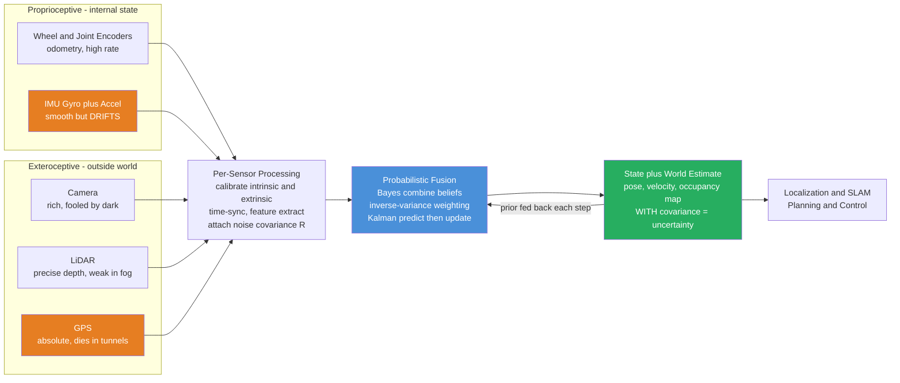

# 🤖 Robot Perception and Sensor Fusion

> [!abstract] TL;DR
> **Perception** is how a robot turns raw sensor bytes into *usable knowledge* about itself and the world (where am I, what is around me, how fast am I moving). No single sensor is enough: a camera is blinded by darkness, GPS dies in tunnels, wheel odometry lies under slippage, an IMU drifts. **Sensor fusion** is the discipline of combining many **noisy, biased, partial, complementary** sensors into *one* coherent belief — and, crucially, doing so **probabilistically**, so the robot always knows not just its best guess but *how uncertain that guess is*. The workhorse is Bayesian combination: weight each sensor by the **inverse of its variance** (trust the confident one more), which is exactly what the **Kalman-filter family** and **complementary filters** implement. Fusing two independent estimates always yields a posterior *at least as tight as the better sensor alone* — that is the whole reason multi-modal robots see better than any of their eyes.

---

## Intuition

**Analogy — crossing a busy street.** Before you step off the curb you do not trust a single sense. Your **eyes** judge the gap to the nearest car, your **ears** catch the engine you cannot yet see, and your **inner ear plus muscle memory** track your own motion as you lean forward. Each sense is imperfect and each has a blind spot the others cover: eyes fail in glare, ears fail in wind, balance drifts if you close your eyes. Yet the picture you actually *act on* is a single confident belief — "it is safe, go now" — fused from all three, weighted by how much you trust each in this moment.

A robot is *worse off* than you: its camera is fooled by darkness and motion blur, its GPS is fooled by tunnels and skyscraper canyons, its wheel odometry is fooled by a patch of gravel that makes the wheels spin without moving. **Robot perception and sensor fusion is how the machine builds ONE coherent, uncertainty-aware belief about its own state and the world by optimally combining many noisy, partial, complementary senses** — so that when the camera goes dark the IMU carries it, and when the IMU drifts the GPS snaps it back. The magic ingredient a human does intuitively but a robot must do with mathematics is *tracking uncertainty explicitly*: every estimate travels with a covariance that says how much to trust it, and fusion is just the arithmetic of combining beliefs weighted by that trust.

---

## How It Works

### Core Mechanics

1. **Sensors produce raw, imperfect measurements.** Split them into two families. **Proprioceptive** sensors measure the robot's *own internal* state — wheel/joint **encoders** (odometry), the **IMU** (gyroscope for angular rate, accelerometer for specific force). These are high-rate and smooth but they *drift*: integrating a gyro or wheel count accumulates error without bound. **Exteroceptive** sensors measure the *outside world* — **cameras** (rich but fooled by light and texture), **LiDAR** (precise range, weak in rain/fog), **radar** (robust in weather, coarse angular resolution), **ultrasonic/sonar** (cheap, short range), **GPS/GNSS** (absolute position but blocked indoors and in canyons), **RGB-D / depth** cameras (dense depth, limited range). These are lower-rate and often noisier but *bounded* — they do not drift because they re-anchor to the world.

2. **Per-sensor processing turns bytes into a measurement plus a noise model.** Calibrate (intrinsics such as camera focal length and lens distortion; extrinsics such as where the LiDAR sits relative to the IMU), correct distortion, extract features (corners, edges, LiDAR points, detected objects), and — the step amateurs skip — attach an explicit **uncertainty**: each measurement becomes a value *and* a covariance $R$ describing how noisy it is.

3. **Represent belief as a probability distribution, not a point.** The robot's knowledge of its state $x$ (pose, velocity, ...) is a distribution, usually a Gaussian $\mathcal{N}(\hat{x}, P)$ with mean $\hat{x}$ (best estimate) and covariance $P$ (how confident). Large $P$ means "I am unsure."

4. **Fuse by Bayesian combination.** New evidence updates the belief via Bayes' rule: $\text{posterior} \propto \text{prior} \times \text{likelihood}$. For Gaussians this has a beautiful closed form — the **product of two Gaussians is another Gaussian**, and combining two independent measurements $z_1 \sim \mathcal{N}(\mu_1, \sigma_1^2)$ and $z_2 \sim \mathcal{N}(\mu_2, \sigma_2^2)$ gives
   $$\frac{1}{\sigma_{\text{fused}}^2} = \frac{1}{\sigma_1^2} + \frac{1}{\sigma_2^2}, \qquad \hat{x}_{\text{fused}} = \sigma_{\text{fused}}^2\left(\frac{\mu_1}{\sigma_1^2} + \frac{\mu_2}{\sigma_2^2}\right).$$
   This is **inverse-variance weighting**: precision (inverse variance) adds, and each source is weighted by its precision — the confident sensor dominates. The fused variance is *smaller than either input*, so **fusion always reduces uncertainty**.

5. **Do it recursively over time — the Kalman filter.** A robot fuses continuously. The **Kalman-filter family** is inverse-variance fusion run as a **predict–update loop**: *predict* the next state using motion (IMU/odometry), which *grows* the covariance $P$ (dead reckoning gets less certain); then *update* with an exteroceptive measurement (GPS/LiDAR/vision), which *shrinks* $P$. The **Kalman gain** $K = P/(P+R)$ is exactly the inverse-variance weight, deciding per-step how much to trust the prediction versus the new measurement. (For nonlinear robots this becomes the EKF/UKF; see [[Kalman_Filter]] and [[State_Space_Models_in_Control]].) A cheaper cousin, the **complementary filter**, high-pass-filters the fast-but-drifting IMU and low-pass-filters the slow-but-stable absolute sensor and adds them — the classic drone attitude trick.

6. **Multi-modal fusion and data association.** Real stacks fuse **vision + LiDAR + IMU** together, each covering the others' failure modes. The hard sub-problem is **data association**: deciding *which* LiDAR point corresponds to *which* camera pixel corresponds to *which* tracked object, so you fuse measurements of the *same* thing.

7. **Build a world model and feed downstream.** The fused output populates a world representation — an **occupancy grid** (probability each cell is occupied), a point-cloud map, or an object list — and a **state estimate** (pose + velocity + covariance). Modern perception uses **deep learning** here: CNN/transformer **object detectors** and **semantic segmentation** networks turn images into labeled objects and drivable-surface masks that are then fused with geometric LiDAR. This fused belief is what **localization/SLAM** and the **controller** consume — perception is the front end of the whole autonomy pipeline (feeding pose estimation, mapping, and eventually planning and control).

### Flow / Architecture



---

## Key Concepts

### 🟢 Secondary — the plain-language picture

- **No single sense is enough.** A camera cannot see in the dark, GPS cannot see in a tunnel, wheels lie on ice. Combining senses covers each one's blind spots.
- **Fusion means combining, weighted by trust.** Trust the sensor that is more reliable *right now* more heavily — like believing your eyes over your ears when both are decent but your eyes are sharper.
- **The robot always tracks how sure it is.** Every estimate carries an "uncertainty" number. Fusing two guesses gives a guess you are *more* sure of than either one alone.
- **Drift vs. anchor.** IMU and odometry are smooth but slowly wander off (drift); GPS and vision are jumpier but stay anchored to reality. Fuse the smooth one with the anchored one and you get smooth *and* correct.

### 🟡 Undergraduate — the working machinery

- **Proprioceptive vs. exteroceptive.** Encoders/IMU measure *self* (high-rate, drift-prone); cameras/LiDAR/radar/GPS measure *world* (bounded error, lower-rate). Their strengths are **complementary** — the design principle behind fusion.
- **Gaussian belief and covariance.** State belief $\mathcal{N}(\hat{x}, P)$: mean is the estimate, $P$ is the uncertainty ellipse. This is the language the whole pipeline speaks.
- **Inverse-variance fusion.** Precisions add: $1/\sigma_f^2 = 1/\sigma_1^2 + 1/\sigma_2^2$. The fused mean is the precision-weighted average, and the fused variance is strictly smaller than either input — the quantitative statement of "fusion reduces uncertainty."
- **Kalman filter as recursive fusion.** Predict (motion model grows $P$) then update (measurement shrinks $P$) each timestep; the Kalman gain $K = P/(P+R)$ is the running inverse-variance weight. Linear-Gaussian version is optimal; see [[Kalman_Filter]].
- **Complementary filter.** High-pass the drifting fast sensor, low-pass the stable slow sensor, sum them. A one-line, tuning-parameter fusion used on nearly every hobby drone for attitude.
- **Calibration and time synchronization.** *Intrinsic* calibration models a single sensor (camera focal length, lens distortion, IMU bias); *extrinsic* calibration finds the rigid transform between sensors (where the LiDAR is relative to the IMU). Fusing mis-calibrated or mis-timestamped sensors injects systematic error worse than either sensor alone.
- **Data association.** Matching which measurement belongs to which object/landmark (nearest-neighbor, gating, JPDA) — get this wrong and you fuse apples with oranges.
- **Occupancy grid.** World split into cells, each holding a probability of being occupied, updated by a log-odds Bayesian rule from range sensors — a simple, robust world model.

### 🔴 Graduate — the frontier machinery

- **The Bayes filter as the master equation.** All of this is one recursive integral: $bel(x_t) = \eta\, p(z_t \mid x_t) \int p(x_t \mid u_t, x_{t-1})\, bel(x_{t-1})\, dx_{t-1}$. The **Kalman filter** is its closed form for linear-Gaussian models; the **EKF** linearizes via Jacobians; the **UKF** propagates sigma points through the true nonlinearity (better for strong nonlinearity, no Jacobians); the **particle filter** represents arbitrary multi-modal beliefs with weighted samples (handles the kidnapped-robot / global-localization problem the Gaussian filters cannot).
- **Observability of the fused system.** Fusion only recovers a state if the *combined* sensor suite makes it **observable** — e.g., a monocular-visual-inertial system has scale, gravity, and IMU-bias states that are unobservable without sufficient motion excitation. This is exactly the [[Controllability_and_Observability]] rank condition applied to the estimator, and it dictates *which* sensors you must add.
- **Correlated vs. independent errors.** Inverse-variance fusion assumes *independent* errors. When errors are correlated (two cameras seeing the same fog, GPS multipath), naive fusion is overconfident. **Covariance intersection** fuses estimates with unknown cross-correlation conservatively; full-covariance filters track cross-terms explicitly.
- **Consistency and the NEES/NIS tests.** A filter is **consistent** if its reported covariance $P$ matches its actual error (the normalized estimation-error-squared sits inside its chi-square bounds). Over-confident $P$ (too small) makes the filter ignore good measurements and diverge; under-confident $P$ wastes information. Tuning $Q$ and $R$ is really tuning consistency.
- **Loose vs. tight coupling.** *Loosely coupled* fusion combines each sensor's independently-computed estimate (fuse a GPS position with a visual-odometry pose); *tightly coupled* fusion drops raw measurements (GPS pseudoranges, individual image features) into one estimator — more accurate and more robust to partial sensor failure, at the cost of complexity. Modern **VIO/SLAM** (e.g., factor-graph smoothers like iSAM/GTSAM) are tightly coupled.
- **Robust fusion and outlier rejection.** Real measurements contain outliers (dynamic objects, GPS multipath, spoofing). Gate with the **Mahalanobis distance**, use **RANSAC** for geometric association, and switch Gaussian likelihoods for heavy-tailed / M-estimator costs so a single bad measurement cannot capture the estimate.
- **Deep-learned perception in the loop.** CNN/transformer detectors and segmentation nets (see [[Object_Detection_RCNN]], [[Semantic_Segmentation_Deep]]) provide *semantic* measurements that are fused with geometric LiDAR/stereo; the open research problem is propagating *calibrated* uncertainty out of a neural net so it can enter a Bayesian filter honestly.

---

## Python Demo

We fuse two complementary 1-D position sensors tracking a moving robot: a **smooth-but-drifting** estimate (integrated IMU velocity — low noise per step, but bias accumulates into unbounded drift) and a **jumpy-but-unbiased** absolute sensor (GPS — high per-sample noise, no drift). We fuse them with a tiny **1-D Kalman filter** (predict with IMU velocity, update with GPS via the inverse-variance Kalman gain) and show the fused track beats *both* sensors on RMSE. We also draw the **"product of two Gaussians"** picture — a prediction belief times a measurement belief giving a *tighter* posterior — and plot how the fused uncertainty shrinks over time. numpy + matplotlib only.

```python
# Robot sensor fusion: complementary IMU (drifts) + GPS (noisy) -> Kalman fusion.
# Shows the fused estimate beats EITHER sensor alone, and that fusing two Gaussian
# beliefs yields a tighter posterior (uncertainty reduction).
import numpy as np
import matplotlib.pyplot as plt

rng = np.random.default_rng(7)

# ---------------- Ground truth: a robot moving along a 1-D path -----------------
dt   = 0.1
T    = 40.0
t    = np.arange(0.0, T, dt)
N    = len(t)
v_true = 1.0 + 0.6 * np.sin(0.3 * t)        # true velocity (m/s)
x_true = np.cumsum(v_true) * dt             # true position (m)

# ---------------- Sensor 1: IMU-integrated position (smooth but DRIFTS) ---------
# The IMU measures velocity with a small constant bias + tiny noise. Integrating a
# biased velocity produces an estimate that is locally smooth but drifts without bound.
imu_bias  = 0.05                            # constant velocity bias (m/s)
v_imu     = v_true + imu_bias + rng.normal(0, 0.02, N)
x_imu     = np.cumsum(v_imu) * dt           # dead-reckoning: drifts away from truth

# ---------------- Sensor 2: GPS absolute position (NOISY but unbiased) ----------
gps_std   = 3.0                             # large per-sample noise (m)
x_gps     = x_true + rng.normal(0, gps_std, N)

# ---------------- Fusion: a 1-D Kalman filter ----------------------------------
# State = position. Predict using the IMU velocity (grows uncertainty), then update
# with the GPS measurement (shrinks uncertainty). K = P/(P+R) is the inverse-variance
# weight: it decides how much to trust the prediction vs. the new measurement.
x_hat = 0.0                                 # initial position estimate
P     = 5.0**2                              # initial variance (unsure)
Q     = (0.15)**2                           # process noise: trust in IMU prediction/step
R     = gps_std**2                          # measurement noise: GPS variance

x_fused = np.zeros(N)
P_hist  = np.zeros(N)
for k in range(N):
    # --- PREDICT with IMU velocity increment ---
    x_hat = x_hat + v_imu[k] * dt
    P     = P + Q
    # --- UPDATE with GPS measurement ---
    K     = P / (P + R)                     # Kalman gain = inverse-variance weight
    x_hat = x_hat + K * (x_gps[k] - x_hat)
    P     = (1 - K) * P
    x_fused[k] = x_hat
    P_hist[k]  = P

# ---------------- Error comparison ---------------------------------------------
rmse = lambda e: np.sqrt(np.mean(e**2))
err_imu   = x_imu   - x_true
err_gps   = x_gps   - x_true
err_fused = x_fused - x_true
print(f"RMSE  IMU-only  (drifts) : {rmse(err_imu):.3f} m")
print(f"RMSE  GPS-only  (noisy)  : {rmse(err_gps):.3f} m")
print(f"RMSE  FUSED     (Kalman) : {rmse(err_fused):.3f} m   <-- best")

# ---------------- Gaussian product picture (uncertainty reduction) -------------
def gauss(x, mu, sig):
    return np.exp(-0.5 * ((x - mu) / sig)**2) / (sig * np.sqrt(2 * np.pi))

grid = np.linspace(-8, 8, 600)
mu1, s1 = -2.0, 2.5          # belief A: prediction (e.g., IMU/motion) - broad
mu2, s2 =  1.5, 1.5          # belief B: measurement (e.g., a good LiDAR fix) - tighter
# Product of two Gaussians -> inverse-variance combination
s_post  = np.sqrt(1.0 / (1.0/s1**2 + 1.0/s2**2))
mu_post = s_post**2 * (mu1/s1**2 + mu2/s2**2)

# ---------------- Plots --------------------------------------------------------
fig, ax = plt.subplots(2, 2, figsize=(14, 9))

# (0,0) Trajectories vs truth
ax[0,0].plot(t, x_true, 'k-', lw=2.5, label='truth')
ax[0,0].plot(t, x_imu,  color='#E67E22', lw=1.5, label='IMU only (drifts)')
ax[0,0].scatter(t, x_gps, s=8, color='#95a5a6', alpha=0.5, label='GPS only (noisy)')
ax[0,0].plot(t, x_fused, color='#2980B9', lw=2, label='FUSED (Kalman)')
ax[0,0].set_title('Position estimate: fused tracks truth best')
ax[0,0].set_xlabel('time [s]'); ax[0,0].set_ylabel('position [m]'); ax[0,0].legend(fontsize=8)

# (0,1) Absolute error over time
ax[0,1].plot(t, np.abs(err_imu),   color='#E67E22', label=f'IMU  RMSE={rmse(err_imu):.2f}')
ax[0,1].plot(t, np.abs(err_gps),   color='#95a5a6', alpha=0.6, label=f'GPS  RMSE={rmse(err_gps):.2f}')
ax[0,1].plot(t, np.abs(err_fused), color='#2980B9', lw=2, label=f'FUSED RMSE={rmse(err_fused):.2f}')
ax[0,1].set_title('Absolute error: fusion beats either sensor alone')
ax[0,1].set_xlabel('time [s]'); ax[0,1].set_ylabel('|error| [m]'); ax[0,1].legend(fontsize=8)

# (1,0) Product of two Gaussian beliefs -> tighter posterior
ax[1,0].plot(grid, gauss(grid, mu1, s1), color='#E67E22', label=f'belief A  sigma={s1}')
ax[1,0].plot(grid, gauss(grid, mu2, s2), color='#27AE60', label=f'belief B  sigma={s2}')
ax[1,0].plot(grid, gauss(grid, mu_post, s_post), 'k-', lw=2.5,
             label=f'FUSED  sigma={s_post:.2f}')
ax[1,0].fill_between(grid, gauss(grid, mu_post, s_post), alpha=0.15, color='k')
ax[1,0].set_title('Product of two beliefs = tighter posterior')
ax[1,0].set_xlabel('state'); ax[1,0].set_ylabel('probability density'); ax[1,0].legend(fontsize=8)

# (1,1) Fused uncertainty (std dev) shrinking to steady state
ax[1,1].plot(t, np.sqrt(P_hist), color='#8E44AD', lw=2, label='fused std dev sqrt(P)')
ax[1,1].axhline(gps_std, color='#95a5a6', ls='--', label=f'GPS std = {gps_std}')
ax[1,1].set_title('Fusion drives uncertainty below any single sensor')
ax[1,1].set_xlabel('time [s]'); ax[1,1].set_ylabel('estimate std dev [m]'); ax[1,1].legend(fontsize=8)

plt.tight_layout(); plt.show()
```

Running it prints the IMU-only estimate as the worst (its bias integrates into a large, growing drift), GPS-only as noisy, and the **fused estimate with the lowest RMSE of the three** — the drift is corrected by GPS while the per-step jitter is smoothed by the IMU prediction. The bottom-left panel makes the core mechanism visual: multiplying two Gaussian beliefs yields a posterior that is *both* better-centered *and* narrower than either input, and the bottom-right panel shows the filter's reported uncertainty settling to a steady-state value well below any single sensor's noise — fusion literally buys certainty.

---

## Real-World Applications

- **Self-driving cars (Waymo, Cruise, Tesla).** The perception stack tightly fuses **camera + LiDAR + radar + IMU + GPS + wheel odometry**. Camera gives semantics (traffic-light color, lane type via segmentation), LiDAR gives precise 3-D geometry, radar gives velocity and works in rain/fog, and the whole set is fused into a tracked object list and a centimeter-level ego-pose. Redundancy is a *safety* requirement: if the camera is sun-blinded, LiDAR and radar keep the car safe.
- **Drones and quadrotors (PX4, ArduPilot).** Attitude estimation fuses **gyro + accelerometer + magnetometer** via a complementary or EKF filter (the classic "AHRS"); position fuses **IMU + GPS + barometer + optical flow**, enabling stable hover indoors where GPS is unavailable — the IMU carries the fast dynamics and optical flow anchors position, exactly the drift-plus-anchor pattern of the demo.
- **Visual-Inertial Odometry / SLAM (ARKit, ARCore, Skydio, Mars rovers).** VIO tightly fuses a camera with an IMU: the IMU predicts fast motion and resolves scale/gravity, the camera corrects drift by tracking visual features. This powers phone AR, drone autonomy, and NASA rover navigation where no GPS exists (feeds directly into robot pose estimation, visual odometry, and full SLAM).
- **Mobile robots and warehouse AMRs (Amazon Robotics).** Fuse **wheel odometry + IMU + 2-D LiDAR** into an **occupancy grid** and an AMCL/particle-filter pose for localization on a factory floor — cheap sensors made reliable by fusion.
- **Spacecraft and missiles (GNC).** Inertial-navigation systems fuse high-grade IMUs with star trackers and GPS; the Kalman filter was literally invented and first flown for the Apollo guidance computer's navigation fusion.

---

## Common Pitfalls

- **Bad calibration and time desynchronization.** Fusing a LiDAR and a camera with a wrong **extrinsic** transform, or with mis-aligned timestamps, smears every fused measurement — a 20 ms clock offset at highway speed is a ~0.5 m position error. Always calibrate intrinsics *and* extrinsics, hardware-timestamp every sensor, and time-align (interpolate) before fusing. A well-calibrated cheap sensor beats a mis-calibrated expensive one.
- **Assuming independent errors when they are correlated.** Inverse-variance fusion (and the vanilla Kalman filter) assume measurement errors are independent. Two cameras staring into the same fog, or GPS multipath affecting successive fixes, produce **correlated** errors; naive fusion then becomes *overconfident* and diverges. Use **covariance intersection** or model the cross-covariance explicitly.
- **Over- or under-confident covariances (inconsistent filter).** Setting $R$ or $Q$ wrong is the #1 field failure. Too-small $P$/$R$ makes the filter *trust itself and ignore good measurements* — it locks onto a wrong track and diverges. Too-large makes it noisy and slow. Validate **consistency** with NEES/NIS chi-square tests; tune $Q, R$ until the reported uncertainty matches the actual error.
- **Outliers and dynamic objects.** A single spurious measurement (a reflection, a moving pedestrian mistaken for a landmark) can hijack a least-squares/Kalman update because the Gaussian likelihood has thin tails. **Gate** every measurement by Mahalanobis distance, use **RANSAC** for association, and adopt robust (heavy-tailed / M-estimator) cost functions.
- **Sensor failure and spoofing.** Fusion must *detect and reject* a failed or malicious sensor, not average it in. GPS spoofing, a frozen camera returning the last frame, or a LiDAR blinded by direct sun will corrupt the estimate unless the stack monitors innovation statistics and fails over to the remaining sensors. Redundancy only helps if you actually notice the bad input.
- **Forgetting observability.** No amount of clever fusion recovers a state the combined sensor suite cannot observe (monocular VIO with no motion cannot recover metric scale). If the fused estimate for one axis is confidently wrong or slowly drifting, suspect an **unobservable** mode — an [[Controllability_and_Observability]] problem — and add a sensor or exciting motion rather than retuning the filter.

---

## Related Concepts

- [[Kalman_Filter]] — the recursive Bayesian predict–update engine that *is* optimal inverse-variance sensor fusion for linear-Gaussian systems; the workhorse of this note.
- [[State_Space_Models_in_Control]] — the $\dot{x}=Ax+Bu,\; y=Cx$ model whose $y$ are the sensors and whose hidden $x$ the fusion filter estimates.
- [[Controllability_and_Observability]] — observability decides *whether* the fused sensor suite can recover a given state at all; the go/no-go check behind every estimator.
- [[State_Space_Models]] — the time-series view of the same latent-state-plus-noisy-observation structure the Kalman filter exploits.
- [[Bayesian_Statistics]] — fusion is Bayes' rule (prior × likelihood → posterior) applied recursively; the theoretical foundation of probabilistic perception.
- [[Statistical_Inference]] — estimator consistency, variance, and the chi-square tests used to check that a filter's reported uncertainty is honest.
- [[Probability_Theory]] — Gaussians, covariance, and the product-of-distributions arithmetic that make closed-form fusion possible.
- [[Common_Probability_Distributions]] — the Gaussian whose product-closure property makes Kalman fusion analytically tractable.
- [[Visual_SLAM]] — the downstream system that fuses camera+IMU to simultaneously localize and map; perception's flagship consumer.
- [[Point_Cloud_Processing]] — how raw LiDAR/depth points are turned into features and registered before fusion with vision.
- [[Depth_Estimation_Deep]] — stereo/monocular depth as an exteroceptive measurement fused with LiDAR and IMU.
- [[Object_Detection_RCNN]] — CNN detectors that supply the *semantic* measurements (cars, pedestrians) fused with geometric sensors.
- [[Semantic_Segmentation_Deep]] — per-pixel labels (drivable surface, lane) that enter the fused world model.
- [[Image_Representations]] — the camera image-formation and pixel model underlying every visual measurement.
- [[CNN_Fundamentals]] — the deep-learning backbone of modern learned perception front-ends.
- [[Sampling_Theorem]] — why sensor sample rates and time-synchronization matter when fusing multi-rate streams.
- [[Digital_Filter_Design]] — the high-pass/low-pass split at the heart of the complementary filter.

---

## Review Questions

### 🟢 Secondary
1. A delivery robot uses wheel odometry (smooth but slowly drifts) and GPS (jumpy but stays roughly correct). In plain words, why is combining the two better than trusting either one alone? Which one keeps the estimate *smooth* and which keeps it *from drifting away*?

### 🟡 Undergraduate
2. Two independent sensors report the same distance: sensor A gives $10.0$ m with standard deviation $2.0$ m, sensor B gives $11.0$ m with standard deviation $1.0$ m. Using inverse-variance fusion, compute the fused estimate and its standard deviation. Is the fused uncertainty smaller than *either* sensor's? Which sensor does the fused mean sit closer to, and why?
3. In the Kalman fusion loop, the gain is $K = P/(P+R)$. Explain what happens to $K$ (and therefore to how much a new measurement is trusted) when the measurement noise $R$ is very large versus very small, and connect this to the "trust the confident sensor more" intuition.

### 🔴 Graduate
4. A team fuses two forward cameras with a naive Kalman filter and finds the estimate is *overconfident* and occasionally diverges in fog. Diagnose the likely cause in terms of the independence assumption, and describe a fusion method that stays consistent when the cross-correlation between the two sensors is unknown.
5. A monocular visual-inertial system reports a confident but slowly drifting metric scale while the vehicle drives in a straight line at constant speed. Explain, in terms of observability of the fused estimator, why no amount of $Q$/$R$ retuning fixes this, and what change to the *motion* or the *sensor suite* would restore observability of scale.

---

## Sources

- Thrun, S., Burgard, W., & Fox, D. — *Probabilistic Robotics* (MIT Press, 2005) — the canonical text on Bayes filters, Kalman/particle filters, occupancy grids, and probabilistic sensor fusion.
- Siciliano, B., & Khatib, O. (eds.) — *Springer Handbook of Robotics*, 2nd ed. (Springer, 2016) — perception, sensing, and multi-sensor data-fusion chapters.
- Corke, P. — *Robotics, Vision and Control*, 2nd ed. (Springer, 2017) — camera models, features, and vision-based state estimation with runnable examples.
- Durrant-Whyte, H., & Bailey, T. — "Simultaneous Localization and Mapping (SLAM): Part I," *IEEE Robotics & Automation Magazine* 13(2), 2006 — foundational treatment of probabilistic estimation and data association.
- Barfoot, T. D. — *State Estimation for Robotics* (Cambridge University Press, 2017) — modern, math-complete treatment of Gaussian and batch estimation for robots.

---

#robotics #perception #sensor-fusion #probabilistic-robotics #estimation
