# 📷 Robot Pose Estimation and Visual Odometry

> [!abstract] TL;DR
> A robot cannot act without knowing **where it is and how it is oriented** — its **pose** $(R, t)$ in some reference frame. **Pose estimation** recovers that pose; **odometry** builds it up *incrementally* by estimating motion between successive instants. **Visual odometry (VO)** does this using nothing but a camera: detect distinctive **features** in each frame, **match** them to the next frame, and from how those correspondences moved, solve for the camera's own **rotation and translation** — 2D-2D via the **essential matrix** and epipolar geometry, 3D-2D via **PnP**, or 3D-3D via **ICP / point-set registration**, always with **RANSAC** to throw out mismatches. Chaining these frame-to-frame estimates traces a **trajectory** — but because every step's small error is *integrated*, the path inevitably **drifts** and a single camera cannot even recover absolute **scale**. Removing that drift is exactly what **SLAM** adds (loop closure + a persistent map) and what fusing an **IMU** (visual-inertial odometry) mitigates. It is how Mars rovers, drones, and the AR in your phone know they are moving.

---

## Intuition

**Analogy — the moving-train window.** Stare out the window of a moving train. The fence posts right beside the track *whip* past in a blur, the mid-distance trees slide by at a comfortable pace, and the far mountains barely shift at all. You were told nothing — no speedometer, no map — yet from this **pattern of apparent motion** alone your brain effortlessly senses how fast you are going and which way you are heading. Near things stream fast, far things creep; the whole visual field flows in a coherent way that *encodes your own movement*.

Visual odometry gives a robot exactly this power. It watches how **features slide across its camera** from one frame to the next and, from that flow, deduces its own motion through space — turning an ordinary camera into a **dead-reckoning odometer**. There is no separate "motion sensor"; the *change in what the eyes see* **is** the measurement. This is the "the eyes tell you how you moved" trick behind Mars rovers crossing terrain no wheel-encoder could trust, and behind the phone in your hand anchoring a virtual object to the floor as you walk around it. The same cue that makes the fence posts blur is the cue the robot integrates, frame by frame, into a path.

---

## How It Works

### Core mechanics

A **pose** is a rigid-body transform: a rotation $R \in SO(n)$ and a translation $t$ that place the robot's body frame within a world (or previous-frame) frame — the $SE(3)$ machinery of rigid-body motion. Odometry never measures pose directly; it measures **relative motion** $(R_{\text{rel}}, t_{\text{rel}})$ between two instants and *accumulates* it. Wheel odometry reads that motion from encoders; **visual** odometry reads it from images; **visual-inertial** odometry fuses images with an IMU. The visual pipeline is:

1. **Feature detection.** Find repeatable, distinctive points in each image — **corners** (Harris, Shi-Tomasi, FAST) or full keypoints with descriptors (**ORB**, **SIFT**, **SURF**). Good features are ones you can re-find under viewpoint and lighting change.
2. **Matching / tracking.** Establish **correspondences**: which feature in frame $k{-}1$ is the same physical point in frame $k$. Either match descriptors (nearest-neighbour + ratio test) or *track* features by optical flow (Lucas-Kanade / KLT). This yields a set of point pairs.
3. **Motion estimation from correspondences.** Solve for $(R_{\text{rel}}, t_{\text{rel}})$ that explains how the points moved. Three geometric cases:
   - **2D-2D** (image points in both frames): the **essential matrix** $E = [t]_\times R$ links corresponding rays via the **epipolar constraint** $x'^{\mathsf T} E\, x = 0$; recover $E$ (Nister's **5-point algorithm** or the **8-point** algorithm), then decompose it into $R$ and $t$. Monocular gives $t$ only **up to scale**.
   - **3D-2D** (known 3D points seen as 2D pixels): **PnP** (Perspective-n-Point) solves for the pose that reprojects the 3D points onto their observed pixels — the case when you already have a local map or fiducial markers.
   - **3D-3D** (3D points in both frames, e.g. from stereo/RGB-D): **point-set registration** — align the two clouds with **ICP** or a closed-form **Procrustes/Kabsch** step (SVD of the cross-covariance).
4. **Outlier rejection with RANSAC.** Feature matching *always* produces wrong matches. **RANSAC** repeatedly fits the motion model from a minimal random sample and keeps the hypothesis with the most **inliers**, so a handful of bad correspondences cannot poison the estimate.
5. **Triangulation & scale.** With a recovered pose, **triangulate** matched features to 3D to grow a local map; monocular VO must fix the unknown scale from an external cue (known object size, stereo baseline, or IMU).
6. **Integrate to a trajectory.** Compose each relative pose onto the running estimate: $R_k = R_{k-1} R_{\text{rel}}$, $t_k = t_{k-1} + R_{k-1}\, t_{\text{rel}}$. This *chaining* is where **drift** is born — every step's error is added to all future poses, so position error grows without bound. **SLAM** cancels this by recognizing revisited places (**loop closure**) and jointly optimizing a persistent map.

Underneath sits the **camera model**: a **pinhole** projection with **intrinsics** $K$ (focal length, principal point) mapping 3D rays to pixels, and **extrinsics** $(R,t)$ giving the camera's pose. Calibrating $K$ (and lens distortion) is a prerequisite — VO on an uncalibrated camera is geometry built on sand.

### Flow / architecture

```mermaid
graph LR
    F1["Frame k-1<br/>camera image"]
    F2["Frame k<br/>next image"]
    DET["Feature detection<br/>corners, ORB, SIFT keypoints"]
    MATCH["Feature matching / tracking<br/>correspondences across frames<br/>+ RANSAC rejects outliers"]
    EST["Motion estimation<br/>2D-2D essential matrix + epipolar,<br/>3D-2D PnP, or 3D-3D ICP/Procrustes"]
    REL["Relative pose<br/>rotation R and translation t<br/>t only up to scale if monocular"]
    INT["Integrate motion<br/>chain frame-to-frame poses"]
    TRAJ["Trajectory estimate<br/>error accumulates as DRIFT"]
    SLAM["No loop closure here<br/>drift grows unbounded<br/>SLAM adds map + loop closure"]

    F1 --> DET
    F2 --> DET
    DET --> MATCH
    MATCH --> EST
    EST --> REL
    REL --> INT
    INT --> TRAJ
    TRAJ --> SLAM
    TRAJ -->|"pose of frame k becomes<br/>anchor for frame k+1"| INT

    style EST fill:#4A90D9,color:#fff
    style TRAJ fill:#E67E22,color:#fff
    style SLAM fill:#27AE60,color:#fff
```



---

## Key Concepts

### 🟢 Secondary — the plain-language picture

- **Pose.** Where the robot is *and* which way it faces — position plus orientation. Two numbers in 2D orientation (an angle) or a full 3D rotation, plus a position.
- **Odometry.** Estimating your position by adding up small movements, like counting paces in the dark. Cheap and always available, but errors *pile up*.
- **Visual odometry.** Doing that with a camera: watch how the picture changes between frames and work backwards to how *you* moved.
- **Features.** Distinctive spots in an image (corners, textured patches) that are easy to re-find in the next frame. Blank walls have none — which is a problem.
- **Drift.** Because each step's small error is never erased, the estimated path slowly wanders away from the true one. Walk a loop and your estimate won't quite close.

### 🟡 Undergraduate — the working machinery

- **Rigid-body motion.** A pose is $(R, t)$ with $R$ a rotation matrix (orthonormal, $\det = 1$) and $t$ a translation; composing motions multiplies/adds them (the $SE(3)$ group of rigid-body transforms).
- **Pinhole camera model.** A 3D point $X$ projects to pixel $x = K[R \mid t]X$; **intrinsics** $K$ come from calibration, **extrinsics** $[R \mid t]$ are the pose you want. Un-projecting a pixel gives a *ray*, not a point — depth is lost.
- **Epipolar geometry & the essential matrix.** For a calibrated camera, corresponding normalized points obey $x'^{\mathsf T} E\, x = 0$ with $E = [t]_\times R$. The **8-point** (or minimal **5-point**) algorithm estimates $E$ from matches; SVD decomposes it into four $(R,t)$ candidates, resolved by the **cheirality** check (points must be in front of both cameras).
- **PnP (3D-2D).** Given $n \ge 3$ known 3D points and their pixels, solve for the pose that minimizes **reprojection error** — the standard way to localize against a known map or fiducial markers.
- **Point-set registration (3D-3D).** Aligning two 3D point clouds with a known correspondence has a closed form: center both sets, SVD the cross-covariance $H = \sum (a_i)(b_i)^{\mathsf T}$, and read off $R = V U^{\mathsf T}$ (**Kabsch / orthogonal Procrustes**), then $t$. Unknown correspondences → **ICP** iterates match-then-align.
- **RANSAC.** Fit from a minimal sample, count inliers within a threshold, repeat, keep the best consensus, refit on all inliers. Turns a match set that is 30–50% wrong into a clean estimate.
- **Triangulation & scale.** Two known poses + a matched feature → its 3D position by intersecting rays. A single camera sees only *ratios*, so monocular VO is blind to absolute **scale**.

### 🔴 Graduate — the practical and theoretical edges

- **The full VO/VIO stack.** Feature-based (ORB-SLAM-style: detect, match, RANSAC-PnP, local **bundle adjustment**) vs **direct** methods (DSO, LSD-SLAM) that minimize **photometric** error over pixel intensities directly, skipping features — better in low-texture but sensitive to lighting/exposure. **Semi-direct** (SVO) blends both for speed.
- **Bundle adjustment.** The gold-standard backend: jointly refine all camera poses *and* 3D points by minimizing summed reprojection error — a large sparse nonlinear least-squares problem (Levenberg-Marquardt over the sparse Jacobian, solved with Schur complement on the structure block). VO windows it over recent keyframes; SLAM does it globally.
- **Scale drift & monocular degeneracy.** Beyond the *unknown* scale, monocular VO suffers **scale drift** (the estimated scale slowly changes) and degenerates under pure rotation (no translation → no parallax → no triangulation, essential matrix ill-conditioned). Stereo/RGB-D or an IMU fixes scale absolutely.
- **Visual-inertial odometry (VIO).** Fuse a high-rate IMU (accelerometer + gyro) with the camera. The IMU makes scale **observable**, bridges fast motions and feature dropout, and disambiguates rotation-only cases; fusion is done by an EKF (MSCKF) or by tightly-coupled optimization (VINS-Mono, OKVIS). Requires careful IMU-camera **extrinsic and temporal calibration** and IMU **bias** estimation — the estimation side leans on Kalman-filter state estimation and sensor fusion.
- **Keyframes & marginalization.** Running BA on every frame is infeasible; systems select **keyframes** on parallax/tracking criteria and **marginalize** old states (Schur complement) into a prior, bounding compute while retaining information — the sliding-window backbone of modern VIO.
- **Robust estimation beyond RANSAC.** Heavy-tailed match noise motivates **M-estimators** (Huber, Cauchy) inside BA, and modern **learned** front-ends (SuperPoint detectors, SuperGlue matchers, learned optical flow) that raise inlier rates and survive appearance change where hand-crafted features fail.
- **VO vs SLAM vs SfM.** **VO** is *local* and *causal* — best incremental pose, no global consistency. **SLAM** adds a persistent map + loop closure to enforce global consistency and kill drift. **Structure-from-Motion (SfM)** is the offline, batch cousin (reconstruct scene + all cameras from an unordered image set). Same geometry, different consistency and latency budgets.

---

## Python Demo

We build a compact **2D visual-odometry simulator** that exercises the whole idea end to end. A robot drives a gently curving path through a field of fixed **landmarks** (its visual features). At each step it observes the nearby landmarks *in its own body frame* with sensor noise — these are the tracked features. From the **point correspondences** between two consecutive frames we **recover the relative motion** $(R_{\text{rel}}, t_{\text{rel}})$ with a closed-form least-squares **Procrustes / Kabsch** step (the 3D-3D registration case, done in 2D), and confirm the recovered rotation and translation match the true motion. Then we **chain** those estimated frame-to-frame motions into a full trajectory and watch **drift** accumulate — the estimated path peeling away from ground truth as noise integrates, with no loop closure to pull it back.

```python
# 2D visual odometry: recover per-step motion from feature correspondences,
# then chain motions into a trajectory and watch DRIFT accumulate.
import numpy as np
import matplotlib.pyplot as plt

rng = np.random.default_rng(1)

def rot2(theta):
    c, s = np.cos(theta), np.sin(theta)
    return np.array([[c, -s], [s, c]])

# ---- World: a field of fixed landmarks = the visual features ----
landmarks = rng.uniform(-70, 70, size=(600, 2))

# ---- True robot trajectory: constant speed, slowly varying turn (a smooth arc) ----
Nsteps = 90
speed = 2.2
true_R = [np.eye(2)]
true_t = [np.array([0.0, 0.0])]
for k in range(1, Nsteps):
    dtheta = 0.05 + 0.03 * np.sin(k * 0.12)        # gently changing heading
    R_prev = true_R[-1]
    true_t.append(true_t[-1] + R_prev @ np.array([speed, 0.0]))  # step forward
    true_R.append(R_prev @ rot2(dtheta))                          # then rotate

def observe(R, t, noise_std=0.12, rng_max=55.0):
    """Landmarks seen in the robot BODY frame (world->body: R^T (L - t)), with sensor
    noise and limited range/front-of-camera visibility. Returns coords + visibility mask."""
    body = (landmarks - t) @ R                      # rows = R^T (L_j - t)
    dist = np.linalg.norm(landmarks - t, axis=1)
    vis = (body[:, 0] > 1.0) & (dist < rng_max)     # in front + within range
    noisy = body + rng.standard_normal(body.shape) * noise_std
    return noisy, vis

def estimate_rigid_2d(A, B):
    """Least-squares (Procrustes/Kabsch): find R, t so that B ~= R @ A.T + t. A, B are (M,2)."""
    a_bar, b_bar = A.mean(0), B.mean(0)
    H = (A - a_bar).T @ (B - b_bar)                 # 2x2 cross-covariance
    U, _, Vt = np.linalg.svd(H)
    D = np.diag([1.0, np.sign(np.linalg.det(Vt.T @ U.T))])  # reflection guard
    R = Vt.T @ D @ U.T
    t = b_bar - R @ a_bar
    return R, t

# ---- Chain frame-to-frame VO estimates into a trajectory ----
est_R = [true_R[0].copy()]          # anchor first pose to ground truth
est_t = [true_t[0].copy()]
angle_err = []
sample_pair = None                  # keep one pair for the correspondence plots

for k in range(1, Nsteps):
    pA, visA = observe(true_R[k-1], true_t[k-1])    # points in frame k-1
    pB, visB = observe(true_R[k],   true_t[k])      # points in frame k
    common = visA & visB                            # same landmarks seen in both
    A, B = pA[common], pB[common]                   # correspondences: A in frame k-1, B in frame k

    # We established p_{k-1} = R_rel @ p_k + t_rel  -> align B (frame k) onto A (frame k-1)
    R_rel, t_rel = estimate_rigid_2d(B, A)

    # ground-truth relative motion for validation
    R_rel_true = true_R[k-1].T @ true_R[k]
    angle_err.append(abs(np.arctan2(R_rel[1, 0], R_rel[0, 0])
                         - np.arctan2(R_rel_true[1, 0], R_rel_true[0, 0])))

    # compose onto running estimate:  R_k = R_{k-1} R_rel,  t_k = t_{k-1} + R_{k-1} t_rel
    est_R.append(est_R[-1] @ R_rel)
    est_t.append(est_t[-1] + est_R[-2] @ t_rel)

    if k == Nsteps // 2:            # snapshot a mid-run pair for visualization
        sample_pair = (A, B, R_rel, t_rel)

true_xy = np.array(true_t)
est_xy  = np.array(est_t)
drift   = np.linalg.norm(est_xy - true_xy, axis=1)

# ---- one-step recovery sanity check ----
A, B, R_rel, t_rel = sample_pair
print(f"correspondences used this frame : {len(A)}")
print(f"recovered rotation (deg)        : {np.degrees(np.arctan2(R_rel[1,0], R_rel[0,0])):+.3f}")
print(f"recovered translation (body)    : [{t_rel[0]:+.3f}, {t_rel[1]:+.3f}]  (true forward step ~ {speed})")
print(f"mean per-step angle error (deg) : {np.degrees(np.mean(angle_err)):.4f}")
print(f"final drift                     : {drift[-1]:.2f} m over {Nsteps} steps")

# ================= Plots =================
fig, ax = plt.subplots(2, 2, figsize=(13, 10))

# (a) feature correspondences between two consecutive frames (body coords)
show = np.linspace(0, len(A) - 1, min(30, len(A))).astype(int)
ax[0,0].scatter(A[show,0], A[show,1], s=40, c='steelblue',  label='features in frame k-1')
ax[0,0].scatter(B[show,0], B[show,1], s=40, c='crimson', marker='x', label='features in frame k')
for i in show:
    ax[0,0].plot([A[i,0], B[i,0]], [A[i,1], B[i,1]], 'gray', lw=0.6, alpha=0.7)
ax[0,0].set_title('(a) feature correspondences (body frame)')
ax[0,0].set_xlabel('x [m]'); ax[0,0].set_ylabel('y [m]'); ax[0,0].legend(); ax[0,0].axis('equal')

# (b) apply the RECOVERED motion to frame-k points -> they overlay frame k-1 (motion recovered)
B_aligned = (R_rel @ B.T).T + t_rel
ax[0,1].scatter(A[show,0], A[show,1], s=55, facecolors='none', edgecolors='steelblue',
                label='frame k-1 (target)')
ax[0,1].scatter(B_aligned[show,0], B_aligned[show,1], s=20, c='seagreen',
                label='frame k after recovered R,t')
ax[0,1].set_title('(b) recovered motion aligns the two frames')
ax[0,1].set_xlabel('x [m]'); ax[0,1].set_ylabel('y [m]'); ax[0,1].legend(); ax[0,1].axis('equal')

# (c) true vs VO-estimated trajectory -> drift visible
ax[1,0].plot(true_xy[:,0], true_xy[:,1], 'k-',  lw=2.5, label='true trajectory')
ax[1,0].plot(est_xy[:,0],  est_xy[:,1],  'darkorange', lw=2, ls='--', label='visual odometry estimate')
ax[1,0].scatter(*true_xy[0], c='green', s=90, zorder=5, label='start (aligned)')
ax[1,0].scatter(*true_xy[-1], c='black', s=60, zorder=5)
ax[1,0].scatter(*est_xy[-1],  c='red',   s=60, zorder=5, label='end (drifted apart)')
ax[1,0].set_title('(c) VO trajectory drifts from ground truth')
ax[1,0].set_xlabel('x [m]'); ax[1,0].set_ylabel('y [m]'); ax[1,0].legend(); ax[1,0].axis('equal')

# (d) drift magnitude grows with distance travelled (no loop closure)
ax[1,1].plot(np.arange(Nsteps), drift, 'purple', lw=2)
ax[1,1].fill_between(np.arange(Nsteps), 0, drift, color='purple', alpha=0.15)
ax[1,1].set_title('(d) position drift accumulates without loop closure')
ax[1,1].set_xlabel('frame / step'); ax[1,1].set_ylabel('||estimate - truth|| [m]')

plt.tight_layout()
plt.show()
```

Running it prints a per-step recovery check: from ~a hundred noisy correspondences the Procrustes step recovers the true rotation and the forward translation to a fraction of a percent — the motion really is *readable* from how features moved. Panel **(a)** shows the raw correspondences (each gray line links the same landmark seen in two frames — the "apparent motion" the analogy describes); **(b)** applies the recovered $(R,t)$ to the frame-$k$ points and they snap onto the frame-$k{-}1$ targets, confirming the estimate; **(c)** overlays the VO trajectory on ground truth — anchored at the same start, they peel apart as the run proceeds; and **(d)** shows the killer property: **drift grows monotonically** with distance travelled, because each tiny per-step error is *integrated* into every future pose and nothing ever corrects it. That growing gap is precisely the problem SLAM's loop closure and VIO's IMU fusion exist to solve.

---

## Real-World Applications

- **Mars rovers (Spirit, Opportunity, Curiosity, Perseverance).** Wheel odometry is useless on loose sand where wheels slip; NASA's rovers run **visual odometry** on stereo navigation-camera pairs to measure how far they *actually* moved by tracking terrain features frame to frame — the canonical flight-proven VO deployment.
- **Smartphone & headset AR (ARKit, ARCore, Quest, Vision Pro).** Anchoring virtual objects to the real world requires knowing the device's 6-DOF pose at 60+ Hz. These systems run **visual-inertial odometry**, fusing the camera with the IMU so a placed object stays fixed to the floor as you walk around it.
- **Drones and autonomous flight.** GPS-denied indoor/urban flight relies on downward/forward cameras + IMU for VIO-based state estimation, feeding the pose to the flight controller — the perception layer beneath autonomous aerial vehicles.
- **ORB-SLAM3 / VINS-Fusion / DSO.** The reference open-source stacks: ORB-SLAM (feature + PnP + RANSAC + bundle adjustment), VINS-Mono/Fusion (tightly-coupled VIO), DSO (direct photometric VO) — the VO/VIO front-ends that self-driving research and robotics build on, extending naturally into full *[[Visual_SLAM]]*.
- **Fiducial-marker localization (AprilTags, ArUco).** When you can place known markers in the scene, a single tag gives an exact **PnP** pose — used for robot docking, warehouse AGVs, drone landing pads, and camera-rig calibration.

---

## Common Pitfalls

- **Monocular scale ambiguity.** One camera recovers translation only *up to an unknown scale factor* — the estimated path can be metrically wrong even when its shape is perfect. Fix scale with a stereo baseline, RGB-D depth, an IMU (VIO), or a known-size reference; never trust monocular metric distances without one.
- **Drift accumulation.** VO integrates relative motions, so error grows without bound and a looped path won't close. VO alone is only *locally* accurate — for global consistency you need **loop closure** and mapping (*[[Visual_SLAM]]*), or periodic absolute fixes (GPS, known landmarks).
- **Feature-poor / low-texture scenes.** Blank walls, sky, snow, and repetitive textures yield few or ambiguous features; matching collapses and tracking is lost. Direct methods, wider FOV, active sensing, or IMU bridging help — but a truly textureless scene defeats pure VO.
- **Dynamic objects.** Moving people/cars violate the static-world assumption; features on them imply a *false* ego-motion. Reject them with RANSAC (if they're a minority), semantic masking, or explicit motion segmentation — otherwise the robot "thinks" it moved when the scene did.
- **Outliers demand RANSAC.** Descriptor matching always returns wrong pairs; a single gross outlier wrecks a least-squares essential-matrix or PnP fit. **RANSAC** (or robust M-estimators inside bundle adjustment) is not optional — it is what makes geometric estimation survive real match sets.
- **Motion blur and rolling shutter.** Fast motion smears features (detection fails) and rolling-shutter sensors warp geometry within a frame (rows captured at different times), biasing the essential/PnP solution. Use global-shutter cameras, model the rolling shutter explicitly, or lean on the IMU through the blurred interval.
- **Uncalibrated camera.** All of the geometry assumes known intrinsics $K$ and undistorted images. Skipping calibration (or ignoring lens distortion) injects systematic pose error that no amount of RANSAC can remove.

---

## Related Concepts

- [[Visual_SLAM]] — the direct extension: VO is the *tracking front-end*; SLAM adds a persistent map + loop closure + global bundle adjustment to eliminate the drift this note demonstrates.
- [[Optical_Flow_Tracking]] — the feature-tracking machinery (Lucas-Kanade / KLT, RAFT) that produces the frame-to-frame correspondences VO consumes.
- [[Depth_Estimation_Deep]] — stereo/monocular depth resolves the scale ambiguity and enables 3D-3D and 3D-2D motion estimation.
- [[Point_Cloud_Processing]] — the 3D-3D registration case: aligning point clouds (ICP / Procrustes) to recover motion, the method used in the demo.
- [[NeRF_and_3DGS]] — modern differentiable scene representations that pair with pose estimation for reconstruction and novel-view synthesis.
- [[Singular_Value_Decomposition]] — the workhorse behind essential-matrix decomposition, the 8-point algorithm, and the Procrustes/Kabsch motion-recovery step.
- [[Matrices_and_Determinants]] — rotation matrices, the camera projection $K[R\mid t]$, the skew-symmetric $[t]_\times$, and the essential/fundamental matrices are all matrix objects.
- [[Eigenvalues_and_Eigenvectors]] — the eigen/singular structure underlying least-squares pose solving and the cheirality/rank conditions on $E$.
- [[Vectors_and_Vector_Spaces]] — points, camera rays, and translations as vectors; the epipolar constraint is a bilinear form on them.
- [[Linear_Transformations]] — rigid-body motion and pinhole projection are (affine/projective) linear maps between coordinate frames.
- [[Numerical_Linear_Algebra]] — least-squares solvers, SVD, and the sparse nonlinear least-squares (bundle adjustment) that refine poses in practice.
- [[Robotics_and_Control_Overview]] — the field map placing perception and localization within the broader robotics stack.

---

## Review Questions

### 🟢 Secondary
1. Using the moving-train-window analogy, explain how a robot with only a camera can figure out *how it moved* without any dedicated motion sensor. Why do nearby features appear to move more than distant ones, and how is that useful?

### 🟡 Undergraduate
2. A monocular visual-odometry system produces a trajectory whose *shape* looks correct but whose *distances* are all wrong. Which fundamental limitation causes this, and name three concrete ways to fix it.
3. Given a set of matched 2D image points between two calibrated camera frames, outline the 2D-2D pipeline that recovers the relative rotation and translation. What role does the essential matrix play, why do you get *four* candidate solutions, and how do you pick the right one?

### 🔴 Graduate
4. You are told that pure visual odometry inevitably drifts, yet SLAM systems built on the *same* front-end achieve globally consistent maps. Precisely what does SLAM add that VO lacks, why does that eliminate unbounded drift, and what is the computational price?
5. A drone must estimate its 6-DOF pose during aggressive, fast maneuvers through a dimly lit warehouse with occasional blank walls. Explain why *monocular VO alone* will fail here, how **visual-inertial odometry** addresses each failure mode (scale, motion blur, feature dropout, rotation-only degeneracy), and what calibration/estimation problems VIO introduces in return.

---

## Sources

- Scaramuzza, D., & Fraundorfer, F. — "Visual Odometry, Part I: The First 30 Years and Fundamentals," *IEEE Robotics & Automation Magazine*, 18(4), pp. 80–92 (2011). *(the canonical VO tutorial; Part II covers matching, robustness, and applications.)*
- Hartley, R., & Zisserman, A. — *Multiple View Geometry in Computer Vision*, 2nd ed. (Cambridge University Press, 2004). *(epipolar geometry, the essential/fundamental matrix, triangulation, bundle adjustment.)*
- Nister, D. — "An Efficient Solution to the Five-Point Relative Pose Problem," *IEEE TPAMI*, 26(6), pp. 756–770 (2004).
- Corke, P. — *Robotics, Vision and Control: Fundamental Algorithms in Python*, 3rd ed. (Springer, 2023). *(pose, camera models, VO worked in code.)*
- Cadena, C., et al. — "Past, Present, and Future of SLAM: Toward the Robust-Perception Age," *IEEE Transactions on Robotics*, 32(6), pp. 1309–1332 (2016). *(where VO fits within SLAM and VIO.)*

---

#robotics #visual-odometry #pose-estimation #computer-vision #localization
