# 🤖 Sampling-Based Planning (RRT and PRM)

> [!abstract] TL;DR
> Sampling-based planners solve the motion-planning problem for high-degree-of-freedom robots by **refusing to build the free space explicitly**. Instead of computing the intractable geometry of every collision-free configuration, they throw down **random samples** in configuration space, keep the ones that pass a **collision check**, and stitch nearby valid samples together into a **graph (PRM)** or a **tree (RRT)**. The result is only *probabilistically complete* — it will find a path if one exists, given enough samples — but it is what finally made planning for many-jointed arms and mobile robots practical.

---

## Intuition

**Analogy:** Imagine you must find a walkable route through a vast, pitch-black cave. Mapping every square inch of rock is hopeless — the geometry is far too intricate. But you *can* toss thousands of glow sticks in random directions. Wherever one lands in open air (not inside a wall), it marks a spot you know is safe. Then you connect glow sticks that are close together with short straight corridors, testing each corridor to make sure it does not clip a wall. Within minutes you have a rough web of verified passages threading the cave, and you can trace a route from entrance to exit through the web — without ever having drawn the cave's true shape.

Sampling-based planners do exactly this in the robot's **configuration space** (the space of all its joint angles or poses). Instead of computing the impossible full geometry of the free region, they randomly sample configurations, discard the ones in collision, and grow a tree or graph of valid connections. The collision checker is the only thing that ever "sees" the obstacles — the planner itself just samples, connects, and searches.

---

## How It Works

### Core Mechanics

The two workhorse algorithms share a philosophy but differ in structure.

**PRM (Probabilistic Roadmap) — multi-query, best for static worlds.**
1. **Sample** `N` random configurations uniformly in configuration space.
2. **Filter** each through the collision checker; discard configurations inside obstacles.
3. **Connect** each surviving node to its `k` nearest neighbors, keeping an edge only if the *straight-line motion* between them is collision-free (the "local planner").
4. **Query.** Add the start and goal to the roadmap, connect them locally, and run an ordinary graph search (Dijkstra or A*) to extract the shortest path over the roadmap. The expensive sampling is done **once**; any number of start-goal queries then reuse the same graph.

**RRT (Rapidly-Exploring Random Tree) — single-query, incremental.**
1. **Root** a tree at the start configuration.
2. **Sample** a random configuration `q_rand` (with a small probability, sample the goal directly — *goal biasing*).
3. **Nearest.** Find the tree node `q_near` closest to `q_rand` under a distance metric.
4. **Steer.** Take a fixed step of length `eta` from `q_near` toward `q_rand`, producing `q_new`.
5. **Collision-check** the short edge `q_near -> q_new`; if it is free, add `q_new` to the tree.
6. **Repeat** until a node reaches the goal region, then trace parent pointers back to the start.

The magic of RRT is its **Voronoi bias**: a uniformly random sample is most likely to fall in a large unexplored region, so the nearest tree node is usually one on the frontier — the tree therefore rushes outward to fill space rapidly rather than densifying where it already is.

**Key variants.**
- **RRT-Connect** grows *two* trees, one from start and one from goal, and greedily tries to connect them each iteration — dramatically faster in practice.
- **RRT\*** and **PRM\*** (Karaman & Frazzoli) add a **rewiring** step: when a new node is added, nearby nodes are re-parented if routing through the new node is cheaper. With a neighbor radius that shrinks as `O((log n / n)^{1/d})`, they become **asymptotically optimal** — the path cost converges to the true minimum as samples increase, which plain RRT never guarantees.

The **collision checker is the workhorse**: it dominates runtime, and the whole paradigm's advantage is that checking whether *one* configuration or *one* short edge is free is far cheaper than constructing the entire free space.

### Flow / Architecture

```mermaid
flowchart TD
    subgraph RRT["RRT: single-query incremental tree"]
        R0["Root tree at start"] --> R1["Sample q_rand<br/>with goal bias"]
        R1 --> R2["Find nearest tree node q_near<br/>under distance metric"]
        R2 --> R3["Steer step eta<br/>toward q_rand to get q_new"]
        R3 --> R4{"Edge q_near to q_new<br/>collision-free"}
        R4 -- "no" --> R1
        R4 -- "yes" --> R5["Add q_new to tree"]
        R5 --> R6{"Reached goal region"}
        R6 -- "no" --> R1
        R6 -- "yes" --> R7["Trace parents<br/>back to start"]
    end

    subgraph PRM["PRM: multi-query roadmap"]
        P0["Sample N configurations"] --> P1["Keep collision-free nodes"]
        P1 --> P2["Connect k-nearest neighbors<br/>if local path is free"]
        P2 --> P3["Roadmap graph built once"]
        P3 --> P4["Add start and goal<br/>to roadmap"]
        P4 --> P5["Graph search<br/>Dijkstra or A-star"]
        P5 --> P6["Return path"]
    end
```



---

## Key Concepts

**Secondary (build the picture):**
- **Sample, do not solve.** Rather than compute the exact shape of the safe region, scatter random points and keep the safe ones.
- **Connect the dots.** Link nearby safe points with short paths you have verified are collision-free, forming a web of routes.
- **Tree vs graph.** RRT grows a single tree outward from the start for one query; PRM builds a reusable graph covering the whole space for many queries.

**Undergraduate (the mechanics):**
- **Configuration space.** Each point is a full robot configuration (all joint angles / the pose); obstacles map to forbidden regions here. Sampling happens in *this* space, not the physical workspace.
- **Collision checker as a black box.** The planner never needs an explicit obstacle model — only a function `is_free(q)` and `edge_free(q1, q2)`. This is what lets one planner serve a 2-joint arm and a 20-joint humanoid alike.
- **Distance metric and steering.** RRT needs a notion of "nearest" and a way to move a step toward a sample. For a mobile robot the metric is Euclidean; for arms it may weight joints; for cars it must respect that you cannot slide sideways.
- **Goal biasing and Voronoi bias.** Occasionally sampling the goal pulls the tree toward it; the implicit Voronoi bias makes uniform sampling explore outward efficiently.

**Graduate (the deep structure):**
- **Probabilistic completeness vs optimality.** As samples go to infinity, RRT and PRM find a solution *if one exists* with probability approaching 1 — but plain RRT converges to an **arbitrary**, generally suboptimal path. Optimality is a separate, stronger property.
- **Asymptotic optimality (RRT\*, PRM\*).** Karaman & Frazzoli showed that with a connection radius `r_n = gamma (log n / n)^{1/d}` and rewiring, the cost of the returned path converges almost surely to the optimum. Fixed-radius or fixed-`k` PRM is *not* asymptotically optimal in general; the shrinking radius is essential.
- **The narrow-passage problem.** The probability of sampling inside a thin corridor scales with its volume, so uniform sampling starves narrow passages. Remedies: bridge sampling, Gaussian sampling near obstacles, medial-axis sampling, or informed/heuristic sampling.
- **Kinodynamic planning.** When the robot has differential constraints (a car cannot move sideways; a drone has momentum), "steer exactly to `q_rand`" has no closed form. Kinodynamic RRT integrates the system's *dynamics* forward under sampled controls and connects with a two-point boundary-value solver where possible.
- **High-dimensional nearest-neighbor cost.** Each RRT iteration must find the nearest node; naive scan is `O(n)` per step, `O(n^2)` overall. KD-trees and approximate nearest-neighbor structures cut this, but degrade in very high dimensions.

---

## Python Demo

```python
# Sampling-based motion planning in a 2D maze-like world.
#   (a) RRT  : grow a tree from start -> sample, nearest, steer, collision-check, extend.
#   (b) RRT* : same, but REWIRE nearby nodes for a shorter (near-optimal) path.
#   (c) PRM  : sample N nodes, connect k-nearest collision-free, then graph-search a query.
# Only numpy + matplotlib. The collision checker is the sole thing that "sees" obstacles.
import numpy as np
import matplotlib.pyplot as plt
from matplotlib.patches import Rectangle

rng = np.random.default_rng(7)

# ---------- world: axis-aligned rectangular obstacles forming a maze ----------
BOUNDS = np.array([0.0, 10.0])
OBSTACLES = [                        # (x_min, y_min, x_max, y_max)
    (2.0, 0.0, 2.8, 7.0),
    (5.0, 3.0, 5.8, 10.0),
    (7.5, 0.0, 8.3, 6.0),
]
START = np.array([0.5, 0.5])
GOAL  = np.array([9.5, 9.0])

def in_free(p):
    """True if point p is inside the bounds and outside every obstacle."""
    if np.any(p < BOUNDS[0]) or np.any(p > BOUNDS[1]):
        return False
    for (xmn, ymn, xmx, ymx) in OBSTACLES:
        if xmn <= p[0] <= xmx and ymn <= p[1] <= ymx:
            return False
    return True

def edge_free(a, b, res=0.05):
    """Collision-check the straight segment a->b by dense sampling (the local planner)."""
    d = np.linalg.norm(b - a)
    n = max(2, int(d / res))
    for t in np.linspace(0.0, 1.0, n):
        if not in_free(a + t * (b - a)):
            return False
    return True

def sample_free():
    while True:
        p = rng.uniform(BOUNDS[0], BOUNDS[1], size=2)
        if in_free(p):
            return p

# ============================ (a)/(b) RRT and RRT* ============================
def rrt(star=False, n_iter=3000, step=0.6, goal_bias=0.05, goal_tol=0.6, radius=1.5):
    nodes  = [START.copy()]
    parent = [-1]
    cost   = [0.0]                                   # cost-to-come (used by RRT*)
    goal_idx = None
    for _ in range(n_iter):
        q_rand = GOAL.copy() if rng.random() < goal_bias else sample_free()
        pts = np.array(nodes)
        near = int(np.argmin(np.linalg.norm(pts - q_rand, axis=1)))   # nearest neighbor
        direction = q_rand - nodes[near]
        dist = np.linalg.norm(direction)
        if dist < 1e-9:
            continue
        q_new = nodes[near] + step * direction / dist                 # steer one step
        if not (in_free(q_new) and edge_free(nodes[near], q_new)):
            continue

        if not star:                                                  # -------- plain RRT
            best_parent, best_cost = near, cost[near] + np.linalg.norm(q_new - nodes[near])
        else:                                                         # -------- RRT*: choose cheapest parent
            pts = np.array(nodes)
            nbrs = np.where(np.linalg.norm(pts - q_new, axis=1) <= radius)[0]
            best_parent, best_cost = near, cost[near] + np.linalg.norm(q_new - nodes[near])
            for j in nbrs:
                c = cost[j] + np.linalg.norm(q_new - nodes[j])
                if c < best_cost and edge_free(nodes[j], q_new):
                    best_parent, best_cost = int(j), c

        new_idx = len(nodes)
        nodes.append(q_new); parent.append(best_parent); cost.append(best_cost)

        if star:                                                      # -------- RRT*: rewire neighbors through q_new
            for j in nbrs:
                c = best_cost + np.linalg.norm(nodes[j] - q_new)
                if c < cost[j] and edge_free(q_new, nodes[j]):
                    parent[j] = new_idx; cost[j] = c

        if np.linalg.norm(q_new - GOAL) < goal_tol:
            goal_idx = new_idx
            if not star:                                              # RRT stops at first hit; RRT* keeps improving
                break
    return nodes, parent, goal_idx

def trace(nodes, parent, idx):
    path = []
    while idx != -1:
        path.append(nodes[idx]); idx = parent[idx]
    return np.array(path[::-1])

# ================================ (c) PRM ================================
def prm(n_nodes=250, k=8):
    V = [START.copy(), GOAL.copy()] + [sample_free() for _ in range(n_nodes)]
    V = np.array(V)
    adj = {i: [] for i in range(len(V))}
    for i in range(len(V)):
        d = np.linalg.norm(V - V[i], axis=1); d[i] = np.inf
        for j in np.argsort(d)[:k]:                                   # connect k-nearest collision-free
            if edge_free(V[i], V[j]):
                adj[i].append((int(j), d[j])); adj[j].append((i, d[j]))
    # Dijkstra from start (index 0) to goal (index 1)
    import heapq
    dist = {0: 0.0}; prev = {0: -1}; pq = [(0.0, 0)]
    while pq:
        du, u = heapq.heappop(pq)
        if u == 1:
            break
        for v, w in adj[u]:
            nd = du + w
            if nd < dist.get(v, np.inf):
                dist[v] = nd; prev[v] = u; heapq.heappush(pq, (nd, v))
    if 1 not in prev:
        return V, adj, None
    path, u = [], 1
    while u != -1:
        path.append(V[u]); u = prev[u]
    return V, adj, np.array(path[::-1])

# ================================ run + plot ================================
rrt_nodes,  rrt_par,  rrt_g  = rrt(star=False)
star_nodes, star_par, star_g = rrt(star=True)
prm_V, prm_adj, prm_path      = prm()

rrt_path  = trace(rrt_nodes,  rrt_par,  rrt_g)  if rrt_g  is not None else None
star_path = trace(star_nodes, star_par, star_g) if star_g is not None else None

def draw_world(ax, title):
    for (xmn, ymn, xmx, ymx) in OBSTACLES:
        ax.add_patch(Rectangle((xmn, ymn), xmx - xmn, ymx - ymn, color="0.6"))
    ax.plot(*START, "go", ms=10); ax.plot(*GOAL, "r*", ms=16)
    ax.set_xlim(BOUNDS); ax.set_ylim(BOUNDS); ax.set_aspect("equal")
    ax.set_title(title); ax.grid(True, alpha=0.3)

fig, ax = plt.subplots(1, 3, figsize=(16, 5.5))

# left: RRT tree + path
draw_world(ax[0], "RRT: tree + first path found")
for i, p in enumerate(rrt_nodes):
    if rrt_par[i] != -1:
        q = rrt_nodes[rrt_par[i]]
        ax[0].plot([p[0], q[0]], [p[1], q[1]], "-", color="tab:blue", lw=0.4, alpha=0.6)
if rrt_path is not None:
    ax[0].plot(rrt_path[:, 0], rrt_path[:, 1], "-", color="orange", lw=3)

# middle: RRT* rewired tree + shorter path
draw_world(ax[1], "RRT*: rewired -> shorter path")
for i, p in enumerate(star_nodes):
    if star_par[i] != -1:
        q = star_nodes[star_par[i]]
        ax[1].plot([p[0], q[0]], [p[1], q[1]], "-", color="tab:green", lw=0.4, alpha=0.6)
if star_path is not None:
    ax[1].plot(star_path[:, 0], star_path[:, 1], "-", color="orange", lw=3)

# right: PRM roadmap + queried path
draw_world(ax[2], "PRM: roadmap + Dijkstra query")
for i in prm_adj:
    for j, _ in prm_adj[i]:
        if j > i:
            ax[2].plot([prm_V[i, 0], prm_V[j, 0]], [prm_V[i, 1], prm_V[j, 1]],
                       "-", color="0.75", lw=0.3)
ax[2].plot(prm_V[:, 0], prm_V[:, 1], ".", color="tab:purple", ms=3)
if prm_path is not None:
    ax[2].plot(prm_path[:, 0], prm_path[:, 1], "-", color="orange", lw=3)

plt.tight_layout(); plt.show()

# ================================ report ================================
def length(path):
    return None if path is None else float(np.sum(np.linalg.norm(np.diff(path, axis=0), axis=1)))
print("RRT  path length :", round(length(rrt_path),  3) if rrt_path  is not None else "FAILED")
print("RRT* path length :", round(length(star_path), 3) if star_path is not None else "FAILED")
print("PRM  path length :", round(length(prm_path),  3) if prm_path  is not None else "FAILED")
```

Running this in the maze-like world, the **left** panel shows RRT's jagged tree exploding outward (Voronoi bias) and the first — visibly indirect — path it stumbles onto. The **middle** panel shows RRT\* using the same samples but rewiring, yielding a noticeably straighter, shorter route. The **right** panel shows PRM's pre-built roadmap, over which Dijkstra extracts a query path. The printed lengths make the point quantitatively: RRT\* and PRM typically return a shorter path than plain RRT because plain RRT accepts the *first* connection, not the *best* one.

---

## Real-World Applications

> **Example — MoveIt / OMPL on robot arms (ROS).** The Open Motion Planning Library that ships inside MoveIt is essentially a library of sampling-based planners (RRT-Connect, RRT\*, PRM, and kin). When a 6- or 7-DOF arm plans a collision-free reach in a cluttered workcell, it is almost always RRT-Connect finding a feasible path in configuration space, followed by shortcut smoothing. Explicitly building the arm's high-dimensional free space is intractable; sampling plus a collision checker is what makes it real-time.

> **Example — self-driving and warehouse mobile robots.** Planners derived from RRT\* and kinodynamic RRT generate feasible trajectories that respect a vehicle's turning radius and momentum (nonholonomic constraints), then hand a smoothed reference to a trajectory tracker. The single-query, anytime nature of RRT\* fits a robot that must plan quickly and refine while moving.

> **Example — protein folding and molecular docking.** The very same PRM machinery maps the configuration space of a molecule's degrees of freedom, treating steric clashes as "collisions." Roadmaps of low-energy conformations approximate folding pathways — a striking case of a robotics algorithm exported wholesale to computational biology.

---

## Common Pitfalls

- **Narrow passages starve the sampler.** The chance of a uniform sample landing in a thin corridor scales with its (tiny) volume, so planners can spend enormous effort — or fail — to thread a gap. Fixes: bridge sampling, Gaussian/obstacle-based sampling, medial-axis sampling, or an informed sampler that focuses effort in promising regions.
- **Plain RRT returns ugly, non-optimal paths.** A basic RRT accepts the first connection it finds; the path is feasible but often wildly indirect. Use RRT\* / PRM\* for asymptotic optimality, or apply post-processing.
- **You almost always need smoothing.** Raw sampling paths are jagged. A **shortcutting** pass — repeatedly pick two path points and replace the sub-path with a straight edge if it is collision-free — dramatically cleans the result and is cheap. Treat it as a mandatory final stage, not an option.
- **Metric and steering choices matter enormously.** "Nearest" and "steer" must match the robot. Euclidean distance is wrong for a car (it cannot slide sideways) and for angular joints that wrap at 2*pi. A poor metric makes RRT explore inefficiently or connect physically impossible edges.
- **Probabilistic, not full, completeness.** These planners never *prove* no path exists — they only find one if given enough samples. A failed query might mean "no solution" or "not enough samples yet." Do not read failure as a proof of infeasibility.
- **High-dimensional nearest-neighbor cost dominates.** Every RRT step searches for the nearest node; naive linear scan is `O(n^2)` over a run. Spatial structures (KD-trees, approximate NN) help, but their advantage erodes in very high dimensions where distances concentrate.
- **Collision-check resolution is a silent trap.** Checking an edge by sampling too coarsely can miss a thin obstacle "poking through" between samples, admitting an invalid edge. Match the check resolution to the smallest obstacle feature.

---

## Related Concepts

- [[A_Star_Search]] — the graph search that extracts the shortest path over a PRM roadmap once it is built; heuristic search on the sampled graph.
- [[Dijkstra]] — the uninformed shortest-path search used in the demo's PRM query; A\*'s zero-heuristic special case.
- [[Graph_Representation]] — a PRM roadmap *is* a weighted graph of collision-free connections; adjacency structure determines query cost.
- [[BFS]] — the breadth-first frontier expansion that RRT's space-filling growth loosely mirrors in configuration space.
- [[DFS]] — contrast: depth-first tree exploration versus RRT's Voronoi-biased random tree growth.
- [[Binary_Tree_Fundamentals]] — RRT stores explored configurations as a parent-pointer tree; path recovery is a root-to-node trace.
- [[Minimum_Spanning_Tree]] — like RRT\*'s rewiring, MST algorithms minimize connection cost over a set of points; both reason about cheapest-tree structure.
- [[KNN]] — PRM connects each node to its `k` nearest neighbors, and RRT's "nearest" step is a 1-NN query; nearest-neighbor search is the shared primitive.
- [[Metric_Spaces]] — the distance metric that defines "nearest" and "steer" is exactly a metric on configuration space; the whole method presumes one.
- [[Vectors_and_Vector_Spaces]] — configurations are vectors and steering is vector interpolation between them.
- [[Probability_Theory]] — probabilistic completeness and asymptotic optimality are statements about sample distributions converging as `n` grows.
- [[Monte_Carlo_Integration]] — sampling-based planning is Monte Carlo applied to geometry: random samples approximate a structure too costly to compute exactly.
- [[Random_Number_Generation]] — the uniform sampler over configuration space is the engine; its quality and seeding shape reproducibility and coverage.

Within this vault, sampling-based planners operate on the **configuration space** (see the sibling note *Configuration_Space_and_Motion_Planning*), typically feed a **trajectory optimizer** (*Trajectory_Optimization_and_Generation*) that turns a geometric path into a timed, dynamically-feasible reference, and underpin planning for both *Aerial_and_Autonomous_Vehicles* and *Robotic_Manipulation_and_Grasping*.

---

## Review Questions

**Secondary:** Using the dark-cave analogy, explain why it is easier to "throw glow sticks and connect the close ones" than to map the whole cave. What does a glow stick that lands *inside a wall* correspond to, and what does the planner do with it?

**Undergraduate:** Contrast RRT and PRM on three axes: single- vs multi-query, tree vs graph, and where the expensive work happens. For a factory where a fixed arm repeatedly plans among unchanging shelves, which would you build and why?

**Graduate:** Plain RRT is probabilistically complete but not asymptotically optimal, while RRT\* is both. Explain precisely what rewiring does, why the neighbor radius must shrink like `(log n / n)^{1/d}` for optimality, and how the *narrow-passage problem* can defeat both regardless of optimality guarantees.

---

## Sources

- [LaValle, "Rapidly-Exploring Random Trees: A New Tool for Path Planning" (TR 98-11, 1998)](http://msl.cs.illinois.edu/~lavalle/papers/Lav98c.pdf)
- [Kavraki, Svestka, Latombe & Overmars, "Probabilistic Roadmaps for Path Planning in High-Dimensional Configuration Spaces" (IEEE T-RA, 1996)](https://ieeexplore.ieee.org/document/508439)
- [Karaman & Frazzoli, "Sampling-based Algorithms for Optimal Motion Planning" (IJRR, 2011) — RRT\* / PRM\*](https://arxiv.org/abs/1105.1186)
- [LaValle, *Planning Algorithms* (Cambridge, 2006) — free online](http://lavalle.pl/planning/)
- [Kuffner & LaValle, "RRT-Connect: An Efficient Approach to Single-Query Path Planning" (ICRA, 2000)](http://msl.cs.illinois.edu/~lavalle/papers/KufLav00.pdf)

---

#robotics #sampling-based-planning #rrt #prm #motion-planning
