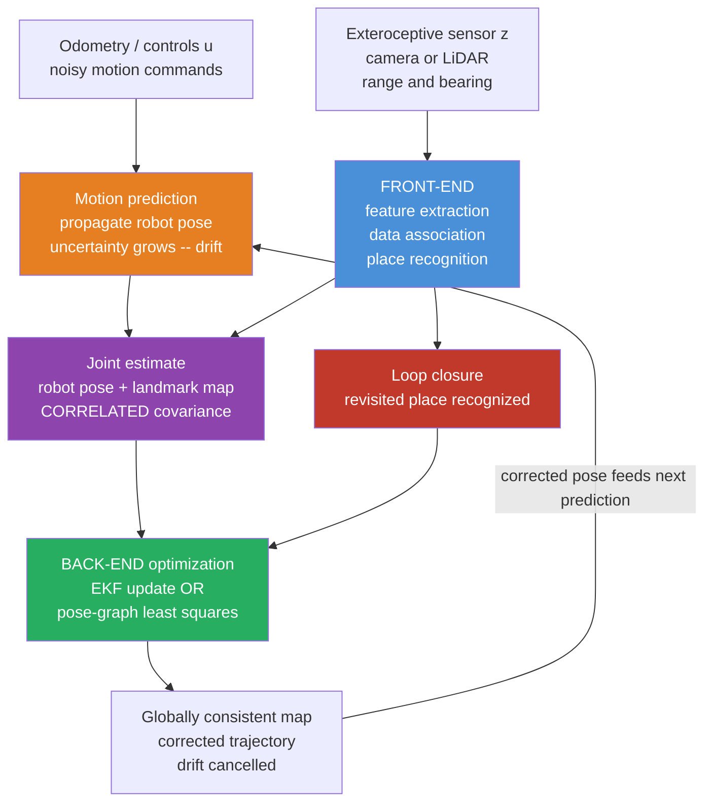

# 🗺️ Simultaneous Localization and Mapping

> [!abstract] TL;DR
> **SLAM** is the problem of building a **map of an unknown environment** while **simultaneously estimating the robot's pose within that map** — using only its own noisy motion commands and noisy sensor observations, with no external ground truth like GPS. It is fundamentally a **chicken-and-egg** problem: you need a map to localize, and you need to know where you are to build a map. SLAM breaks the loop probabilistically by jointly estimating the *correlated* uncertainty of pose and map, and it defeats **drift** through **loop closure** — recognizing a previously visited place and snapping the whole trajectory back into global consistency. The two dominant families are **filter-based** (EKF-SLAM, FastSLAM) and the modern standard, **graph/optimization-based** SLAM (pose-graph optimization and bundle adjustment), which solves a large sparse nonlinear least-squares problem.

---

## Intuition

**Analogy — waking up in an unknown building with no map and no GPS.** You come to in a windowless corridor of a building you have never seen. You want two things at once: a *map* of the building, and to know *where in it you are standing*. But these two goals are locked in a trap. To draw an accurate map, you must know where you are each time you note a feature. To know where you are, you must compare what you see against a map. Neither exists yet.

Yet a human solves this instinctively. You start walking and **count your steps** — a rough, drifting estimate of how far you have gone (this is *odometry*, and it slowly accumulates error). You note **distinctive landmarks** as you pass them: a red fire extinguisher, a cracked tile, a vending machine. You sketch them onto a mental map at your best guess of their location. Every landmark you record is stained by your uncertainty about where *you* were when you saw it — so **your pose error and your map error are correlated**, not independent. Then the magic moment: you round a corner and see **the vending machine you already mapped an hour ago**. Now you *know* you have looped back. That single recognition lets you **cancel the drift** you accumulated over the whole loop — you rigidly rotate and stretch your entire mental map so the two sightings of the vending machine coincide. This is **loop closure**, and it is what turns a wobbly, drifting sketch into a globally consistent map.

A SLAM robot does *exactly this*: it dead-reckons from noisy odometry, extracts and tracks landmarks from a camera or LiDAR, maintains the coupled uncertainty of pose-and-map, and each time it recognizes a place it has been before, it corrects the accumulated error across the entire trajectory.

---

## How It Works

### Core Mechanics

1. **Predict (motion / odometry).** At each step the robot applies a control $u_t$ (wheel odometry, IMU integration, commanded velocity). A **motion model** propagates the belief about the pose forward: $x_t = g(x_{t-1}, u_t) + \text{noise}$. Because the odometry is noisy, the pose uncertainty **grows without bound** on its own — this is *dead-reckoning drift*.
2. **Sense (observation).** An **exteroceptive sensor** (camera, LiDAR, sonar) measures the environment. A **measurement model** predicts what the robot *should* see given its estimated pose and map: $z_t = h(x_t, m) + \text{noise}$ — typically the **range and bearing** to landmarks, or pixel reprojections in vision.
3. **Data association (the front-end).** Match each new observation to a landmark already in the map, initialize a new landmark, or recognize a whole *place* (loop closure). This is the hardest and most failure-prone step — a wrong match corrupts everything downstream.
4. **Correct / estimate (the back-end).** Fuse prediction and observation to update the **joint** estimate of pose *and* map, exploiting their **correlation**: observing a well-known landmark sharpens the pose, and a confident pose sharpens every landmark. Filter approaches (EKF) do this via a Kalman update; graph approaches accumulate all constraints and solve a global optimization.
5. **Loop closure.** When the front-end recognizes a **previously visited place**, it adds a constraint linking the current pose to a much earlier one. The back-end then redistributes the accumulated drift **backward through the entire trajectory**, restoring **global consistency**. This is the single most important mechanism separating SLAM from mere odometry.

### The probabilistic formulation

SLAM estimates the **posterior** over the robot trajectory $x_{0:t}$ and the map $m$ given all controls and observations:

$$p(x_{0:t}, m \mid z_{1:t}, u_{1:t}).$$

Using the Markov assumption, this factorizes into a product of **motion** and **observation** terms:

$$p(x_{0:t}, m \mid z_{1:t}, u_{1:t}) \;\propto\; p(x_0)\prod_{t} \underbrace{p(x_t \mid x_{t-1}, u_t)}_{\text{motion model}} \; \underbrace{p(z_t \mid x_t, m)}_{\text{observation model}}.$$

**Online SLAM** keeps only the *current* pose $p(x_t, m \mid \dots)$ by marginalizing past poses (what EKF-SLAM does). **Full SLAM** keeps the *entire* trajectory $p(x_{0:t}, m \mid \dots)$ — the graph/optimization view, which is why it can re-linearize and correct the whole path at loop closure.

### Flow / Architecture



---

## Key Concepts

### 🟢 Secondary — the plain-language picture

- **Two unknowns, one problem.** SLAM answers *"where am I?"* and *"what does the world look like?"* at the same time, because you cannot cleanly separate them — each depends on the other.
- **Odometry drifts.** Counting wheel turns or integrating an IMU gives a pose that is fine for a second but *slowly wanders off* — small errors compound step after step. This is why odometry alone can never map a large loop.
- **Landmarks anchor you.** Distinctive, re-recognizable features (corners, signs, LiDAR edges) are the fixed reference points. Seeing the same landmark twice ties two moments of your trip together.
- **Loop closure is the payoff.** The instant you recognize a place you have already mapped, you can erase the drift accumulated over the whole loop and snap the map into shape. Without it you have *visual odometry*; with it you have SLAM.
- **Front-end vs back-end.** The front-end is the *perception* half (what did I see, and does it match something?). The back-end is the *math* half (given all these matches, what is the best-fit trajectory and map?).

### 🟡 Undergraduate — the working machinery

- **Motion and measurement models.** For a 2D robot, pose $x=(x,y,\theta)$; the odometry model advances it, and a **range-bearing** sensor returns $z=(r,\phi)$ to a landmark $m_j=(m_x,m_y)$ with $r=\sqrt{(m_x-x)^2+(m_y-y)^2}$ and $\phi=\operatorname{atan2}(m_y-y,\,m_x-x)-\theta$.
- **EKF-SLAM.** Stack the robot pose *and every landmark* into **one big state vector** $\mu$ with **one joint covariance** $\Sigma$. Predict with the [[Kalman_Filter|Kalman]] motion Jacobian; correct with the observation Jacobian. The **off-diagonal blocks of $\Sigma$ encode pose-landmark and landmark-landmark correlations** — the mathematical embodiment of *"my map error and my pose error are linked."* When a re-observed landmark is corrected, those correlations propagate the fix to the pose and to *every other* landmark. Cost is $O(n^2)$ in the number of landmarks because $\Sigma$ is dense.
- **FastSLAM (particle filter).** Key insight (Rao-Blackwellization): *given the trajectory*, the landmarks become **conditionally independent**. So represent the trajectory with particles, and attach to each particle a small independent EKF **per landmark**. This scales to thousands of landmarks and handles nonlinearity and multi-hypothesis data association better than a single EKF.
- **Front-end responsibilities.** Feature extraction (ORB, SIFT, FAST, LiDAR edge/plane features), **data association** (which measurement belongs to which landmark), and **place recognition** for loop closure (bag-of-words like DBoW2, or learned descriptors like NetVLAD).
- **Back-end responsibilities.** Given the graph of constraints, compute the maximum-likelihood trajectory and map — an [[Statistical_Inference|inference]] problem solved either recursively (filter) or in batch (optimization).
- **Landmark maps vs dense maps.** A **feature/landmark map** stores a sparse set of 3D points (efficient, great for localization). A **dense/occupancy map** (occupancy grid, TSDF, point cloud) stores the full geometry (needed for planning and obstacle avoidance) but is heavier.

### 🔴 Graduate — the modern standard and its edges

- **Graph SLAM / pose-graph optimization — the modern default.** Model SLAM as a [[Graph_Theory|graph]]: **nodes** are robot poses (and optionally landmarks), **edges** are relative-motion or observation **constraints**, each with an information (inverse-covariance) matrix. Every constraint contributes an error term; SLAM becomes one big **nonlinear least-squares** problem
  $$x^\star = \arg\min_{x} \sum_{\langle i,j\rangle} e_{ij}(x)^\top \Omega_{ij}\, e_{ij}(x),$$
  solved by Gauss-Newton or Levenberg-Marquardt. A **loop-closure edge** is just one more constraint linking a recent node to an old one — adding it and re-optimizing is precisely what redistributes drift around the loop.
- **Sparsity is everything.** The information matrix of the full problem is **sparse**: pose $i$ only shares constraints with nearby poses and co-visible landmarks. Exploiting this sparsity (variable ordering, Cholesky on the sparse [[Numerical_Linear_Algebra|linear system]], the Schur complement to marginalize landmarks) is what makes batch SLAM tractable — libraries g2o, GTSAM, Ceres, and SLAM++ are built around it. Filters like EKF-SLAM *destroy* this sparsity through marginalization (they yield a dense covariance), which is a core reason optimization overtook filtering.
- **Bundle adjustment (visual SLAM).** In vision the constraints are **reprojection errors**: minimize $\sum \lVert z_{ij} - \pi(K, x_i, m_j)\rVert^2$ over camera poses $x_i$ and 3D points $m_j$, where $\pi$ is the projection through the camera model. This *is* graph SLAM specialized to cameras and is the backbone of ORB-SLAM, structure-from-motion, and visual-inertial odometry.
- **Filtering vs smoothing.** EKF-SLAM is *filtering* — it marginalizes past poses and cannot undo an early linearization error. Batch optimization is *smoothing* — it keeps the trajectory and **re-linearizes**, so it is more accurate; incremental smoothing (iSAM/iSAM2 via the Bayes tree) recovers real-time performance by updating only the affected part of the factorization.
- **Consistency and observability.** EKF-SLAM is famously **inconsistent**: linearization errors make it *overconfident*, underestimating covariance, especially in yaw. The deep cause is that SLAM has **unobservable directions** (global position and heading — the world has no absolute frame), and naive Jacobians spuriously make them observable. Observability-constrained EKF and invariant/right-invariant EKF (on the Lie group $SE(2)/SE(3)$) fix this by respecting the true unobservable subspace.
- **Robust back-ends.** A single false loop closure can catastrophically fold the map. **Robust cost functions** (Huber, Cauchy), **switchable constraints**, **max-mixtures**, and RANSAC-style outlier rejection in the front-end make the least-squares solve tolerant to wrong data associations.
- **Sensor modalities.** *LiDAR SLAM* (ICP/NDT scan matching, LOAM/Cartographer) is precise and lighting-invariant but geometry-degenerate in long corridors. *Visual SLAM* is cheap and information-rich but scale-ambiguous (monocular) and light-sensitive. *Visual-inertial (VIO)* fuses camera + IMU to recover metric scale and survive fast motion and blur — the standard on drones and AR headsets.

---

## Python Demo

A minimal, fully self-contained **EKF-SLAM** in a 2D world. A robot drives one full loop (a circle) through a field of landmarks. Its **odometry is noisy** (per-step forward and heading errors that accumulate into drift), and its **range-bearing observations** of landmarks are noisy too. We compare three trajectories:

1. **Truth** — the real path (a clean circle that returns to its start).
2. **Dead reckoning** — integrating the noisy odometry only; watch it **drift** so the loop fails to close.
3. **EKF-SLAM corrected** — jointly estimate pose *and* landmark positions; re-observing landmarks (and finally the *starting* landmarks after a full loop — **loop closure**) **cancels the drift** so the trajectory closes and the estimated map lands near the true landmarks.

Pure NumPy for the estimator; Matplotlib for the picture. No `scipy`, no SLAM library.

```python
# Minimal EKF-SLAM: one big state [robot_pose, landmark_1, landmark_2, ...]
# with one joint covariance whose off-diagonal blocks tie pose and map together.
# numpy only for the filter; matplotlib for the plot.
import numpy as np
import matplotlib.pyplot as plt

rng = np.random.default_rng(7)
def wrap(a):                      # wrap angle to (-pi, pi]
    return (a + np.pi) % (2*np.pi) - np.pi

# ---- World: landmarks scattered around a loop -----------------------------
landmarks = np.array([
    [ 8.0,  0.0], [ 6.0,  5.0], [ 0.0,  8.0], [-5.0,  6.0],
    [-8.0,  0.0], [-6.0, -5.0], [ 0.0, -8.0], [ 5.0, -6.0],
    [ 3.5,  3.5], [-3.5,  3.5], [-3.5, -3.5], [ 3.5, -3.5],
])
n_lm = len(landmarks)

# ---- True trajectory: one full loop (circle of radius 6, centred at origin) 
N       = 240
radius  = 6.0
d_true  = 2*np.pi*radius / N       # forward step so the circumference is covered
dth_true= 2*np.pi / N              # constant left turn -> closes the loop exactly
U_true  = np.tile([d_true, dth_true], (N, 1))

true = np.zeros((N+1, 3))
true[0] = [radius, 0.0, np.pi/2]   # start at (6,0) facing +y (tangent to circle)
for k in range(N):
    d, dth = U_true[k]; th = true[k, 2]
    true[k+1] = [true[k,0] + d*np.cos(th),
                 true[k,1] + d*np.sin(th), wrap(th + dth)]

# ---- Noisy odometry: same controls corrupted by per-step noise ------------
sig_d, sig_th = 0.03, 0.020        # forward [m] and heading [rad] noise per step
U_odo = U_true + rng.normal(0, [sig_d, sig_th], size=(N, 2))

# Dead reckoning: integrate the noisy odometry ONLY (no sensor correction)
dead = np.zeros((N+1, 3)); dead[0] = true[0]
for k in range(N):
    d, dth = U_odo[k]; th = dead[k, 2]
    dead[k+1] = [dead[k,0] + d*np.cos(th),
                 dead[k,1] + d*np.sin(th), wrap(th + dth)]

# ---- Sensor: range-bearing to landmarks within max_range ------------------
max_range, sig_r, sig_b = 4.5, 0.08, 0.02
Q = np.diag([sig_r**2, sig_b**2])  # observation noise covariance

# ---- EKF-SLAM -------------------------------------------------------------
mu   = np.array(true[0], dtype=float)   # state grows as new landmarks appear
Sig  = np.diag([1e-6, 1e-6, 1e-6])      # start pose is (essentially) known
lm_index = {}                            # landmark id -> its first row in mu
est  = np.zeros((N+1, 3)); est[0] = mu[:3]

for k in range(N):
    # --- PREDICT with the noisy odometry -------------------------------
    d, dth = U_odo[k]; th = mu[2]
    mu[0] += d*np.cos(th); mu[1] += d*np.sin(th); mu[2] = wrap(mu[2] + dth)
    n = len(mu)
    G = np.eye(n); G[0,2] = -d*np.sin(th); G[1,2] = d*np.cos(th)  # motion Jacobian
    V = np.array([[np.cos(th), 0.0], [np.sin(th), 0.0], [0.0, 1.0]])
    Rx = V @ np.diag([sig_d**2, sig_th**2]) @ V.T                 # control noise -> pose
    R = np.zeros((n, n)); R[:3,:3] = Rx
    Sig = G @ Sig @ G.T + R                                       # covariance grows

    # --- CORRECT with every landmark currently in range ----------------
    txp, typ, tth = true[k+1]            # true pose only used to synthesize a reading
    for j in range(n_lm):
        dx_t, dy_t = landmarks[j,0]-txp, landmarks[j,1]-typ
        if np.hypot(dx_t, dy_t) > max_range:
            continue
        z = np.array([np.hypot(dx_t, dy_t) + rng.normal(0, sig_r),
                      wrap(np.arctan2(dy_t, dx_t) - tth + rng.normal(0, sig_b))])

        if j not in lm_index:            # first sighting: initialise landmark
            lm_index[j] = len(mu)
            lx = mu[0] + z[0]*np.cos(z[1] + mu[2])
            ly = mu[1] + z[0]*np.sin(z[1] + mu[2])
            mu = np.append(mu, [lx, ly])
            m = len(mu); S2 = np.zeros((m, m))
            S2[:m-2,:m-2] = Sig; S2[m-2,m-2] = S2[m-1,m-1] = 1e4   # big prior
            Sig = S2

        li, n = lm_index[j], len(mu)     # EKF measurement update
        dx, dy = mu[li]-mu[0], mu[li+1]-mu[1]
        q = dx*dx + dy*dy; rp = np.sqrt(q)
        z_hat = np.array([rp, wrap(np.arctan2(dy, dx) - mu[2])])
        Hl = np.array([[-rp*dx, -rp*dy, 0.0,  rp*dx, rp*dy],
                       [    dy,    -dx,  -q,    -dy,    dx]]) / q  # low Jacobian
        F = np.zeros((5, n)); F[0,0]=F[1,1]=F[2,2]=1.0; F[3,li]=F[4,li+1]=1.0
        H = Hl @ F
        S = H @ Sig @ H.T + Q
        K = Sig @ H.T @ np.linalg.inv(S)
        nu = z - z_hat; nu[1] = wrap(nu[1])                       # innovation
        mu = mu + K @ nu; mu[2] = wrap(mu[2])
        Sig = (np.eye(n) - K @ H) @ Sig
    est[k+1] = mu[:3]

est_lm = np.array([mu[lm_index[j]:lm_index[j]+2] for j in sorted(lm_index)])

# ---- Errors ---------------------------------------------------------------
dead_err = np.hypot(dead[1:,0]-true[1:,0], dead[1:,1]-true[1:,1])
est_err  = np.hypot(est[1:,0]-true[1:,0],  est[1:,1]-true[1:,1])
print(f"final dead-reckoning error : {dead_err[-1]:.2f} m")
print(f"final EKF-SLAM error       : {est_err[-1]:.3f} m")
print(f"mean landmark map error    : "
      f"{np.mean(np.hypot(est_lm[:,0]-landmarks[:,0], est_lm[:,1]-landmarks[:,1])):.3f} m")

# ---- Plots ----------------------------------------------------------------
fig, ax = plt.subplots(1, 2, figsize=(14, 6))
ax[0].plot(true[:,0], true[:,1], 'k-',  lw=2.2, label='true path')
ax[0].plot(dead[:,0], dead[:,1], '--',  lw=1.8, color='crimson',
           label='dead reckoning (odometry only)')
ax[0].plot(est[:,0],  est[:,1],  '-',   lw=1.8, color='royalblue',
           label='EKF-SLAM corrected')
ax[0].scatter(landmarks[:,0], landmarks[:,1], marker='*', s=200, c='green',
              zorder=5, label='true landmarks')
ax[0].scatter(est_lm[:,0], est_lm[:,1], marker='x', s=70, c='blue',
              zorder=6, label='estimated landmarks')
ax[0].scatter(*true[0,:2], c='black', s=60, zorder=7)
ax[0].annotate('start / loop-closure', true[0,:2],
               textcoords='offset points', xytext=(8, 8), fontsize=9)
ax[0].set_aspect('equal'); ax[0].legend(loc='upper right', fontsize=8)
ax[0].set_title('SLAM vs dead reckoning: the loop closes')
ax[0].set_xlabel('x [m]'); ax[0].set_ylabel('y [m]')

steps = np.arange(1, N+1)
ax[1].plot(steps, dead_err, color='crimson',   label='dead reckoning error')
ax[1].plot(steps, est_err,  color='royalblue', label='EKF-SLAM error')
ax[1].set_title('Position error vs step (drift grows; SLAM stays bounded)')
ax[1].set_xlabel('step'); ax[1].set_ylabel('position error [m]'); ax[1].legend()
plt.tight_layout(); plt.show()
```

**What you see.** The printout shows the dead-reckoning error ending around **1–2 m** while the EKF-SLAM error stays at a **few centimetres**, and the estimated landmark map lands within centimetres of the truth. In the left panel the red odometry-only path **spirals off and fails to close** the loop, while the blue SLAM path **hugs the true circle and returns cleanly to its start** — because re-observing landmarks (culminating in the *starting* landmarks after a full lap: loop closure) continually cancels the drift. In the right panel the red curve **climbs steadily** (unbounded drift), while the blue curve **stays flat and bounded** — the signature of SLAM keeping error in check by fusing every observation into the joint pose-and-map estimate. Try deleting the correction block (make it pure prediction) and the blue path collapses onto the red one — proof that the map is doing the work.

---

## Real-World Applications

- **Autonomous vehicles.** Self-driving stacks (Waymo, Cruise) run LiDAR + visual + inertial SLAM to build and localize against HD maps in GPS-denied canyons, tunnels, and parking structures where satellite positioning fails.
- **Warehouse and service robots.** Amazon/Kiva floor robots and consumer vacuums (Roomba, Roborock) use LiDAR or visual SLAM to map a building once and then localize within it for coverage planning and navigation.
- **Drones and aerial robots.** Visual-inertial SLAM/VIO (e.g., on DJI drones and research quadrotors) provides the only reliable state estimate for stable flight indoors or under bridges where GPS is unavailable.
- **AR/VR headsets.** Meta Quest, Microsoft HoloLens, and Apple Vision Pro run real-time visual-inertial SLAM ("inside-out tracking") to anchor virtual content to the physical room and track the headset with sub-centimetre, low-latency precision.
- **Planetary and subsea exploration.** Mars rovers (Perseverance's visual odometry and mapping) and autonomous underwater vehicles rely on SLAM because neither GPS nor prior maps exist off-world or on the seafloor.
- **Search-and-rescue and mining.** Ground and legged robots (Boston Dynamics Spot, the DARPA SubT teams) map collapsed buildings and mines in real time to guide responders through hazardous, unmapped spaces.

---

## Common Pitfalls

- **Data-association errors.** Matching an observation to the *wrong* landmark injects a false constraint that the back-end trusts completely, warping the map. Perceptual aliasing (identical-looking corridors, repetitive facades) is the usual culprit. Mitigate with strong descriptors, geometric verification (RANSAC), and gating tests (Mahalanobis distance).
- **False loop closures.** A *single* incorrect loop closure is often catastrophic — it can fold two distinct places onto each other and collapse the whole map. This is why robust cost functions (Huber/Cauchy), switchable constraints, and strict verification before accepting a closure are essential. False negatives merely leave drift; false positives destroy the map.
- **Drift accumulation.** Between loop closures, error grows without bound (roughly with distance travelled). Long featureless stretches (a blank corridor, open water, a highway) starve the filter of corrections and let drift build unchecked until the next recognizable place.
- **Computational scaling.** EKF-SLAM is $O(n^2)$ in landmarks because its covariance is dense; naive batch optimization is $O(n^3)$. Real systems survive only by exploiting **sparsity** (Schur complement, sparse Cholesky), keyframing, marginalization, and submapping — otherwise the back-end cannot keep up in real time.
- **Dynamic and changing environments.** Classic SLAM assumes a **static** world. Moving people, cars, and doors violate this, corrupting both odometry and the map. Remedies include treating moving objects as outliers, semantic masking of dynamic classes, or explicitly modelling them (dynamic/semantic SLAM).
- **The kidnapped-robot / relocalization problem.** If the robot is picked up and moved, or tracking is lost (motion blur, occlusion), the pose belief becomes wrong with high confidence and the filter cannot recover on its own. A robust system needs **global relocalization** (place recognition against the whole map) to re-anchor — distinct from ordinary loop closure, which assumes tracking was never fully lost.
- **Overconfidence / inconsistency.** EKF-SLAM systematically *underestimates* its own uncertainty because of linearization about a drifting estimate, especially in heading. The reported covariance shrinks faster than the true error, which can make the filter reject valid loop closures. Invariant EKF or optimization-based smoothing addresses the root cause.

---

## Related Concepts

- [[Kalman_Filter]] — the recursive Bayesian estimator at the heart of EKF-SLAM; SLAM stacks the pose *and every landmark* into one Kalman state with a joint covariance, and each observation is a Kalman update.
- [[State_Space_Models]] — SLAM is a state-space estimation problem: a motion (transition) model plus an observation model, exactly the structure filters operate on.
- [[Visual_SLAM]] — the camera-based instantiation covered in depth (ORB-SLAM3, PnP tracking, bundle adjustment, DBoW2 loop closure); this note is the sensor-agnostic, probabilistic parent.
- [[Bayesian_Statistics]] — SLAM *is* Bayesian inference: it computes the posterior over trajectory-and-map given controls and observations, fusing motion priors with sensor likelihoods.
- [[Statistical_Inference]] — the maximum-likelihood / MAP estimation framework that both the filter and the least-squares back-end are solving.
- [[Graph_Theory]] — pose-graph SLAM literally models the problem as a graph of pose/landmark nodes and constraint edges; the sparse structure of that graph is what makes optimization tractable.
- [[Numerical_Linear_Algebra]] — the back-end reduces to a large **sparse** linear system solved by Cholesky/QR each Gauss-Newton iteration; the Schur complement marginalizes landmarks.
- [[Newtons_Method]] — Gauss-Newton (a Newton variant for least squares) is the workhorse solver for graph SLAM and bundle adjustment.
- [[Trust_Region]] — Levenberg-Marquardt, the trust-region damping of Gauss-Newton, is the robust nonlinear-least-squares method used by g2o, GTSAM, and Ceres for SLAM.
- [[Conjugate_Gradient]] — an iterative solver used inside large-scale bundle adjustment when direct factorization is too expensive.
- [[Regression_and_Correlation]] — the whole back-end is nonlinear least squares; the residual-minimization intuition transfers directly.
- [[Common_Probability_Distributions]] — Gaussian belief representation underpins EKF-SLAM (mean + covariance) and the least-squares (information-form) view.
- [[Graph_Representation]] — adjacency/sparse-matrix representations of the constraint graph are exactly what SLAM back-ends store and factorize.
- [[Rigid_Body_Motion_and_Homogeneous_Transforms]] — poses live in $SE(2)/SE(3)$; composing and inverting these transforms is the algebra of every motion and observation constraint.
- [[Robotics_and_Control_Overview]] — the field map placing SLAM within the perception-and-navigation branch of the robotics stack.

> Adjacent robotics notes to build next (prose, not yet in the vault): *Kalman_Filtering_and_State_Estimation* (the estimation foundation), *Robot_Perception_and_Sensor_Fusion* (the front-end sensors feeding SLAM), *Robot_Pose_Estimation_and_Visual_Odometry* (the drift-prone front-end SLAM corrects), *Configuration_Space_and_Motion_Planning* (planning *on* the map SLAM builds), and *Aerial_and_Autonomous_Vehicles* (the platforms where SLAM is mission-critical).

---

## Review Questions

### 🟢 Secondary
1. Using the "waking up in an unknown building" analogy, explain why localization and mapping form a chicken-and-egg problem, and describe the exact moment (recognizing the vending machine you already mapped) that lets you fix your accumulated error. What is that moment called in SLAM?

### 🟡 Undergraduate
2. In EKF-SLAM the robot pose and all landmarks share **one** covariance matrix. Why are the off-diagonal (correlation) blocks essential — what would go wrong if you estimated each landmark with its own *independent* filter and ignored the correlations?
3. Distinguish the **front-end** from the **back-end** of a SLAM system. Give one concrete failure mode of each, and explain why a front-end mistake (wrong data association) is typically more dangerous than a back-end approximation.

### 🔴 Graduate
4. Modern SLAM has largely moved from EKF-based filtering to graph/optimization-based smoothing. Explain **two** distinct reasons for this shift, referencing (a) sparsity of the information matrix and (b) the ability to re-linearize at loop closure. Why does marginalization in EKF-SLAM hurt on both counts?
5. EKF-SLAM is known to be **inconsistent** (overconfident), especially in heading. Explain the connection to SLAM's *unobservable* directions (global position/heading) and how linearizing about a drifting estimate spuriously makes them appear observable. Name one estimator that repairs this.
6. You add a loop-closure constraint between the current pose and a pose from 500 steps ago, but your place-recognition front-end has a small false-positive rate. Describe precisely what a *single* false loop closure does to the least-squares solution, and outline two mechanisms (one front-end, one back-end) that make the system robust to it.

---

## Sources

- Thrun, S., Burgard, W., & Fox, D. — *Probabilistic Robotics* (MIT Press, 2005), Chs. 10–13 (EKF-SLAM, GraphSLAM, FastSLAM).
- Durrant-Whyte, H., & Bailey, T. — "Simultaneous Localization and Mapping (SLAM): Part I & Part II," *IEEE Robotics & Automation Magazine*, 2006.
- Cadena, C., Carlone, L., Carrillo, H., Latif, Y., Scaramuzza, D., Neira, J., Reid, I., & Leonard, J. — "Past, Present, and Future of Simultaneous Localization and Mapping: Toward the Robust-Perception Age," *IEEE Transactions on Robotics*, 32(6), 2016.
- Grisetti, G., Kümmerle, R., Stachniss, C., & Burgard, W. — "A Tutorial on Graph-Based SLAM," *IEEE Intelligent Transportation Systems Magazine*, 2(4), 2010.
- Dellaert, F., & Kaess, M. — *Factor Graphs for Robot Perception*, Foundations and Trends in Robotics (2017); and the GTSAM library.

---

#robotics #slam #localization #mapping #loop-closure
