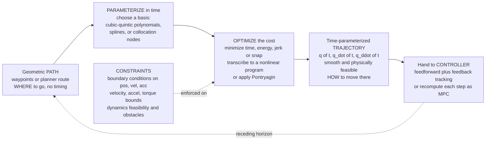

# 🛤️ Trajectory Optimization and Generation

> [!abstract] TL;DR
> A **path** is a geometric route — an ordered set of poses in space with *no clock attached*. A **trajectory** glues a clock to that route: it is a **time-parameterized motion** $\mathbf{q}(t)$ (with its derivatives $\dot{\mathbf{q}}(t), \ddot{\mathbf{q}}(t)$) that a real machine can actually execute. **Trajectory generation** builds such a motion by *interpolation* — fitting cubic/quintic polynomials, splines, or trapezoidal/S-curve velocity profiles between waypoints while enforcing **boundary conditions** on position, velocity, and acceleration. **Trajectory optimization** goes further: it poses an **optimal control problem** — *minimize time, energy, or jerk/snap subject to the robot's dynamics and its velocity/acceleration/torque limits* — and solves it, usually by transcribing the continuous problem into a finite **nonlinear program** (direct **collocation** or **shooting**) or, classically, via **Pontryagin's** conditions (indirect methods). Smoothness is not cosmetic: **minimum-jerk** and **minimum-snap** trajectories keep actuator commands continuous and bounded, which is exactly what lets a quadrotor flip through a window or a robot arm slam a part into place without ringing. This is the layer that turns the jagged output of a planner into a plan the motors can follow — and the receding-horizon version of it *is* Model Predictive Control.

---

## Intuition

**Analogy — the road trip vs the drive.** A planner hands you a **connect-the-dots route** through a maze: "go to corner A, then B, then C." That is a *path* — it tells you **where**, drawn as straight segments meeting at sharp corners. But no car can teleport around a right-angle corner at speed, and no robot arm can instantly reverse its motors. To actually *drive* the route you need a **trajectory**: a smooth, timed plan of **how** to move — when to accelerate, how fast to take each bend, when to brake — that respects how hard the engine can push and how sharply the wheels can turn. A racing driver does not follow the connect-the-dots line; they *round off* the corners into a smooth racing line and pick a speed profile the tyres can hold.

That rounding-off and speed-picking is trajectory generation and optimization. The path answers *where to go*; the trajectory answers *how to move there* — **smooth in time, feasible for the motors, and often "best"** by some yardstick of time, energy, or jerk. The difference is the difference between a sketch on a napkin and a plan the hardware can run at 3 a.m. without shaking itself apart.

---

## How It Works

### Core Mechanics

1. **Start from a path (or just waypoints).** The input is a geometric route: a list of waypoints $\mathbf{q}_0, \mathbf{q}_1, \dots, \mathbf{q}_N$, or a continuous but timeless curve (perhaps the jagged output of a sampling-based planner). No timing information yet.

2. **Choose a parameterization for time.** Pick a mathematical form for $\mathbf{q}(t)$ on each segment. Common choices:
   - **Cubic polynomial** (4 coefficients) — matches end *positions* and *velocities*: $q(t) = a_0 + a_1 t + a_2 t^2 + a_3 t^3$.
   - **Quintic polynomial** (6 coefficients) — matches end positions, velocities, *and accelerations*, giving continuous acceleration across segments. The quintic with zero boundary velocity and acceleration is exactly the **minimum-jerk** trajectory.
   - **Trapezoidal / S-curve velocity profiles** — ramp up, cruise at $v_{\max}$, ramp down; the S-curve additionally limits jerk by rounding the acceleration corners.
   - **Splines / Béziers** — piecewise polynomials with continuity constraints at the knots (the same math as keyframe animation).

3. **Impose boundary and continuity conditions.** Fix the endpoints and enforce smoothness at the joins: matching position (C⁰), velocity (C¹), acceleration (C²), and — for minimum-snap — jerk (C³). Each condition is a linear equation on the coefficients; solving the linear system *is* the generation step.

4. **Add the cost and the constraints (this is where "generation" becomes "optimization").** Instead of only interpolating, minimize an objective
   $$J = \int_0^{T} L\big(\mathbf{q}(t), \dot{\mathbf{q}}(t), \ddot{\mathbf{q}}(t), \mathbf{u}(t)\big)\, dt \;+\; \phi(T)$$
   — total time $T$, control energy $\int \mathbf{u}^\top \mathbf{u}\,dt$, or squared jerk $\int \dddot{\mathbf{q}}^2 dt$ — **subject to** the system dynamics $\dot{\mathbf{x}} = f(\mathbf{x}, \mathbf{u})$ and inequality limits $|\dot{\mathbf{q}}| \le v_{\max}$, $|\ddot{\mathbf{q}}| \le a_{\max}$, $|\boldsymbol{\tau}| \le \tau_{\max}$, plus obstacle-avoidance constraints.

5. **Solve.** Two families:
   - **Direct methods (transcription).** Discretize the trajectory into finitely many decision variables (spline coefficients, or state/control values at collocation nodes) and hand the resulting **nonlinear program (NLP)** to a solver (SQP, interior-point). Direct **collocation** and **multiple shooting** dominate practice.
   - **Indirect methods.** Apply **Pontryagin's Minimum Principle** / calculus of variations to derive optimality conditions (costate equations, a two-point boundary-value problem) and solve *those*. Elegant, gives insight (e.g. **bang-bang** structure for time-optimal control), but brittle and hard to warm-start.

6. **Emit a time-parameterized trajectory.** The output is $\mathbf{q}(t), \dot{\mathbf{q}}(t), \ddot{\mathbf{q}}(t)$ (and often the feedforward torque $\boldsymbol{\tau}(t)$) — handed to a tracking controller, or, in receding-horizon form, recomputed every timestep as **MPC**.

### Flow / Architecture



---

## Key Concepts

### Secondary Level (Motivation)

- **Path vs trajectory.** A *path* is a shape drawn in space — the dotted line on a map. A *trajectory* is that shape **plus a clock**: it says where you are at every instant. The path has no speed; the trajectory has speed, acceleration, and a start and end time.
- **Why sharp corners are impossible.** A connect-the-dots route has instantaneous direction changes. A real body has mass, so changing direction instantly would need infinite force. Smoothing rounds those corners into arcs the machine can actually take.
- **Speed limits are real.** Motors saturate: there is a top speed ($v_{\max}$) and a top push ($a_{\max}$). A good trajectory never asks the motor for more than it can give — it ramps up, cruises, and brakes, like a car respecting the speed limit.

### Undergraduate Level

- **Polynomial interpolation & boundary conditions.** A degree-$n$ polynomial has $n+1$ coefficients, fixed by $n+1$ conditions. A **cubic** (4 unknowns) matches start/end position and velocity; a **quintic** (6 unknowns) also matches start/end acceleration, so joining quintics gives continuous acceleration. Solve a small linear system $A\mathbf{c} = \mathbf{b}$ for the coefficients.
- **Trapezoidal & S-curve velocity profiles.** The workhorse of CNC and industrial motion: accelerate at $a_{\max}$ until reaching $v_{\max}$, **cruise**, then decelerate at $a_{\max}$. If the move is too short to reach $v_{\max}$, it degenerates to a **triangle**. The **S-curve** adds jerk limits by ramping the *acceleration* smoothly, eliminating the trapezoid's discontinuous-acceleration corners.
- **Smoothness objectives — minimum jerk & minimum snap.** **Jerk** is $\dddot{q}$ (rate of change of acceleration); **snap** is $\ddddot{q}$. Minimizing $\int \dddot{q}^2\,dt$ or $\int \ddddot{q}^2\,dt$ produces the gentlest possible motion — no sudden force changes to excite structural vibration or overshoot. The minimum-jerk point-to-point trajectory (zero boundary vel/acc) is the famous quintic $q(\tau) = q_0 + (q_f-q_0)(10\tau^3 - 15\tau^4 + 6\tau^5)$, $\tau = t/T$.
- **Kinematic vs dynamic limits.** *Kinematic* limits bound $\dot{q}, \ddot{q}$ directly. *Dynamic* limits bound the **torque** $\boldsymbol{\tau} = M(\mathbf{q})\ddot{\mathbf{q}} + C\dot{\mathbf{q}} + \mathbf{g}$ (see the sibling *Robot_Dynamics_and_Equations_of_Motion*), so the feasible acceleration depends on configuration and velocity — a much harder, coupled constraint.
- **The path–velocity decomposition.** A neat trick: fix the geometric path, parameterize progress along it by a scalar $s \in [0,1]$, and optimize only the **time-scaling** $s(t)$. This turns time-optimal traversal of a *fixed* path into a convex problem — the basis of TOPP (Time-Optimal Path Parameterization).

### Graduate Level

- **The optimal control problem (OCP).** Formally: $\min_{\mathbf{u}(\cdot),T} \int_0^T L\,dt + \phi(\mathbf{x}(T))$ s.t. $\dot{\mathbf{x}} = f(\mathbf{x},\mathbf{u})$, $\mathbf{g}(\mathbf{x},\mathbf{u}) \le 0$, $\mathbf{x}(0)=\mathbf{x}_0$, boundary conditions on $\mathbf{x}(T)$. Trajectory optimization is *numerical optimal control*.
- **Direct transcription.** Discretize into an NLP. **Direct collocation** represents the state/control as piecewise polynomials and enforces the dynamics at collocation points (Hermite–Simpson, Legendre–Gauss pseudospectral); **direct/multiple shooting** integrates the dynamics forward between knot points. The NLP is solved by SQP or interior-point methods; its optimality is characterized by the **KKT conditions**. Sparsity of the constraint Jacobian is what makes it tractable.
- **Indirect methods & Pontryagin.** Introduce costates $\boldsymbol{\lambda}(t)$, form the Hamiltonian $H = L + \boldsymbol{\lambda}^\top f$, and require $\partial H/\partial \mathbf{u} = 0$ with $\dot{\boldsymbol{\lambda}} = -\partial H/\partial \mathbf{x}$. This yields a **two-point boundary-value problem**. For control-affine systems with bounded inputs, the minimum principle predicts **bang-bang** control — inputs saturate at their limits and switch — which is the structure of **time-optimal** trajectories.
- **Convexity & structure.** Generic trajopt is **nonconvex** (the dynamics constraint is nonlinear) and rife with **local minima**. But important sub-problems are convex: min-snap with linear dynamics is a **quadratic program**; time-scaling a fixed path is convex; sequential convexification (SCP/SCvx) solves nonconvex problems as a series of convex ones. Convexity buys a *unique global optimum* and fast, reliable solves (see [[Convex_Functions]], [[KKT_Conditions]]).
- **Differential flatness.** Some systems (notably **quadrotors**, cars) are *differentially flat*: the full state and inputs can be written as algebraic functions of a few **flat outputs** and their derivatives. For a quadrotor the flat outputs are position $(x,y,z)$ and yaw. This collapses trajectory optimization into planning **smooth curves in the flat output space** — which is precisely why Mellinger & Kumar's **minimum-snap** quadrotor trajectories work: snap (the 4th derivative of position) maps directly to the rotor commands, so minimizing snap minimizes aggressive actuator use.
- **Connection to MPC and planning.** **Model Predictive Control** *is* trajectory optimization solved over a short receding horizon, re-run every timestep with feedback — the sibling *Model_Predictive_Control* covers this. On the planning side, trajectory optimization is the standard **post-processing** that *smooths* the jagged output of sampling-based planners (the RRT/PRM path from *Sampling_Based_Planning_RRT_and_PRM*) into an executable motion; CHOMP, STOMP, and TrajOpt optimize directly in the configuration space of *Configuration_Space_and_Motion_Planning*.

---

## Python Demo

```python
# Trajectory generation & optimization from scratch (numpy + matplotlib).
#   (A) QUINTIC (minimum-jerk) point-to-point trajectory from boundary conditions
#       on position/velocity/acceleration  ->  smooth, zero end-velocity/accel.
#   (B) TRAPEZOIDAL velocity profile that provably respects v_max and a_max bounds.
#   (C) A 2D minimum-jerk path traced smoothly through a set of waypoints.
# We plot position, velocity, acceleration vs time (with the bound lines) and the 2D path.
import numpy as np
import matplotlib.pyplot as plt

# =========================================================================
# (A) QUINTIC = MINIMUM-JERK point-to-point.
#     A 5th-order polynomial has 6 coefficients, fixed by 6 boundary
#     conditions: position, velocity AND acceleration at t=0 and t=T.
# =========================================================================
def quintic_coeffs(q0, qf, T, v0=0.0, vf=0.0, a0=0.0, af=0.0):
    """Solve a0..a5 of q(t)=sum_k a_k t^k from the 6 boundary conditions."""
    A = np.array([
        [1, 0,   0,     0,      0,       0      ],   # q(0)   = q0
        [0, 1,   0,     0,      0,       0      ],   # q'(0)  = v0
        [0, 0,   2,     0,      0,       0      ],   # q''(0) = a0
        [1, T,   T**2,  T**3,   T**4,    T**5   ],   # q(T)   = qf
        [0, 1,   2*T,   3*T**2, 4*T**3,  5*T**4 ],   # q'(T)  = vf
        [0, 0,   2,     6*T,    12*T**2, 20*T**3],   # q''(T) = af
    ])
    b = np.array([q0, v0, a0, qf, vf, af])
    return np.linalg.solve(A, b)

def poly_eval(c, t):
    """Return (position, velocity, acceleration) of polynomial with coeffs c."""
    p = sum(c[k] * t**k              for k in range(len(c)))
    v = sum(k * c[k] * t**(k-1)      for k in range(1, len(c)))
    a = sum(k*(k-1) * c[k] * t**(k-2) for k in range(2, len(c)))
    return p, v, a

vmax, amax = 1.0, 2.0            # kinematic bounds shared by both methods
Tq = 2.0
tq = np.linspace(0, Tq, 400)
cq = quintic_coeffs(0.0, 1.0, Tq)   # move 0 -> 1, rest-to-rest
pq, vq, aq = poly_eval(cq, tq)

# =========================================================================
# (B) TRAPEZOIDAL velocity profile respecting v_max / a_max.
#     Accelerate at a_max -> cruise at v_max -> decelerate at a_max.
#     If the move is too short to reach v_max, it degenerates to a TRIANGLE.
# =========================================================================
def trapezoidal(L, vmax, amax, n=400):
    ta = vmax / amax                       # time to ramp up to v_max
    da = 0.5 * amax * ta**2                # distance used during one ramp
    if 2*da >= L:                          # triangular: never reach v_max
        ta   = np.sqrt(L / amax)
        vpk  = amax * ta
        tc   = 0.0
    else:                                  # full trapezoid
        vpk  = vmax
        tc   = (L - 2*da) / vmax           # cruise time
    Ttot = 2*ta + tc
    tt   = np.linspace(0, Ttot, n)
    pos, vel, acc = np.zeros(n), np.zeros(n), np.zeros(n)
    for i, ti in enumerate(tt):
        if ti < ta:                                    # accelerating
            acc[i], vel[i] = amax, amax*ti
            pos[i] = 0.5*amax*ti**2
        elif ti < ta + tc:                             # cruising
            acc[i], vel[i] = 0.0, vpk
            pos[i] = 0.5*amax*ta**2 + vpk*(ti-ta)
        else:                                          # decelerating
            td = ti - ta - tc
            acc[i], vel[i] = -amax, vpk - amax*td
            pos[i] = 0.5*amax*ta**2 + vpk*tc + vpk*td - 0.5*amax*td**2
    return tt, pos, vel, acc, Ttot

tt, pt, vt, at, Ttrap = trapezoidal(1.0, vmax, amax)

# =========================================================================
# (C) 2D MINIMUM-JERK path through waypoints: each axis is a quintic per
#     segment (rest-to-rest), giving a smooth curve that hits every waypoint.
# =========================================================================
wpts  = np.array([[0.0, 0.0], [1.0, 2.0], [3.0, 1.5], [4.0, 3.0], [5.5, 2.0]])
seg_T = 1.5
def minjerk_axis(vals, T, pts_per_seg=80):
    out = []
    for i in range(len(vals) - 1):
        c  = quintic_coeffs(vals[i], vals[i+1], T)   # rest-to-rest each hop
        ts = np.linspace(0, T, pts_per_seg)
        out.append(poly_eval(c, ts)[0])
    return np.concatenate(out)
px = minjerk_axis(wpts[:, 0], seg_T)
py = minjerk_axis(wpts[:, 1], seg_T)

# ------------------------------- Plots -----------------------------------
fig, ax = plt.subplots(2, 2, figsize=(13, 9))

ax[0,0].plot(tq, pq,        label="quintic (min-jerk)")
ax[0,0].plot(tt, pt, '--',  label=f"trapezoidal (T={Ttrap:.2f}s)")
ax[0,0].set(title="(A/B) Position vs time", xlabel="t (s)", ylabel="q (position)")
ax[0,0].legend(); ax[0,0].grid(alpha=.3)

ax[0,1].plot(tq, vq,        label="quintic (min-jerk)")
ax[0,1].plot(tt, vt, '--',  label="trapezoidal")
ax[0,1].axhline(vmax, color='r', ls=':', label="v_max bound")
ax[0,1].set(title="Velocity vs time (respects v_max)", xlabel="t (s)", ylabel="q_dot")
ax[0,1].legend(); ax[0,1].grid(alpha=.3)

ax[1,0].plot(tq, aq,        label="quintic (min-jerk)")
ax[1,0].plot(tt, at, '--',  label="trapezoidal")
ax[1,0].axhline( amax, color='r', ls=':', label="a_max bound")
ax[1,0].axhline(-amax, color='r', ls=':')
ax[1,0].set(title="Acceleration vs time (respects a_max)", xlabel="t (s)", ylabel="q_ddot")
ax[1,0].legend(); ax[1,0].grid(alpha=.3)

ax[1,1].plot(px, py, '-', lw=2.2, label="smooth min-jerk path")
ax[1,1].plot(wpts[:,0], wpts[:,1], 'ko--', alpha=.45, label="raw waypoints (jagged)")
ax[1,1].set(title="(C) 2D path smoothed through waypoints", xlabel="x", ylabel="y")
ax[1,1].axis("equal"); ax[1,1].legend(); ax[1,1].grid(alpha=.3)

plt.tight_layout(); plt.show()

# ------------------------- Numerical sanity report -----------------------
print(f"quintic  end velocity   = {vq[-1]: .2e}   (min-jerk -> ~0)")
print(f"quintic  end accel      = {aq[-1]: .2e}   (min-jerk -> ~0)")
print(f"quintic  peak |vel|     = {np.max(np.abs(vq)):.3f}   (bound {vmax})")
print(f"quintic  peak |accel|   = {np.max(np.abs(aq)):.3f}   (bound {amax})")
print(f"trapezoid peak vel      = {np.max(vt):.3f}   hits bound {vmax}")
print(f"trapezoid peak |accel|  = {np.max(np.abs(at)):.3f}   hits bound {amax}")
```

**What the four panels show.** Both methods move the joint from `0` to `1`. The **quintic** (panel A/B, solid) is the **minimum-jerk** solution: its velocity rises and falls smoothly to **exactly zero** at both ends, and its acceleration is continuous — gentle on the motors, but it takes the full `2.0 s`. The **trapezoidal** profile (dashed) is *faster* (`~1.5 s`) because it **saturates the bounds**: velocity flat-tops at `v_max` and acceleration is a bang-bang `±a_max` — you can see it kiss both dotted bound lines. The trade is visible in the acceleration panel: the trapezoid's acceleration **jumps discontinuously** (infinite jerk at the corners), which excites vibration — the exact reason S-curves and min-jerk exist. Panel (C) turns the jagged connect-the-dots waypoints (black dashed) into a **smooth 2D path** (blue) by making each axis a rest-to-rest quintic — a miniature of how planners smooth an RRT output into something a robot can fly.

---

## Real-World Applications

- **Industrial robot arms & CNC (Fanuc, KUKA, ABB, Siemens/Fanuc CNC).** Point-to-point moves and contour following use trapezoidal and **S-curve** profiles to hit target poses as fast as possible while respecting per-axis $v_{\max}, a_{\max}, j_{\max}$ — the difference between a smooth production cycle and a machine that rattles its own bolts loose.
- **Quadrotors & aggressive flight (Mellinger & Kumar; the sibling *Aerial_and_Autonomous_Vehicles*).** **Minimum-snap** trajectories exploit **differential flatness**: because snap maps to rotor thrust, minimizing $\int \ddddot{\mathbf{p}}^2\,dt$ yields the smooth, feasible curves that let drones flip through gaps and fly figure-eights. Solved as a QP over piecewise polynomials.
- **Self-driving cars & motion planning (Apollo, Autoware).** Behavior planners emit a coarse path; a trajectory optimizer produces a comfortable, dynamically feasible $\mathbf{q}(t)$ that bounds lateral acceleration and jerk (passenger comfort) and respects the road boundary — often via convex QP over a Frenet frame.
- **Legged locomotion (Boston Dynamics, MIT Cheetah, ANYmal).** Whole-body **trajectory optimization** (direct collocation over contact-rich dynamics) plans footstep timing and center-of-mass motion that respect friction cones and torque limits; solved online as **MPC**.
- **Spacecraft & rockets (SpaceX landing, lunar descent).** Fuel-optimal / time-optimal descent is a classic optimal-control problem; **lossless convexification** turns the powered-descent guidance problem into a convex program solvable in milliseconds onboard.
- **Surgical & assistive robots.** Minimum-jerk profiles mimic the smooth, bell-shaped velocity of human reaching movements, producing motion that feels natural and is gentle on delicate tissue and tools.

---

## Common Pitfalls

- **Ignoring dynamic limits.** Generating a geometrically smooth spline and *assuming* the robot can follow it is the classic error. A trajectory can be $C^\infty$-smooth yet demand torque the motors cannot deliver near a singular configuration. Always check the trajectory against **actuator/torque limits** (via the dynamics), not just kinematic $v_{\max}, a_{\max}$.
- **Discontinuous acceleration / jerk.** Cubic splines give continuous velocity but *discontinuous acceleration* at the knots; trapezoidal profiles have bang-bang acceleration. Those jumps mean **infinite jerk**, which excites structural resonance, causes overshoot and audible chatter, and wears gearboxes. Use quintics (continuous accel) or S-curves (bounded jerk) when smoothness matters.
- **Local minima in nonconvex trajopt.** The dynamics constraint is nonlinear, so the NLP is nonconvex — the solver can converge to a poor local optimum or to a wildly different solution from a slightly different seed. **Warm-start** from a feasible initial guess (e.g. the geometric path), use multiple restarts, or reformulate convexly (SCP, path–velocity decomposition) when possible.
- **Time allocation.** For multi-segment (min-snap-style) trajectories you must choose *how long* each segment lasts. Allocate too little time and the trajectory violates limits; too much and it crawls. Segment durations are themselves decision variables — but making them free turns the QP nonconvex, so practitioners bilevel-optimize or heuristically scale times until feasible.
- **Infeasibility & over-constraining.** Demanding to hit every waypoint *and* zero velocity there *and* a tight total time can make the problem infeasible; the solver then returns garbage or fails silently. Diagnose which constraint binds, relax waypoint tolerances (turn hard waypoints into soft costs / corridors), or lengthen the horizon.
- **Confusing the path with the trajectory.** Optimizing the geometric shape (shorter, obstacle-free) is *not* the same as optimizing the motion (smooth, fast, feasible). A shortest path can be the *worst* trajectory if it forces sharp, high-acceleration corners. Keep the two stages — plan the path, then optimize the trajectory — conceptually distinct.

---

## Related Concepts

- [[Interpolation_and_Approximation]] — polynomial and spline interpolation is the mathematical engine of trajectory *generation*; fitting cubics/quintics to boundary conditions is exactly the interpolation problem.
- [[Bezier_and_Bsplines]] — the same piecewise-polynomial machinery used for keyframe animation and vector graphics; Bézier/B-spline curves are a standard trajectory parameterization with convex-hull and continuity guarantees.
- [[Systems_of_ODEs]] — the dynamics constraint $\dot{\mathbf{x}}=f(\mathbf{x},\mathbf{u})$ is a system of ODEs that a feasible trajectory must satisfy; shooting methods integrate it, collocation enforces it at nodes.
- [[Numerical_Integration]] — direct-collocation transcription discretizes the cost *integral* and the dynamics using quadrature/collocation rules (Hermite–Simpson, Gauss).
- [[Lagrange_Multipliers]] — equality-constrained trajectory optimization is solved via multipliers; in the indirect (Pontryagin) view the costates *are* the multipliers of the dynamics constraint.
- [[KKT_Conditions]] — the first-order optimality conditions characterizing the solution of the constrained nonlinear program that direct transcription produces.
- [[Convex_Functions]] — when the trajopt is convex (min-snap QP, fixed-path time-scaling, lossless convexification) it has a unique global optimum and solves fast and reliably; convexity is the property worth engineering for.
- [[Gradient_Descent]] — the first-order backbone of the NLP solvers; combined with [[Newtons_Method]] and SQP/interior-point machinery to drive the transcribed problem to a KKT point.

*Foundational siblings in the Robotics_and_Control vault (some to be written): Robot_Dynamics_and_Equations_of_Motion supplies the $M\ddot{\mathbf{q}}+C\dot{\mathbf{q}}+\mathbf{g}=\boldsymbol{\tau}$ dynamics that become the trajectory's feasibility constraint; Configuration_Space_and_Motion_Planning and Sampling_Based_Planning_RRT_and_PRM produce the geometric path that this note time-parameterizes and smooths; Model_Predictive_Control is receding-horizon trajectory optimization run online; Aerial_and_Autonomous_Vehicles applies minimum-snap and differential flatness to quadrotors and self-driving cars.*

---

## Review Questions

1. **(Secondary)** In one or two sentences, explain the difference between a *path* and a *trajectory*, and give an everyday example (like driving) where the same path can be executed as many different trajectories.
2. **(Undergraduate)** Why does a **quintic** polynomial, rather than a **cubic**, give continuous *acceleration* when you chain several segments together? How many boundary conditions does each need, and what physical quantities do those conditions fix?
3. **(Undergraduate)** In the demo, the trapezoidal profile finishes faster than the minimum-jerk quintic but its acceleration jumps discontinuously. State the trade-off precisely and explain why the discontinuity is a problem for real hardware.
4. **(Graduate)** Contrast **direct** (collocation/shooting → NLP) and **indirect** (Pontryagin → boundary-value problem) methods for trajectory optimization. Give one advantage and one disadvantage of each, and explain why time-optimal control tends to be **bang-bang**.
5. **(Graduate / scenario)** You must fly a quadrotor through three narrow gaps at fixed positions as fast as possible. Explain how **differential flatness** and a **minimum-snap** formulation let you pose this as a (convex) optimization, what the decision variables are, why **time allocation** across segments is the tricky part, and how you would detect and fix an infeasible result.

---

## Sources

- Kelly, M. — *An Introduction to Trajectory Optimization: How to Do Your Own Direct Collocation*, SIAM Review 59(4), 2017. [PDF](https://epubs.siam.org/doi/10.1137/16M1062569) — the clearest hands-on tutorial on direct methods.
- Betts, J. T. — *Practical Methods for Optimal Control and Estimation Using Nonlinear Programming* (2nd ed., SIAM, 2010) — the reference for transcription and NLP-based optimal control.
- Mellinger, D. & Kumar, V. — *Minimum Snap Trajectory Generation and Control for Quadrotors*, ICRA 2011. [PDF](https://ieeexplore.ieee.org/document/5980409) — differential flatness and the min-snap QP.
- Lynch, K. M. & Park, F. C. — *Modern Robotics: Mechanics, Planning, and Control* (Cambridge, 2017), Ch. 9 "Trajectory Generation." [Free PDF](https://hades.mech.northwestern.edu/index.php/Modern_Robotics)
- Biagiotti, L. & Melchiorri, C. — *Trajectory Planning for Automatic Machines and Robots* (Springer, 2008) — the definitive treatment of polynomial, trapezoidal, and S-curve profiles.

---

#robotics #trajectory-optimization #motion-generation #minimum-jerk #optimal-control
