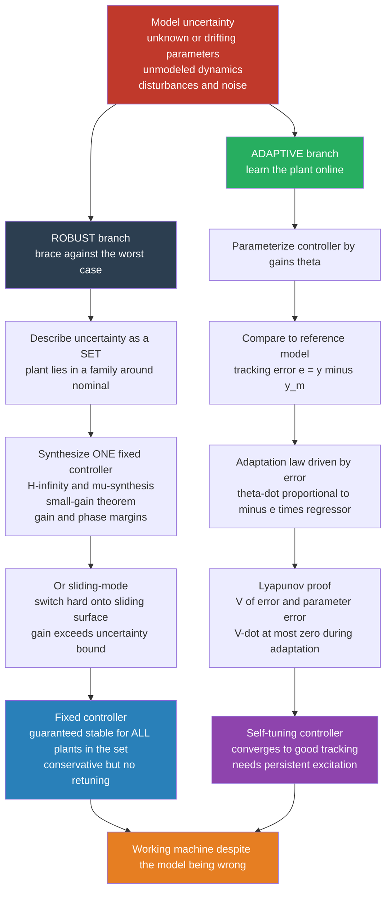

# 🎛️ Adaptive and Robust Control

> [!abstract] TL;DR
> Every controller is designed against a **model**, and every model is wrong — parameters are unknown or drift, dynamics go unmodeled, disturbances hit. Two philosophies answer this. **Robust control** designs a *single fixed* controller proven to work for an entire **set** of possible plants (the worst case) using tools like $H_\infty$ synthesis, the small-gain theorem, gain/phase margins, and sliding-mode control — it *braces* against uncertainty. **Adaptive control** instead adjusts the controller *online* as it learns the plant — Model-Reference Adaptive Control (MRAC), self-tuning regulators, and Lyapunov-designed adaptation laws driven by tracking error — it *learns* the uncertainty away. Robust trades performance for a stability guarantee up front; adaptive recovers performance at the cost of transient risk and the need for persistent excitation.

---

## Intuition

**Analogy — the truck tuned for an empty bed.** You tune a truck's cruise control and steering assist while the bed is empty. It drives beautifully. Then you load two tonnes of cargo: the same throttle now accelerates too slowly, the same steering now understeers, and the "perfect" controller drives the truck terribly. The plant changed; the controller didn't. There are exactly two ways to survive this.

**Robust control is a suspension built tough enough for any legal load.** Instead of retuning, you design *once* for the whole range — empty to fully-laden — accepting that the ride will be a compromise (a bit stiff empty, a bit soft full) but *guaranteed safe and stable at every load in the range*. You brace against the worst case and never touch the settings again.

**Adaptive control is a driver who feels the truck is heavier and adjusts on the fly.** The controller watches how the truck actually responds, infers *"this is heavier than I assumed,"* and continuously re-tunes its own gains until the response matches what it wants. It learns the load in real time rather than pre-planning for it.

One design *assumes the worst and holds firm*; the other *measures reality and moves*. Both keep the machine working when the model doesn't match the world — and real aerospace and robotic systems routinely combine them.

---

## How It Works

The shared enemy is **model uncertainty**, which comes in three flavors: (1) **parametric** — the structure is known but numbers like mass, inertia, or aerodynamic coefficients are unknown or slowly changing; (2) **unmodeled dynamics** — high-frequency modes, flexible modes, and time delays the design ignored; (3) **disturbances and noise** — exogenous forces and sensor error. Robust and adaptive control attack this from opposite directions.

### The robust branch — design for the whole uncertainty set

1. **Describe the uncertainty as a set**, not a point: the true plant $P$ lives somewhere in a family $\{P_0(1 + \Delta W)\}$ around a nominal $P_0$, where $\Delta$ is any stable perturbation with $\lVert\Delta\rVert_\infty \le 1$ and $W$ shapes its size across frequency.
2. **Synthesize one fixed controller** $C$ that stabilizes *every* member of that set and meets performance. The **small-gain theorem** gives the core condition: the loop stays stable for all $\lVert\Delta\rVert \le 1$ iff $\lVert W\,T\rVert_\infty < 1$, where $T$ is the closed-loop complementary sensitivity. This is what $H_\infty$ synthesis and $\mu$-synthesis optimize; classical **gain and phase margins** are its single-loop, scalar shadow.
3. **Sliding-mode control** is the nonlinear, high-gain cousin: define a sliding surface $s = 0$ and switch the control hard enough ($u = -\kappa\,\mathrm{sign}(s)$ with $\kappa$ exceeding the uncertainty bound) that the state is *forced* onto the surface and stays there regardless of the parameters — robustness by brute authority.

### The adaptive branch — estimate the plant online and update the controller

1. **Parameterize the controller** with adjustable gains $\theta$ that *would* be correct if you knew the plant.
2. **Compare against a reference model** you want the closed loop to imitate, forming the **tracking error** $e = y - y_m$.
3. **Update $\theta$ online** with an adaptation law driven by that error — the direct-MRAC Lyapunov law $\dot\theta \propto -e\cdot\phi$ (with $\phi$ the regressor of signals) provably drives $e \to 0$. **Self-tuning regulators** do it indirectly: run a recursive least-squares estimator of the plant parameters, then recompute the controller as if the estimate were true (certainty equivalence).
4. **Guarantee stability *during* adaptation** with a Lyapunov function $V = \tfrac12 e^2 + \tfrac{1}{2\gamma}\tilde\theta^2$ that bundles tracking error *and* parameter error; choosing the update law so $\dot V \le 0$ proves boundedness of everything and convergence of the error — the theme of nonlinear-Lyapunov control design.



---

## Key Concepts

### 🟢 Secondary — the plain-language picture

- **The model is always wrong.** A controller is a plan built on an assumed model; when the real machine differs (heavier load, worn part, wind gust), the plan degrades. Robust and adaptive control are the two cures.
- **Robust = one tough design for the worst case.** Build it strong enough to survive *any* plausible situation and never touch it. Safe and simple, but a compromise — it is stiff when it could be gentle.
- **Adaptive = a controller that retunes itself.** It watches how the system responds, figures out what changed, and adjusts its own knobs in real time to keep tracking well.
- **The core tradeoff.** Robust gives up some performance for an ironclad guarantee; adaptive claws performance back but is more complex and can misbehave during the learning phase.

### 🟡 Undergraduate — the working machinery

- **Uncertainty models.** *Parametric* uncertainty (unknown mass $m$, gain $b$) versus *unstructured* / *dynamic* uncertainty (multiplicative $\Delta W$ capturing unmodeled high-frequency modes). Robust design needs a bound on how big the uncertainty is; adaptive design needs the *structure* (which parameters are unknown) but not their values.
- **Small-gain theorem.** The feedback interconnection of two stable systems with gains $\gamma_1,\gamma_2$ stays stable if $\gamma_1\gamma_2 < 1$. Robust stability conditions like $\lVert W T\rVert_\infty < 1$ are direct applications — this is why $H_\infty$ (the *worst-case energy gain*) is the natural robust-control norm.
- **Model-Reference Adaptive Control (MRAC).** Pick a stable **reference model** $\dot y_m = a_m y_m + b_m r$ describing the response you *want*. Adjust controller gains so the plant output $y$ tracks $y_m$. The **MIT rule** updates gains along the gradient of $e^2$; the **Lyapunov redesign** replaces that heuristic with an update proven stable.
- **The direct-MRAC law (scalar).** For plant $\dot y = -a y + b u$ with $a,b$ unknown ($b>0$), control $u = \theta_r r - \theta_y y$, error $e = y - y_m$: the Lyapunov-stable laws are $\dot\theta_y = \gamma\,e\,y$ and $\dot\theta_r = -\gamma\,e\,r$. The single Lyapunov function $V = \tfrac12 e^2 + \tfrac{b}{2\gamma}(\tilde\theta_r^2 + \tilde\theta_y^2)$ gives $\dot V = -a_m e^2 \le 0$ — error and parameter error stay bounded and $e\to 0$.
- **Persistent excitation (PE).** Tracking error going to zero does **not** by itself force the parameter *estimates* to the true values — the input must be *rich* enough (contain enough distinct frequencies) to excite every unknown. Two unknowns need at least two spectral lines; a constant reference identifies nothing.
- **Sliding-mode control.** Define $s = \dot e + \lambda e$; drive $u$ so $s\dot s < 0$ using a discontinuous $-\kappa\,\mathrm{sign}(s)$ term with $\kappa$ larger than the worst-case disturbance. The state slides on $s=0$ with dynamics *independent of the uncertain parameters* — perfectly robust in theory, chattering-prone in practice.

### 🔴 Graduate — the practical and theoretical edges

- **Certainty equivalence and its limits.** Indirect adaptive control (self-tuning regulators) estimates the plant, then designs as if the estimate were exact. It works, but the estimator and controller interact: a good tracking controller may *stop exciting* the plant, starving the estimator — the **PE / dual-control** tension. Optimal dual control (probing to learn while regulating) is intractable in general; practical schemes add deliberate excitation.
- **Robustifying adaptation.** Pure adaptive laws are fragile: with disturbances or unmodeled dynamics the estimate can **drift** unbounded (Egardt/Rohrs instability). Fixes are structural: **$\sigma$-modification** ($\dot\theta = -\gamma e\phi - \sigma\theta$), **$e$-modification**, **dead-zones** (freeze adaptation when the error is within the noise floor), and **projection** (clamp $\theta$ to a known convex set). This is the subject of Ioannou & Sun's *Robust Adaptive Control* — merging the two philosophies.
- **$H_\infty$ and $\mu$-synthesis.** $H_\infty$ minimizes the worst-case closed-loop gain via a pair of algebraic Riccati equations (or an LMI); it handles *unstructured* uncertainty exactly but is conservative for *structured* uncertainty. The **structured singular value** $\mu$ and $D$-$K$ iteration tighten it when the uncertainty has known block structure — at real computational cost.
- **Adaptive control as classical "learning control."** Historically, adaptive control *was* machine learning for dynamical systems — an adaptation law is exactly online gradient/Lyapunov learning of a controller. This is the direct ancestor of using **reinforcement learning** for control (learning the value/policy instead of the parameters), and modern **meta-learning** and $\mathcal{L}_1$-adaptive control that decouple fast estimation from robust control effort.
- **The transient guarantee gap.** Classical MRAC proves *asymptotic* convergence but says little about the *transient* — early adaptation can overshoot wildly. $\mathcal{L}_1$-adaptive control addresses this by adapting fast but low-pass-filtering the control signal, trading a quantifiable performance bound for guaranteed transient behavior and robustness margins.
- **Where they meet.** The mature view is not robust *versus* adaptive but *robust adaptive*: adapt to reduce conservatism where you can estimate, and hold a robust margin against everything you cannot (unmodeled dynamics, bounded disturbance). Aerospace flight control does exactly this.

---

## Python Demo

We take a first-order plant $\dot y = -a\,y + b\,u$ with parameters $a,b$ **unknown to the controller**, and demand it track a **reference model** $\dot y_m = -a_m y_m + b_m r$. We compare three controllers:

1. **Fixed controller** — tuned for *nominal* parameters $(a_\text{nom}, b_\text{nom})$ that are wrong. Its gains $\theta_r^\text{nom}, \theta_y^\text{nom}$ would perfectly match the model *if* the plant were nominal; because the true $b$ is 3x larger, it produces a persistent tracking error (wrong closed-loop DC gain).
2. **Robust high-gain controller** — the same nominal gains *plus* a large feedback term $K(y_m - y)$ that overpowers the parameter error without ever estimating it. Small bounded error, no learning, but heavy control effort.
3. **Direct MRAC** — starts from the *same wrong nominal gains* and adapts $\theta_r,\theta_y$ online via the Lyapunov law $\dot\theta_y=\gamma e y,\ \dot\theta_r=-\gamma e r$. We use a square-wave reference (rich enough to be persistently exciting) and watch the tracking error collapse **and** the gain estimates converge to the true matching values $\theta_r^\star=b_m/b,\ \theta_y^\star=(a_m-a)/b$.

```python
# Adaptive vs fixed vs robust control of a plant with UNKNOWN parameters.
# Plant: y' = -a*y + b*u  (a, b unknown to the controllers, b>0 known-sign).
# numpy + matplotlib only.
import numpy as np
import matplotlib.pyplot as plt

# ---- TRUE plant parameters (unknown to every controller) -------------------
a_true, b_true = 1.0, 3.0
# ---- Reference model: the response we WANT (stable, pole at -a_m) -----------
a_m, b_m = 2.0, 2.0
# ---- NOMINAL parameters the fixed controller was (wrongly) tuned for --------
a_nom, b_nom = 1.0, 1.0        # true b is 3x the assumed b -> mistuned

# Matching gains that make the plant IMITATE the reference model exactly:
#   theta_r* = b_m / b_true ,  theta_y* = (a_m - a_true) / b_true
th_r_star = b_m / b_true
th_y_star = (a_m - a_true) / b_true
# Gains the FIXED controller actually uses (based on wrong nominal params):
th_r_nom = b_m / b_nom
th_y_nom = (a_m - a_nom) / b_nom

# ---- Simulation setup ------------------------------------------------------
dt, T = 0.005, 40.0
N = int(T / dt)
t = np.arange(N) * dt
r = np.sign(np.sin(2 * np.pi * t / 6.0))    # square wave -> persistently exciting
gamma = 3.0                                  # adaptation rate
K_hg = 25.0                                  # robust high-gain feedback

# State containers
ym = np.zeros(N)                              # reference-model output
y_fix, y_rob, y_ada = (np.zeros(N) for _ in range(3))
u_rob, u_ada = np.zeros(N), np.zeros(N)
th_r = np.zeros(N); th_y = np.zeros(N)        # MRAC gain estimates over time
th_r[0], th_y[0] = th_r_nom, th_y_nom         # MRAC STARTS from the wrong nominal

def plant_step(y, u):                          # Euler step of y' = -a*y + b*u
    return y + dt * (-a_true * y + b_true * u)

for k in range(N - 1):
    # Reference model
    ym[k + 1] = ym[k] + dt * (-a_m * ym[k] + b_m * r[k])

    # (1) Fixed controller: wrong constant gains -> steady tracking error
    u_f = th_r_nom * r[k] - th_y_nom * y_fix[k]
    y_fix[k + 1] = plant_step(y_fix[k], u_f)

    # (2) Robust high-gain: nominal gains + big error feedback (no estimation)
    u_r = th_r_nom * r[k] - th_y_nom * y_rob[k] + K_hg * (ym[k] - y_rob[k])
    u_rob[k] = u_r
    y_rob[k + 1] = plant_step(y_rob[k], u_r)

    # (3) MRAC: adapt gains from the tracking error e = y - y_m (Lyapunov law)
    u_a = th_r[k] * r[k] - th_y[k] * y_ada[k]
    u_ada[k] = u_a
    y_ada[k + 1] = plant_step(y_ada[k], u_a)
    e = y_ada[k] - ym[k]
    th_y[k + 1] = th_y[k] + dt * (gamma * e * y_ada[k])   # theta_y' =  gamma e y
    th_r[k + 1] = th_r[k] + dt * (-gamma * e * r[k])      # theta_r' = -gamma e r

# Tracking errors
e_fix = y_fix - ym
e_rob = y_rob - ym
e_ada = y_ada - ym

print(f"True matching gains : theta_r* = {th_r_star:.3f}, theta_y* = {th_y_star:.3f}")
print(f"MRAC final estimates: theta_r  = {th_r[-1]:.3f}, theta_y  = {th_y[-1]:.3f}")
print(f"Fixed  RMS error (2nd half): {np.sqrt(np.mean(e_fix[N//2:]**2)):.4f}")
print(f"Robust RMS error (2nd half): {np.sqrt(np.mean(e_rob[N//2:]**2)):.4f}")
print(f"MRAC   RMS error (2nd half): {np.sqrt(np.mean(e_ada[N//2:]**2)):.4f}")

# ---- Plots -----------------------------------------------------------------
fig, ax = plt.subplots(2, 2, figsize=(13, 9))

# (1) Outputs vs the reference model
ax[0, 0].plot(t, ym,    'k--', lw=2, label='reference model $y_m$')
ax[0, 0].plot(t, y_fix, color='#C0392B', alpha=0.9, label='fixed (mistuned)')
ax[0, 0].plot(t, y_rob, color='#2980B9', alpha=0.7, label='robust high-gain')
ax[0, 0].plot(t, y_ada, color='#27AE60', lw=2,     label='MRAC (adaptive)')
ax[0, 0].set_title('(1) Output tracking of the reference model')
ax[0, 0].set_xlabel('time [s]'); ax[0, 0].set_ylabel('output y'); ax[0, 0].legend(fontsize=8)

# (2) Tracking error magnitude over time
ax[0, 1].plot(t, np.abs(e_fix), color='#C0392B', label='fixed')
ax[0, 1].plot(t, np.abs(e_rob), color='#2980B9', label='robust high-gain')
ax[0, 1].plot(t, np.abs(e_ada), color='#27AE60', lw=2, label='MRAC')
ax[0, 1].set_title('(2) |tracking error|: MRAC learns it away')
ax[0, 1].set_xlabel('time [s]'); ax[0, 1].set_ylabel('|y - y_m|'); ax[0, 1].legend(fontsize=8)

# (3) MRAC parameter estimates converging to the true matching gains
ax[1, 0].plot(t, th_r, color='#8E44AD', lw=2, label=r'$\theta_r$ estimate')
ax[1, 0].plot(t, th_y, color='#E67E22', lw=2, label=r'$\theta_y$ estimate')
ax[1, 0].axhline(th_r_star, color='#8E44AD', ls='--', label=r'$\theta_r^\star$ truth')
ax[1, 0].axhline(th_y_star, color='#E67E22', ls='--', label=r'$\theta_y^\star$ truth')
ax[1, 0].set_title('(3) Parameter estimates converge (persistent excitation)')
ax[1, 0].set_xlabel('time [s]'); ax[1, 0].set_ylabel('gain value'); ax[1, 0].legend(fontsize=8)

# (4) Control effort: robustness by brute high gain vs. settled adaptation
ax[1, 1].plot(t, u_rob, color='#2980B9', alpha=0.8, label='robust high-gain u')
ax[1, 1].plot(t, u_ada, color='#27AE60', lw=1.5,   label='MRAC u')
ax[1, 1].set_title('(4) Control effort: robust brute force vs settled MRAC')
ax[1, 1].set_xlabel('time [s]'); ax[1, 1].set_ylabel('control u'); ax[1, 1].legend(fontsize=8)

plt.tight_layout(); plt.show()
```

**What you see.** The printout shows the MRAC estimates $\theta_r,\theta_y$ homing in on the true matching gains $\theta_r^\star = 0.667,\ \theta_y^\star = 0.333$ — the controller has *identified the unknown plant* from the tracking error alone. Panel (1): the fixed controller (red) overshoots the reference model persistently because its DC gain is wrong; the MRAC (green) starts equally wrong but morphs onto the black dashed reference within a few cycles. Panel (2): the fixed error never decays, the MRAC error collapses toward zero, and the robust high-gain controller (blue) holds a *small but nonzero* error the whole time — it never learns, it just overpowers. Panel (3) is the heart of adaptive control: the estimates slide from their wrong starting values to the dashed truth lines, and they only get there because the square-wave reference is **persistently exciting** (swap it for a constant and the estimates stall). Panel (4) shows the price of robustness: the blue high-gain controller spends large control effort continuously, while the green MRAC control settles to a modest, well-matched signal once it has learned the plant.

---

## Real-World Applications

- **Aerospace flight control.** Aircraft and missiles fly across huge envelopes — Mach number, altitude, mass, and center-of-gravity all shift dynamics dramatically. Historically handled by **gain scheduling** (a lookup table of robustly-designed controllers); modern research fields (NASA, DARPA) use **MRAC** and **$\mathcal{L}_1$-adaptive control** to compensate for damage, icing, and shifting aero coefficients in real time.
- **Robotic manipulators with varying payloads.** A robot arm's effective inertia changes the moment it picks up an object. **Adaptive computed-torque** and the Slotine-Li adaptive controller estimate the unknown link/payload parameters online so the same arm tracks precisely whether it holds a feather or a brick.
- **Process control.** Chemical reactors, distillation columns, and bioreactors have slowly drifting gains (catalyst aging, fouling). **Self-tuning regulators** built on recursive least-squares estimation retune PID/pole-placement controllers continuously — one of the earliest industrial adaptive-control successes.
- **Automotive and power electronics.** Sliding-mode control is a workhorse for DC-DC converters, motor drives, and traction control precisely because it is *robust to load and parameter variation by construction* — the switching authority swamps the uncertainty.
- **Hard-disk drives and precision motion.** $H_\infty$ / robust loop-shaping designs the read/write head servo to guarantee stability margins against resonances and manufacturing spread across millions of units that can never be individually tuned.

---

## Common Pitfalls

- **Adaptation instability and parameter drift.** In the presence of disturbances or unmodeled dynamics, a pure adaptive law can let the estimates grow without bound while tracking still looks fine (the Rohrs counterexamples). Never deploy naked adaptation — add **$\sigma$/$e$-modification, dead-zones, or projection** to keep $\theta$ bounded.
- **Forgetting persistent excitation.** Small tracking error does **not** imply correct parameters. If the reference is not rich enough, the estimates converge to *some* value that happens to cancel the current error, then drift or fail the moment the operating point changes. If you need true identification, inject probing signals.
- **Robust-control conservatism.** Designing for the absolute worst case means the controller is detuned for the *typical* case — sluggish response, wasted actuator authority, poor nominal performance. If your uncertainty bound is loose, $H_\infty$ or high-gain sliding-mode buys a guarantee you may not need at a performance price you will always pay.
- **Unmodeled dynamics wreck both.** Adaptive laws assume a known model *structure*; a neglected flexible mode or delay violates that and can trigger drift or high-frequency instability. Robust designs assume the true plant lies inside the uncertainty set; if it doesn't (an unmodeled resonance outside your $W$), the guarantee is void. Always validate the uncertainty description.
- **Chattering in sliding mode.** The ideal discontinuous $\mathrm{sign}(s)$ switch excites unmodeled dynamics and wears actuators. Practical fixes (boundary layer, super-twisting / higher-order sliding modes) trade a sliver of robustness for a continuous, implementable signal.
- **Assuming asymptotic stability equals good transients.** Classical MRAC proves $e\to 0$ *eventually* but permits ugly early overshoot during fast adaptation. When the transient matters (a passenger aircraft), bound it explicitly — this is the motivation for $\mathcal{L}_1$-adaptive control.
- **Ignoring stability *during* adaptation.** The controller and the plant form a *time-varying* nonlinear loop while $\theta$ changes; stability of every frozen-$\theta$ controller does **not** guarantee the adapting loop is stable. The Lyapunov design exists precisely to certify the moving loop — skip it and adaptation can destabilize a system every fixed member of which is stable.

---

## Related Concepts

- [[LQR_Optimal_Control]] — the optimal *fixed* controller when the model is known; adaptive control removes the "known" assumption, and robust control asks how much LQR's guarantees survive model error (recall Doyle's LQG-margin caveat).
- [[Feedback_Control_Fundamentals]] — negative feedback and closed-loop sensitivity are the substrate; robust control is a quantitative theory of *how much* feedback tolerates model error.
- [[State_Feedback_Control]] — the $u = -Kx$ / pole-placement framework whose gains adaptive control makes time-varying and self-tuning.
- [[Pole_Placement_and_Full_State_Feedback]] — the fixed-gain design that a self-tuning regulator recomputes online as its plant estimate updates.
- [[Kalman_Filtering_and_State_Estimation]] — recursive online estimation; the indirect (self-tuning) side of adaptive control is estimation feeding certainty-equivalence design.
- [[Robot_Dynamics_and_Equations_of_Motion]] — the nonlinear, parameter-dependent robot model whose unknown payload/inertia terms adaptive computed-torque estimates.
- [[Nonlinearity_and_Feedback]] — sliding-mode and Lyapunov adaptive design are inherently nonlinear-feedback techniques; this note frames why nonlinearity is both the difficulty and the tool.
- [[Feedback_Loops_and_Causality]] — the loop structure and delayed cause-effect that make stability-during-adaptation subtle.
- [[Adaptation_and_Learning_in_Systems]] — the systems-thinking view of a controller that senses and reconfigures itself; adaptive control is the engineering instance.
- [[Complex_Adaptive_Systems]] — an adaptive controller plus its plant is a small adaptive system; the same feedback-driven self-tuning logic scales up here.
- [[Dynamical_Systems_and_Attractors]] — Lyapunov stability, the tool that certifies adaptation, is the language of attractors and convergence used throughout.
- [[Systems_of_ODEs]] — plant, reference model, and adaptation law together form a coupled nonlinear ODE system whose solution *is* the adaptive closed loop.
- [[Eigenvalues_and_Eigenvectors]] — closed-loop poles are eigenvalues; robust margins bound how far model error can push them before they cross into instability.
- [[RL_Fundamentals]] — reinforcement learning is the modern successor to "learning control": it learns a policy/value function online where adaptive control learns parameters, and both must balance exploration/excitation against control.

> The control-stack siblings this note sits among (referenced in prose, being built out in this section): *Nonlinear_Control_and_Lyapunov_Stability* (the Lyapunov machinery every adaptive proof rests on), *Reinforcement_Learning_for_Control* (learning-based control as adaptive control's descendant), *Sim_to_Real_Transfer_and_Domain_Randomization* (robustness-by-randomization, the ML echo of worst-case robust design), *PID_Control* (the fixed loop self-tuning regulators retune), and *Bode_Nyquist_and_Loop_Shaping* (where gain/phase margins — robustness's classical face — live).

---

## Review Questions

### 🟢 Secondary
1. Using the loaded-truck analogy, explain the difference between the robust and the adaptive strategy. Give one everyday advantage and one disadvantage of each.

### 🟡 Undergraduate
2. Write the direct-MRAC control law and adaptation laws for the scalar plant $\dot y = -ay + bu$ tracking a reference model. Explain the role of the tracking error $e = y - y_m$ in the update, and why the reference signal must be *persistently exciting* for the parameter estimates (not just the output) to converge.
3. State the small-gain theorem and explain how the robust-stability condition $\lVert WT\rVert_\infty < 1$ follows from it. What does a *conservative* uncertainty weight $W$ cost you in nominal performance?

### 🔴 Graduate
4. A pure MRAC law works flawlessly in simulation but its parameter estimates drift to huge values on hardware and eventually destabilize, even though tracking initially looks good. Diagnose the likely causes (disturbances / unmodeled dynamics / lack of PE) and describe three concrete robustifying modifications and what each guarantees.
5. Explain precisely why proving that *every frozen-parameter* controller is stable does **not** prove the *adapting* closed loop is stable, and how a Lyapunov function combining tracking error and parameter error resolves this. Where does the certainty-equivalence assumption of a self-tuning regulator hide the same risk?
6. You must control an aircraft across a wide flight envelope with both *estimable* parametric uncertainty (mass, CG) and *unmodeled* high-frequency structural modes. Argue for a *combined* robust-adaptive architecture: which uncertainty does each layer handle, why $\mathcal{L}_1$-adaptive control's decoupling of fast estimation from filtered control effort helps the transient, and what you give up versus pure adaptation.

---

## Sources

- Åström, K. J., & Wittenmark, B. — *Adaptive Control*, 2nd ed. (Addison-Wesley, 1995; Dover reprint 2008) — the standard reference on MRAC and self-tuning regulators.
- Slotine, J.-J. E., & Li, W. — *Applied Nonlinear Control* (Prentice Hall, 1991) — Lyapunov-based adaptive and sliding-mode design.
- Ioannou, P. A., & Sun, J. — *Robust Adaptive Control* (Prentice Hall, 1996; Dover reprint 2012) — merging robust and adaptive; $\sigma$/$e$-modification, projection, dead-zones.
- Zhou, K., & Doyle, J. C. — *Essentials of Robust Control* (Prentice Hall, 1998) — $H_\infty$, $\mu$-synthesis, small-gain, and structured uncertainty.
- Khalil, H. K. — *Nonlinear Systems*, 3rd ed. (Prentice Hall, 2002), Chs. on Lyapunov stability and adaptive control.

---

#robotics #adaptive-control #robust-control #mrac #uncertainty
