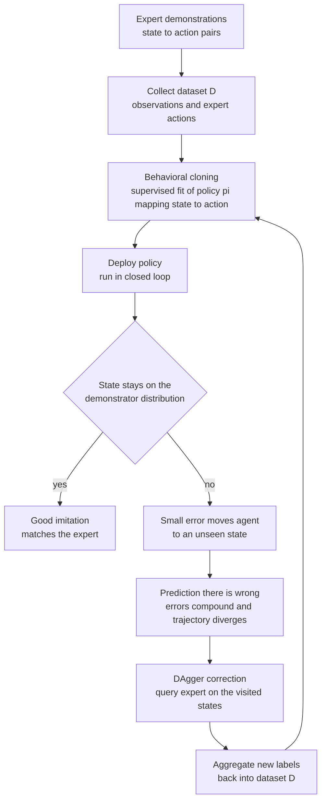

# 🤖 Imitation Learning and Learning from Demonstration

> [!abstract] TL;DR
> Imitation learning teaches a robot a task from **expert demonstrations** instead of the slow, dangerous trial-and-error of reinforcement learning. The simplest form, **behavioral cloning**, is just supervised learning of a state→action mapping from demo data — but it hides a fatal trap: the instant the policy drifts to a state the demonstrator never visited, its predictions are wrong, the error grows, and the trajectory **diverges** (covariate shift / compounding error). The fixes are **DAgger** (re-query the expert on the states the learner actually visits) and **inverse reinforcement learning** (infer the *reward* the expert optimizes and re-plan from it), each trading simplicity for robustness.

---

## Intuition

**Analogy:** The fastest way to teach someone to make an omelet is *not* to hand them a reward function that scores a thousand attempts on doneness and let them fail their way to competence. It is to make one omelet in front of them, once, and let them copy you. Show, don't score.

Imitation learning gives robots exactly that shortcut. Rather than exploring an environment blindly for a reward signal — burning motors, dropping parts, and risking crashes along the way — a human simply demonstrates the task, and the robot learns to mimic the mapping from *what it sees* to *what to do*. But copying has a hidden trap that reward-driven learning does not: the moment the learner drifts even slightly to a situation the demonstrator was never in — the pan tilted a way you never showed, the whisk held at an angle you never used — it has **no idea what to do**, because it only ever saw the expert's tidy, on-course states. One small mistake nudges it off-course, the off-course state produces a worse guess, and the errors snowball. The whole subject is really about closing that gap.

---

## How It Works

### Core Mechanics

1. **Collect demonstrations.** An expert (a human, or a hand-tuned controller) performs the task, producing a dataset of state–action pairs `D = {(s_i, a_i)}`. Sources include **kinesthetic teaching** (physically guiding the robot's limbs), **teleoperation** (driving it with a joystick or a VR rig), and **video demonstrations** (watching a human and inferring the motion).
2. **Behavioral cloning (BC).** Treat the demonstrations as a labeled dataset and fit a policy `pi(s) -> a` with ordinary **supervised learning** — regression for continuous actions, classification for discrete ones. This is nothing more exotic than "predict the expert's action from the current state."
3. **Deploy in closed loop.** Run the learned policy on the robot. Here the trouble starts: unlike a static prediction task, the policy's own actions determine the *next* state, so its errors feed back into its own inputs.
4. **The compounding-error problem (covariate shift).** BC is trained on the distribution of states the *expert* visits, but at run time the robot visits the distribution of states *its own imperfect policy* produces. A tiny prediction error moves it to a slightly novel state; there the policy is even less certain and errs more; the state grows more novel still. Ross and Bagnell showed the total error grows as `O(T^2 * epsilon)` over a horizon `T` — quadratically — versus the benign `O(T * epsilon)` of a task without feedback.
5. **DAgger (Dataset Aggregation) — fix the distribution, not the model.** Roll out the current policy, record the states it *actually visits*, and ask the expert to label those states with the correct action. Aggregate these new labels into `D`, retrain, and repeat. The training distribution is dragged toward the learner's own state distribution, so the policy finally sees — and learns to recover from — its own mistakes.
6. **Inverse reinforcement learning (IRL) — learn *why*, not just *what*.** Instead of copying actions, infer the **reward function** the expert appears to be maximizing, then optimize that reward with planning or RL. Because the reward is a compact, portable explanation of intent, the resulting policy generalizes to new states far better than raw action-copying — at the cost of being **ill-posed** (many rewards explain the same behavior). **Maximum-entropy IRL** resolves the ambiguity by preferring the least-committal reward consistent with the demos; **GAIL** (Generative Adversarial Imitation Learning) skips explicit reward recovery, pitting the policy against a discriminator — an [[GAN|adversarial]] game — that tries to tell learner trajectories from expert ones.

### Flow / Architecture



---

## Key Concepts

**Secondary (build the picture):**
- **Show, don't score.** Learn from someone doing the task correctly instead of from thousands of scored attempts.
- **Copying a mapping.** The robot learns "when I see *this*, do *that*" from the human's examples.
- **The drift trap.** Copying works beautifully until the robot ends up somewhere the teacher never was — then it is lost.

**Undergraduate (the mechanics):**
- **Behavioral cloning is supervised learning.** State = input, expert action = label; fit with [[Linear_Regression|regression]] or a neural net and a standard [[Loss_Functions|loss]]. No environment interaction needed to *train*.
- **Covariate shift.** Train distribution (expert states) ≠ test distribution (learner states). This is the same distribution-mismatch that plagues any deployed supervised model, but here the model *creates* its own mismatch through closed-loop feedback.
- **DAgger's online-learning view.** By repeatedly labeling the learner's own visited states, DAgger reduces imitation to a no-regret online learning problem, converting the `O(T^2)` compounding into `O(T)`.
- **Imitation vs RL.** Imitation is sample-efficient and safe but capped by the demonstrator; RL can exceed the demonstrator but is sample-hungry and risky. They combine well: warm-start with imitation, then fine-tune with RL.

**Graduate (the deep structure):**
- **The reward is the generalizable object.** IRL rests on the premise (Ng and Russell) that the reward is a more *transferable* description of a task than a policy — a good reward keeps working when dynamics change; a cloned policy does not. IRL is fundamentally **ill-posed**: constant rewards, and infinitely many others, rationalize any behavior.
- **Maximum-entropy IRL.** Ziebart et al. cast demonstrations as samples from a distribution `p(trajectory) proportional to exp(reward)`, selecting the maximum-[entropy] reward consistent with observed feature expectations — a principled tie-breaker among the infinitely many explanatory rewards.
- **Adversarial imitation (GAIL).** Recasts imitation as distribution matching between occupancy measures, trained like a [[GAN]]: a discriminator provides the reward signal, dodging the inner RL loop of classical IRL.
- **The correspondence problem.** A human's joints, sensors, and body do not map one-to-one onto the robot's. Demonstrations must be retargeted across embodiments before actions even mean the same thing — a prerequisite that pure BC quietly assumes away.
- **Multimodal demonstrations.** When several valid actions exist for one state (go left *or* right around an obstacle), regressing to the *mean* action produces a catastrophic average (drive straight into the obstacle). Modern **diffusion policies** and **behavior transformers** model the full multimodal action *distribution* rather than a single point estimate, sidestepping mode-averaging.

---

## Python Demo

```python
# Behavioral cloning and its distribution-shift failure, on a lane-keeping-style task.
#   Task: track a sinusoidal "road". The policy observes the cross-track error e = y - ref(x)
#         and commands a lateral steering action. The error dynamics are slightly UNSTABLE
#         open-loop, so active feedback (a restoring gain) is ESSENTIAL to stay on the road.
#   (a) An EXPERT (a stabilizing controller) demonstrates -> it keeps e ~ 0, so the demos only
#       ever cover a razor-thin band of states around the road.
#   (b) Behavioral cloning fits action = w0 + w1 * e on those demos. On the road it imitates
#       perfectly -- but because the demos never showed large e, it never learns the restoring
#       gain. From a SMALL initial offset the tiny error compounds and the trajectory DIVERGES.
#   (c) DAgger: roll out the learner, query the EXPERT on the (large-e) states it drifts into,
#       aggregate, refit -> the gain is now identified and the policy RECOVERS.
# numpy + matplotlib only.
import numpy as np
import matplotlib.pyplot as plt

rng = np.random.default_rng(0)

# ---- system + task ----
dt, v = 0.1, 1.0
A, omega = 1.0, 1.0
rho  = 1.03                       # OPEN-LOOP cross-track error is (slightly) UNSTABLE
pole = 0.5                        # expert places the closed-loop error pole at 0.5 (stable)
K_expert = (pole - rho) / dt      # expert control law: a = K_expert * e

def ref(x):
    return A * np.sin(omega * x)

def expert_action(e):             # the "human" demonstrator: a stabilizing cross-track controller
    return K_expert * e

def step(x, e, a):                # forward motion + cross-track error dynamics
    return x + v * dt, rho * e + dt * a

def rollout(policy, x0, e0, T, noise=0.0):
    xs, es, acts = [x0], [e0], []
    x, e = x0, e0
    for _ in range(T):
        a = policy(e) + noise * rng.standard_normal()
        acts.append(a)
        x, e = step(x, e, a)
        xs.append(x); es.append(e)
    return np.array(xs), np.array(es), np.array(acts)

T = 140

# ---------- (a) collect EXPERT demonstrations: they start ON the road, so e stays ~ 0 ----------
demoE, demoA = [], []
for _ in range(6):
    x0 = rng.uniform(0, 2)
    _, es, acts = rollout(expert_action, x0, 0.0, T, noise=0.02)
    demoE.append(es[:-1]); demoA.append(acts)
demoE = np.concatenate(demoE); demoA = np.concatenate(demoA)

# ---------- fit BEHAVIORAL CLONING: ridge regression  a_hat = w0 + w1 * e ----------
def fit_bc(E, Aout, lam=0.5):
    Phi = np.stack([np.ones_like(E), E], axis=1)
    return np.linalg.solve(Phi.T @ Phi + lam * np.eye(2), Phi.T @ Aout)

def make_policy(w):
    return lambda e: w[0] + w[1] * e

w_bc = fit_bc(demoE, demoA)
bc_policy = make_policy(w_bc)

# ---------- (b) roll out: ON-distribution (start on road) vs OFF-distribution (small offset) ----------
_, e_exp_on, _ = rollout(expert_action, 0.0, 0.0, T)   # expert, on the road
_, e_bc_on,  _ = rollout(bc_policy,     0.0, 0.0, T)   # BC imitates well where it was trained

e0 = 0.2                                               # a SMALL initial cross-track error
_, e_exp, _ = rollout(expert_action, 0.0, e0, T)       # expert recovers
_, e_bc,  _ = rollout(bc_policy,     0.0, e0, T)        # BC: error COMPOUNDS -> diverges

# ---------- (c) DAgger: label the learner's own visited states with the expert ----------
aggE, aggA = list(demoE), list(demoA)
w_dag = w_bc.copy()
for _ in range(4):
    _, es_vis, _ = rollout(make_policy(w_dag), 0.0, e0, T)   # states the learner drifts into
    aggE += list(es_vis[:-1])
    aggA += list(expert_action(es_vis[:-1]))                 # <-- expert relabels them
    w_dag = fit_bc(np.array(aggE), np.array(aggA))
_, e_dag, _ = rollout(make_policy(w_dag), 0.0, e0, T)

# ---------- plot ----------
xs = np.arange(T + 1) * v * dt
road = ref(xs)

fig, ax = plt.subplots(1, 2, figsize=(14, 5))

ax[0].plot(xs, road,          'k--',           lw=2,   label='reference road  ref(x)')
ax[0].plot(xs, road + e_exp,  color='tab:green', lw=2,  label='expert (recovers)')
ax[0].plot(xs, road + e_bc,   color='tab:red',   lw=2,  label='behavioral cloning (DIVERGES)')
ax[0].plot(xs, road + e_dag,  color='tab:blue',  lw=2,  label='DAgger (recovers)')
ax[0].plot(xs, road + e_bc_on, color='tab:orange', lw=1.5, ls=':', label='BC from on-road start (imitates)')
ax[0].scatter([0], [road[0] + e0], color='k', zorder=5)
ax[0].set_title('Small initial offset -> BC drifts off the demo distribution')
ax[0].set_xlabel('along-track position x'); ax[0].set_ylabel('lateral position y')
ax[0].set_ylim(-5, 5); ax[0].legend(fontsize=8); ax[0].grid(alpha=0.3)

ax[1].semilogy(xs, np.abs(e_exp) + 1e-6, color='tab:green', lw=2, label='expert')
ax[1].semilogy(xs, np.abs(e_bc)  + 1e-6, color='tab:red',   lw=2, label='behavioral cloning')
ax[1].semilogy(xs, np.abs(e_dag) + 1e-6, color='tab:blue',  lw=2, label='DAgger')
ax[1].set_title('Cross-track error |e| vs time (log scale) -> compounding vs bounded')
ax[1].set_xlabel('step'); ax[1].set_ylabel('|error|')
ax[1].legend(); ax[1].grid(alpha=0.3, which='both')

plt.tight_layout(); plt.show()

# ---------- report ----------
print(f"learned BC gain w1 = {w_bc[1]:+.3f}   (true expert gain = {K_expert:+.3f})")
print(f"DAgger      gain w1 = {w_dag[1]:+.3f}")
print(f"final |error|:  expert={abs(e_exp[-1]):.3f}   BC={abs(e_bc[-1]):.2e}   DAgger={abs(e_dag[-1]):.3f}")
```

**What you see.** From the on-road start the cloned policy (orange dotted) rides the reference perfectly — it *imitates well on the training distribution*. But nudged by a tiny offset of `0.2`, behavioral cloning (red) peels off and its cross-track error grows geometrically, because the demos never exercised large errors so the fit never recovered the restoring gain (`w1` comes out near `0` instead of `-5.3`). The expert (green) shrugs the offset off, and DAgger (blue) — having been shown the very states the learner drifts into and told what the expert would do there — re-identifies the gain and pulls back onto the road. The log-scale panel makes the mechanism unmistakable: BC is a straight rising line (exponential compounding), while expert and DAgger decay to zero.

---

## Real-World Applications

> **Example — ALVINN, the original self-driving net (Pomerleau, 1988).** A 3-layer network learned to steer a van by cloning a human driver: camera image in, steering angle out. It worked on roads similar to its training footage but was brittle exactly where behavioral cloning predicts — off-distribution road types — and Pomerleau had to synthesize *shifted* views to teach recovery, an early hand-built cousin of DAgger's covariate-shift fix.

> **Example — robot manipulation from teleoperation (diffusion policies).** Modern manipulation stacks collect hundreds of human teleoperation demos on a robot arm, then train a **diffusion policy** to imitate them. Diffusion is chosen precisely because grasping is *multimodal* — there are many valid ways to pick an object — and a plain regressor would average them into a failing motion. This connects to the sibling notes *Robotic_Manipulation_and_Grasping* and *Human_Robot_Interaction_and_Safety*.

> **Example — autonomous-driving planners and inverse RL.** Companies infer human drivers' implicit **reward** (comfort, safety margins, progress) via maximum-entropy IRL, then plan trajectories that optimize it — more transferable across intersections than cloning any single driver's steering trace.

> **Example — warm-starting reinforcement learning.** In locomotion and dexterous hands, teams seed an RL agent with an imitation-pretrained policy to escape the crippling early-exploration phase, then fine-tune with reward. This bridges directly to the sibling *Reinforcement_Learning_for_Control* and to *Sim_to_Real_Transfer_and_Domain_Randomization*, where the imitation-then-RL policy is hardened against the reality gap.

---

## Common Pitfalls

- **Compounding errors / covariate shift.** The signature failure, shown in the demo: BC is trained on the expert's state distribution but runs on its own, so small errors snowball quadratically in the horizon. *Fix:* DAgger, injected recovery data, noise-augmented demonstrations (DART), or add feedback so the policy sees off-nominal states during training.
- **A clone is never better than its demonstrations.** BC's ceiling is the expert. Suboptimal, inconsistent, or fatigued human demos are copied faithfully, warts and all. If you need *superhuman* behavior, you need reward-driven [[Reinforcement_Learning|RL]] or IRL-then-optimize, not imitation alone.
- **Ambiguous / multimodal demonstrations.** When several actions are valid for one state, regressing to the mean yields an action that satisfies no mode (averaging "go left" and "go right" into "crash straight ahead"). *Fix:* model the action *distribution* — mixtures, diffusion policies, behavior transformers — not a single point.
- **The correspondence problem.** Human and robot bodies differ in joints, dynamics, and sensing; a demonstrated motion may be physically impossible or meaningless on the robot without retargeting. Video-based demos make this worse, since even the action must be inferred.
- **Reward inference is ill-posed.** IRL admits infinitely many rewards (including trivial constant ones) consistent with any demonstration set. Without a principled tie-breaker — maximum entropy, margin maximization, adversarial matching — the recovered reward is arbitrary and generalizes poorly.
- **Distribution coverage, not model capacity, is usually the bottleneck.** Teams reach for a bigger network when the real problem is that the demos simply never covered the failure states. More of the *right* data (DAgger, on-policy corrections) beats more parameters.

---

## Related Concepts

- [[Reinforcement_Learning]] — the trial-and-error alternative imitation short-circuits; the two are routinely combined (imitate to warm-start, then RL to surpass the demonstrator).
- [[Linear_Regression]] — behavioral cloning in its purest form is supervised regression of expert action on state, exactly the fit used in the demo.
- [[Bias_Variance_Tradeoff]] — covariate shift is a distribution-mismatch failure; on-distribution the clone has low error, off-distribution its variance explodes.
- [[GAN]] — GAIL casts imitation as an adversarial game, using a discriminator (generator-vs-critic) instead of an explicitly recovered reward.
- [[Markov_Chains]] — the closed-loop robot is a Markov decision process; imitation and IRL both reason over state-transition distributions and occupancy measures.
- [[Gradient_Descent]] — the optimizer that fits the cloned policy and, in max-entropy IRL / GAIL, drives the reward or discriminator updates.
- [[Loss_Functions]] — the supervised objective (squared error for continuous actions, cross-entropy for discrete) that behavioral cloning minimizes.
- [[Regression_and_Correlation]] — the statistical backbone of fitting a continuous action to observed states from demonstrations.

Within this vault, imitation learning sits beside the other learning-and-autonomy siblings: *Reinforcement_Learning_for_Control* (the reward-driven counterpart it warm-starts), *Sim_to_Real_Transfer_and_Domain_Randomization* (which hardens an imitated policy against the reality gap), *Robotic_Manipulation_and_Grasping* (the flagship application of demonstration learning), and *Human_Robot_Interaction_and_Safety* (where the demonstrator *is* the human in the loop).

---

## Review Questions

**Secondary:** Using the omelet analogy, explain why "show me once" can teach a task faster than "score my thousand attempts" — and describe the one situation where the person who only watched still gets stuck.

**Undergraduate:** Behavioral cloning is "just supervised learning," yet a model with near-zero training error can still fail catastrophically when deployed. Explain covariate shift and why the closed-loop feedback of a robot turns a small per-step error into a quadratically growing one. How does DAgger change the training distribution to fix it?

**Graduate:** Contrast behavioral cloning, DAgger, and inverse reinforcement learning on (1) what object they learn, (2) whether they need to query the expert or the environment at training time, and (3) how well they generalize to unseen states. Then explain why IRL is *ill-posed* and how maximum-entropy IRL and GAIL each resolve the ambiguity.

---

## Sources

- [Ross, Gordon and Bagnell, "A Reduction of Imitation Learning and Structured Prediction to No-Regret Online Learning" (AISTATS 2011) — DAgger](https://arxiv.org/abs/1011.0686)
- [Argall, Chernova, Veloso and Browning, "A Survey of Robot Learning from Demonstration" (Robotics and Autonomous Systems, 2009)](https://www.sciencedirect.com/science/article/abs/pii/S0921889008001772)
- [Ng and Russell, "Algorithms for Inverse Reinforcement Learning" (ICML 2000)](https://ai.stanford.edu/~ang/papers/icml00-irl.pdf)
- [Pomerleau, "ALVINN: An Autonomous Land Vehicle in a Neural Network" (NeurIPS 1988)](https://proceedings.neurips.cc/paper/1988/hash/812b4ba287f5ee0bc9d43bbf5bbe87fb-Abstract.html)
- [Ho and Ermon, "Generative Adversarial Imitation Learning" (NeurIPS 2016) — GAIL](https://arxiv.org/abs/1606.03476)

---

#robotics #imitation-learning #learning-from-demonstration #behavioral-cloning #inverse-rl
