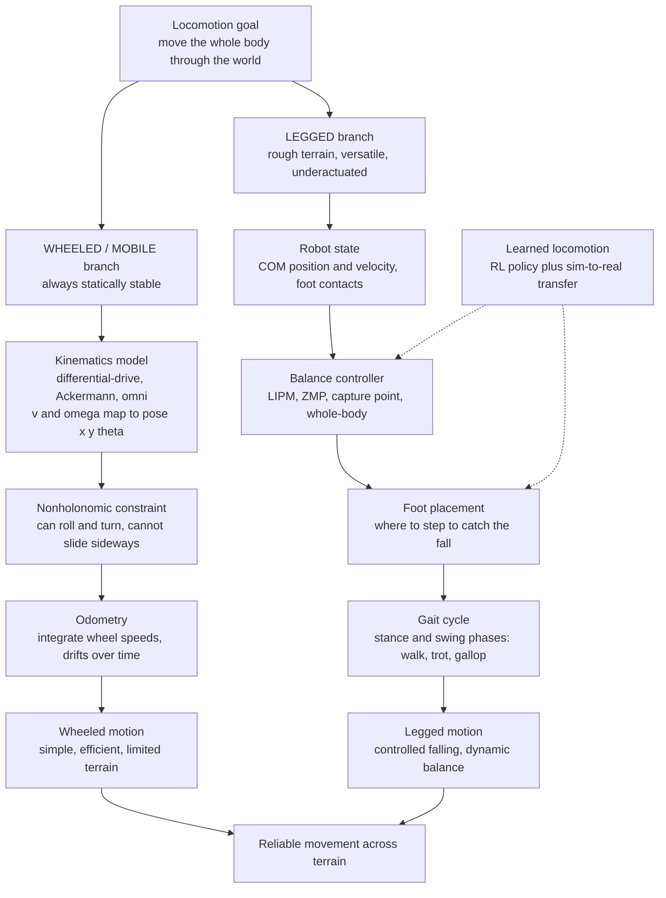

# 🦿 Legged and Mobile Robot Locomotion

> [!abstract] TL;DR
> **Locomotion** is how a robot *moves its whole body through the world* — the layer beneath navigation and planning, where physics is unforgiving. **Wheeled/mobile robots** (differential-drive, Ackermann-steer, omnidirectional) are the easy case: a wheel is always statically stable, so the whole problem collapses to **kinematics** — mapping forward speed $v$ and turn rate $\omega$ to a pose $(x,y,\theta)$ — under a **nonholonomic** constraint that they cannot slide sideways. **Legged robots** (bipeds, quadrupeds, hexapods) buy access to rough, human-built, unstructured terrain, but at a brutal price: a walking machine is **underactuated** and perpetually **falling**, so it must *actively balance*. The governing insight is that a walker is an **inverted pendulum**: the body topples over its stance foot, and staying upright means constantly choosing **where to put the next foot** so the toppling never runs away. The classical toolkit — the **Linear Inverted Pendulum Model (LIPM)**, the **Zero-Moment Point (ZMP)**, the **capture point**, whole-body control, and bio-inspired **central pattern generators** — makes "controlled falling" reliable, while the modern shift to **learned locomotion** (deep reinforcement learning trained in simulation and transferred to hardware) has produced the robust, agile walking seen in Boston Dynamics, ANYmal, and Cassie.

---

## Intuition

**Analogy — walking is a miracle of controlled falling.** Watch yourself take a step. You lean forward, and for a fraction of a second you are genuinely *tipping over* — your center of mass sails out past your planted foot and gravity yanks you toward the ground. Then your swing leg shoots out and catches you just in time, and the whole toppling-and-catching repeats. That is walking: not a stable posture held in place, but a **fall interrupted twice per stride**. A wheel, by contrast, is *lazy* — it is always sitting flat on the ground, never in danger of tipping, which is exactly why wheeled robots are simple and legged robots are hard.

Now push the analogy into the machine. A **wheeled robot** never has to think about balance; its only question is geometric — "given how fast each wheel is spinning, where do I end up?" A **legged robot** lives on a knife's edge: its weight is a pendulum balanced on a point, and every millisecond it must ask "is my body toppling, and where must I plant my foot to catch the fall without stopping?" **Locomotion** is the science of turning that precarious pendulum dance — or the placid roll of a wheel — into reliable, efficient movement across the messy, uneven, real world.

---

## How It Works

### Core Mechanics

1. **Two families, one goal.** Locomotion answers "how does the body physically translate through space?" Everything above it (path planning, SLAM, navigation) hands down a desired velocity or trajectory; locomotion must *realize* it against gravity, contact, and friction. The two dominant families make opposite bargains: **wheels trade terrain for simplicity**, **legs trade simplicity for terrain**.

2. **Wheeled / mobile kinematics.** A wheel rolls without ever tipping, so the whole problem is **kinematic** — no balance needed. The three canonical models:
   - **Differential drive** — two independently driven wheels. Body forward speed $v = \tfrac{r}{2}(\dot\phi_R + \dot\phi_L)$ and turn rate $\omega = \tfrac{r}{L}(\dot\phi_R - \dot\phi_L)$, integrated as $\dot x = v\cos\theta,\ \dot y = v\sin\theta,\ \dot\theta = \omega$. Simple, cheap, can spin in place.
   - **Ackermann steering** — the car geometry: front wheels steer, a minimum turn radius exists, no spinning in place.
   - **Omnidirectional** — mecanum or omni wheels that *can* translate in any direction, dropping the sideways-motion restriction at the cost of efficiency and payload.
3. **The nonholonomic constraint.** A standard wheel cannot slip sideways: $\dot x \sin\theta - \dot y \cos\theta = 0$. This is a constraint on *velocities*, not positions — the robot can still reach any pose, but not by moving directly toward it (hence parallel parking). This shapes every wheeled motion planner.
4. **Odometry.** Integrating measured wheel speeds forward gives a **dead-reckoning** estimate of pose. It is cheap and smooth but drifts without bound because wheel slip and calibration error accumulate — which is why odometry is *fused* with exteroceptive sensing (see estimation below).
5. **Why legs at all.** Wheels need a graded, connected surface. Legs make **discrete, isolated contacts**, so they can cross rubble, climb stairs, step over gaps, and reuse infrastructure built for human legs. The cost is that a legged robot is a tall mass on point contacts — inherently **unstable and underactuated**.
6. **Static vs dynamic stability — the central dichotomy.**
   - **Static stability:** the ground projection of the **center of mass (COM)** stays inside the **support polygon** (the convex hull of the ground-contact points) at all times. The robot could freeze at any instant and not fall. This is the safe, slow regime — a hexapod crawl, a quasi-static humanoid shuffle.
   - **Dynamic stability:** the COM projection is *allowed to leave* the support polygon; the robot is momentarily falling and relies on **momentum and future footholds** to stay up. Freeze it mid-stride and it topples. This is "controlled falling" — and it is how running, trotting, and natural human walking work. Faster, more efficient, far harder to control.
7. **Gait — the rhythm of contact.** A **gait** is the cyclic pattern of which feet are on the ground when. Each foot alternates **stance** (loaded, pushing) and **swing** (lifted, repositioning); the **duty factor** is the fraction of the cycle spent in stance. Quadrupeds shift gait with speed exactly as animals do — **walk → trot → gallop** — trading stability for economy. A gait is naturally described by the **phase** of each limb around the cycle, which is why locomotion is a **limit-cycle** phenomenon in state space.
8. **Balance models — reducing the walker to a pendulum.**
   - **Linear Inverted Pendulum Model (LIPM):** approximate the robot as a point mass at constant height $z_c$ over a support point $p$. The COM obeys $\ddot x = \omega^2 (x - p)$ with $\omega = \sqrt{g/z_c}$. This is an *unstable* linear system — the body topples exponentially — but it is exactly solvable, so it is the workhorse for planning footsteps.
   - **Zero-Moment Point (ZMP):** the point on the ground where the net ground-reaction torque has no horizontal component. If the ZMP stays strictly *inside* the support polygon, the foot does not roll and the gait is dynamically balanced. Classical humanoid walking (Honda ASIMO, HRP series) is planned by generating COM trajectories that keep the ZMP feasible.
   - **Capture point (a.k.a. instantaneous capture point / divergent component of motion):** the spot $\xi = x + \dot x/\omega$ where, if you plant your foot, the LIPM comes to rest. It is the mathematical version of "catching a stumble" — step to the capture point and the topple freezes. Capture-point control underlies push-recovery.
   - **Whole-body control:** a QP-based controller that respects the full multi-body dynamics, contact forces, and joint/torque limits simultaneously, tracking COM, foot, and posture objectives at once.
9. **Central pattern generators (CPGs).** Biology does not solve differential equations to walk — spinal neural circuits produce **rhythmic output** that feet entrain to. Robotic CPGs mimic this with coupled nonlinear oscillators, giving smooth, self-stabilizing, easily-modulated gaits, especially popular for hexapods and swimming/snake robots.
10. **Energy efficiency and passive dynamics.** Actively fighting gravity is expensive. **Passive dynamic walkers** (McGeer) walk *down a shallow slope with no motors at all*, powered only by gravity, exploiting the leg's natural pendulum swing — proof that efficient locomotion is about *shaping natural dynamics*, not overpowering them. This idea seeds "minimally actuated" and highly efficient bipeds.
11. **The modern shift — learned locomotion.** Rather than hand-designing gaits and balance laws, train a neural **policy** with deep **reinforcement learning** in a fast physics simulator, then transfer it to hardware. Massively parallel simulation (thousands of robots at once) plus **domain randomization** over friction, mass, terrain, and latency produces controllers robust enough to blind-walk over rubble, ice, and stairs — as demonstrated on **ANYmal**, **Cassie**, and Boston Dynamics platforms. Contact and terrain uncertainty, which crippled model-based methods, become just more randomized parameters. Closing the **sim-to-real** gap is the crux.

Locomotion sits at the crossroads of several companion notes in this section: the full *Robot Dynamics and Equations of Motion* it approximates with the LIPM; the *Nonlinear Control and Lyapunov Stability* that certifies its gaits and powers push-recovery; *Reinforcement Learning for Control* and *Sim-to-Real Transfer and Domain Randomization*, which together drive modern learned walking; and *Soft Robotics and Bioinspired Design*, which rethinks the legs and feet themselves.

### Flow / Architecture



---

## Key Concepts

**Secondary (intuitive foundation)**
- **Wheels are stable, legs are not.** A wheel sits flat and never tips; a leg balances a tall body on a point, so it must actively keep from falling.
- **Support polygon and center of mass.** Draw the shape enclosing all ground contacts; keep the body's weight-line inside it and you cannot tip over — that is static balance.
- **Gait.** The repeating pattern of stepping — which feet are down and which are swinging — like the difference between a walk, a trot, and a gallop.
- **Controlled falling.** Fast walking and running are a controlled version of falling forward and catching yourself, over and over.

**Undergraduate (models and control)**
- **Differential-drive kinematics.** $\dot x = v\cos\theta,\ \dot y = v\sin\theta,\ \dot\theta = \omega$; deriving $v,\omega$ from wheel speeds; the **nonholonomic** velocity constraint.
- **Odometry and its drift.** Dead reckoning from wheel encoders; unbounded error growth; the need for sensor fusion.
- **Static vs dynamic stability** as two operating regimes, and the **duty factor** linking gait to stability.
- **Linear Inverted Pendulum Model.** $\ddot x = \omega^2(x-p)$, $\omega=\sqrt{g/z_c}$; recognizing it as an unstable linear system stabilized by choosing the support point $p$.
- **Zero-Moment Point.** The dynamic-balance criterion "ZMP inside the support polygon"; ZMP-based walking-pattern generation.

**Graduate (frontier and rigor)**
- **Capture point / divergent component of motion** for push recovery and one-step balance guarantees.
- **Whole-body control** as a hierarchical/weighted QP over full rigid-body dynamics, contact wrenches, and actuator limits.
- **Hybrid dynamics and limit cycles.** Walking as a hybrid system (continuous swing + discrete impact); **hybrid zero dynamics** and Poincaré-map stability of the periodic gait.
- **Underactuation** and the fundamental limits it imposes; **passive dynamic walking** and energy-shaping controllers.
- **Central pattern generators** as coupled-oscillator dynamical systems with entrainment.
- **Learned locomotion:** RL policy architectures, massively parallel simulation, **domain randomization**, teacher–student privileged learning, and the **sim-to-real** transfer problem.

---

## Python Demo

```python
# Balance and locomotion dynamics:
#   Part A - the Linear Inverted Pendulum Model (LIPM) of walking balance:
#            the center of mass over a stance foot is an UNSTABLE inverted
#            pendulum; a balance controller stays upright by choosing WHERE
#            to place the support point (foot placement / ZMP / capture point).
#   Part B - a differential-drive WHEELED robot: pure kinematics turning
#            speed commands (v, omega) into a path through the world.
import numpy as np
import matplotlib.pyplot as plt

# ----- Part A: LIPM balance -- falling vs stabilized ------------------------
g, z_c = 9.81, 0.9                 # gravity [m/s^2], COM height [m]
omega  = np.sqrt(g / z_c)          # inverted-pendulum rate [1/s]
dt, T  = 1e-3, 2.0
steps  = int(T / dt)
t      = np.linspace(0, T, steps)

def simulate_lipm(x0, v0, controller):
    """COM dynamics x_ddot = omega^2 (x - p); controller picks support point p."""
    x, v = x0, v0
    xs, vs, ps = np.zeros(steps), np.zeros(steps), np.zeros(steps)
    for k in range(steps):
        p = controller(x, v)           # where the balance controller plants support
        a = omega**2 * (x - p)         # inverted-pendulum COM acceleration
        xs[k], vs[k], ps[k] = x, v, p
        v += a * dt
        x += v * dt
    return xs, vs, ps

# (1) No balance control: support fixed under the start -> the robot topples.
fall_x, fall_v, fall_p = simulate_lipm(0.03, 0.0, lambda x, v: 0.0)

# (2) Capture-point control: step the support to xi = x + v/omega, the point
#     that freezes the topple -- exactly how a person catches a stumble.
stab_x, stab_v, stab_p = simulate_lipm(0.03, 0.0, lambda x, v: x + v / omega)

# ----- Part B: differential-drive wheeled robot kinematics ------------------
def simulate_diffdrive(v_cmd, w_cmd, dt=0.01, T=20.0):
    """State (x, y, theta); inputs v, omega. Nonholonomic: no sideways slip."""
    n = int(T / dt)
    x = y = th = 0.0
    xs, ys = np.zeros(n), np.zeros(n)
    for k in range(n):
        v, w = v_cmd(k * dt), w_cmd(k * dt)
        x  += v * np.cos(th) * dt
        y  += v * np.sin(th) * dt
        th += w * dt
        xs[k], ys[k] = x, y
    return xs, ys

# Constant speed, sinusoidal steering -> a smooth serpentine path.
dx, dy = simulate_diffdrive(lambda tt: 0.6, lambda tt: 0.9 * np.sin(0.6 * tt))

# ----- Plots ----------------------------------------------------------------
fig, ax = plt.subplots(1, 3, figsize=(15, 4.3))

ax[0].plot(t, fall_x, 'r-',  lw=2, label='COM: no balance (tips over)')
ax[0].plot(t, stab_x, 'g-',  lw=2, label='COM: capture-point control')
ax[0].plot(t, stab_p, 'g--', lw=1, alpha=0.7, label='support point p')
ax[0].axhline(0.0, color='k', lw=0.5)
ax[0].set_xlabel('time [s]'); ax[0].set_ylabel('COM position x [m]')
ax[0].set_title('LIPM balance: falling vs stabilized'); ax[0].legend(fontsize=8)

ax[1].plot(fall_x, fall_v, 'r-', lw=2, label='falling (diverges)')
ax[1].plot(stab_x, stab_v, 'g-', lw=2, label='stabilized (converges)')
ax[1].set_xlabel('COM position x [m]'); ax[1].set_ylabel('COM velocity [m/s]')
ax[1].set_title('LIPM phase portrait'); ax[1].legend(fontsize=8)

ax[2].plot(dx, dy, 'b-', lw=2)
ax[2].plot(dx[0],  dy[0],  'go', label='start')
ax[2].plot(dx[-1], dy[-1], 'rs', label='end')
ax[2].set_xlabel('x [m]'); ax[2].set_ylabel('y [m]')
ax[2].set_title('Differential-drive path'); ax[2].axis('equal'); ax[2].legend(fontsize=8)

plt.tight_layout(); plt.show()

# What you see:
#   Left/middle  - with a fixed foot the COM runs away exponentially (falls);
#                  placing the foot at the capture point freezes the topple and
#                  the COM converges -- balance is FOOT PLACEMENT, not brute force.
#   Right        - the wheeled robot needs no balance at all: speed commands
#                  integrate directly into a smooth path (pure kinematics).
```

The LIPM half shows the essence of legged balance: the same open-loop-unstable pendulum either diverges (a fall) or converges (a caught step) depending purely on *where the support is placed*. The differential-drive half shows the opposite world — no balance to worry about, just kinematic integration of velocity commands into a pose trajectory.

---

## Real-World Applications

- **Boston Dynamics Atlas / Spot.** Atlas performs dynamic humanoid parkour and Spot a robust quadruped trot over industrial terrain; both blend model-based whole-body control with, increasingly, learned components — the practical face of "controlled falling."
- **ANYmal (ETH Zürich / ANYbotics).** The reference platform for **learned locomotion**: RL policies trained in massively parallel simulation with domain randomization walk blind over rubble, snow, and stairs, then run unchanged on hardware — deployed for autonomous industrial inspection.
- **Agility Robotics Cassie / Digit.** Bipeds designed around passive-dynamics-inspired springy legs; Cassie learned to run a 5K and traverse stairs via RL, and Digit is piloted for warehouse logistics.
- **Honda ASIMO / HRP humanoids.** The classical **ZMP** lineage — walking-pattern generators that keep the Zero-Moment Point inside the foot polygon — the foundation decades of humanoid balance were built on.
- **Warehouse and Mars mobile robots.** Amazon/Kiva differential-drive floor robots and NASA's Ackermann-style rovers (Curiosity, Perseverance) show the wheeled trade-off: dead-simple, efficient, reliable — as long as the terrain cooperates.
- **RHex and hexapod field robots.** Six-legged designs using CPG-style rhythmic control cross terrain far too broken for wheels, prized for their fault tolerance.

---

## Common Pitfalls

- **Confusing static and dynamic stability.** Assuming the COM must always sit inside the support polygon rules out running, trotting, and natural walking — all of which *deliberately* leave it. Conversely, applying dynamic assumptions to a slow crawler over-complicates a problem that quasi-static balance solves. Know which regime you are in.
- **Naive terrain and contact modeling.** Treating the ground as a rigid, infinitely-high-friction plane makes controllers that shatter on real rubble, compliant soil, or ice. Contact is intermittent, uncertain, and force-limited; unmodeled contact is the number-one cause of falls.
- **Ignoring underactuation.** A biped has more degrees of freedom than actuators once a foot is off the ground — you *cannot* command arbitrary body accelerations. Designing as if the robot were fully actuated yields controllers that demand impossible torques and violate contact limits.
- **Foot slip.** Balance laws (ZMP, capture point) silently assume the stance foot does not slide. When friction is overestimated, the foot slips, the pendulum model's support point moves unexpectedly, and recovery fails. Always plan within a friction cone.
- **Neglecting energy efficiency.** Fighting gravity with high-gain position control is enormously power-hungry and gives stiff, unnatural motion. Efficient walkers *exploit* passive pendulum dynamics and compliance rather than overriding them.
- **The sim-to-real gap for learned gaits.** A policy that looks flawless in simulation can fail instantly on hardware because of unmodeled actuator dynamics, latency, sensor noise, and contact mismatch. Without **domain randomization** and careful system identification, RL locomotion overfits the simulator.
- **Odometry drift treated as ground truth.** Wheel odometry accumulates unbounded error from slip and calibration; using it as an absolute pose without exteroceptive correction guarantees the robot slowly gets lost.

---

## Related Concepts

- [[Model_Predictive_Control]] — the workhorse for generating dynamically-feasible footstep and COM plans over a receding horizon.
- [[LQR_Optimal_Control]] — linear-optimal stabilization of the LIPM and of balance about a nominal trajectory.
- [[Reinforcement_Learning]] — the framework behind modern learned quadruped and humanoid locomotion policies.
- [[Configuration_Space_and_Motion_Planning]] — where locomotion meets navigation: planning body paths that a wheeled or legged base can execute.
- [[Robot_Perception_and_Sensor_Fusion]] — fuses odometry with exteroception so a moving robot knows where it is despite drift.
- [[Kalman_Filtering_and_State_Estimation]] — estimates COM, base velocity, and foot contact state from noisy proprioception, closing the balance loop.
- [[Forward_Kinematics]] — maps joint angles to foot positions, the geometric backbone of foot placement.
- [[Velocity_Kinematics_and_the_Jacobian]] — relates joint rates to Cartesian foot and COM velocities used in whole-body control.
- [[Lagrangian_Mechanics]] — derives the inverted-pendulum and multi-link walker equations of motion.
- [[Rotational_Dynamics]] — angular momentum about contact points governs balance and the ZMP condition.
- [[Oscillations_and_SHM]] — the pendulum physics and natural swing frequency underlying passive dynamic walking.
- [[Dynamical_Systems_and_Attractors]] — gaits as stable **limit cycles**; balance as convergence to an attractor.
- [[Chaos_Theory_and_Sensitive_Dependence]] — why unstable walking and rough-terrain contact are so sensitive to initial conditions.
- [[Biomechanics_of_Movement]] — the biological locomotion and gait that legged robots reverse-engineer.
- [[Cell_Motility_and_Adhesion]] — locomotion at the microscale, a striking contrast to inverted-pendulum walking.
- [[Systems_of_ODEs]] — the mathematical form of every locomotion model simulated here.

---

## Review Questions

1. **(Secondary)** Why is a wheeled robot "always stable" while a walking robot is described as constantly falling? Use the ideas of support polygon and center of mass in your answer.
2. **(Undergraduate)** Starting from the differential-drive kinematics $\dot x = v\cos\theta,\ \dot y = v\sin\theta,\ \dot\theta = \omega$, explain what the **nonholonomic constraint** $\dot x\sin\theta - \dot y\cos\theta = 0$ physically forbids, and why odometry built on these equations drifts over time.
3. **(Undergraduate)** In the LIPM $\ddot x = \omega^2(x-p)$, show why a *fixed* support point $p$ gives an unstable system, and explain how moving $p$ to the **capture point** $\xi = x + \dot x/\omega$ brings the center of mass to rest.
4. **(Graduate / scenario)** You must deploy a quadruped for autonomous inspection of a construction site with loose gravel, puddles, and stairs. Would you build a classical **ZMP + whole-body-control** stack or a **learned RL policy with domain randomization**? Justify your choice in terms of terrain uncertainty, contact modeling, and the sim-to-real gap.
5. **(Graduate / trade-off)** Contrast **static walking**, **ZMP-based dynamic walking**, and **passive dynamic walking** along three axes: energy efficiency, terrain robustness, and control complexity. When does each win?

---

## Sources

- Raibert, M. — *Legged Robots That Balance* (MIT Press). The founding text on dynamic balance and hopping.
- Kajita, S. et al. — *Introduction to Humanoid Robotics* (Springer). LIPM, ZMP, and walking-pattern generation.
- Siegwart, R., Nourbakhsh, I., Scaramuzza, D. — *Introduction to Autonomous Mobile Robots* (MIT Press). Wheeled kinematics, nonholonomic constraints, odometry.
- Hutter, M. et al. — *ANYmal: A Highly Mobile and Dynamic Quadrupedal Robot* (IROS 2016), and Lee/Hwangbo/Hutter et al. — *Learning quadrupedal locomotion over challenging terrain* (Science Robotics 2020).
- McGeer, T. — *Passive Dynamic Walking* (Int. J. Robotics Research, 1990). Gravity-powered walking and energy efficiency.

---

#robotics #locomotion #legged-robots #mobile-robots #balance
