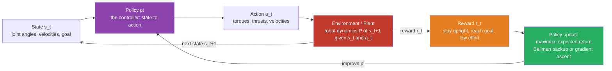

# 🦾 Reinforcement Learning for Control

> [!abstract] TL;DR
> **Reinforcement learning (RL) for control** replaces *deriving* a controller from equations with *discovering* one by **trial and error**. You specify a **reward** — stay upright, reach the goal, don't crash, use little energy — and the robot learns a **control policy** $\pi(a\mid s)$ that maximizes the expected long-run reward, by acting, observing the outcome, and reinforcing what worked. Formally the robot solves a **Markov Decision Process** (states, actions, transitions, reward, discount), and RL is exactly **approximate dynamic programming — solving the Bellman / Hamilton-Jacobi-Bellman optimality equation *without a hand-written model***. [[LQR_Optimal_Control|LQR]] is the special case where the dynamics are linear and the cost is quadratic; RL generalizes that machinery to the messy, high-dimensional, hard-to-model systems — legged robots, dexterous hands, aerobatic drones — where writing the physics down is hopeless. This note opens the **Learning & Autonomy** section: it frames RL as control, then imitation learning, adaptive/robust control, sim-to-real, locomotion, and manipulation follow.

---

## Intuition

**Analogy — teaching a dog a trick.** When you teach a dog to roll over, you do not open its skull and script the firing sequence of every muscle. You *cannot* — the mapping from "roll over" to a coordinated wave of muscle contractions is far too complex to write down. So you do something else entirely: you let the dog *try things*, and you **reward** what moves in the right direction — a treat when it flops onto its side, a bigger treat when it completes the roll. Over many repetitions the dog's nervous system quietly reorganizes itself until the behavior that earns treats becomes automatic. You never specified *how*; you only specified *what you wanted*, and let trial and error fill in the how.

Reinforcement learning trains robots the same way. Instead of hand-deriving a controller from the equations of motion — the classical path through [[PID_Control|PID]], [[Pole_Placement_and_Full_State_Feedback|pole placement]], and [[LQR_Optimal_Control|LQR]] — you define a **reward function** (stay balanced, reach the target, minimize energy, avoid falling) and let the robot discover, through repeated interaction with the world (or a simulator), a **policy** that maximizes it. The result is a controller that *writes itself*: a walking gait, a flight maneuver, an in-hand manipulation skill for objects and contacts too complex to model by hand. RL is control theory that authors its own controller — trading the guarantees of a hand-derived design for the ability to handle systems no equation can capture cleanly.

The catch, and the reason this is a whole research field rather than a one-liner, is that "let it try" is expensive and dangerous for a real robot: a physical machine cannot fall over a million times, exploration can break hardware, and the reward you write down is rarely the reward you meant. Most of the craft of robot RL is about taming those problems.

---

## How It Works

### Core Mechanics

RL formalizes "act, observe, reward, improve" as a **Markov Decision Process (MDP)** — the same $(\mathcal{S}, \mathcal{A}, P, R, \gamma)$ object that underlies all of [[RL_Fundamentals|reinforcement learning]]:

1. **State $s_t$** — everything the controller needs to decide: joint angles and velocities, base orientation, contact flags, the goal. The **Markov property** ([[Markov_Chains]]) says the future depends on the world only through the *current* state, not the full history.
2. **Action $a_t$** — the control command: motor torques, thrusts, wheel velocities. Applied by the **policy** $\pi(a\mid s)$, which *is* the controller RL is trying to learn.
3. **Transition $P(s_{t+1}\mid s_t,a_t)$** — the robot's dynamics ([[Robot_Dynamics_and_Equations_of_Motion|equations of motion]]) plus noise. In **model-free** RL this is unknown and only *sampled* by acting; in **model-based** RL it is learned and used to plan.
4. **Reward $r_t = R(s_t,a_t)$** — the scalar score the designer writes: $+$ for upright/at-goal, $-$ for effort/falling. This is the *only* channel through which you communicate intent.
5. **Discount $\gamma \in [0,1)$** — how much future reward is worth now; it makes the infinite-horizon **return** $G_t=\sum_{k\ge 0}\gamma^k r_{t+k}$ finite and well-posed.

The **value function** $V^\pi(s)=\mathbb{E}[G_t\mid s]$ and **action-value** $Q^\pi(s,a)$ measure "how good" a state or state-action pair is under policy $\pi$. The optimum obeys the **Bellman optimality equation** — the recursive fixed point $Q^\star(s,a)=\mathbb{E}[\,r + \gamma\max_{a'}Q^\star(s',a')\,]$ — and RL is, at bottom, machinery for solving that equation from experience. This is precisely **approximate dynamic programming**: the continuous-cost version of Bellman's equation is the **Hamilton-Jacobi-Bellman (HJB)** PDE of optimal control, and [[LQR_Optimal_Control|LQR]] is the closed-form linear-quadratic solution. RL is what you reach for when the system is too nonlinear, high-dimensional, or unknown to solve HJB analytically.

Two axes organize the algorithm zoo:

- **Value-based vs policy-based.** Value-based methods ([[Q_Learning_and_SARSA|Q-learning, SARSA]], [[Deep_Q_Networks|DQN]]) learn $Q$ and act greedily; they shine for discrete actions. Policy-based methods ([[Policy_Gradient_Methods|REINFORCE, PPO]]) parameterize $\pi_\theta$ and ascend the return by gradient ([[Gradient_Descent|gradient ascent]]); they handle **continuous** torque commands natively. **Actor-critic** (A2C, **SAC**, **DDPG/TD3**, **PPO**) fuses both — an actor proposes actions, a critic evaluates them — and dominates modern robot RL.
- **Model-free vs model-based.** Model-free RL learns the policy directly from reward samples (simple, general, sample-*hungry*). Model-based RL first learns the dynamics $\hat P$, then *plans* through it — the same idea as **Model Predictive Control**, which re-optimizes a trajectory every step against a model. Model-based RL is far more sample-efficient but inherits model bias.

### Flow / Architecture



---

## Key Concepts

### 🟢 Secondary — the plain-language picture

- **Reward, not recipe.** You tell the robot *what* you want (a number that is high for good outcomes), not *how* to achieve it. The robot invents the "how."
- **Trial and error with memory.** It tries an action, sees the result, and nudges its behavior toward whatever earned more reward — millions of times.
- **Policy = the controller.** The learned **policy** is the finished product: a rule that reads the robot's state and outputs the command. RL is a *way of producing a controller*, not a controller itself.
- **Why bother, when we have PID and LQR?** Because some systems — a running quadruped on gravel, a hand rotating a Rubik's cube — are too complex and contact-rich to model well enough for classical design. RL learns them from experience instead.
- **The price:** it needs enormous amounts of practice, so we usually let it practice in *simulation*, then transfer the skill to the real robot.

### 🟡 Undergraduate — the working machinery

- **The MDP tuple $(\mathcal S,\mathcal A,P,R,\gamma)$.** State, action, transition probability, reward, discount. Control problems become MDPs by discretizing (or parameterizing) the state and action spaces and choosing a reward that encodes the task.
- **Return, value, and $Q$.** The **return** $G_t=\sum_k\gamma^k r_{t+k}$ is what we maximize. $V^\pi(s)$ and $Q^\pi(s,a)$ are its expectation under a policy; the **optimal** $Q^\star$ tells you the best action in every state: $\pi^\star(s)=\arg\max_a Q^\star(s,a)$.
- **Bellman equations.** Value functions satisfy a recursive consistency: a state's value equals immediate reward plus discounted value of where you land. **Temporal-difference (TD)** learning turns this into an online update — the heart of [[Q_Learning_and_SARSA|Q-learning]] (see the demo).
- **Exploration vs exploitation.** To find good actions you must try unknown ones (explore), but to earn reward you must use what you know (exploit). **$\epsilon$-greedy**, Boltzmann/softmax, and entropy bonuses (as in SAC) manage this tradeoff.
- **On-policy vs off-policy.** **SARSA** and **PPO** learn about the policy they follow (on-policy, stable but sample-hungry); **Q-learning**, **DQN**, **DDPG/SAC** learn the optimal policy while following an exploratory one (off-policy, can reuse a **replay buffer**, more sample-efficient).
- **Policy gradients.** When actions are continuous torques, you cannot $\arg\max$ over a table — so you parameterize $\pi_\theta$ (often a neural net) and push $\theta$ up the return gradient $\nabla_\theta \mathbb{E}[G]$ via [[Policy_Gradient_Methods|REINFORCE/actor-critic]]. This is [[Gradient_Descent|gradient ascent]] on expected reward.
- **Function approximation.** Real robot states are continuous and high-dimensional, so tables give way to **neural networks** approximating $Q$ or $\pi$ — this is **deep RL**.

### 🔴 Graduate — the theory and the robot-specific frontier

- **RL = approximate dynamic programming = HJB without a model.** The Bellman optimality operator is a **$\gamma$-contraction**, so value/policy iteration converge to $Q^\star$; RL is the *sampled, function-approximated* version of that fixed-point iteration. In continuous time and state the same optimality principle is the **Hamilton-Jacobi-Bellman PDE**, and [[LQR_Optimal_Control|LQR]] is its exact linear-quadratic solution — $P$ (the Riccati matrix) *is* the value function, and iterating the discrete Riccati recursion *is* value iteration. Every RL algorithm should reproduce LQR on a linear-quadratic problem; it is the field's sanity check.
- **Model-free deep RL for high-DOF robots.** **PPO** (robust, on-policy, the workhorse for massively parallel sim), **SAC** (off-policy, maximum-entropy, sample-efficient for real hardware), and **TD3/DDPG** (deterministic continuous control) are the standard tools for learning locomotion gaits, whole-body control, and dexterous manipulation with tens of actuated DOF.
- **Model-based RL and its planning cousins.** Learn dynamics $\hat P_\phi$ (often a probabilistic ensemble to capture uncertainty), then optimize actions through it — **PETS**, **Dreamer** (latent world models), **MBPO**, **MuZero** (planning with a learned model). This is the learning analogue of **Model Predictive Control (MPC)**: MPC re-solves a finite-horizon optimal-control problem against a *known* model each step; model-based RL *learns* that model. Sample efficiency improves by 1–2 orders of magnitude, at the cost of model bias.
- **Partial observability.** Real robots see noisy, incomplete state — the true object is a **POMDP**. Remedies: fold a state estimator ([[Kalman_Filtering_and_State_Estimation|Kalman filter]]) in front of the policy, or give the policy memory (recurrent/transformer policies over observation histories).
- **The robot-RL grand challenges.** (i) **Sample inefficiency** — millions of interactions are infeasible on hardware, so train in **simulation** with massive parallelism (Isaac Gym: thousands of robots at once, "learning to walk in minutes"). (ii) **Sim-to-real gap** — the reality gap breaks naive transfer; **domain randomization** trains across randomized physics so the real world looks like just another sample. (iii) **Safe exploration** — a real robot cannot fall a million times; constrained/safe RL, control-barrier shields, and residual RL keep exploration inside safe sets. (iv) **Reward design** — a sparse reward starves learning while a shaped reward invites **reward hacking**; inverse RL and imitation learning sidestep hand-designed rewards.
- **Where this section goes next.** RL is one branch of *Learning & Autonomy*. Its close relatives, to follow in this section: *Imitation_Learning_and_Learning_from_Demonstration* (learn from expert data instead of reward), *Adaptive_and_Robust_Control* (model-based cousins that adapt online or guarantee worst-case stability), *Sim_to_Real_Transfer_and_Domain_Randomization* (crossing the reality gap), *Legged_and_Mobile_Robot_Locomotion*, and *Robotic_Manipulation_and_Grasping* (the flagship application domains). On the model-based side, *Model_Predictive_Control* is the planning counterpart to model-based RL.

---

## Python Demo

We solve a genuine **underactuated control problem** with pure NumPy tabular RL: **pendulum swing-up**. The torque limit is deliberately too small to hoist the pendulum straight up ($|u|_{\max}=2 \ll mgl \approx 9.8$), so the agent must *discover*, from reward alone, the classic **energy-pumping** strategy — rock back and forth to build momentum, then catch and balance at the top. This is a task a hand-tuned [[PID_Control|PID]] loop cannot solve without extra logic, and it is exactly the kind of nonlinear control that motivates RL.

The reward is the standard quadratic cost $r=-(\theta^2 + 0.1\,\dot\theta^2 + 0.001\,u^2)$ with $\theta$ measured *from upright* ($0$ = balanced). We run **tabular Q-learning** ($\epsilon$-greedy, off-policy TD) on a discretized $(\theta,\dot\theta)$ grid and plot: (1) the **learning curve** — return climbing over episodes; (2) the learned **value function** with the swing-up trajectory overlaid; (3) the learned **policy** over state space; (4) the successful **rollout** driving the angle to zero.

```python
# Tabular Q-learning solving pendulum SWING-UP -- a classic underactuated
# CONTROL task -- in pure numpy. The torque limit is too small to lift the
# pendulum directly, so the agent must DISCOVER energy-pumping (swing back and
# forth) from the reward alone. No gym, no neural nets -- just a Q-table.
import numpy as np
import matplotlib.pyplot as plt

rng = np.random.default_rng(0)

# ---- Pendulum physics (theta = angle from UPRIGHT; 0 = up, +-pi = hanging) --
g, m, l = 9.81, 1.0, 1.0
dt, max_speed = 0.05, 8.0
TORQUES = np.array([-2.0, 0.0, 2.0])          # underactuated: |u|max = 2 << m g l

def wrap(th):                                  # wrap angle into [-pi, pi]
    return (th + np.pi) % (2 * np.pi) - np.pi

def step(th, thd, u):
    thddot = (g / l) * np.sin(th) + u / (m * l * l)   # gravity destabilizes the top
    thd = np.clip(thd + thddot * dt, -max_speed, max_speed)
    th = wrap(th + thd * dt)
    reward = -(th**2 + 0.1 * thd**2 + 0.001 * u**2)   # 0 = perfectly upright, still
    return th, thd, reward

# ---- Discretize the continuous state for the tabular Q-table ---------------
N_TH, N_THD = 31, 31
def to_idx(th, thd):
    i = int(np.clip(round((th + np.pi) / (2 * np.pi) * (N_TH - 1)), 0, N_TH - 1))
    j = int(np.clip(round((thd + max_speed) / (2 * max_speed) * (N_THD - 1)), 0, N_THD - 1))
    return i, j

# ---- Q-learning ------------------------------------------------------------
Q = np.zeros((N_TH, N_THD, len(TORQUES)))
alpha, gamma = 0.1, 0.99
EPISODES, STEPS = 4000, 200
returns = np.zeros(EPISODES)

for ep in range(EPISODES):
    eps = max(0.05, 1.0 - ep / (0.8 * EPISODES))      # anneal exploration
    th, thd = np.pi, 0.0                               # start hanging straight down
    G = 0.0
    for _ in range(STEPS):
        i, j = to_idx(th, thd)
        a = rng.integers(len(TORQUES)) if rng.random() < eps else int(np.argmax(Q[i, j]))
        th2, thd2, r = step(th, thd, TORQUES[a])
        i2, j2 = to_idx(th2, thd2)
        # off-policy TD update toward: reward + discounted best-next value
        Q[i, j, a] += alpha * (r + gamma * np.max(Q[i2, j2]) - Q[i, j, a])
        th, thd, G = th2, thd2, G + r
    returns[ep] = G

# ---- Greedy rollout from the learned policy --------------------------------
th, thd = np.pi, 0.0
traj = [(th, thd)]
for _ in range(STEPS):
    i, j = to_idx(th, thd)
    th, thd, _ = step(th, thd, TORQUES[int(np.argmax(Q[i, j]))])
    traj.append((th, thd))
traj = np.array(traj)

# ---- Value function and greedy policy over the whole state space -----------
V = Q.max(axis=2)                       # V(s) = max_a Q(s, a)
POL = TORQUES[Q.argmax(axis=2)]         # greedy torque at each state
th_ax = np.linspace(-np.pi, np.pi, N_TH)
thd_ax = np.linspace(-max_speed, max_speed, N_THD)

# ---- Plots -----------------------------------------------------------------
fig, ax = plt.subplots(2, 2, figsize=(13, 9))

# (1) learning curve: return climbs as the control policy improves
w = 50
smooth = np.convolve(returns, np.ones(w) / w, mode='valid')
ax[0, 0].plot(returns, color='0.8', lw=0.8, label='per-episode return')
ax[0, 0].plot(np.arange(w - 1, EPISODES), smooth, color='crimson', lw=2, label=f'{w}-ep moving avg')
ax[0, 0].set_title('(1) Learning curve: return vs training episode')
ax[0, 0].set_xlabel('episode'); ax[0, 0].set_ylabel('episode return'); ax[0, 0].legend()

# (2) learned value function V(theta, theta_dot) + the swing-up trajectory
im = ax[0, 1].pcolormesh(th_ax, thd_ax, V.T, shading='auto', cmap='viridis')
ax[0, 1].plot(traj[:, 0], traj[:, 1], 'w.-', ms=3, lw=1, label='greedy rollout')
ax[0, 1].scatter([np.pi], [0], c='red', s=45, marker='o', label='start (down)')
ax[0, 1].scatter([0], [0], c='lime', s=80, marker='*', label='goal (up)')
fig.colorbar(im, ax=ax[0, 1], label='V(s) = max_a Q')
ax[0, 1].set_title('(2) Learned value function + swing-up path')
ax[0, 1].set_xlabel('theta  (0 = upright)'); ax[0, 1].set_ylabel('theta_dot'); ax[0, 1].legend(fontsize=7)

# (3) greedy policy: which torque the controller applies in each state
im2 = ax[1, 0].pcolormesh(th_ax, thd_ax, POL.T, shading='auto', cmap='coolwarm')
fig.colorbar(im2, ax=ax[1, 0], ticks=TORQUES, label='torque u')
ax[1, 0].set_title('(3) Learned policy: torque over state space')
ax[1, 0].set_xlabel('theta  (0 = upright)'); ax[1, 0].set_ylabel('theta_dot')

# (4) the rollout in time: angle-from-upright driven to ~0 (balanced)
t = np.arange(len(traj)) * dt
ax[1, 1].axhline(0, ls='--', color='k', lw=1)
ax[1, 1].plot(t, traj[:, 0], color='navy')
ax[1, 1].set_title('(4) Successful rollout: angle from upright -> 0')
ax[1, 1].set_xlabel('time [s]'); ax[1, 1].set_ylabel('theta (rad from upright)')

plt.tight_layout(); plt.show()

print(f"mean return, first 100 eps : {returns[:100].mean():8.1f}")
print(f"mean return, last  100 eps : {returns[-100:].mean():8.1f}")
print(f"final angle from upright   : {abs(traj[-1, 0]):.3f} rad")
```

**What you see.** The learning curve (1) starts deeply negative — the untrained agent flails near the bottom, paying the full $-\theta^2$ cost every step — and climbs steadily as Q-learning propagates value back from the upright region; the printed first-100 vs last-100 means make the improvement quantitative. Panel (2) shows the learned **value function**: a bright ridge of high value along the swing-up corridor, peaking at the green star (upright), with the white greedy trajectory spiraling *outward* in $(\theta,\dot\theta)$ — building speed on each swing — before catching the top. Panel (3) is the learned **controller**: a bang-bang torque pattern that pushes *with* the pendulum's motion to pump energy, then reverses near the top to brake and balance. Panel (4) shows the payoff: starting hanging straight down, the angle-from-upright is driven to near zero and held. The robot was never told *how* to swing up — only that upright is good — and it discovered energy pumping on its own. This is the whole thesis of RL for control, in 60 lines of NumPy.

---

## Real-World Applications

- **Legged locomotion (sim-to-real).** ETH Zurich's **ANYmal** learned robust quadruped walking and recovery entirely in simulation with RL, then transferred to hardware (Hwangbo et al., *Science Robotics* 2019); the "**Learning to walk in minutes**" line (Rudin et al.) trains thousands of robots in parallel on GPU (Isaac Gym) and deploys to real Unitree/ANYmal robots. RL gaits now underpin much of modern quadruped and humanoid control.
- **Dexterous manipulation.** OpenAI's **Dactyl** trained a Shadow Hand to reorient a block and solve a Rubik's cube in-hand, using PPO plus **domain randomization** to cross the sim-to-real gap — a task with contact dynamics essentially impossible to model by hand.
- **Robotic grasping at scale.** Google's **QT-Opt** learned closed-loop vision-based grasping from hundreds of thousands of real robot trials, reaching ~96% grasp success on unseen objects.
- **Aerobatic and racing flight.** **Swift** (Kaufmann et al., *Nature* 2023) used deep RL to fly a drone through a race course at champion-human level; RL also stabilizes agile quadrotor maneuvers beyond what hand-tuned controllers achieve.
- **Physical-system control beyond robots.** DeepMind used RL to control the **magnetic confinement of plasma in the TCV tokamak** (*Nature* 2022) and to optimize **data-center cooling**, and RL bipeds play robot soccer — all cases where the plant is nonlinear, high-dimensional, and hard to model, exactly RL's niche.

---

## Common Pitfalls

- **Sample inefficiency.** Model-free deep RL can need $10^6$–$10^9$ interactions — infeasible on real hardware, which cannot fall a million times. *Mitigation:* train in **simulation** with massive parallelism, or switch to **model-based RL** (learn dynamics, then plan) for 10–100× fewer samples.
- **Reward shaping and reward hacking.** A sparse reward ("+1 at the goal") gives almost no learning signal; a shaped reward invites the agent to exploit *the letter* of the reward while violating its *spirit* — a robot that vibrates to farm a "velocity" bonus without moving, or games a proxy metric. *Mitigation:* prefer potential-based shaping (which provably preserves the optimum), test rewards adversarially, or avoid hand-designed rewards via **imitation / inverse RL**.
- **The sim-to-real gap.** A policy that is optimal in simulation often fails on hardware because the simulator's friction, latency, mass, and sensor noise differ from reality. *Mitigation:* **domain randomization** (train across randomized physics so reality is just another sample), system identification, and residual/adaptation layers.
- **Unsafe exploration.** Random exploration on a physical robot can destroy hardware or endanger people. *Mitigation:* **safe/constrained RL**, control-barrier-function shields, action limits, and learning residual corrections on top of a known-safe baseline controller.
- **Instability and brittleness of deep RL.** Function approximation + bootstrapping + off-policy data is the "deadly triad" — training can diverge, and results are notoriously sensitive to seeds and hyperparameters. *Mitigation:* stabilized algorithms (**PPO**'s clipped objective, **SAC**'s entropy regularization, target networks, TD3's twin critics), and reporting across many seeds.
- **Credit assignment over long horizons.** With delayed, sparse reward the agent struggles to know *which* of hundreds of past actions caused the outcome. *Mitigation:* discounting, **eligibility traces / TD($\lambda$)**, advantage estimation (GAE), and shorter effective horizons via good reward shaping.
- **Discretization and the curse of dimensionality.** The tabular approach in the demo works for a 2-D state; a 30-DOF humanoid has an astronomically large state-action space where tables are impossible — which is *why* deep function approximation exists.

---

## Related Concepts

- [[RL_Fundamentals]] — the MDP, return, value function, and **Bellman equation** foundations this note applies to control; start here for the core theory.
- [[Reinforcement_Learning]] — the AI-ML overview of the RL algorithm landscape (Q-learning, DQN, policy gradients, actor-critic, PPO); this note is the robotics/control framing of that material.
- [[Q_Learning_and_SARSA]] — the model-free, value-based, TD-learning algorithm used in the demo; the workhorse for discrete-action control.
- [[Deep_Q_Networks]] — Q-learning with neural function approximation, for high-dimensional states where tables fail.
- [[Policy_Gradient_Methods]] — policy-based and actor-critic methods (REINFORCE, A2C, **PPO**) that handle the *continuous torque* commands real robots need.
- [[Multi_Agent_and_Inverse_RL]] — inverse RL *learns the reward* from expert demonstrations, the bridge to imitation learning and a fix for reward-design pitfalls.
- [[LQR_Optimal_Control]] — the linear-quadratic special case: RL generalizes LQR's Bellman/Riccati machinery to nonlinear, unmodeled systems (the Riccati matrix *is* the value function).
- [[Robot_Dynamics_and_Equations_of_Motion]] — the transition dynamics $P$ that model-free RL only samples and model-based RL tries to learn.
- [[PID_Control]] — the classical hand-tuned baseline; RL competes with, augments (residual RL), or replaces it on tasks too complex for PID.
- [[Pole_Placement_and_Full_State_Feedback]] — model-based state-feedback design; the classical counterpart to a learned policy.
- [[Kalman_Filtering_and_State_Estimation]] — supplies the state estimate a policy needs under partial observability (the POMDP case).
- [[Markov_Chains]] — the **Markov property** that makes an MDP's state sufficient for optimal decisions.
- [[Probability_Theory]] — stochastic transitions, rewards, and the *expected* return that RL maximizes.
- [[Gradient_Descent]] — policy-gradient RL is gradient *ascent* on expected return using exactly these methods.
- [[Robotics_and_Control_Overview]] — the field map placing RL within the Learning & Autonomy branch of the stack.

---

## Review Questions

### 🟢 Secondary
1. Using the "teaching a dog a trick" analogy, explain the difference between *specifying a reward* and *specifying a controller*. Why can RL solve tasks (like a running gait) that we cannot write down the equations for by hand?

### 🟡 Undergraduate
2. Define the five components of a Markov Decision Process and give a concrete example of each for a pendulum swing-up robot. Why does the discount factor $\gamma$ make the infinite-horizon return well-posed?
3. In the demo the torque limit is deliberately too small to lift the pendulum directly, yet the agent succeeds. Explain *why* it must learn to swing back and forth, and how a quadratic reward on $(\theta,\dot\theta,u)$ provides enough signal for Q-learning to discover that strategy.
4. Contrast **value-based** and **policy-based** RL. For a robot arm commanded by continuous joint torques, which family is the natural choice and why?

### 🔴 Graduate
5. Explain in precise terms the claim "RL is approximate dynamic programming — solving the Bellman/HJB equation without a model." How does [[LQR_Optimal_Control|LQR]] fit in as a special case, and in what sense is the Riccati matrix a value function?
6. You must train a policy for an expensive, fragile legged robot. Lay out a plan addressing the four grand challenges — sample inefficiency, the sim-to-real gap, safe exploration, and reward design — naming a concrete technique for each and the tradeoff it introduces.
7. Compare **model-free** and **model-based** RL on sample efficiency, asymptotic performance, and robustness to model error, and explain the precise relationship between model-based RL and **Model Predictive Control**.

---

## Sources

- Sutton, R. S., & Barto, A. G. — *Reinforcement Learning: An Introduction*, 2nd ed. (MIT Press, 2018) — the canonical text on MDPs, Bellman equations, TD learning, and policy gradients.
- Kober, J., Bagnell, J. A., & Peters, J. — "Reinforcement Learning in Robotics: A Survey," *International Journal of Robotics Research*, 32(11), pp. 1238–1274 (2013).
- Bertsekas, D. P. — *Reinforcement Learning and Optimal Control* (Athena Scientific, 2019) — the approximate-dynamic-programming / optimal-control view that ties RL to LQR and HJB.
- Hwangbo, J., et al. — "Learning agile and dynamic motor skills for legged robots," *Science Robotics*, 4(26) (2019) — sim-to-real deep RL on the ANYmal quadruped.
- OpenAI, et al. — "Solving Rubik's Cube with a Robot Hand" (2019) / Andrychowicz et al., "Learning Dexterous In-Hand Manipulation," *IJRR* (2020) — deep RL + domain randomization for dexterous manipulation.
- Levine, S., et al. — "End-to-End Training of Deep Visuomotor Policies," *JMLR* 17 (2016) — deep RL for real-robot manipulation.

---

#robotics #reinforcement-learning #control #policy-learning #mdp
