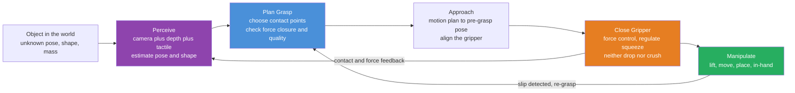

# 🤖 Robotic Manipulation and Grasping

> [!abstract] TL;DR
> **Manipulation** is the branch of robotics concerned with *physically interacting* with the world — using arms, hands, and end-effectors to grip, lift, move, and rearrange objects. Its hard core is **grasping**: choosing *where* to touch an object and *how hard* to squeeze so the grip is stable. The theory rests on **contact models** (point-with-friction, soft-finger) and **friction cones** — the geometric fact that a finger can only push, plus a bounded sideways friction force. From these you get two flavours of stability: **form closure** (the fingers *geometrically cage* the object so it cannot move even without friction) and the more common **force closure** (the contacts, using friction, can generate forces and torques — a *wrench* — that resist *any* external disturbance). An **antipodal** two-finger grip is force-closed exactly when the line joining the contacts lies inside *both* friction cones. A **grasp-quality metric** scores how far a grasp is from slipping — the radius of the largest disturbance wrench it can resist. Execution then needs **force / compliance control** (impedance, hybrid position-force, the RCC device) so the hand squeezes *enough not to drop* but *not so much as to crush*. Because contact dynamics are stiff, uncertain, and hard to simulate, modern systems increasingly *learn* grasps from data — **Dex-Net**, deep RL, and imitation — closing the gap between clean theory and the messy, contact-rich reality of touching the world.

---

## Intuition

**Analogy — a toddler at the fruit bowl.** A two-year-old can pick up a slippery grape without pulping it, pluck a floppy sock off the floor, and heave a heavy picture book onto the couch — and does all three *effortlessly*, unconsciously adjusting **where** to place the fingers, **how hard** to squeeze, and **how** to recover when the object shifts mid-lift. That fluent, adaptive, feather-light-to-firm modulation of contact is one of the **hardest** things to give a robot. A robot arm that can trace a flawless spiral through *empty air* — pure kinematics, a solved problem — becomes helpless the instant it must actually **touch** something: Which two points on this mug give a stable grip? Squeeze how hard so it neither slips through the fingers nor shatters? What do I do when the object rolls a centimetre as I close?

**Manipulation is the frontier where robotics stops being geometry and becomes physics** — the beautiful, contact-rich messiness of *interacting* with a real, uncertain, deformable world. Everything upstream (planning a path, solving the arm's joint angles) is about moving *through* space; manipulation is about the split-second when metal meets object and the whole problem becomes forces, friction, deformation, and slip. The mathematics that tames it is surprisingly elegant: model each fingertip as a point that can only **push** (plus a cone of friction), ask whether the chosen contacts can together produce *any* force-and-torque the world might demand of them, and you have converted "will this grip hold?" into a clean geometric question about cones and convex hulls.

---

## How It Works

### Core Mechanics

1. **Perceive the object.** Manipulation begins with perception: estimate the object's **pose** (position + orientation) and, ideally, its **shape** and **mass** from a camera, depth sensor, or point cloud — and increasingly from **tactile** sensors once contact is made. Everything downstream inherits this estimate's error, so *uncertainty in pose and shape is the original sin of grasping* (this feeds directly on the robot's perception-and-sensor-fusion stack).

2. **Model the contacts.** Each finger–object touch is idealized as a **contact model**. A **frictionless point** transmits force only along the surface **normal** (it can push, never pull, never resist sideways). A **point-with-friction** (hard-finger) contact adds a tangential friction force bounded by the **Coulomb** law $|f_t| \le \mu f_n$ — geometrically, the total force must lie inside a **friction cone** of half-angle $\arctan\mu$ about the inward normal. A **soft-finger** contact adds a bounded **frictional torque** about the normal (a fingertip pad resists twisting), and a full **multi-finger hand** stacks many such contacts.

3. **Turn contacts into wrenches.** A force $f$ applied at a contact point $p$ produces both a force and a **torque** $\tau = p \times f$ about the object's reference frame. The stacked pair $w = (f, \tau)$ is a **wrench** — the six-dimensional (three in 2-D: $f_x, f_y, \tau$) currency of manipulation. Each friction cone, at each contact, generates a whole *set* of achievable wrenches; the union over all contacts, closed under positive scaling and addition, is the **grasp wrench space (GWS)**.

4. **Test for closure.** A grasp resists an external disturbance wrench $w_\text{ext}$ if the contacts can generate $-w_\text{ext}$. It resists *every possible* disturbance — the definition of stability — exactly when the GWS **spans the whole wrench space**, i.e. its convex hull **contains the origin in its interior**. Two cases: **form closure** ignores friction and asks whether the geometry alone *cages* the object (needs at least four contacts in 2-D, seven in 3-D); **force closure** *uses* friction and typically needs far fewer contacts (an **antipodal** two-finger grip suffices when the grasp line lies within both friction cones). Force closure is the workhorse of real grippers.

5. **Score the grasp.** Among many force-closed grasps, pick the *best* with a **grasp-quality metric**. The classic **Ferrari–Canny (epsilon) metric** is the **radius of the largest wrench ball** centered at the origin that fits inside the GWS convex hull — the magnitude of the *worst-case* disturbance the grasp can still resist. Larger radius = more robust, further from slipping.

6. **Approach and close with force control.** Plan a collision-free motion to a **pre-grasp pose**, align the gripper, then **close** the fingers — but *not* with blind position commands. Contact is stiff: a millimetre of over-closure can spike the force by hundreds of newtons and crush a grape or stall a motor. Instead use **force / compliance control** — **impedance control** (make the hand behave like a programmable spring-damper), **hybrid position/force control** (position along free directions, force along contact directions), or a passive **Remote Center of Compliance (RCC)** device — to *regulate the grip force* to a target between "too weak, it slips" and "too strong, it breaks."

7. **Manipulate, sense slip, re-grasp.** With a stable grip, execute the task: **pick-and-place**, **in-hand manipulation** (re-orienting the object within the fingers), handling **deformable** objects (cloth, cable, dough). **Tactile sensing** watches for **incipient slip** and triggers a squeeze increase or a **re-grasp**. The whole thing is a closed loop: contact and force feedback continuously correct the plan the imperfect perception produced.

### Flow / Architecture



---

## Key Concepts

### 🟢 Secondary — the plain-language picture

- **A gripper can only push, never pull.** A fingertip presses *into* a surface; it cannot suck it back (unless it is a suction cup). All of grasp theory grows from this one fact.
- **Friction gives you a little sideways grip.** Beyond pushing straight in, friction lets a finger resist some sliding — but only up to a limit set by how hard you press and how rough the surfaces are. Press harder, get more grip.
- **A good grasp cannot be knocked loose.** Whatever way you shove, twist, or pull the object, a *stable* grasp can push back and hold on. That is **force closure** — resistance to any disturbance.
- **The antipodal grip.** The everyday two-finger pinch: touch the object on two roughly opposite faces so the fingers "line up" through it. If the line between the fingers sits within the friction of both, it holds.
- **Squeeze just right.** Too soft and the grape slips; too hard and it bursts. Robots must *regulate force*, not just position — the difference between a machine that can hold an egg and one that only holds bricks.

### 🟡 Undergraduate — the working machinery

- **Contact models.** *Frictionless point* (force along normal only), *point-with-friction / hard-finger* (force inside the **friction cone**, half-angle $\arctan\mu$), *soft-finger* (adds bounded twisting torque). More contact freedoms = more wrenches the grasp can generate.
- **Coulomb friction cone.** $|f_t|\le\mu f_n$. The set of admissible contact forces is a cone about the inward normal; linearizing it into $k$ edges (a polyhedral cone) makes the whole analysis a linear-algebra / linear-programming problem.
- **Wrench = force + torque.** $w = (f,\ p\times f)$. Manipulation lives in **wrench space** (3-D in the plane, 6-D in 3-D). A grasp's reachable wrenches form the **grasp wrench space**, the convex cone spanned by all contacts' friction-cone edges.
- **Form vs. force closure.** *Form closure* = geometric caging, friction ignored, many contacts. *Force closure* = friction-based resistance to any wrench, few contacts. **Force closure $\iff$ the friction-cone wrenches positively span wrench space $\iff$ their convex hull contains the origin in its interior.**
- **Antipodal condition.** For a 2-finger grip, force closure holds iff the line through the two contacts lies inside *both* friction cones — equivalently the surface normals at the contacts point "at each other" within the friction angle.
- **Grasp-quality (epsilon) metric.** Radius of the largest origin-centered ball inside the GWS hull = worst-case resistible disturbance = distance from slipping. Grasp planning = *search contacts to maximize this*.
- **Force / compliance control.** *Impedance control* renders a virtual stiffness-damping so contact forces stay bounded; *hybrid position/force control* splits the task into position-controlled and force-controlled subspaces; the passive **RCC** mechanically absorbs misalignment during insertion.
- **Grippers.** *Parallel-jaw* (simple, robust, dominant in industry), *multi-fingered / dexterous hands* (Shadow, Allegro — high dexterity, hard to control), *suction* (great for flat, sealed surfaces — Amazon bins), *soft / underactuated* (compliant fingers that conform to shape, forgiving of pose error — the bioinspired route).

### 🔴 Graduate — the frontier machinery

- **Grasp map and the grasp matrix $G$.** Relating contact wrenches to the net object wrench, $w_\text{obj} = G\,f_c$, where $G$ stacks the contact geometry. Force closure $\iff$ $G$ is surjective onto wrench space *and* a strictly-interior contact-force solution exists within the friction cones — a **feasibility LP** (or SOCP with the true quadratic cone). Grasp *quality* becomes a convex program (see the optimization view of force distribution).
- **Ferrari–Canny vs. task-oriented metrics.** The $L_2$ (largest inscribed ball) and $L_1$ (limited total contact force) epsilon metrics measure *isotropic* robustness; **task wrench space** metrics weight the directions the task actually demands (a screwdriver needs torque about its axis, not isotropic resistance). Optimal grasp = maximize the metric subject to reachability, collision, and kinematic limits.
- **Internal forces and force optimization.** A grasp has a null space of **internal (squeeze) forces** that produce no net object wrench but keep every contact inside its cone; distributing contact forces to hold an external load *while staying friction-feasible and minimizing max force* is a classic **second-order cone program** — the crush-vs-drop tradeoff made rigorous.
- **Underactuation and dexterous hands.** Many-DOF hands are typically *underactuated* (fewer motors than joints, coupled by tendons/springs) so they passively conform; controlling in-hand manipulation then means reasoning about **rolling and sliding contacts**, contact-mode switching, and the **hybrid dynamics** of making/breaking contact — a nonsmooth, combinatorially hard control problem.
- **Contact dynamics are stiff and nonsmooth.** The equations of motion switch structure at every contact event (Painlevé paradoxes, impacts, stick-slip). This is *why* manipulation resists both classical control and naive simulation — and why **sim-to-real** for contact is an open problem: friction and compliance are hard to identify and hard to render faithfully.
- **The learning turn.** Analytic grasp synthesis needs an accurate model of a *known* object; the real world is cluttered, novel, and occluded. **Dex-Net (Mahler et al.)** trains a **Grasp-Quality CNN** on millions of synthetic depth-image/grasp pairs labeled by *analytic* force-closure robustness — marrying the theory above with data to predict robust grasps on *novel* objects from a single depth image. **Deep RL and imitation** push further into dexterous, contact-rich, in-hand manipulation, learning policies that a model could never hand-specify, with **domain randomization** to bridge sim-to-real (feeds robot learning for control and learning-from-demonstration).
- **Perception–action coupling.** Modern pipelines (e.g. transporter nets, diffusion policies, learned grasp detectors) fuse **object detection / pose / depth** directly into grasp proposals, and **tactile** feedback into slip-aware closed-loop control — dissolving the clean perceive-then-plan-then-act pipeline into an end-to-end learned loop.

---

## Python Demo

We analyze grasps on a 2-D rectangular object using the exact theory above. Each candidate contact carries a **friction cone**; every cone edge is a **primitive wrench** $(f_x, f_y, \tau)$ with $\tau = p_x f_y - p_y f_x$. A grasp is **force-closed** iff the convex hull of its primitive wrenches contains the origin — and the **grasp-quality (epsilon) metric** is the radius of the largest origin-centered ball inside that hull, computed as $Q=\min_{\lVert d\rVert=1}\max_i (d\cdot w_i)$ by sampling unit directions on the wrench sphere. We compare a **GOOD** antipodal grip (contacts on opposite faces, grasp line inside both cones — encloses the object, resists any wrench, $Q>0$) against a **BAD** grip (two contacts on the *same* face — cannot resist an upward pull, $Q<0$, it slips). We plot object + contacts + friction cones, the **force-plane support** curve that visually exposes the bad grasp's unresistable direction, and a small **force-control** panel showing grip force regulated to a target *between drop and crush* — well-damped holds, under-damped overshoots and crushes. numpy + matplotlib only.

```python
# Grasp analysis in 2D: friction cones -> grasp wrench space -> force-closure quality.
# GOOD antipodal grasp (Q>0, holds) vs BAD same-face grasp (Q<0, slips), plus grip-force control.
import numpy as np
import matplotlib.pyplot as plt

# ----------------------------- Object: a rectangle, centroid at origin -----------
HW, HH = 1.5, 1.0                                   # half-width, half-height
rho = np.hypot(HW, HH)                              # characteristic length to scale torque
rect = np.array([[-HW,-HH],[HW,-HH],[HW,HH],[-HW,HH],[-HW,-HH]])

# ----------------------------- Contact / friction-cone machinery -----------------
def rot(th):
    c, s = np.cos(th), np.sin(th)
    return np.array([[c, -s], [s, c]])

def cone_edges(normal, mu):
    """Two unit edge directions of the Coulomb friction cone about an inward normal."""
    a = np.arctan(mu)                              # cone half-angle
    n = np.asarray(normal, float); n = n / np.linalg.norm(n)
    return [rot(a) @ n, rot(-a) @ n]

def primitive_wrenches(contacts, mu):
    """Stack (fx, fy, tau/rho) for every friction-cone edge of every contact."""
    W = []
    for p, n in contacts:
        p = np.asarray(p, float)
        for f in cone_edges(n, mu):                # each edge is a unit contact force
            tau = p[0]*f[1] - p[1]*f[0]            # z-component of p x f
            W.append([f[0], f[1], tau/rho])        # scale torque so axes are comparable
    return np.array(W)

def fib_sphere(n):
    """n roughly-uniform unit directions on the 3D sphere (Fibonacci lattice)."""
    i = np.arange(n) + 0.5
    phi = np.arccos(1 - 2*i/n)
    theta = np.pi * (1 + 5**0.5) * i
    return np.stack([np.sin(phi)*np.cos(theta),
                     np.sin(phi)*np.sin(theta),
                     np.cos(phi)], axis=1)

def grasp_quality(W, n_dirs=6000):
    """Epsilon metric: radius of largest origin-centered ball inside the wrench hull.
       Q = min over unit directions d of ( max over primitives i of d.w_i ).
       Q > 0  <=>  origin strictly interior  <=>  FORCE CLOSURE."""
    D = fib_sphere(n_dirs)
    support = (D @ W.T).max(axis=1)                # support function h(d) of the hull
    return support.min()

mu = 0.5                                            # friction coefficient (arctan .5 ~ 26.6 deg cone)

# GOOD grasp: antipodal, contacts on the two vertical faces, normals pointing at each other.
good = [((-HW, 0.0), (1.0, 0.0)),                  # left face,  inward normal +x
        (( HW, 0.0), (-1.0, 0.0))]                 # right face, inward normal -x
# BAD grasp: two contacts on the SAME (top) face -> both normals point down.
bad  = [((-0.4, HH), (0.0, -1.0)),
        (( 0.4, HH), (0.0, -1.0))]

W_good, W_bad = primitive_wrenches(good, mu), primitive_wrenches(bad, mu)
Q_good, Q_bad = grasp_quality(W_good), grasp_quality(W_bad)
print(f"GOOD antipodal grasp : Q = {Q_good:+.3f}   -> {'FORCE CLOSURE (holds)' if Q_good>1e-6 else 'NOT force-closed'}")
print(f"BAD  same-face grasp : Q = {Q_bad:+.3f}   -> {'FORCE CLOSURE (holds)' if Q_bad>1e-6 else 'NO force closure (SLIPS)'}")

# ----------------------------- Force-plane support (2D visual of closure) ---------
def force_support(contacts, mu, angles):
    """Max contact-force projection the grasp can produce in each planar direction.
       Positive for ALL directions  <=>  the force-plane hull encloses the origin."""
    edges = np.array([f for p, n in contacts for f in cone_edges(n, mu)])  # (k,2)
    dirs  = np.stack([np.cos(angles), np.sin(angles)], axis=1)             # (m,2)
    return (dirs @ edges.T).max(axis=1)                                    # (m,)

ang = np.linspace(0, 2*np.pi, 400)
sup_good, sup_bad = force_support(good, mu, ang), force_support(bad, mu, ang)

# ----------------------------- Grip force control (don't drop, don't crush) -------
# Closed-loop grip force as a 2nd-order system: f'' + 2*zeta*wn*f' + wn^2*f = wn^2*f_target.
# Well-damped -> settles below the crush limit; under-damped -> overshoots and crushes.
m_obj = 1.0; g = 9.81
f_drop  = m_obj*g / (2*mu)          # min grip force so friction holds the weight (2 contacts)
f_crush = 2.4 * f_drop              # material damage threshold
f_tgt   = 0.5*(f_drop + f_crush)    # aim safely between drop and crush
wn = 12.0; dt = 0.002; T = 1.2; steps = int(T/dt); tt = np.arange(steps)*dt

def sim_force(zeta):
    f, fd = 0.0, 0.0; hist = np.zeros(steps)
    for k in range(steps):
        fdd = wn*wn*(f_tgt - f) - 2*zeta*wn*fd
        fd += fdd*dt; f += fd*dt; hist[k] = f
    return hist

f_tuned, f_aggr = sim_force(0.9), sim_force(0.25)

# =============================== Plots ===========================================
fig, ax = plt.subplots(2, 2, figsize=(14, 10))

def draw_grasp(a, contacts, title, Q, ok):
    a.plot(rect[:,0], rect[:,1], 'k-', lw=2)
    a.fill(rect[:,0], rect[:,1], color='#d6dbdf', alpha=0.6)
    for p, n in contacts:
        p = np.asarray(p, float); n = np.asarray(n, float); n = n/np.linalg.norm(n)
        a.plot(*p, 'o', color='#c0392b', ms=11, zorder=5)
        a.arrow(*p, *(0.55*n), color='#2c3e50', width=0.012,
                head_width=0.09, length_includes_head=True, zorder=4)   # inward normal
        e1, e2 = cone_edges(n, mu); L = 0.9                              # friction cone wedge
        wedge = np.array([p, p+L*e1, p+L*e2])
        a.fill(wedge[:,0], wedge[:,1], color='#f1c40f', alpha=0.45, zorder=3)
        a.plot([p[0], p[0]+L*e1[0]], [p[1], p[1]+L*e1[1]], color='#f39c12', lw=1)
        a.plot([p[0], p[0]+L*e2[0]], [p[1], p[1]+L*e2[1]], color='#f39c12', lw=1)
    ps = np.array([np.asarray(p, float) for p, n in contacts])
    a.plot(ps[:,0], ps[:,1], '--', color='#2980b9', lw=1.3, zorder=2)   # grasp line
    a.plot(0, 0, 'k+', ms=10)
    col = '#27AE60' if ok else '#c0392b'
    a.set_title(f"{title}\nquality Q = {Q:+.3f}  ->  {'FORCE CLOSURE' if ok else 'SLIPS'}", color=col)
    a.set_aspect('equal'); a.set_xlim(-2.6, 2.6); a.set_ylim(-2.2, 2.2)
    a.set_xlabel('x'); a.set_ylabel('y'); a.grid(alpha=0.25)

draw_grasp(ax[0,0], good, 'GOOD: antipodal grip (opposite faces)', Q_good, Q_good > 1e-6)
draw_grasp(ax[0,1], bad,  'BAD: two contacts on the same face',    Q_bad,  Q_bad  > 1e-6)

# (1,0) Force-plane support: min over directions is the 2D closure margin.
ax[1,0].plot(np.degrees(ang), sup_good, color='#27AE60', lw=2,
             label=f'GOOD  min = {sup_good.min():+.2f}  (all > 0)')
ax[1,0].plot(np.degrees(ang), sup_bad, color='#c0392b', lw=2,
             label=f'BAD   min = {sup_bad.min():+.2f}  (dips < 0)')
ax[1,0].axhline(0, color='k', lw=1)
ax[1,0].fill_between(np.degrees(ang), sup_bad, 0, where=(sup_bad < 0),
                     color='#c0392b', alpha=0.25)
ax[1,0].annotate('cannot resist an\nUPWARD pull', xy=(90, sup_bad.min()),
                 xytext=(150, -0.6), color='#c0392b',
                 arrowprops=dict(arrowstyle='->', color='#c0392b'))
ax[1,0].set_title('Grasp wrench space (force-plane projection)\nforce closure = support > 0 in every direction')
ax[1,0].set_xlabel('disturbance direction [deg]'); ax[1,0].set_ylabel('max resistible force')
ax[1,0].legend(fontsize=8); ax[1,0].grid(alpha=0.25)

# (1,1) Grip-force control: regulate between DROP and CRUSH.
ax[1,1].axhspan(f_drop, f_crush, color='#27AE60', alpha=0.12, label='safe band')
ax[1,1].axhline(f_drop,  color='#2980b9', ls='--', label=f'drop limit = {f_drop:.1f} N')
ax[1,1].axhline(f_crush, color='#c0392b', ls='--', label=f'crush limit = {f_crush:.1f} N')
ax[1,1].axhline(f_tgt,   color='#7f8c8d', ls=':',  label=f'target = {f_tgt:.1f} N')
ax[1,1].plot(tt, f_tuned, color='#27AE60', lw=2, label='well-damped (holds)')
ax[1,1].plot(tt, f_aggr,  color='#e67e22', lw=2, label='under-damped (overshoots -> crush)')
ax[1,1].set_title('Force control: squeeze enough to hold, not enough to crush')
ax[1,1].set_xlabel('time [s]'); ax[1,1].set_ylabel('grip force [N]')
ax[1,1].legend(fontsize=8); ax[1,1].grid(alpha=0.25)

plt.tight_layout(); plt.show()
```

Running it prints a **positive** quality for the antipodal grip (its four friction-cone edges span all three wrench axes, so the origin sits strictly inside the grasp wrench space — it can oppose *any* push, pull, or twist) and a **negative** quality for the same-face grip (every one of its contact forces points *downward*, so a direction exists — straight up — the grasp cannot resist; the origin lies outside the hull). The bottom-left panel makes this visual: the good grasp's support curve stays above zero for every direction, while the bad grasp's dips **below zero near 90°** — the shaded notch is the exact set of upward disturbances that pull the object free. The bottom-right panel shows the *execution* side: a well-damped force loop settles cleanly inside the drop–crush band and holds an egg, while an under-damped loop overshoots past the crush limit — the millisecond-scale reason robots need force control, not position control, at contact.

---

## Real-World Applications

- **Amazon / warehouse picking (Robin, Sparrow; the Amazon Picking Challenge legacy).** Bin-picking from cluttered, novel-item bins is dominated by **suction** grippers (a sealed cup on a flat face is fast and pose-forgiving) plus **parallel-jaw** grasps for the rest, with grasp points chosen by learned detectors trained the way **Dex-Net** pioneered — analytic force-closure labels on synthetic depth images generalizing to unseen products.
- **Industrial assembly and insertion (peg-in-hole, connector mating).** Classic **force / compliance control** territory: hybrid position-force control and the passive **Remote Center of Compliance (RCC)** let a robot slide a tight peg into a hole despite sub-millimetre misalignment by *feeling* the contact forces instead of commanding an exact position — the canonical proof that manipulation needs force, not just kinematics.
- **Dexterous in-hand manipulation (OpenAI's Dactyl, Shadow Hand).** A five-fingered hand re-orienting a cube or solving a Rubik's cube in-hand is trained with **deep RL in simulation** plus heavy **domain randomization** to survive **sim-to-real** transfer of stiff, uncertain contact dynamics — the flagship demonstration that learning can crack contact-rich control analytic methods cannot specify.
- **Surgical and food-handling robots.** Grasping soft, deformable, easily-damaged tissue or produce is the extreme case of the drop-vs-crush problem: **soft / underactuated grippers** conform to shape and inherently limit force, while **tactile** feedback catches incipient slip — the bioinspired route to the toddler's grape.
- **Home and service robots (Google RT-2, mobile manipulators).** Open-world manipulation fuses **object detection, 6-DoF pose, and depth** with learned, language-conditioned grasp-and-place policies — grasping arbitrary household objects a designer never enumerated, the current frontier of general-purpose manipulation.

---

## Common Pitfalls

- **Trusting the object pose too much.** Grasp planning assumes the object is *where perception says it is*, but pose/shape estimates carry centimetres of error and objects are often **occluded**. A geometrically perfect antipodal grasp on the *estimated* pose misses on the *true* pose. Fixes: plan **robust** grasps (large epsilon margin tolerant of pose error), use **funnel/compliant** approaches, and correct with **tactile** feedback on contact.
- **Assuming you know the friction.** The friction coefficient $\mu$ sets the cone angle and thus *whether a grasp is even force-closed* — yet $\mu$ varies with material, surface finish, moisture, and wear and is rarely known. A grasp designed at $\mu=0.5$ can slip at the true $\mu=0.2$. Plan with a **conservative (small) $\mu$** and monitor for **slip**.
- **Slip and the drop/crush knife-edge.** Squeeze below the friction-required force and the object slides out; squeeze past the material limit and you crush it — and both thresholds are uncertain. **Position control fails here** because a tiny over-closure spikes force enormously (contact is stiff). Use **force / impedance control** with slip detection to sit in the safe band.
- **Deformable and articulated objects break the rigid model.** Cloth, cable, dough, and hinged objects have infinite-dimensional configuration and change shape *as you grasp them*, so friction-cone / wrench-hull analysis (which assumes a rigid body) simply does not apply. These need dedicated deformable-object models or learned policies.
- **Cluttered scenes and collisions.** In a bin, the *best* grasp may be unreachable — the gripper collides with neighbours or the bin wall. Grasp planning must be **collision-aware** and reason about **clearing** order, not just single-object quality.
- **Position control instead of force control at contact.** The single most common beginner error: commanding fingertip *position* through a contact. Because contact stiffness is enormous, a controller that owns position does not own force — leading to crushed objects, saturated motors, or bouncing. Own **force** (or impedance) in the contact directions.
- **Sim-to-real for contact.** Contact dynamics (friction, restitution, stick-slip, compliance) are stiff, nonsmooth, and hard to identify, so policies trained in simulation often fail on hardware. Mitigate with **system identification**, **domain randomization**, and closing the loop on **real tactile** feedback rather than open-loop trusting the sim.

---

## Related Concepts

- [[Newtons_Laws_and_Kinematics]] — contact forces and Coulomb friction ($|f_t|\le\mu f_n$) are the physics the whole friction-cone model is built on.
- [[Rotational_Dynamics]] — torque and the moment $\tau = p\times f$ are half of every *wrench*; grasp stability is fundamentally about resisting torques, not just forces.
- [[Work_Energy_and_Conservation]] — grip force, deformation energy, and the mechanics of squeezing without crushing sit on the work–energy relations for contact.
- [[Vectors_and_Vector_Spaces]] — wrenches live in a vector space; "the grasp wrench space *spans* wrench space" is the linear-algebra statement of force closure.
- [[Matrices_and_Determinants]] — the **grasp matrix** $G$ maps contact forces to the object wrench; its rank/surjectivity is the algebraic force-closure test.
- [[Linear_Transformations]] — the contact-to-object wrench map is a linear transformation; its range and null space are the achievable and internal (squeeze) forces.
- [[Convex_Sets]] — force closure = **the origin lies in the interior of the convex hull** of the friction-cone wrenches; the epsilon metric is a distance to that hull's boundary.
- [[Convex_Functions]] — grasp force optimization (minimize max contact force subject to friction cones) is a convex program over these sets.
- [[Lagrange_Multipliers]] — constrained force distribution across contacts (hold the load, stay in the cones) is solved with multipliers on the equality/inequality constraints.
- [[KKT_Conditions]] — the optimality conditions for the (second-order cone) grasp-force and quality programs.
- [[Object_Detection_RCNN]] — perception front end that localizes the object to be grasped; grasp detectors are built on the same detection backbones.
- [[Object_Detection_3D]] — 6-DoF object detection provides the pose that grasp planning consumes.
- [[Depth_Estimation_Deep]] — depth images are the standard input to learned grasp-quality networks (Dex-Net style).
- [[Point_Cloud_Processing]] — raw depth/LiDAR points are turned into surfaces and normals from which contact points and cones are computed.
- [[Reinforcement_Learning]] — deep RL learns dexterous, contact-rich, in-hand manipulation policies analytic synthesis cannot specify.
- [[CNN_Fundamentals]] — the convolutional backbone of the Grasp-Quality CNN that predicts robust grasps from depth images.
- [[Neural_Network_Basics]] — the function approximators underlying modern learned grasp detection and manipulation policies.

---

## Review Questions

### 🟢 Secondary
1. A robot picks up a smooth glass jar with two flat fingers. In plain words, explain why *where* it puts the fingers matters, and why it must also control *how hard* it squeezes — what goes wrong at each extreme (too soft, too hard)?

### 🟡 Undergraduate
2. Define **form closure** and **force closure** and state how they differ. For a flat two-finger gripper on a box with friction coefficient $\mu=0.4$, what is the friction-cone half-angle, and what geometric condition on the two contact points guarantees the grasp is force-closed (the antipodal condition)?
3. A grasp's three primitive contact-force directions in the plane all have a *negative* $y$-component. Using the "convex hull of wrenches must contain the origin" criterion, argue why this grasp cannot be force-closed, and name the disturbance direction that defeats it.

### 🔴 Graduate
4. The epsilon (Ferrari–Canny) metric is the radius of the largest origin-centered ball inside the grasp wrench space. Explain why a **task-oriented** wrench-space metric can rank two grasps differently than the isotropic epsilon metric, and give a concrete task (e.g. driving a screw) where the task metric is the right objective. How would you pose "distribute contact forces to hold a load while minimizing the maximum finger force" as a convex optimization problem, and what makes it a *second-order* cone program rather than a linear one?
5. Analytic grasp synthesis needs an accurate model of a known object, yet **Dex-Net** grasps *novel* objects from a single depth image. Explain how it combines the analytic force-closure theory of this note with deep learning, and why **sim-to-real** transfer of the resulting policy is harder for contact-rich manipulation than for free-space motion. What roles do domain randomization and tactile feedback play in closing that gap?

---

## Sources

- Murray, R. M., Li, Z., & Sastry, S. S. — *A Mathematical Introduction to Robotic Manipulation* (CRC Press, 1994) — the canonical treatment of contact models, grasp maps, wrench spaces, and force closure.
- Mason, M. T. — *Mechanics of Robotic Manipulation* (MIT Press, 2001) — friction, contact mechanics, and the physics of pushing, grasping, and manipulation.
- Bicchi, A., & Kumar, V. — "Robotic Grasping and Contact: A Review," *IEEE ICRA* 2000 — the standard survey of grasp analysis, closure conditions, and quality metrics.
- Mahler, J., et al. — "Dex-Net 2.0: Deep Learning to Plan Robust Grasps with Synthetic Point Clouds and Analytic Grasp Metrics," *RSS* 2017 — the bridge from analytic grasp quality to learned grasp detection.
- Siciliano, B., & Khatib, O. (eds.) — *Springer Handbook of Robotics*, 2nd ed. (Springer, 2016) — grasping, contact modeling, dexterous hands, and force-control chapters.

---

#robotics #manipulation #grasping #force-closure #contact
