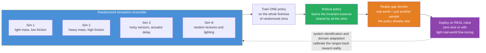

# 🌉 Sim-to-Real Transfer and Domain Randomization

> [!abstract] TL;DR
> Modern robot learning needs a firehose of experience that is **unsafe, slow, and expensive** to gather on real hardware, so we train in **simulation** — fast, safe, parallel, and cheap. But a policy tuned in a single perfect simulator usually **fails on the real robot**, because sim never equals reality: unmodeled friction, contact, actuator delays, sensor noise, and dynamics all differ. That mismatch is the **reality gap** (the *sim-to-real problem*). **Domain randomization** is the dominant fix: instead of one carefully-calibrated simulator, train across a huge ensemble of simulators with **randomized parameters** — masses, frictions, damping, actuator gains, delays, sensor noise, and (for vision) textures and lighting. Forced to succeed across all of them, the policy stops memorizing one sim's quirks and learns the **robust, invariant essence** of the task, so the real world looks like *just one more sample it has already seen*. The cost is a tuning knob: too little randomization and the gap remains; too much and the task becomes conservative or unlearnable.

---

## Intuition

**Analogy — the pilot and the flight simulators.** Imagine a pilot who only ever trained on *one* perfectly-calibrated flight simulator. Every switch, every gust, every ounce of the aircraft's weight was always identical. Put that pilot in a real cockpit that feels even slightly different — a touch heavier, a stickier rudder, an unexpected crosswind — and they are dangerous, because they overfit to the exact feel of that single machine. Now imagine a second pilot trained across *hundreds* of randomly-varied simulators: different aircraft weights, shifting winds, sticky and loose controls, laggy instruments. That pilot never memorized one machine — they learned the **robust essence of flying**, the invariant control skill that works no matter the specifics. When they finally sit in the real plane, it is just *one more variation* among the hundreds they already handled, and they fly it well on the first try.

Domain randomization is exactly this trick applied to robots. Rather than perfecting a single simulator and hoping reality matches it, we deliberately blast the policy with a **randomized ensemble of simulators**. The policy that survives that firehose has learned to ignore the incidental parameters that change from sim to sim and to lock onto the underlying structure of the task. The real robot, with its own peculiar friction and delays, is then indistinguishable from yet another randomized sim — so the learned skill transfers.

---

## How It Works

### Core mechanics

The sim-to-real pipeline has three stages: **why sim, why it breaks, and how randomization fixes it.**

1. **Why train in simulation.** Reinforcement learning and modern robot learning are *data-hungry* — a dexterous-hand or legged-locomotion policy can need years of equivalent real-world experience. On hardware that experience is **slow** (real time, one robot), **unsafe** (falls, collisions, burnt motors), and **costly** (wear, human supervision, breakage). A physics simulator is the opposite: **thousands of times faster than real time, perfectly safe, massively parallel** across cores or GPUs, and essentially free. So we do the heavy learning in sim.

2. **The reality gap (the sim-to-real problem).** A simulator is a *model*, and every model is wrong somewhere. Contact and friction are notoriously hard to simulate; actuators have backlash, deadzones, and latency; sensors have noise, bias, and delay; mass and inertia are never known exactly; and countless small effects (cable drag, gear elasticity, air) go unmodeled entirely. A policy trained to exploit the *exact* dynamics of one simulator **overfits to that simulator** — it learns behaviors that are optimal in sim but brittle or catastrophic on the physical robot. This gap between simulated and real performance is what sinks naive sim-to-real transfer.

3. **Domain randomization (the fix).** Instead of a single nominal simulator, define **distributions** over its parameters and sample a fresh simulator for every training episode:
   - **Dynamics randomization** — mass, inertia, center of mass, joint friction and damping, actuator gain and torque limits, latency, and control-loop delay (see [[Robot_Dynamics_and_Equations_of_Motion]] for exactly which physical terms get perturbed).
   - **Visual randomization** — for vision-based policies, randomize textures, colors, lighting, camera pose, and background clutter, so a perception network never depends on the photorealism that sim cannot deliver.
   - **Sensor and observation noise** — inject noise, bias, dropout, and delay into observations to match real sensor imperfection.

   Trained to succeed across this whole range, the policy is pushed to find behaviors that are **invariant** to the randomized factors. The real robot's true parameters, whatever they are, fall inside (or near) the randomized ranges, so **reality becomes just another sample from the training distribution** and the policy transfers zero-shot or near-zero-shot.

The complementary strategy is **domain adaptation / system identification**: rather than covering reality by brute-force width, *calibrate the sim toward the real robot* — measure real trajectories and fit the simulator's parameters to them (real-to-sim), or learn an online estimate of the true dynamics that the policy conditions on. In practice the strongest systems combine both: wide randomization for robustness plus light **real-world fine-tuning** or online adaptation to close the last of the gap. Related bridges include building **higher-fidelity simulators**, **meta-learning** for rapid on-robot adaptation, and **residual / hybrid learning** that learns only the correction on top of an analytic model.

### Flow / architecture



---

## Key Concepts

### 🟢 Secondary — the plain-language picture

- **Practice in the imagination, perform in the world.** Robots learn by trial and error, and doing millions of trials on a real machine would break it. So they practice in a video-game-like simulation first, where crashing is free.
- **The catch: the game is not reality.** The simulation is never a perfect copy of the real world, so a robot that becomes a champion *in the game* can flop the moment it touches real hardware. That difference is the **reality gap**.
- **The fix: practice in many slightly-wrong games.** Domain randomization runs the practice across thousands of *randomly tweaked* simulations — heavier, lighter, stickier, laggier, differently lit. A robot that wins across all of them has learned the real skill, not one game's quirks.
- **Then reality is just game number one-thousand-and-one.** Because the real robot's true properties sit somewhere inside all that variation, it feels familiar and the skill carries over.
- **You can still cheat a little.** After transfer you often let the robot practice briefly on the real thing to polish the last few percent — **real-world fine-tuning**.

### 🟡 Undergraduate — the working machinery

- **Formalizing the ensemble.** Let the simulator dynamics depend on parameters $\xi$ (mass, friction, gains, delays, textures). Domain randomization defines a distribution $p(\xi)$ and trains a **single policy** $\pi_\theta$ to maximize *expected* return over the whole distribution: $\max_\theta \; \mathbb{E}_{\xi \sim p(\xi)}\big[\, R(\pi_\theta, \xi)\,\big]$. Compare this to nominal training, which maximizes only $R(\pi_\theta, \xi_0)$ at one fixed $\xi_0$ — that single-point objective is precisely what overfits.
- **Randomization as regularization.** Averaging performance over many environments is a form of **implicit regularization** (see [[Regularization]]): it forbids solutions that exploit fragile, environment-specific structure, exactly as data augmentation forbids a vision model from relying on one lighting condition. Visual domain randomization *is* aggressive [[Data_Augmentation_CV]] for the perception stack.
- **Dynamics vs visual randomization.** **Dynamics randomization** targets the *control* problem — mass, friction, damping, torque limits, latency — and is what makes force/torque and locomotion policies robust. **Visual randomization** targets the *perception* problem — textures, lighting, camera — and is what lets a network trained on non-photorealistic renders read real camera images. Full systems randomize both.
- **The transfer objective is a Monte Carlo estimate.** In practice the expectation over $p(\xi)$ is approximated by **sampling** environments each episode (see [[Monte_Carlo_Integration]] and [[Common_Probability_Distributions]]) — uniform or log-uniform ranges are common. Wider ranges cover more reality but raise variance and make learning harder.
- **Domain adaptation and system ID as the dual.** Where randomization pushes the *policy* to cover reality, **system identification** pulls the *simulator* toward reality — fitting $\xi$ to real logged trajectories, or estimating it online (a role natural for a state/parameter estimator such as a Kalman-filter-based scheme; see [[Kalman_Filtering_and_State_Estimation]]). Adaptive and robust control (a sibling topic) formalizes the same robustness goal analytically rather than by learning.

### 🔴 Graduate — the theoretical and practical edges

- **Randomization range vs learnability — the central tradeoff.** Too-narrow ranges leave a residual reality gap (reality falls outside the training support). Too-wide ranges make the problem **conservative** (the policy hedges against parameters that never occur, sacrificing performance) or outright **unlearnable** (no single policy succeeds across an absurdly broad range, and optimization stalls or collapses to a timid do-nothing behavior). The art is choosing ranges *just wide enough* to bracket reality.
- **Automatic Domain Randomization (ADR).** Rather than hand-tuning ranges, ADR (from OpenAI's Rubik's-cube hand) **grows the randomization ranges over training** — widening a parameter only once the policy has mastered the current range. This curriculum keeps the task always learnable while pushing coverage as wide as the policy can bear, and it produced a policy robust enough to handle a real 24-DoF hand it had never touched.
- **Sim fidelity vs randomization, and what stays unmodeled.** Randomization only helps for effects the simulator *can represent*. A structurally missing phenomenon — an unmodeled cable, an unsimulated contact mode, a nonlinearity absent from the engine — is not covered by randomizing the parameters that *are* modeled, so the gap persists. This motivates the complementary investment in **better simulators** (differentiable and contact-accurate physics) and in **residual / hybrid learning**, where a learned term absorbs precisely the discrepancy the analytic model misses.
- **Robust control connection.** Training over an ensemble is closely related to **min-max / robust optimization**: domain randomization optimizes *average* performance over the parameter set, while worst-case robust control ([[Model_Predictive_Control]]'s tube and min-max variants, and adaptive/robust control generally) optimizes the *worst* case. Average-case randomization is cheaper and less conservative; worst-case gives guarantees. The two are endpoints of the same robustness spectrum.
- **Meta-learning and rapid adaptation.** Instead of one fixed robust policy, meta-learning or context-conditioned policies learn to **infer the current dynamics online** from a short interaction and adapt in a few steps — turning the wide randomization distribution from something to be *survived* into something to be *identified and exploited* on the real robot.
- **Where it has won.** Dynamics randomization enabled **quadruped and legged locomotion** policies trained entirely in sim to walk, trot, and recover on real hardware (a sibling locomotion topic), and enabled **dexterous in-hand manipulation** (a sibling manipulation topic) — reorienting objects and even solving a Rubik's cube — on real robot hands with no real-world training data for the control policy. These are the flagship proofs that the reality gap can be crossed.

---

## Python Demo

We make the reality gap concrete on a control task simple enough to reason about but rich enough to fail. The "robot" is a **cart of mass $m$ with viscous friction $b$**, governed by $m\ddot p + b\dot p = u$, that must move to a target position and hold it. The **policy** is a PD controller with gains $(K_p, K_d)$ — searched over a grid, standing in for "training." A small control-effort penalty makes the optimal gains *depend on the true mass*, which is what creates a genuine reality gap.

- **(a) Nominal training** tunes $(K_p, K_d)$ on a **single** nominal model (mass $m_0 = 0.8$). We then test that fixed controller against a whole range of *true* masses — a stand-in for the unknown real robot.
- **(b) Domain-randomization training** tunes **one** $(K_p, K_d)$ to maximize *average* performance across a **randomized ensemble** of models (mass and friction sampled from ranges).
- We plot **performance vs true mass** for both. The nominal controller peaks at its training mass and **degrades badly** on heavier held-out "real" robots; the domain-randomized controller has a **flatter, higher** curve across the whole range — including the unseen real mass — at the price of being marginally worse right at the single nominal point.

```python
# Domain randomization for robustness on a cart-with-friction regulation task.
#   plant:  m p'' + b p' = u   (true m, b differ from the simulator's guess)
#   policy: PD control  u = -Kp (p - p_ref) - Kd p'   (gains searched = "training")
#   reward = exp(-cost),  cost = integrated squared error + small control effort
import numpy as np
import matplotlib.pyplot as plt

rng = np.random.default_rng(0)

# ---------------- Closed-loop simulator, VECTORIZED over an ensemble of plants ----------------
dt, T   = 0.02, 6.0
steps   = int(T / dt)
p_ref   = 1.0
u_max   = 20.0            # actuator saturation
lam     = 0.05           # control-effort weight -> optimal gains depend on the true mass

def eval_gains(Kp, Kd, m, b):
    """Simulate PD control of m p'' + b p' = u for an ARRAY of plants (m, b).
       Returns reward in (0, 1]:  reward = exp(-cost),  cost = ISE + lam * effort."""
    m = np.atleast_1d(np.asarray(m, float))
    b = np.broadcast_to(np.atleast_1d(np.asarray(b, float)), m.shape).copy()
    p = np.zeros_like(m); v = np.zeros_like(m); cost = np.zeros_like(m)
    for _ in range(steps):
        u = np.clip(-Kp * (p - p_ref) - Kd * v, -u_max, u_max)   # PD + saturation
        a = (u - b * v) / m                                       # accel depends on TRUE mass
        v = v + a * dt
        p = p + v * dt
        cost += ((p - p_ref) ** 2 + lam * (u / u_max) ** 2) * dt
    return np.exp(-cost)

# ---------------- Candidate PD gains (the "policy" search space) ----------------
Kp_grid = np.linspace(2.0, 80.0, 30)
Kd_grid = np.linspace(1.0, 30.0, 20)
gains   = [(kp, kd) for kp in Kp_grid for kd in Kd_grid]

# ---------------- (a) NOMINAL training: tune on ONE fixed simulator ----------------
m_nom, b_nom = 0.8, 1.0
best_nom, gain_nom = -1.0, None
for kp, kd in gains:
    r = eval_gains(kp, kd, m_nom, b_nom)[0]
    if r > best_nom:
        best_nom, gain_nom = r, (kp, kd)

# ---------------- (b) DOMAIN RANDOMIZATION: tune on a randomized ENSEMBLE ----------------
m_lo, m_hi = 0.5, 3.0
b_lo, b_hi = 0.3, 2.0
ens_m = rng.uniform(m_lo, m_hi, 25)          # randomized masses
ens_b = rng.uniform(b_lo, b_hi, 25)          # randomized frictions
best_dr, gain_dr = -1.0, None
for kp, kd in gains:
    r = eval_gains(kp, kd, ens_m, ens_b).mean()   # maximize AVERAGE reward over the ensemble
    if r > best_dr:
        best_dr, gain_dr = r, (kp, kd)

print(f"Nominal-trained gains : Kp={gain_nom[0]:5.1f}  Kd={gain_nom[1]:5.1f}")
print(f"DR-trained gains      : Kp={gain_dr[0]:5.1f}  Kd={gain_dr[1]:5.1f}")

# ---------------- Test both across the range of TRUE masses (the reality-gap sweep) ----------------
m_test = np.linspace(m_lo, m_hi, 40)
r_nom  = eval_gains(*gain_nom, m_test, b_nom)     # nominal controller vs true mass
r_dr   = eval_gains(*gain_dr,  m_test, b_nom)     # DR controller vs true mass
m_real = 3.0                                      # a held-out "real robot": heavy
print(f"Avg reward over range -- nominal: {r_nom.mean():.3f}   DR: {r_dr.mean():.3f}")

# ---------------- Step responses on the held-out real robot ----------------
def rollout(Kp, Kd, m, b):
    p, v, traj = 0.0, 0.0, []
    for _ in range(steps):
        u = np.clip(-Kp * (p - p_ref) - Kd * v, -u_max, u_max)
        v += (u - b * v) / m * dt
        p += v * dt
        traj.append(p)
    return np.array(traj)

t = np.arange(steps) * dt
traj_nom = rollout(*gain_nom, m_real, b_nom)
traj_dr  = rollout(*gain_dr,  m_real, b_nom)

# ---------------- Plots ----------------
fig, ax = plt.subplots(1, 2, figsize=(13, 5))

# (a) THE ROBUSTNESS CURVE: performance vs true mass
ax[0].axvspan(m_lo, m_hi, color='seagreen', alpha=0.05)
ax[0].plot(m_test, r_nom, 'o-', color='crimson',  lw=2, ms=4, label='nominal-trained (single sim)')
ax[0].plot(m_test, r_dr,  's-', color='seagreen', lw=2, ms=4, label='domain-randomized (sim ensemble)')
ax[0].axvline(m_nom,  ls='--', color='crimson', alpha=0.6)
ax[0].axvline(m_real, ls=':',  color='k')
ax[0].annotate('nominal sim\n(training mass)', (m_nom, 0.06), color='crimson', ha='center', fontsize=8)
ax[0].annotate('held-out\nREAL robot', (m_real, 0.55), color='k', ha='right', fontsize=8)
ax[0].set_title('(a) robustness across the reality gap')
ax[0].set_xlabel('true plant mass  m  [kg]')
ax[0].set_ylabel('performance  (reward, higher = better)')
ax[0].set_ylim(0, 1); ax[0].legend(loc='upper right')

# (b) deployment: step response on the real (heavy) robot
ax[1].axhline(p_ref, ls='--', color='k', lw=1, label='target')
ax[1].plot(t, traj_nom, color='crimson',  lw=2, label=f'nominal-trained (Kp={gain_nom[0]:.0f})')
ax[1].plot(t, traj_dr,  color='seagreen', lw=2, label=f'DR-trained (Kp={gain_dr[0]:.0f})')
ax[1].set_title(f'(b) deployment on the REAL robot  (m = {m_real} kg)')
ax[1].set_xlabel('time [s]'); ax[1].set_ylabel('position  p  [m]')
ax[1].legend(loc='lower right')

plt.tight_layout(); plt.show()
```

Running it prints something like `Nominal-trained gains: Kp=xx Kd=yy` versus a **stronger, better-damped** `DR-trained` pair, and an average reward over the mass range that is clearly higher for the DR controller. Panel **(a)** is the punchline: the crimson nominal curve spikes near its 0.8 kg training mass and then **sags toward zero** as the true robot gets heavier — the controller tuned for a light cart is too weak and under-damped for a heavy one, so it tracks slowly and oscillates. The green domain-randomized curve is **flatter and higher across the whole range**, including the held-out 3 kg real robot, because it was optimized to perform *on average* over exactly that spread of masses; the only place it loses is a sliver right at the nominal mass, where it trades a little peak performance for broad robustness. Panel **(b)** shows the same story as trajectories on the real 3 kg robot: the nominal controller crawls toward (or overshoots and oscillates around) the target, while the DR controller reaches and holds it. This is domain randomization in miniature — *do not perfect one model; be good across many, and reality becomes just another sample.*

---

## Real-World Applications

- **Dexterous in-hand manipulation (OpenAI Dactyl and the Rubik's-cube hand).** A control policy trained *entirely in simulation* with heavy dynamics randomization — object mass, size, friction, and even Automatic Domain Randomization that grows the ranges over training — transferred to a real 24-DoF Shadow Hand to reorient objects and solve a Rubik's cube, with **no real-world data for the policy**. The flagship demonstration that wide, curricularized randomization crosses the gap on a hard contact-rich task.
- **Legged and quadruped locomotion.** Walking, trotting, and fall-recovery policies for real quadrupeds (and humanoids) are routinely learned in massively-parallel sim with randomized mass, friction, terrain, motor strength, and latency, then deployed **zero-shot** onto hardware that walks over gravel, stairs, and slippery floors it never saw in sim — the locomotion sibling of this topic.
- **Vision-based grasping and pick-and-place.** Perception networks trained on **visually randomized** synthetic scenes — random textures, lighting, camera poses, distractor objects — read real RGB-D images well enough to grasp novel objects, sidestepping the need for photorealistic rendering or huge real-world labeled datasets (this is aggressive synthetic data augmentation for robotics).
- **Autonomous driving and drones.** Sim-to-real with domain randomization is used to pre-train perception and control for self-driving cars and aerial robots, where collecting rare or dangerous real scenarios directly is impractical; randomized sim covers the long tail safely.
- **Robotic assembly and force control.** Contact-heavy tasks (peg insertion, connector mating) randomize friction, stiffness, part tolerances, and sensor noise so that force/torque policies robust to the exact, unmeasurable stiffness of the real parts transfer to the factory cell.

---

## Common Pitfalls

- **Too-wide randomization → conservative or unlearnable.** Cranking every range to the maximum feels safe but backfires: the policy either hedges against parameters that never occur in reality (sacrificing real performance) or fails to find *any* behavior that works across the absurd spread, so optimization stalls or collapses to a timid, do-nothing policy. Widen ranges only as far as needed to bracket reality — or grow them adaptively with a curriculum (ADR).
- **Unmodeled effects are never covered.** Randomizing the parameters the simulator *has* does nothing for phenomena it *lacks* — a missing cable, an unsimulated contact mode, an absent nonlinearity. If the true failure is structural, no amount of parameter randomization helps; you need a better simulator or a **residual / hybrid** learned correction, not wider ranges.
- **Assuming the reality gap is fully closed.** Even good randomization usually leaves a residual gap. Treating a policy that works in sim as automatically deployable is how robots break on day one. Validate on hardware, and budget for the gap.
- **Skipping real-world fine-tuning / adaptation.** The last few percent of performance often *requires* a short bout of on-robot fine-tuning, online **system identification**, or a context-adaptive policy. Pure zero-shot transfer is the exception, not the rule; plan for a calibration or adaptation step.
- **Sim-fidelity vs randomization tradeoff mismanaged.** Teams over-invest in one lever and ignore the other. A photorealistic but narrowly-randomized simulator overfits to its own accuracy; a crude simulator randomized to the moon is unlearnable. The sweet spot balances **decent fidelity** (so the modeled effects are trustworthy) with **enough randomization** (so the unmodeled residual is absorbed) — tune both together, not one in isolation.
- **Randomizing the wrong parameters.** Effort spent randomizing factors the real robot barely varies (while missing the one that actually matters — say, actuator latency or contact friction) wastes learnability. Use sensitivity analysis or real-world logs to find which parameters the reality gap actually rides on.

---

## Related Concepts

- [[Reinforcement_Learning]] — the data-hungry training paradigm that *forces* the move to simulation; sim-to-real is the deployment half of the RL-for-robotics story (the RL-for-control sibling covers the policy side).
- [[Transfer_Learning]] — sim-to-real is a transfer problem: knowledge learned in the source domain (simulation) must generalize to a shifted target domain (the real robot).
- [[Regularization]] — domain randomization acts as an implicit regularizer, forbidding solutions that overfit one simulator's incidental dynamics.
- [[Data_Augmentation_CV]] — visual domain randomization is aggressive data augmentation for the perception stack: randomized textures, lighting, and camera poses.
- [[Neural_Network_Basics]] — the policies and perception networks that are trained across the randomized ensemble are almost always neural nets.
- [[Probability_Theory]] — randomization defines distributions over simulator parameters; the training objective is an expectation over that distribution.
- [[Common_Probability_Distributions]] — the uniform and log-uniform ranges from which masses, frictions, gains, and delays are sampled each episode.
- [[Monte_Carlo_Integration]] — the expected-return-over-environments objective is estimated by Monte Carlo sampling of simulators, exactly as in the demo's ensemble average.
- [[Robot_Dynamics_and_Equations_of_Motion]] — the physical terms (mass, inertia, friction, damping, torque limits) that dynamics randomization perturbs.
- [[Rigid_Body_Physics]] — the rigid-body / contact physics engines that generate the simulations being randomized.
- [[Model_Predictive_Control]] — the model-based control alternative; its robust (tube / min-max) variants are the worst-case counterpart to randomization's average-case robustness.
- [[LQR_Optimal_Control]] — the optimal-control baseline whose fixed gains highlight, by contrast, why a single-model design is fragile under parameter shift.
- [[Kalman_Filtering_and_State_Estimation]] — the estimation machinery behind system identification and online domain adaptation, which pulls the sim toward the real robot.
- [[Robotics_and_Control_Overview]] — the field map placing sim-to-real within the learning-and-autonomy tier of the robotics stack.

---

## Review Questions

### 🟢 Secondary
1. Using the flight-simulator analogy, explain why a robot trained in one perfect simulation often fails on the real robot, and why training across hundreds of randomly-varied simulations fixes it. What is the "reality gap" in your own words?

### 🟡 Undergraduate
2. Write down the training objective for nominal training versus domain randomization, and explain precisely which term makes the nominal policy overfit. Why does averaging return over a distribution of environments behave like regularization?
3. Distinguish **dynamics randomization** from **visual randomization**: which robotics subproblem does each target, what specific parameters does each randomize, and why does a full vision-based manipulation system need both?

### 🔴 Graduate
4. You widen every randomization range to be safe, and your policy's real-world performance gets *worse*, not better. Diagnose the two distinct failure modes (conservatism and unlearnability), and explain how **Automatic Domain Randomization** avoids them while still maximizing coverage.
5. A contact-rich assembly policy transfers well in sim-to-sim tests but fails on the real robot, and widening the friction and mass ranges does not help. Argue why the problem is likely an **unmodeled effect** rather than a too-narrow range, and lay out how you would combine better simulation fidelity, residual/hybrid learning, and real-world system identification to close the gap. Where does average-case randomization end and worst-case robust control begin?

---

## Sources

- Tobin, J., Fong, R., Ray, A., Schneider, J., Zaremba, W., & Abbeel, P. — "Domain Randomization for Transferring Deep Neural Networks from Simulation to the Real World," *IROS* (2017). arXiv:1703.06907.
- Peng, X. B., Andrychowicz, M., Zaremba, W., & Abbeel, P. — "Sim-to-Real Transfer of Robotic Control with Dynamics Randomization," *ICRA* (2018). arXiv:1710.06537.
- OpenAI et al. — "Solving Rubik's Cube with a Robot Hand," (2019). arXiv:1910.07113. (Introduces Automatic Domain Randomization, ADR.)
- OpenAI et al. — "Learning Dexterous In-Hand Manipulation," *IJRR* (2020). arXiv:1808.00177. (Dactyl; dynamics randomization for the Shadow Hand.)
- Zhao, W., Queralta, J. P., & Westerlund, T. — "Sim-to-Real Transfer in Deep Reinforcement Learning for Robotics: a Survey," *IEEE SSCI* (2020). arXiv:2009.13303.

---

#robotics #sim-to-real #domain-randomization #robot-learning #reality-gap
