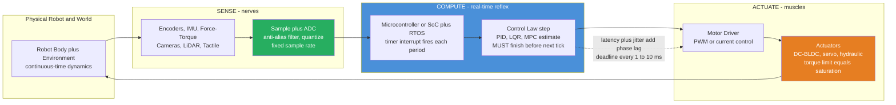

# 🤖 Actuators, Sensors and Embedded Robotics

> [!abstract] TL;DR
> Everything in the previous sections — the kinematics, the LQR gains, the Kalman filters, the optimal trajectories — is **math that assumes the robot can perfectly sense and perfectly move, instantly**. This section-opener is where that assumption meets reality. A robot's **actuators** (motors, hydraulics, artificial muscles) are its muscles; its **sensors** (encoders, IMUs, force-torque cells, cameras, LiDAR) are its nerves; and its **embedded computer** is its reflex arc — a processor that must run the **sense-compute-actuate loop** at a *fixed high rate*, every few milliseconds, forever, or the robot falls, crashes, or crushes something. The three brutal facts of embedded control: **loop rate limits stability** (a controller that works at 1 kHz can go unstable at 20 Hz), **actuators saturate** (a motor cannot deliver infinite torque, so the beautiful control law gets clipped), and **latency and jitter kill** (the delay between measuring and acting adds phase lag that eats your stability margin). Master these and you close the gap between a controller that works in simulation and one that works on real hardware.

---

## Intuition

**Analogy — a goalkeeper diving for a penalty.** All the tactical genius in the world is useless if the keeper has no muscles to launch the dive, no eyes and inner ear to track the ball, and no fast-enough reflexes to react before it crosses the line. The keeper's **muscles are actuators** — powerful but limited: they can only pull so hard, so fast, and they tire. The **eyes and balance organs are sensors** — fast but noisy, and there is a real delay between light hitting the retina and the brain registering "ball going left." And the **spinal reflex and motor cortex are the embedded controller** — they must decide and fire the muscles within a fraction of a second, on a hard deadline that the striker's kick refuses to negotiate. If any link is too slow, too weak, or too noisy, the save fails no matter how good the plan was.

A robot is worse off than the keeper: its "muscles" are electric motors that saturate at a torque limit, its "nerves" quantize the world into discrete samples and add electrical noise, and its "brain" is a microcontroller with kilobytes of RAM that must finish its computation *before the next control tick* or miss the deadline entirely. **Actuators, sensors and embedded robotics is the physical layer where elegant continuous-time control theory is forced through the unforgiving discretization of real motors, real wires, real timing, and a real world that will not wait for a slow loop.** The single most important idea: unlike your laptop, an embedded controller does not just need to be *correct on average* — it needs to be correct *within milliseconds, every single time* (real-time determinism), because a robot balancing on two legs cannot pause for garbage collection.

---

## How It Works

### Core Mechanics

1. **Actuators — the muscles.** They convert stored energy (electrical, hydraulic, pneumatic) into motion. **Electric motors** dominate: brushed **DC** (simple, cheap), **BLDC/PMSM** (efficient, high power density, need electronic commutation), **steppers** (open-loop positioning), and **servos** (a motor plus encoder plus onboard controller in a box). Motors are inherently high-speed / low-torque, so a **gearbox** trades speed for torque — but adds backlash, friction, and reflected inertia. Two philosophies bracket the design space: **direct-drive / series-elastic actuators** (a spring between motor and load gives clean force control and shock tolerance, used in legged robots) versus **high-ratio geared** joints (stiff, precise, but poor at sensing external force). **Hydraulics** (huge force density, used in Atlas-class robots and excavators) and **pneumatics / artificial muscles** (compliant, bio-inspired) fill the extremes. The defining physical limit: an actuator has a finite **torque/force ceiling and a finite slew rate** — its command *saturates*.

2. **Sensors — the nerves.** Split into **proprioceptive** (measure the robot's own body — **encoders** for joint angle, **IMUs** for angular rate and acceleration, **current sensors** as a proxy for torque, **force-torque** cells at the wrist) and **exteroceptive** (measure the outside world — **cameras**, **LiDAR**, **radar**, **ultrasonic**, **tactile** skins). Every sensor is defined by three numbers: **resolution** (smallest change it can report — a 12-bit encoder quantizes a revolution into 4096 steps), **noise** (random error per reading), and **rate** (how often it updates). These are not free: reading a sensor takes time, and its output is a *quantized, noisy, delayed* shadow of the true quantity.

3. **The embedded compute stack — the reflex arc.** Sensor signals are **sampled** by an ADC (analog-to-digital converter) at a fixed rate, processed by a **microcontroller** or **SoC**, and turned into actuator commands sent out as **PWM** or current setpoints to a motor driver. The controller runs inside a **real-time loop**: a timer interrupt fires at a fixed period (say every 1 ms), the interrupt handler reads sensors, computes the control law, and writes the actuator command — and it *must finish before the next tick*. A **Real-Time Operating System** (or a bare-metal interrupt loop) guarantees this timing, unlike a general-purpose OS where a background task can steal the CPU at the worst moment.

4. **Digital / discrete-time realities — where theory breaks.** Continuous control theory (from the earlier sections) assumes an infinitely fast, infinitely precise loop. Reality imposes four taxes. **(a) Sampling rate limits stability**: a controller tuned in continuous time can become *unstable* when run too slowly, because the zero-order-hold and the one-sample delay add phase lag proportional to the sample period — the faster the loop, the more stable. **(b) Quantization**: finite sensor resolution and finite actuator resolution inject a small, non-Gaussian error and can cause limit cycles. **(c) Latency and jitter**: the delay from measuring to actuating (sensor read + compute + bus transport + driver) is pure phase lag that shrinks your stability margin; *jitter* (variation in that delay) is worse than a constant delay because you cannot compensate for it. **(d) Aliasing**: if you sample a signal with frequency content above half your sample rate without an **anti-alias filter**, high-frequency noise folds down and masquerades as a low-frequency signal your controller will chase.

5. **Hardware-software integration and power.** Above the bare loop sits **middleware** — most commonly **ROS/ROS 2** — which shuttles messages between perception, planning, and control nodes; the hard real-time inner loop typically stays on a dedicated microcontroller while ROS handles the softer outer loops. Underneath everything is **power**: motors draw large, spiky currents; battery voltage sags under load (changing the motor's effective gain); and the compute, sensing, and actuation all compete for a finite energy budget on a mobile robot. Embedded constraints — limited FLOPs, kilobytes of RAM, milliwatts of power — mean the controller you *can run on the robot* is often a stripped-down version of the one you designed in simulation.

### Flow / Architecture



---

## Key Concepts

### 🟢 Secondary — the plain-language picture

- **Muscles, nerves, reflexes.** Actuators move the robot, sensors tell it what is happening, and the embedded computer decides what to do — fast, and on a strict clock.
- **Motors have limits.** A motor can only push so hard. When the controller asks for more than the motor can give, the command is *clipped* (saturated) and the robot responds more slowly than the math predicted.
- **The loop has to be fast.** The robot senses, thinks, and acts in a tight repeating loop. If that loop runs too slowly, a robot that would balance fine at high speed will start to wobble and fall — timing itself affects stability.
- **Delay is poison.** Any lag between sensing and acting makes a robot react to *stale* information, which causes overshoot and oscillation — the same reason a shower with slow-responding taps is so hard to set.

### 🟡 Undergraduate — the working machinery

- **DC-motor model.** A first cut: motor torque is proportional to current, back-EMF is proportional to speed, giving a first-order velocity response `omega_dot = (Km * V - omega) / tau`. Position is the integral of velocity. Voltage `V` is bounded by the supply — this bound is the saturation.
- **Gearing trade-offs.** A gear ratio `N` multiplies torque by `N`, divides speed by `N`, and multiplies reflected inertia by `N^2` — but injects backlash and friction that corrupt fine force control. Series-elastic actuators put a calibrated spring in the loop so force = spring deflection, trading bandwidth for clean, shock-tolerant force sensing.
- **Sampling and the zero-order hold (ZOH).** The controller updates only at sample instants and *holds* its output constant between them. This hold is a half-sample-average delay: it adds phase lag of roughly `omega * T / 2` radians at frequency `omega`, directly eroding phase margin. Faster sampling (smaller `T`) means less lag and more margin.
- **Proprioceptive vs exteroceptive.** Internal-state sensors (encoders, IMU) are fast and drift-prone; world-sensing sensors (camera, LiDAR) are slower but bounded. Fusing them is [[Robot_Perception_and_Sensor_Fusion]]'s job; here we care that each has a rate, a resolution, and a noise floor.
- **Quantization.** An `n`-bit sensor or DAC splits its range into `2^n` levels; the resulting step error behaves like added noise of magnitude about one least-significant-bit, and near equilibrium it can drive a small **limit cycle** as the controller hunts between quantization levels.
- **Real-time loop and interrupts.** A hardware timer interrupt (see [[Interrupts_and_DMA]]) triggers the control task at a fixed rate; the task must complete within the period. Missing a deadline (a *loop overrun*) means acting on old data or skipping a cycle — both destabilizing.
- **Anti-aliasing.** Before sampling, an analog low-pass filter must remove content above the Nyquist frequency (half the sample rate); otherwise high-frequency noise aliases into the control band and cannot be filtered out afterward — a direct application of the [[Sampling_Theorem]].

### 🔴 Graduate — the frontier machinery

- **Discrete-time redesign, not just discretization.** Emulation (design in continuous time, then discretize the controller) works only when the sample rate is 20–30x the closed-loop bandwidth. Below that, you must design directly in the **z-domain**: map the plant through a ZOH-equivalent, place the *discrete* closed-loop poles inside the unit circle, and account for the sampler explicitly (see [[Z_Transform]], [[Digital_Filter_Design]], and [[State_Space_Models_in_Control]]). Sampling can push a stable continuous design to poles *outside* the unit circle.
- **Delay as extra state.** A sensor-to-actuator delay of `d` samples adds `d` poles at the origin in discrete time; it is not a nuisance to ignore but a dynamic element to model. **Smith predictors** and delay-augmented state-space / MPC formulations explicitly compensate known delays; unknown or time-varying delay (**jitter**) cannot be perfectly compensated and must be handled with robustness margin.
- **Actuator saturation and windup.** When the command saturates, the loop is effectively open, and any integrator keeps winding up — **integrator windup** — producing huge overshoot on recovery. **Anti-windup** (clamping/back-calculation) and constraint-aware controllers (**MPC**, see [[Model_Predictive_Control]]) handle saturation as a first-class limit rather than a surprise.
- **Real-time scheduling theory.** Guaranteeing the loop always meets its deadline is a schedulability problem: **rate-monotonic** and **earliest-deadline-first** analysis, **priority inversion** (a low-priority task blocking a high-priority one — the bug that hobbled Mars Pathfinder), and **priority inheritance** protocols live in [[Real_Time_and_Embedded_Operating_Systems]] and depend on deterministic [[CPU_Scheduling_Algorithms]] and [[Interrupts_Traps_and_Dual_Mode_Operation]].
- **The sim-to-real gap.** Simulation omits unmodeled friction, backlash, compliance, sensor latency, quantization, current limits, and voltage sag. A controller that is optimal in sim can be unstable on hardware precisely because these embedded effects were absent. Techniques: high-fidelity actuator models, domain randomization for learned controllers, and hardware-in-the-loop testing.
- **Electromechanical energy conversion.** Motor torque arises from the Lorentz force on current-carrying conductors in a magnetic field ([[Magnetism_and_Biot_Savart]]), and back-EMF from [[Faradays_Law_and_Induction]]; the coupled electrical-plus-mechanical dynamics ([[Rotational_Dynamics]]) set the real bandwidth and the thermal limit that ultimately caps continuous torque.

---

## Python Demo

Two experiments on a single **DC-motor position servo** (`omega_dot = (Km*V - omega)/tau`, `theta_dot = omega`) controlled by a discrete PD law running in a zero-order-hold loop. **Experiment A** runs the *same* controller at different **loop rates** and shows that a fast loop is crisp while a slow loop rings and then goes unstable — timing alone destroys stability. **Experiment B** fixes a fast loop and adds two hardware realities: **actuator voltage saturation** (a torque ceiling) and a **sensor-to-actuator delay** (latency), each degrading a controller that is perfect without them. numpy + matplotlib only.

```python
# Embedded/digital control realities on a DC-motor position servo.
# A: same PD controller at different LOOP RATES -> slow loop goes unstable.
# B: fixed fast loop + actuator SATURATION and sensor-to-actuator DELAY -> degradation.
import numpy as np
import matplotlib.pyplot as plt

def simulate(loop_rate, Kp=100.0, Kd=0.1, umax=np.inf, delay=0.0,
             Tsim=1.5, tau=0.1, Km=1.0, ref=1.0):
    """Continuous DC-motor truth integrated finely; PD controller runs at loop_rate
    with a zero-order hold. `umax` clips the voltage (actuator saturation);
    `delay` (seconds) is the sensor-to-actuator latency."""
    dt = 1.0 / 4000.0                       # fine 'truth' integration step
    N  = int(Tsim / dt)
    t  = np.arange(N) * dt
    theta = np.zeros(N); omega = np.zeros(N)
    u = 0.0                                  # held actuator command (ZOH)
    ctrl_dt = 1.0 / loop_rate
    last_ctrl = -1e9
    d_steps = int(round(delay / dt))
    for k in range(1, N):
        # --- controller fires only at the fixed loop rate (ZOH in between) ---
        if t[k] - last_ctrl >= ctrl_dt - 1e-12:
            last_ctrl = t[k]
            ks = max(0, k - d_steps)         # act on DELAYED (stale) measurement
            e  = ref - theta[ks]
            u  = Kp * e - Kd * omega[ks]     # PD law
            u  = np.clip(u, -umax, umax)     # actuator saturation
        # --- plant integrates continuously with the held command ---
        omega[k] = omega[k-1] + ((Km * u - omega[k-1]) / tau) * dt
        theta[k] = theta[k-1] + omega[k-1] * dt
    return t, theta

# ---------------- Experiment A: loop rate vs stability -------------------------
rates = [400, 60, 20]                        # Hz: fast, medium, slow
labelsA = ["400 Hz (fast, stable)", "60 Hz (marginal)", "20 Hz (slow, unstable)"]
colsA   = ["#27AE60", "#E67E22", "#C0392B"]
respA   = [simulate(r) for r in rates]

# sweep many rates -> instability metric = ringing amplitude over the last 0.5 s
sweep = np.linspace(12, 300, 40)
def ring_metric(r):
    t, th = simulate(r)
    tail = th[t > 1.0]
    return np.std(tail)                      # large if oscillating, ~0 if settled
metric = np.array([ring_metric(r) for r in sweep])

# ---------------- Experiment B: saturation and latency ------------------------
t_ideal, th_ideal = simulate(400)                              # crisp baseline
t_sat,   th_sat   = simulate(400, umax=6.0)                    # voltage-limited motor
t_del,   th_del   = simulate(400, umax=20.0, delay=0.030)      # 30 ms sensor->actuator lag

# ---------------- Plots -------------------------------------------------------
fig, ax = plt.subplots(2, 2, figsize=(14, 9))

# (0,0) same controller, different loop rates
for (t, th), lab, c in zip(respA, labelsA, colsA):
    ax[0,0].plot(t, th, color=c, lw=1.8, label=lab)
ax[0,0].axhline(1.0, color="k", ls="--", lw=1, label="reference")
ax[0,0].set_ylim(-0.5, 2.5)
ax[0,0].set_title("A. Same PD controller, different LOOP RATES")
ax[0,0].set_xlabel("time [s]"); ax[0,0].set_ylabel("position theta")
ax[0,0].legend(fontsize=8)

# (0,1) instability cliff vs loop rate
ax[0,1].plot(sweep, metric, "o-", color="#8E44AD", ms=4)
ax[0,1].axhline(0.02, color="gray", ls=":", label="settled threshold")
ax[0,1].set_title("A. Ringing amplitude vs loop rate (instability cliff)")
ax[0,1].set_xlabel("loop rate [Hz]"); ax[0,1].set_ylabel("tail std dev (ringing)")
ax[0,1].legend(fontsize=8)

# (1,0) actuator saturation
ax[1,0].plot(t_ideal, th_ideal, color="#27AE60", lw=2, label="ideal (no limit)")
ax[1,0].plot(t_sat,   th_sat,   color="#C0392B", lw=2, label="voltage saturated (torque limit)")
ax[1,0].axhline(1.0, color="k", ls="--", lw=1)
ax[1,0].set_title("B. Actuator SATURATION slows and distorts response")
ax[1,0].set_xlabel("time [s]"); ax[1,0].set_ylabel("position theta")
ax[1,0].legend(fontsize=8)

# (1,1) sensor-to-actuator delay
ax[1,1].plot(t_ideal, th_ideal, color="#27AE60", lw=2, label="no delay")
ax[1,1].plot(t_del,   th_del,   color="#2980B9", lw=2, label="30 ms sensor->actuator delay")
ax[1,1].axhline(1.0, color="k", ls="--", lw=1)
ax[1,1].set_title("B. LATENCY adds phase lag -> oscillation")
ax[1,1].set_xlabel("time [s]"); ax[1,1].set_ylabel("position theta")
ax[1,1].legend(fontsize=8)

plt.tight_layout(); plt.show()
```

Running it: **Experiment A** shows the identical PD controller settling crisply at 400 Hz, ringing at 60 Hz, and diverging into growing oscillation at 20 Hz — nothing changed but the *clock*, proving that loop rate is itself a stability parameter (the zero-order hold's phase lag grows with the sample period). The instability-cliff panel makes this a design rule: above some rate the ringing metric is near zero, and below it the response blows up, so the loop must run comfortably on the stable side. **Experiment B** shows a controller that is perfect at 400 Hz degraded two different ways: **voltage saturation** caps how fast the motor can accelerate, so the response ramps sluggishly and overshoots as the clipped command cannot brake in time; and a **30 ms sensor-to-actuator delay** makes the controller act on stale position, injecting phase lag that turns a clean step into a sustained oscillation. Together they are the physical reasons a controller that is flawless in continuous-time simulation misbehaves on real hardware.

---

## Real-World Applications

- **Legged robots (Boston Dynamics Spot/Atlas, ANYmal, MIT Cheetah).** Balancing and running demand joint-torque control at 1 kHz or faster on dedicated real-time computers; MIT Cheetah's proprioceptive actuators use low-gear-ratio, high-torque motors with current sensing so the leg can *feel* ground contact without a force sensor — series-elastic and quasi-direct-drive design chosen precisely to beat the saturation/bandwidth limits this note is about.
- **Drone flight controllers (PX4, Betaflight on STM32).** The attitude loop runs at 1–8 kHz on a microcontroller reading a MEMS IMU; anti-aliasing and gyro filtering are mandatory because motor/prop vibration aliases into the rate signal, and any added latency (a slow filter, a slow ESC) directly costs phase margin and can make a quad oscillate or "toilet-bowl."
- **Industrial servo drives and CNC (Beckhoff, Siemens, EtherCAT).** Position/velocity/current loops are nested at different rates (current loop tens of kHz, position loop kHz) over a deterministic real-time fieldbus; encoder resolution and drive latency set the achievable path accuracy, and anti-windup on the current limit is standard.
- **Automotive and aerospace fly-by-wire.** Hard real-time control over CAN/FlexRay with certified worst-case execution time; actuator saturation (control-surface limits) and transport delay are explicitly modeled, and priority inversion / deadline misses are safety-critical faults.
- **Self-balancing and mobile robots (Segway, warehouse AMRs).** An inverted-pendulum plant is only stabilizable if the IMU-read-to-motor-command loop is fast and low-jitter; slow or jittery loops are the classic reason a hobby balance-bot judders and falls.

---

## Common Pitfalls

- **Loop rate too slow for the bandwidth.** Discretizing an aggressive continuous controller and running it at, say, 20 Hz can push the closed-loop poles outside the unit circle even though the continuous design was perfectly stable. Rule of thumb: sample at 20–30x the closed-loop bandwidth, and if you cannot, redesign directly in discrete time rather than emulating.
- **Latency and jitter.** A constant sensor-to-actuator delay is bad (pure phase lag) but at least compensable with a Smith predictor or delay-augmented model; *jitter* — a delay that varies cycle to cycle from a non-real-time OS, a busy bus, or a variable-time algorithm — cannot be compensated and eats margin unpredictably. Pin the control task, use an RTOS or bare-metal loop, and budget worst-case execution time.
- **Actuator saturation and integrator windup.** Ignoring the torque/voltage ceiling makes the sim lie: the real motor clips, the response lags, and any integral term winds up while saturated and then massively overshoots. Always model `umax`, add anti-windup, or use a constraint-aware controller like MPC.
- **Sensor noise and quantization.** Differentiating a noisy or coarsely quantized encoder to get velocity amplifies noise into the actuator; low resolution can also drive a limit cycle near the setpoint. Filter derivatives, use higher-resolution sensing, or estimate velocity with an observer instead of raw differencing.
- **Aliasing without an anti-alias filter.** Sampling a vibration-rich signal above the Nyquist frequency folds high-frequency energy into the control band where no digital filter can remove it. Put an analog low-pass *before* the ADC, matched to the sample rate.
- **Assuming the OS is real-time.** A control loop `sleep(1ms)` in a general-purpose OS is not deterministic — a background task, page fault, or garbage collector can stall it for tens of milliseconds. Hard real-time control belongs on an RTOS or dedicated microcontroller, not a best-effort scheduler.
- **Integration and units bugs.** Mixing radians and degrees, encoder counts and revolutions, or a wrong sign on velocity feedback is the single most common reason a bench-tested controller drives the robot into a wall. Verify every conversion and the feedback sign before closing the loop on hardware.

---

## Related Concepts

- [[PID_Control]] — the workhorse control law that actually runs inside the fixed-rate embedded loop this note describes; its derivative and integral terms are exactly what quantization noise and saturation windup attack.
- [[State_Space_Models_in_Control]] — the continuous `x_dot = Ax + Bu` model that must be converted to a ZOH-equivalent discrete model before it can run on a sampled digital controller.
- [[Model_Predictive_Control]] — the constraint-aware controller that treats actuator saturation and limits as first-class, rather than clipping and hoping.
- [[Kalman_Filtering_and_State_Estimation]] — runs inside the same real-time loop to turn noisy, quantized sensor samples into a usable state estimate for the controller.
- [[Feedback_Control_Fundamentals]] — the phase-margin picture that explains why the ZOH delay and latency of a slow loop erode stability.
- [[Controllability_and_Observability]] — sets whether the chosen actuator/sensor suite can even command and observe the states the controller needs.
- [[Robot_Dynamics_and_Equations_of_Motion]] — the plant the actuators must drive; motor torque limits and gearing determine whether the commanded dynamics are achievable.
- [[Sampling_Theorem]] — the Nyquist limit that dictates minimum sample rate and mandates anti-alias filtering before the ADC.
- [[DT_Signals]] — the discrete-time signal framework underlying every sampled measurement and held command in the loop.
- [[Z_Transform]] — the tool for placing *discrete* closed-loop poles inside the unit circle when the loop is too slow to emulate a continuous design.
- [[Difference_Equations]] — the recurrence form a digital controller actually executes each tick.
- [[Digital_Filter_Design]] — how the anti-alias and derivative-smoothing filters in the sensing path are built.
- [[Real_Time_and_Embedded_Operating_Systems]] — the RTOS layer that guarantees the control task meets its deadline every cycle, with rate-monotonic/EDF scheduling and priority-inheritance.
- [[CPU_Scheduling_Algorithms]] — the deterministic scheduling that keeps jitter bounded so the loop period stays fixed.
- [[Interrupts_Traps_and_Dual_Mode_Operation]] — the timer interrupt that fires the control loop and the ISR path from sensor to computation.
- [[Interrupts_and_DMA]] — the hardware mechanism that streams sensor samples and dispatches the fixed-rate control task with minimal CPU overhead.
- [[Faradays_Law_and_Induction]] — the back-EMF that couples motor speed to voltage and sets the electrical bandwidth of an electric actuator.
- [[Magnetism_and_Biot_Savart]] — the Lorentz-force origin of motor torque, the physical source of the actuator's force ceiling.
- [[Rotational_Dynamics]] — the torque-inertia relation that, with gearing, sets the real achievable acceleration of a joint.

---

## Review Questions

### 🟢 Secondary
1. A two-legged robot balances perfectly in the lab when its control computer runs its sense-think-act loop 1000 times per second. An engineer slows the loop to 20 times per second to save power and the robot starts wobbling and falls. In plain words, why did *only changing the loop speed* make a working controller fail?

### 🟡 Undergraduate
2. A DC motor is commanded a large step. Explain how a **voltage/torque saturation limit** changes the response compared to the ideal linear prediction, and describe one thing that goes wrong if the controller has an integral term while the actuator is saturated.
3. A zero-order hold adds a phase lag of roughly `omega * T / 2` at frequency `omega`, where `T` is the sample period. Your closed-loop bandwidth is about 5 Hz and your continuous phase margin is 30 degrees. Estimate how much phase margin the ZOH consumes at a 20 Hz loop rate versus a 200 Hz loop rate, and explain which is safe.

### 🔴 Graduate
4. A controller is designed and validated in continuous-time simulation, then deployed on hardware where it oscillates. List four *embedded* effects absent from the simulation that could each cause this, and for the sensor-to-actuator **delay** specifically, describe a principled way to compensate a *known* delay and why *jitter* cannot be compensated the same way.
5. You must sample a rate gyro on a quadrotor whose motors inject strong vibration at 80–120 Hz, and you want a 500 Hz control loop. Explain the aliasing risk, why a *digital* filter after sampling cannot fix it, and what analog and rate choices you would make. Then explain why simply raising the sample rate to 4 kHz without an anti-alias filter is still not a complete fix.

---

## Sources

- Siciliano, B., & Khatib, O. (eds.) — *Springer Handbook of Robotics*, 2nd ed. (Springer, 2016) — actuators, sensors, and robot hardware/embedded-architecture chapters.
- Corke, P. — *Robotics, Vision and Control*, 2nd ed. (Springer, 2017) — motor models, sensing, and practical control with runnable code.
- Åström, K. J., & Murray, R. M. — *Feedback Systems: An Introduction for Scientists and Engineers*, 2nd ed. (Princeton, 2021) — actuator saturation, delay, and real-world control limits.
- Franklin, G. F., Powell, J. D., & Workman, M. — *Digital Control of Dynamic Systems*, 3rd ed. (Addison-Wesley, 1998) — sampling, ZOH, discrete design, and the effect of sample rate on stability.
- Liu, J. W. S. — *Real-Time Systems* (Prentice Hall, 2000) — rate-monotonic/EDF scheduling, deadlines, jitter, and priority inversion for the embedded control loop.

---

Where this section goes next: with the physical layer established — muscles, nerves, and a real-time reflex arc — the *Systems, Humans and Frontiers* section builds outward. Robot_Perception_and_Sensor_Fusion turns these raw, noisy samples into a coherent world model; PID_Control and the earlier control notes supply the laws that run on this hardware; and the frontier notes to come extend the same physical constraints to whole new regimes — Human_Robot_Interaction_and_Safety (when the actuators share space with people and torque limits become safety limits), Swarm_and_Multi_Robot_Systems (when many embedded loops must coordinate over a network), Soft_Robotics_and_Bioinspired_Design (when the actuators are compliant artificial muscles rather than stiff motors), and Aerial_and_Autonomous_Vehicles (when the loop must close fast enough to keep a flying or driving machine safe). Every one of them inherits the lesson of this note: elegant control only matters if the hardware can sense, compute, and move fast enough to make it real.

#robotics #actuators #sensors #embedded-systems #real-time-control
