# 🚗 Aerial and Autonomous Vehicles

> [!abstract] TL;DR
> An **autonomous vehicle** — a self-driving car or a hovering drone — is the *entire robotics stack compressed into a single moving body that carries human lives*. To move one metre safely it must run a full **autonomy pipeline** many times a second: **PERCEPTION** (detect and track cars, pedestrians, lanes, obstacles, free space) → **LOCALIZATION** (where am I, to the centimetre, on an HD map — GPS + IMU + LiDAR + [[Visual_SLAM|SLAM]]) → **PREDICTION** (what will every other agent do in the next few seconds) → **PLANNING** (choose a behavior, then compute a safe, comfortable, collision-free trajectory) → **CONTROL** (track that trajectory with steering/throttle/brake, or with rotor thrusts). This is *sense–think–act* at highway speed with a hard real-time deadline and no room for failure. Autonomous vehicles are where **every thread of this vault — perception, estimation, planning, control, learning, and safety — must work together flawlessly and simultaneously**; they are robotics' most visible, highest-stakes, and most demanding proving ground.

---

## Intuition

**Analogy — the whole of robotics wearing a single body.** Most robotics notes study one organ in isolation: a note on planning, a note on control, a note on estimation. A self-driving car is the *entire organism*. Picture a human driver on a busy road. In one second she takes in the whole scene through her eyes (perception), knows without thinking that she is in the left lane of Main Street approaching a light (localization), reads the body language of a pedestrian glancing at the crosswalk and *guesses he is about to step out* (prediction), decides to ease off and drift right to give room (planning), and turns the wheel and lifts off the throttle by exactly the right amount (control) — and then does it all again, and again, several times a second, for the entire drive. Take away any one of these and she crashes. An autonomous vehicle must synthesize *all five*, in silicon, in real time, with the same life-or-death stakes.

That is why these platforms are robotics' ultimate integration test. A quadrotor hovering in wind or a car merging onto a freeway is not "a controller" or "a perception system" — it is a **sense–think–act loop** in which a failure anywhere (a missed pedestrian, a drifting pose estimate, a late brake command, a control law that saturates in a gust) propagates instantly into physical danger. Everything has to be right *at once*, *fast*, and *for a very long tail of rare situations*. The rest of this note walks the pipeline that makes that possible — and the reasons it remains one of the hardest unsolved problems in engineering.

---

## How It Works

### Core mechanics — the autonomy stack

An autonomous vehicle is organized as a **pipeline of stages**, each consuming the output of the last, running in a tight loop at anywhere from ~10 Hz (behavior planning) to ~100–1000 Hz (low-level control):

1. **Perception — "what is around me?"** Fuse raw streams from **cameras, LiDAR, and radar** into a model of the world: detect and classify objects (vehicles, pedestrians, cyclists), track them over time (assign persistent IDs and velocities), segment drivable free space, and read lanes, curbs, and traffic lights. This is where deep learning dominates — object detection, semantic/instance segmentation, depth, and multi-object tracking. It leans directly on the sensing machinery of the vault's *Robot_Perception_and_Sensor_Fusion*.
2. **Localization — "where exactly am I?"** Estimate the vehicle's pose to **centimetre accuracy** by matching live LiDAR/camera observations against a **prior HD map**, fused with GPS/GNSS and inertial (IMU) dead-reckoning through a filter. In GPS-denied places (tunnels, urban canyons, indoors) this collapses into pure *Simultaneous_Localization_and_Mapping* — the map-and-locate-at-once problem.
3. **Prediction — "what will everyone else do?"** For each tracked agent, forecast its likely future trajectories over the next several seconds (a pedestrian may cross or wait; a car may change lanes). Because the world is *interactive*, good prediction must reason about intent and about how agents respond to **you**.
4. **Planning — "what should I do, and exactly how?"** Split into **behavior planning** (a discrete decision: follow this lane, yield, change lanes, stop) and **motion/trajectory planning** (a continuous, dynamically feasible, collision-free, comfortable path). This is the vault's *Configuration_Space_and_Motion_Planning* and trajectory-optimization machinery applied under real-time and safety constraints.
5. **Control — "make the wheels/rotors do it."** Track the planned trajectory with the actuators. For a **car**: lateral control (steering — pure pursuit, Stanley, or MPC) plus longitudinal control (throttle/brake). For a **quadrotor**: a cascaded loop that maps desired position → desired attitude → rotor thrusts. Advanced platforms use *Model_Predictive_Control* to respect tire-friction, thrust, and rate limits with preview.

Two architectural philosophies compete: the **modular pipeline** above (interpretable, testable stage by stage, dominant in industry) versus **end-to-end learning** (a network mapping sensors more or less directly to controls — simpler, more data-hungry, harder to verify). Most deployed systems are modular with learned components inside each stage.

### Flow / architecture

```mermaid
graph LR
    WORLD["Physical world<br/>road, traffic, pedestrians<br/>wind, rain, darkness"]
    SENSORS["SENSORS<br/>camera, LiDAR, radar<br/>GPS, IMU, wheel odometry"]
    PERCEPTION["1. PERCEPTION<br/>detect and track objects<br/>lanes, free space, obstacles"]
    LOCALIZATION["2. LOCALIZATION<br/>where am I on the map<br/>HD map plus GPS-IMU-LiDAR fusion"]
    PREDICTION["3. PREDICTION<br/>what will other agents do<br/>forecast their trajectories"]
    PLANNING["4. PLANNING<br/>behavior then motion planning<br/>a safe collision-free trajectory"]
    CONTROL["5. CONTROL<br/>track the trajectory<br/>steer-throttle-brake or rotor thrust"]
    ACTUATORS["ACTUATORS<br/>steering, throttle, brakes<br/>or rotor speeds"]

    WORLD --> SENSORS
    SENSORS --> PERCEPTION
    PERCEPTION --> LOCALIZATION
    LOCALIZATION --> PREDICTION
    PREDICTION --> PLANNING
    PLANNING --> CONTROL
    CONTROL --> ACTUATORS
    ACTUATORS -->|"acts on the world, loop repeats many times per second"| WORLD

    style PERCEPTION fill:#4A90D9,color:#fff
    style LOCALIZATION fill:#16A085,color:#fff
    style PREDICTION fill:#E67E22,color:#fff
    style PLANNING fill:#8E44AD,color:#fff
    style CONTROL fill:#27AE60,color:#fff
```



---

## Key Concepts

### 🟢 Secondary — the plain-language picture

- **Sense, think, act — over and over.** Every autonomous vehicle repeats one loop: *look* at the world, *figure out* what is happening and what to do, then *move* — dozens of times a second, forever, without a break.
- **Five jobs, all at once.** See the world (perception), know where you are (localization), guess what others will do (prediction), decide a safe path (planning), and steer to it (control). Miss any one and the vehicle is unsafe.
- **The SAE levels (0–5).** A ladder of autonomy: **L0** no automation; **L1** driver assistance (adaptive cruise *or* lane-keeping); **L2** partial automation (both together, but the human must supervise — most "self-driving" features sold today); **L3** conditional (the car drives, but a human must take over when asked); **L4** high automation (fully self-driving inside a defined area/condition — robotaxis); **L5** full automation (anywhere a human could drive). The leap from L2 to L4 is enormous — it is where the human safety net is removed.
- **Cars vs drones.** A **self-driving car** moves on a plane and can always stop and think. A **drone (quadrotor)** must *keep computing just to stay in the air* — stop the control loop and it falls. Drones are faster, more agile, and less forgiving.
- **The hard part is the rare stuff.** Ordinary driving is nearly solved; the danger lives in the **long tail** — the once-in-a-million weird situations (a couch on the highway, a person in a costume, sun glare wiping out a camera). Handling billions of common cases is easy; handling the rare deadly ones is the whole problem.

### 🟡 Undergraduate — the working machinery

- **The sensor suite.** *Cameras* are cheap, high-resolution, and see color/text (traffic lights, signs) but struggle with distance, glare, and darkness. *LiDAR* gives precise 3D geometry (a dense point cloud) and works in the dark, but is expensive and degraded by rain/fog. *Radar* measures range and *velocity* directly (Doppler) through weather, but is low-resolution. **Sensor fusion** combines their complementary strengths — the core reason production systems carry all three (the "camera-only" camp is the notable dissent).
- **Perception stack.** Object detection (bounding boxes, e.g., YOLO/R-CNN families), semantic and instance segmentation (per-pixel labels), depth estimation, 3D detection on point clouds, and multi-object tracking (data association across frames, often a Kalman filter per track). These directly reuse the Computer-Vision toolkit.
- **Localization via HD maps.** A prebuilt **HD map** stores lane geometry, signs, and a LiDAR/feature layer to centimetre precision. Localization matches live scans to this layer and fuses the result with GPS + IMU in an EKF, giving a pose far more accurate than GPS alone (which is metres off and useless between lane lines).
- **Motion planning.** Sample or optimize a trajectory in configuration space that is collision-free, kinematically feasible (a car cannot move sideways — nonholonomic), and comfortable (bounded jerk/acceleration). Methods span lattice planners, sampling (RRT\*), and optimization; the chosen trajectory becomes the reference the controller tracks.
- **Path-tracking control (cars).** **Pure pursuit** geometrically steers toward a *lookahead point* on the path: $\delta = \arctan\!\big(2L\sin\alpha / L_d\big)$, where $L$ is the wheelbase, $\alpha$ the heading error to the lookahead point, and $L_d$ the lookahead distance. **Stanley** (winner of the DARPA Grand Challenge) instead nulls the front-axle **cross-track error** plus heading error. Both are simple, robust, and the demo below implements pure pursuit.
- **Quadrotor dynamics and control.** A quadrotor has **4 motors but 6 degrees of freedom** — it is **underactuated**: it cannot translate sideways without first *tilting*. Control is therefore **cascaded**: an outer **position** loop computes a desired thrust vector, which sets a desired **attitude**; an inner, faster **attitude** loop drives the body to that orientation via differential motor thrusts. The four control channels are total thrust and three body torques (roll, pitch, yaw).
- **Modular vs end-to-end.** *Modular* pipelines expose every stage for testing and debugging (you can log and inspect the perception output, the plan, the control command). *End-to-end* nets learn sensor→control directly, are simpler and can capture subtleties, but are opaque and hard to certify. The mainstream is modular-with-learned-parts.

### 🔴 Graduate — the theoretical and practical edges

- **The safety-validation problem — "how safe is safe enough, and how do you prove it?"** To show an AV is safer than a human (~1 fatality per ~100 million miles in the US), a naive statistical argument demands driving *hundreds of millions to billions of miles* per software version to demonstrate the failure rate with confidence — infeasible to repeat every release. This drives the field toward **scenario-based testing**, massive **simulation**, **importance sampling** of rare events, formal **safety cases** (e.g., ISO 21448 SOTIF, UL 4600), and mathematical models like **RSS (Responsibility-Sensitive Safety)** that define provably-safe distances/rules rather than relying on statistics alone.
- **The long-tail / edge-case problem.** Performance is limited not by the common 99.9% but by the heavy-tailed 0.1% — an unbounded space of rare configurations (unusual vehicles, debris, construction, gestures, weather). No dataset covers it; the frontier is **operational design domain (ODD)** restriction, active data mining of "interesting" miles, and graceful degradation / minimal-risk maneuvers when the situation leaves the ODD.
- **Sensor-fusion architecture and the LiDAR debate.** *Early (low-level) fusion* combines raw sensor data before detection; *late (object-level) fusion* combines per-sensor detections. The industry split — expensive LiDAR + camera + radar (Waymo, Cruise) versus camera-first, LiDAR-light (Tesla) — is a bet about whether vision alone can reach the required tail reliability, and about cost/scalability.
- **Underactuation and differential flatness (quadrotors).** Quadrotor dynamics are **differentially flat**: the full state and the four inputs can be written as functions of four **flat outputs** (x, y, z position and yaw) and their derivatives. This lets planners generate **minimum-snap** polynomial trajectories in flat-output space that are automatically dynamically feasible — the Mellinger–Kumar result that enabled aggressive, acrobatic flight (flips, flight through thrown hoops and narrow gaps).
- **Learned vs classical planning and control.** Reinforcement and imitation learning increasingly handle prediction and planning (learned cost functions, learned agent models, driving policies), and end-to-end nets are an active research thread. The tension is **performance vs verifiability**: learned components are hard to give guarantees for, so they are wrapped in classical safety envelopes, runtime monitors, and fallback controllers.
- **Verification, runtime assurance, and formal methods.** Because exhaustive testing is impossible, safety-critical AVs increasingly pair the nominal (possibly learned) controller with a **verified safety monitor / shield** (reachability-based, control-barrier-function, or simplex architectures) that vetoes unsafe commands — bringing *formal methods* into the loop alongside statistical validation.
- **Sim-to-real gap.** Policies and perception trained or validated in simulation degrade in reality due to imperfect sensor models, unmodeled dynamics, and distribution shift. Domain randomization, high-fidelity sensor simulation, and closed-loop real-world shadow testing narrow the gap but never fully close it.
- **Beyond cars and drones.** The same stack drives **AUVs** (autonomous underwater vehicles — acoustic sensing, no GPS underwater), **spacecraft/rovers** (huge latency, no GPS, autonomous EDL and navigation), and **aerial swarms** (many agents coordinating), the domain of the vault's *Swarm_and_Multi_Robot_Systems*.

---

## Python Demo

We implement **pure pursuit lateral control** — the classic path-tracking law behind Stanley and countless real vehicles — steering a **kinematic bicycle-model car** along a curved reference road. The car is deliberately started **off the road** (6 m to the side, wrong heading) at constant speed; the controller must **acquire the path and track it** using only geometry. At each step it finds a **lookahead point** a distance $L_d$ ahead on the path, computes the heading error $\alpha$ to that point, and commands the front-wheel steering angle $\delta = \arctan\!\big(2L\sin\alpha / L_d\big)$ (clipped to a physical steering limit). We plot the road and the driven trajectory, the steering command over time (against its saturation limits), the **cross-track error** collapsing to near zero as the car locks onto the road, and the heading error to the lookahead point. Pure NumPy dynamics + Matplotlib — no control library.

```python
# Pure pursuit lateral control of a kinematic bicycle-model car tracking a curvy road.
#   state = [x, y, theta] (rear-axle pose);  constant speed v;  input = steering delta
#   pure pursuit:  delta = atan2( 2 L sin(alpha), Ld )   (L = wheelbase, alpha = heading error
#   to a lookahead point Ld ahead on the path).  Car starts OFF the road and must acquire it.
import numpy as np
import matplotlib.pyplot as plt

# ---------------- Reference path: a curvy two-lane road ----------------
s  = np.linspace(0.0, 110.0, 900)
cx = s
cy = 8.0 * np.sin(0.09 * s) + 3.0 * np.sin(0.03 * s)     # compound gentle curves

# ---------------- Vehicle + controller parameters ----------------
L      = 2.9          # wheelbase [m] (typical sedan)
v      = 8.0          # constant forward speed [m/s]
dt     = 0.03         # control period [s]  (~33 Hz)
k_ld   = 0.35         # lookahead gain: Ld grows with speed
Ld0    = 3.5          # base lookahead distance [m]
d_max  = np.deg2rad(35.0)     # steering saturation limit [rad]

def wrap(a):                   # wrap angle to (-pi, pi]
    return (a + np.pi) % (2 * np.pi) - np.pi

def pure_pursuit(x, y, theta, last_idx):
    """Return steering delta, heading error alpha, and the lookahead index."""
    Ld = k_ld * v + Ld0
    # nearest path point at or ahead of last_idx (monotone progress along the road)
    d = np.hypot(cx[last_idx:] - x, cy[last_idx:] - y)
    nearest = last_idx + int(np.argmin(d))
    # advance until we are at least Ld ahead -> the lookahead point
    idx = nearest
    while idx < len(cx) - 1 and np.hypot(cx[idx] - x, cy[idx] - y) < Ld:
        idx += 1
    alpha = wrap(np.arctan2(cy[idx] - y, cx[idx] - x) - theta)   # heading error to target
    delta = np.arctan2(2.0 * L * np.sin(alpha), Ld)              # pure pursuit geometry
    return np.clip(delta, -d_max, d_max), alpha, nearest

# ---------------- Closed-loop simulation ----------------
# Start OFF the path: 6 m below the road's start, heading straight (wrong) -> must converge.
state = np.array([0.0, -6.0, 0.0])
last_idx = 0
traj, steer, xte, herr = [], [], [], []

for _ in range(2000):
    x, y, theta = state
    delta, alpha, nearest = pure_pursuit(x, y, theta, last_idx)
    last_idx = nearest

    # signed cross-track error: perpendicular distance to the nearest path point
    tx = cx[min(nearest + 1, len(cx) - 1)] - cx[nearest]         # path tangent
    ty = cy[min(nearest + 1, len(cy) - 1)] - cy[nearest]
    sign = np.sign(tx * (y - cy[nearest]) - ty * (x - cx[nearest]))
    e_ct = sign * np.hypot(x - cx[nearest], y - cy[nearest])

    traj.append([x, y]); steer.append(delta); xte.append(e_ct); herr.append(alpha)

    # kinematic bicycle update (rear-axle reference), constant speed
    state = np.array([x + v * np.cos(theta) * dt,
                      y + v * np.sin(theta) * dt,
                      wrap(theta + v / L * np.tan(delta) * dt)])
    if nearest >= len(cx) - 3:        # reached the end of the road
        break

traj = np.array(traj); steer = np.array(steer)
xte  = np.array(xte);  herr  = np.array(herr)
t    = np.arange(len(traj)) * dt

# after the first ~2 s the car has acquired the road; report steady tracking error
acq = int(2.0 / dt)
print(f"peak |steering| = {np.rad2deg(np.max(np.abs(steer))):.1f} deg  (limit 35)")
print(f"initial cross-track error = {xte[0]:+.2f} m")
print(f"RMS cross-track error after acquisition = {np.sqrt(np.mean(xte[acq:]**2)):.3f} m")

# ---------------- Plots ----------------
fig, ax = plt.subplots(2, 2, figsize=(14, 9))

# (a) the road and the driven trajectory
ax[0, 0].plot(cx, cy, 'k--', lw=1.6, label='reference road')
ax[0, 0].plot(traj[:, 0], traj[:, 1], color='seagreen', lw=2.2, label='car trajectory')
ax[0, 0].plot(traj[0, 0], traj[0, 1], 'bo', ms=9, label='start (off the road)')
ax[0, 0].plot(traj[-1, 0], traj[-1, 1], 'r*', ms=15, label='goal reached')
ax[0, 0].set_aspect('equal'); ax[0, 0].legend(loc='upper right', fontsize=8)
ax[0, 0].set_title('(a) pure pursuit acquires and tracks the curvy road')
ax[0, 0].set_xlabel('x [m]'); ax[0, 0].set_ylabel('y [m]')

# (b) steering command vs the physical limit
ax[0, 1].axhline( np.rad2deg(d_max), ls=':', color='gray')
ax[0, 1].axhline(-np.rad2deg(d_max), ls=':', color='gray')
ax[0, 1].fill_between(t, -np.rad2deg(d_max), np.rad2deg(d_max), color='seagreen', alpha=0.06)
ax[0, 1].plot(t, np.rad2deg(steer), color='darkorange', lw=1.8)
ax[0, 1].set_title('(b) steering command vs +/- 35 deg limit')
ax[0, 1].set_xlabel('time [s]'); ax[0, 1].set_ylabel('steering delta [deg]')

# (c) cross-track error collapses to ~0 as the road is acquired
ax[1, 0].axhline(0.0, ls='--', color='k', lw=1)
ax[1, 0].plot(t, xte, color='crimson', lw=1.8)
ax[1, 0].set_title('(c) cross-track error -> 0 (path acquired)')
ax[1, 0].set_xlabel('time [s]'); ax[1, 0].set_ylabel('cross-track error [m]')

# (d) heading error to the lookahead point
ax[1, 1].axhline(0.0, ls='--', color='k', lw=1)
ax[1, 1].plot(t, np.rad2deg(herr), color='royalblue', lw=1.8)
ax[1, 1].set_title('(d) heading error to lookahead point')
ax[1, 1].set_xlabel('time [s]'); ax[1, 1].set_ylabel('alpha [deg]')

plt.tight_layout(); plt.show()
```

**What you see.** The printout reports a large **initial cross-track error of about −6 m** (the car starts well off the road) shrinking to an **RMS of a few centimetres** once acquired, with the steering staying comfortably inside the ±35° limit. Panel **(a)** shows the green car trajectory swinging in from below, **locking onto the dashed road**, and hugging it through every curve to the goal. Panel **(c)** is the punchline: the cross-track error dives from −6 m to ~0 in the first couple of seconds and then stays flat — pure geometry, no explicit error model, has produced stable tracking. Panels **(b)** and **(d)** show the smooth steering effort and the heading error to the lookahead point decaying to near zero. Shrink the lookahead $L_d$ and the car tracks tighter but starts to **oscillate** (the classic pure-pursuit trade-off); enlarge it and tracking becomes sluggish and cuts corners — exactly the tuning tension every real path-tracking controller lives with, and the reason production stacks graduate to Stanley or *Model_Predictive_Control* when tire limits and comfort matter.

---

## Real-World Applications

- **Robotaxis (L4).** Waymo and Cruise operate driverless services in mapped cities using the full LiDAR + camera + radar stack, HD maps, and heavy simulation-based validation — the clearest existence proof that the pipeline works within a bounded ODD.
- **Consumer driver assistance (L2).** Tesla Autopilot/FSD, GM Super Cruise, and Mercedes' L3 Drive Pilot bring perception, prediction, planning, and control to production cars, spanning the camera-first and sensor-rich philosophies and the L2→L3 human-supervision boundary.
- **Delivery and industrial drones.** Zipline (medical delivery via fixed-wing UAVs), Wing/Amazon Prime Air (quadrotor/VTOL delivery), and warehouse/agriculture drones run the same sense–plan–control loop airborne, where losing the loop means falling.
- **Cinematography and racing drones.** DJI camera drones use visual-inertial state estimation and cascaded control for stable autonomous flight; autonomous drone-racing research (aggressive, near-limit flight) pushes minimum-snap planning and fast perception to the extreme.
- **Off-road, defense, and planetary.** DARPA Grand/Urban Challenge vehicles (Stanley, Boss) launched the modern field; agricultural and mining autonomy, and Mars rovers' autonomous navigation and helicopter (Ingenuity) flight, apply the stack where no human or GPS is available.
- **Marine and subsea autonomy.** Autonomous cargo ships and AUVs run localization (acoustic/inertial, no GPS underwater), obstacle avoidance, and control for long missions with intermittent human contact.

---

## Common Pitfalls

- **The long tail eats you.** A system that handles 99.9% of miles can still be unsafe, because collisions concentrate in the rare 0.1% — the unmodeled costume, the overturned truck, the unusual construction zone. Optimizing average-case metrics hides tail risk; you must actively mine and test the tail and restrict the **operational design domain** to what you can actually cover.
- **Sensor failure and adverse conditions.** Heavy rain/fog/snow scatter LiDAR and blind cameras; low sun and tunnels wash out vision; mud, ice, or a cracked lens silently degrade a channel. **Fusion and graceful degradation** (cross-checking sensors, detecting a failed channel, executing a minimal-risk stop) are mandatory — a stack that assumes clean inputs is unsafe by design.
- **"How safe is safe enough?" is unanswered by mileage alone.** Proving a per-mile fatality rate below the human baseline needs impractically many miles per release. Teams that rely on public-road mileage as their sole safety argument are fooling themselves; scenario-based testing, simulation with rare-event sampling, and formal safety cases are required to make the argument tractable.
- **Sim-to-real gap.** Perception and policies validated in simulation can fail on real sensor noise, unmodeled dynamics, and distribution shift. Never certify on simulation alone; use domain randomization, high-fidelity sensor models, and shadow/real-world closed-loop testing.
- **Latency and real-time deadlines.** The whole loop must close inside a hard budget; a perception or planning stage that occasionally overruns injects stale state into control at speed — a control failure, not a slow computation. End-to-end latency (sensor → actuation) must be bounded and accounted for in the planner's safety margins.
- **Over-trust and automation complacency (the L2/L3 trap).** Systems good enough to lull the human but not good enough to be unsupervised create a dangerous handoff: the driver stops paying attention exactly when they are still the safety net. This human-factors failure is why the L2→L4 gap is about *removing* the human, and it ties directly to *Human_Robot_Interaction_and_Safety*.
- **Adversarial and edge inputs.** Perception nets can be fooled by adversarial patches, unusual textures, or spoofed GPS; a stack that trusts a single sensor or an unverified network is exploitable. Robustness, plausibility checks, and cross-sensor consistency guards are needed.
- **Ethical dilemmas and responsibility.** Rare unavoidable-harm situations (the "trolley problem" framing) and the question of *who is accountable* when an autonomous system harms someone are genuine unsolved issues at the boundary with law and *Ethics_and_Applied_Ethics* — not engineering details to be deferred.

---

## Related Concepts

- [[Robotics_and_Control_Overview]] — the field map; this note is the capstone where the Overview's perception, estimation, planning, and control branches are integrated into one real-time system.
- [[Visual_SLAM]] — the camera-based localization-and-mapping that lets a vehicle know where it is when GPS fails (tunnels, canyons, indoors); the localization stage's core algorithm.
- [[Object_Detection_RCNN]] — the object-detection family (R-CNN lineage) that finds and boxes the cars, pedestrians, and cyclists the perception stage must track.
- [[Semantic_Segmentation_Deep]] — per-pixel scene labeling (road, sidewalk, vehicle, sky) that yields drivable free space and lane geometry for planning.
- [[Depth_Estimation_Deep]] — recovering distance from cameras, feeding the 3D scene understanding a driving policy needs when LiDAR is absent or as a cross-check.
- [[Object_Detection_3D]] — detecting objects directly in LiDAR/stereo point clouds with metric 3D pose, the backbone of AV obstacle perception.
- [[Reinforcement_Learning]] — the learning route to prediction, planning, and end-to-end policies; wrapped in classical safety envelopes because learned components are hard to certify.
- [[State_Feedback_Control]] — the state-space feedback foundation beneath trajectory-tracking controllers (LQR/MPC) that turn a planned path into steering and thrust commands.
- [[Aerodynamics_and_Aerospace_Applications]] — the lift, drag, and thrust physics governing fixed-wing UAVs and VTOL aircraft, and the rotor aerodynamics behind quadrotor flight.
- [[Autonomy_Accountability_and_Moral_Machines]] — the ethics of delegating life-and-death decisions to machines: responsibility, accountability, and the trolley-problem framings raised by autonomous vehicles.
- [[AI_Ethics_Overview]] — the broader ethical frame (bias, transparency, safety) for deploying AI systems that make consequential real-world decisions.
- [[Systems_Failure_and_Wicked_Problems]] — why safety validation of a tightly-coupled, high-consequence system is a *wicked* problem, and how such systems fail in ways no single test reveals.

> Adjacent robotics notes (siblings referenced in prose above): *Simultaneous_Localization_and_Mapping* (the localization stage), *Robot_Perception_and_Sensor_Fusion* (the perception stage's sensing), *Configuration_Space_and_Motion_Planning* (the planning stage), *Model_Predictive_Control* (the advanced trajectory-tracking controller), and — to build next — *Swarm_and_Multi_Robot_Systems* (aerial swarms) and *Human_Robot_Interaction_and_Safety* (the safety and handoff frontier).

---

## Review Questions

### 🟢 Secondary
1. Using the human-driver analogy, name the five stages an autonomous vehicle must perform in every control cycle, and explain why removing any single one makes the vehicle unsafe. Which stage does a *drone* have to keep running just to avoid falling out of the sky?

### 🟡 Undergraduate
2. Cameras, LiDAR, and radar each have a distinct strength and a distinct blind spot. Fill in all three, and explain why most production self-driving cars carry all three rather than betting on one — and what the "camera-only" camp is wagering instead.
3. A quadrotor has four motors but must move in six degrees of freedom. Explain what **underactuation** means here, why it forces a **cascaded** (position-then-attitude) control architecture, and what the four actual control channels are.

### 🔴 Graduate
4. A company claims its self-driving car is "safer than a human." Explain why *public-road mileage alone* cannot practically establish that claim to statistical confidence, and describe two complementary approaches (e.g., scenario-based simulation with rare-event sampling, and a formal safety model such as RSS) that make the safety argument tractable.
5. Contrast the **modular pipeline** and **end-to-end learned** architectures for autonomy along three axes: verifiability/testability, data requirements, and ability to capture rare subtleties. For a safety-critical L4 deployment, argue which you would ship as the primary system and how you would use the other — and where a verified runtime safety monitor fits.
6. Pure pursuit tracks a path well but oscillates when the lookahead $L_d$ is short and cuts corners when it is long. Explain this trade-off geometrically, and describe how **Stanley** control and **MPC** each address the limitations of pure pursuit for a car operating near its tire-friction limits.

---

## Sources

- Thrun, S., Montemerlo, M., Dahlkamp, H., et al. — "Stanley: The Robot that Won the DARPA Grand Challenge," *Journal of Field Robotics*, 23(9), pp. 661–692 (2006).
- Paden, B., Čáp, M., Yong, S. Z., Yershov, D., & Frazzoli, E. — "A Survey of Motion Planning and Control Techniques for Self-Driving Urban Vehicles," *IEEE Transactions on Intelligent Vehicles*, 1(1), pp. 33–55 (2016).
- Mellinger, D., & Kumar, V. — "Minimum Snap Trajectory Generation and Control for Quadrotors," *IEEE International Conference on Robotics and Automation (ICRA)*, pp. 2520–2525 (2011).
- Siegwart, R., Nourbakhsh, I. R., & Scaramuzza, D. — *Introduction to Autonomous Mobile Robots*, 2nd ed. (MIT Press, 2011).
- Shalev-Shwartz, S., Shammah, S., & Shashua, A. — "On a Formal Model of Safe and Scalable Self-Driving Cars" (Responsibility-Sensitive Safety, RSS), Mobileye technical report, arXiv:1708.06374 (2017).

---

#robotics #autonomous-vehicles #self-driving #drones #autonomy-stack
