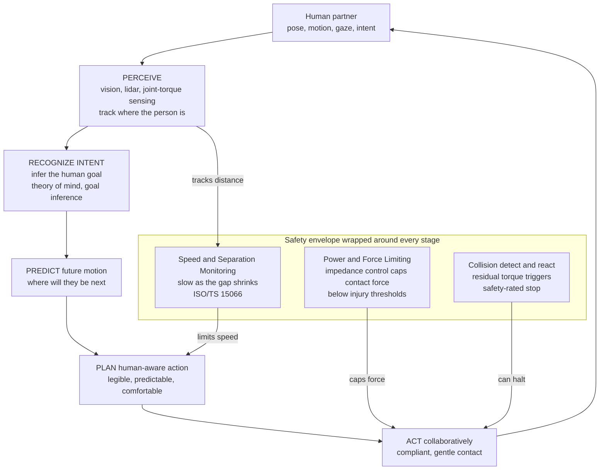

# 🤝 Human-Robot Interaction and Safety

> [!abstract] TL;DR
> For decades industrial robots were locked **behind cages** — blindingly fast, immensely strong, and utterly blind to the people around them; the safety strategy was simply *keep humans out*. The frontier of robotics is tearing down that cage so machines can work **beside** us — in factories, operating rooms, warehouses, and homes. That single change rewrites every requirement. A robot that shares your space must **perceive** the person, **recognize and predict** their intent, move **legibly** so its next move is obvious, respond **compliantly** so any contact is gentle, and above all it must be provably **safe** — because when a caged robot miscalculates you get a scrapped part, but when a *shared-space* robot miscalculates you get an **injury**. This note is about the whole stack that makes robots safe collaborators: the physics of soft, force-limited contact (**impedance control**), the operational safety modes codified in **ISO 10218 / ISO/TS 15066** (speed-and-separation monitoring, power-and-force limiting, safety-rated stops), the perception-and-prediction that lets a robot read a human, and the social and ethical questions — trust, over-reliance, liability — that decide whether we accept these machines at all.

---

## Intuition

**Analogy — the powerful stranger who never looks up.** Picture an industrial robot arm behind its safety cage as an enormously strong stranger swinging a sledgehammer in a rhythmic loop, eyes fixed on the ground, *never once glancing up*. It is breathtakingly efficient and perfectly repeatable — and you would never, ever choose to stand next to it, because it has no idea you exist. The whole point of the cage is to admit that: the robot cannot see you, so the wall keeps you apart.

The future of robotics is the robot that **leaves the cage** to work right beside you — handing you a tool, holding tissue steady during surgery, carrying a load through a crowded aisle, steadying an elderly person as they stand. But a stranger with a sledgehammer cannot simply step out from behind the wall unchanged. To be trusted at arm's length, that machine needs a completely different design: it must be **aware of people** (it looks up, it tracks where you are), **gentle when it touches** (it yields on contact instead of driving through), **predictable in its moves** (you can read what it will do next), and — underneath all of it — **safe by construction**, because a robot sharing your space that misjudges a single motion is not a bug report you file on Monday. It is an injury. Everything in Human-Robot Interaction flows from that one raised stakes: *the human is now inside the workspace, and the machine is responsible for them.*

---

## How It Works

### Core Mechanics

Human-Robot Interaction (HRI) is the study of how humans and robots interact across three intertwined channels: **physical** (sharing space and making contact), **cognitive** (reading and predicting each other's goals), and **social** (trust, communication, and comfort). Safety is the constraint that binds all three. The engineering breaks into a layered stack, from the raw physics of contact up to the social contract.

1. **From caged to collaborative.** A traditional industrial cell is *separation by walls*: high speed, high force, zero awareness, humans excluded by a fence and interlocked doors. A **collaborative robot (cobot)** removes the fence and instead builds the safety *into the robot's behavior* — it senses people, limits its speed and force, and stops or yields when a human is near. The safety guarantee migrates from a steel cage into the control loop.

2. **The four ISO collaboration modes.** The standards **ISO 10218** (industrial robot safety) and the technical specification **ISO/TS 15066** (collaborative operation) define four ways a robot may legally share space with a person:
   - **Safety-rated monitored stop** — the robot holds position (motors still powered) whenever a human is in the shared zone; it resumes only when they leave.
   - **Hand guiding** — the operator physically moves the robot via a force-sensing handle; motion happens only under direct human command.
   - **Speed and Separation Monitoring (SSM)** — sensors track the human-robot separation distance and the robot **slows as the gap shrinks**, stopping before contact is possible. Speed is a function of distance.
   - **Power and Force Limiting (PFL)** — the robot is *allowed* to touch the human, but its contact forces and pressures are capped below documented **biomechanical injury thresholds** (ISO/TS 15066 tabulates limits per body region). This is what makes lightweight, rounded, force-limited cobots inherently safe.

3. **Compliance and physical HRI — making contact safe.** A stiff **position controller** treats any obstacle as an error to overpower: block it and it commands *more* torque, driving contact force through the roof. Safe physical interaction demands the opposite reflex — **yield**. This is **impedance / admittance control**: the robot is programmed to behave like a virtual **spring-mass-damper** rather than a rigid positioner, so a push produces a proportional, gentle give. Contact force becomes `F = K · penetration`, and by choosing a **low stiffness K** the same intrusion that would generate a dangerous force under a stiff controller produces only a mild one. The hardware complements this: **series-elastic actuators** (a deliberate spring between motor and joint), **backdrivable** lightweight transmissions, torque sensing in every joint, and **soft robotics** bodies all lower the effective stiffness of contact.

4. **Collision detection and reaction.** Even a compliant robot needs a reflex for the *unexpected* collision. By comparing the torque its dynamic model *predicts* it should feel against the torque it *actually* measures, a robot computes a **residual** — an estimate of external contact force with no extra sensor. A large residual triggers a reaction: stop, switch to zero-gravity float, or actively retract. This is model-based collision detection built directly on the manipulator equations of motion.

5. **Safe, human-aware, legible motion planning.** Classical planning asks only "is the path collision-free?" HRI planning adds "is the path **comfortable and readable** to the human?" A **legible** motion is one whose intent is obvious early — a robot reaching for the left cup should exaggerate its leftward arc so you *know* which cup it wants, even if that path is slightly longer than the shortest one. Human-aware planners also keep respectful distances, avoid fast motions toward the face, and yield right-of-way.

6. **Intent recognition and prediction.** To collaborate rather than merely avoid, a robot must *read the human's goal*: which object are they reaching for, are they about to hand something over, will they step left or right? This is a prediction problem — inferring a latent goal from partial motion, then forecasting the future trajectory — and it draws directly on human **theory of mind**, Bayesian goal inference, and learned motion models. Good prediction turns reactive avoidance into proactive cooperation.

7. **Social HRI, teleoperation, and shared autonomy.** Beyond physical safety sits the social layer: **trust** (calibrated, not blind), **transparency** (the robot signals its state and intent), and **social cues** (gaze, gesture, expressive motion). In **teleoperation** a human drives a distant robot; in **shared autonomy** control is blended — the human supplies high-level intent while the robot handles low-level safety and precision (a surgical robot filtering hand tremor, an assistive arm auto-aligning to a cup the user is reaching toward). The **uncanny valley** warns that robots which look *almost* human but not quite provoke unease — a design constraint on social acceptance.

8. **Verification and assurance.** Because these are safety-critical systems, HRI increasingly borrows **formal methods**, runtime monitors, and control-theoretic certificates (control-barrier functions, reachability analysis) to *prove* the robot cannot exceed a safe set — the assurance frontier that turns "it seemed safe in testing" into "it is provably bounded."

### Flow / Architecture



---

## Key Concepts

### 🟢 Secondary — the plain-language picture

- **Cage vs collaboration.** Old robots were kept behind fences because they were strong and blind. New "cobots" come out from behind the fence and are built to work next to people safely.
- **Slow down when someone is close.** The simplest safety idea: the nearer a person gets, the slower the robot moves — and it stops entirely before it could ever hit them. Distance controls speed.
- **Be soft, not stiff.** A safe robot **gives way** when it bumps something, like a handshake instead of a punch. A stiff robot pushes back hard and can hurt you; a soft (compliant) one yields.
- **Move so people can read you.** A good collaborator makes its next move obvious, the way a driver signals before turning. Predictable motion feels safe; jerky, surprising motion feels dangerous.
- **Read what the person wants.** The best robots don't just avoid you — they *anticipate* you, figuring out what you're reaching for and helping.
- **Trust, but not too much.** People can trust a robot too little (and fight it) or too much (and stop paying attention). Both are dangerous.

### 🟡 Undergraduate — the working machinery

- **The four ISO/TS 15066 modes.** Safety-rated monitored stop, hand guiding, **speed-and-separation monitoring (SSM)**, and **power-and-force-limiting (PFL)** — know what each permits and forbids. SSM keeps distance and modulates speed; PFL allows contact but caps force/pressure by body region.
- **The SSM protective separation distance.** Sensors must maintain a separation `S_p ≥ (human approach + robot travel during reaction) + stopping distance + uncertainty margins`. As measured separation shrinks toward `S_p`, commanded speed scales down to zero — exactly the speed-versus-distance law in the demo.
- **Impedance vs admittance control.** **Impedance** control renders a virtual spring-damper: measure motion, command *force*. **Admittance** control measures *force*, commands motion. Both make the robot behave like a mass-spring-damper `M·ẍ + B·ẋ + K·x = F_ext`; low `K` = compliant/safe, high `K` = stiff/precise. There is a fundamental **stiffness-vs-safety trade-off**.
- **Contact force = stiffness × penetration.** Under a spring-like controller, the force a human feels on contact is `F ≈ K · (commanded − actual) = K · penetration`. Halving stiffness halves the force for the same intrusion — the quantitative heart of PFL.
- **Series-elastic actuators (SEA).** Placing a physical spring between motor and load turns force control into position control of the spring (`F = k_spring · deflection`), gives shock tolerance, and mechanically limits peak force — safety in the hardware, not just the software.
- **Model-based collision detection.** The **residual** `r = τ_measured − τ_model(q, q̇, q̈)` estimates external torque with no dedicated force sensor; thresholding `r` detects unexpected contact and triggers a reaction. Built on the manipulator dynamics `M(q)q̈ + C q̇ + g = τ`.
- **Legibility vs predictability.** *Predictable* = motion matches the expected path to a known goal. *Legible* = motion reveals an *unknown* goal early. Optimizing legibility can mean deliberately choosing a non-shortest path so the intent is unambiguous.
- **Shared autonomy blending.** Final command `u = (1−α)·u_human + α·u_robot`, where the arbitration weight `α` rises when the robot is confident about the user's goal and the situation is safety-critical.

### 🔴 Graduate — the frontier machinery

- **Passivity as the safety certificate for interaction.** A rendered impedance is provably stable in contact with *any passive environment* (including a human) iff the controlled robot is itself **passive** — it never injects energy. This is why energy-based / passivity-based control (and the manipulator skew-symmetry `Ṁ − 2C`) underpins safe pHRI; it connects directly to Lyapunov certificates. Time-domain passivity observers and **energy tanks** enforce passivity online when rendering low or negative stiffness.
- **Biomechanical injury models.** ISO/TS 15066 limits derive from **pressure/force pain-onset** thresholds per body region and a **transient vs quasi-static** distinction (dynamic impacts allow ~2× the quasi-static force for < 0.5 s). Haddadin's **Safe Motion Unit** work maps robot mass, velocity, and geometry to injury severity (fracture, laceration) via impact-mechanics and cadaver/dummy data — enabling *velocity-scaling by potential injury* rather than by a fixed distance.
- **Reachability and control-barrier safety.** Provable safety via **forward-reachable sets** (the robot cannot reach the human's occupied space within the reaction horizon) and **control-barrier functions (CBFs)** that render a safe set forward-invariant inside a per-timestep QP — combining a control-Lyapunov objective (task) with a barrier constraint (never enter the unsafe set).
- **Intent inference as inverse planning.** Model the human as an approximately-rational agent maximizing an unknown reward; **Bayesian inverse reinforcement learning / inverse planning** infers the latent goal distribution `P(goal | observed motion)` and predicts future trajectories. Feeds probabilistic collision avoidance where the robot plans against a *distribution* of human futures, not a point estimate.
- **Legible motion, formally.** Legibility maximizes the observer's confidence in the *true* goal at each instant: `argmax ∫ P(goal_true | trajectory-so-far) dt`, a functional distinct from efficiency — sometimes exaggerating motion away from the shortest path.
- **Trust dynamics and calibration.** Trust is a *dynamical state* that rises with reliable performance and drops sharply after failures (with hysteresis); the design goal is **calibrated trust** matching reliance to true capability. **Automation complacency** and **automation bias** are the failure modes of over-trust; transparency and explainability are the control inputs.
- **Assurance and the responsibility gap.** Verification of learned/autonomous components (runtime monitors, formal specs, simulation-to-reality validation) plus the **liability question**: when an autonomous robot injures someone, responsibility is diffused across manufacturer, integrator, operator, and algorithm — an open legal and ethical frontier for autonomous vehicles and surgical/care robots alike.

---

## Python Demo

Two experiments make safe interaction concrete — the same two pillars a real cobot rests on.

**(a) Collision safety — speed-and-separation + potential field.** A robot drives from a start to a goal while a **human walks across its path**. An *unsafe* controller ignores the person and drives straight at constant speed — and collides. A *safe* controller wraps two ISO/TS 15066 ideas around the motion: a **speed-and-separation** law that scales speed down to zero as the human gets close, and a **repulsive potential field** that bends the path away from the person. We plot both trajectories and the separation distance over time; the unsafe path violates the minimum-safe distance (a collision), while the safe path **yields and detours**, never breaching it.

**(b) Compliance — stiff vs compliant contact force.** The robot's end-effector is commanded to a setpoint that lies *beyond* a rigid obstacle (a human hand). A **stiff** (high-stiffness) controller treats the block as an error to overpower and slams enormous force into the contact; a **compliant** (low-stiffness) controller yields, producing only a gentle force. We show both the quasi-static `force = K · penetration` curve and a full dynamic impact, with the ISO/TS 15066 injury threshold marked — the stiff controller blows through it, the compliant one stays safely below.

```python
# Safe human-robot interaction: (a) speed-and-separation + potential-field
# collision safety, and (b) impedance compliance (stiff vs compliant contact).
import numpy as np
import matplotlib.pyplot as plt

# =====================================================================
# (a) COLLISION SAFETY: speed-and-separation monitoring + potential field
# =====================================================================
dt, T = 0.02, 10.0
t = np.arange(0.0, T, dt)
start = np.array([0.0, 0.0])
goal  = np.array([4.0, 0.0])

def human_pos(tt):
    """Human walks straight across the robot's path, crossing y=0 at t=2.5s."""
    return np.array([2.0, 1.5 - 0.6 * tt])

# --- Safety parameters ---
d_stop, d_slow = 0.40, 1.20      # separation thresholds (m): stop / start-slowing
d_infl         = 1.50            # repulsive field influence radius (m)
d_min_safe     = 0.30            # minimum permissible separation (m)
k_att, k_rep   = 1.0, 0.60       # attractive / repulsive gains
v_nom          = 0.80            # nominal cruise speed (m/s)

def ssm_speed_scale(dist):
    """Speed-and-separation law: full speed far away, linear ramp, full stop when close."""
    if dist <= d_stop:  return 0.0
    if dist >= d_slow:  return 1.0
    return (dist - d_stop) / (d_slow - d_stop)

# --- SAFE robot: potential field + speed-and-separation monitoring ---
pos = start.copy()
safe_path, safe_sep = [pos.copy()], []
for tt in t:
    h = human_pos(tt)
    d_vec = pos - h
    dist = max(np.linalg.norm(d_vec), 1e-6)
    safe_sep.append(dist)
    # attractive pull to goal (capped)
    v_att = k_att * (goal - pos)
    if np.linalg.norm(v_att) > v_nom:
        v_att = v_nom * v_att / np.linalg.norm(v_att)
    # repulsive push from human (FIRAS-style gradient), active within influence radius
    v_rep = np.zeros(2)
    if dist < d_infl:
        v_rep = k_rep * (1.0/dist - 1.0/d_infl) * (1.0/dist**2) * (d_vec/dist)
    v = v_att + v_rep
    if np.linalg.norm(v) > v_nom:                     # never exceed nominal speed
        v = v_nom * v / np.linalg.norm(v)
    v *= ssm_speed_scale(dist)                        # SLOW/STOP as human nears
    pos = pos + v * dt
    safe_path.append(pos.copy())
safe_path = np.array(safe_path)

# --- UNSAFE robot: straight to goal at constant speed, human ignored ---
unsafe_path, unsafe_sep = [], []
for tt in t:
    x = min(v_nom * tt, goal[0])
    p = np.array([x, 0.0])
    unsafe_path.append(p)
    unsafe_sep.append(np.linalg.norm(p - human_pos(tt)))
unsafe_path = np.array(unsafe_path)

print(f"(a) UNSAFE min separation = {min(unsafe_sep):.3f} m "
      f"(breaches {d_min_safe} m safe distance -> COLLISION)")
print(f"(a) SAFE   min separation = {min(safe_sep):.3f} m "
      f"(stays above {d_min_safe} m -> no contact)")

# =====================================================================
# (b) COMPLIANCE: stiff vs compliant impedance controller hitting a wall
# =====================================================================
x_wall   = 0.10          # rigid obstacle (human hand) position (m)
x_cmd    = 0.30          # commanded setpoint BEYOND the wall (m)
F_injury = 140.0         # ISO/TS 15066 quasi-static hand contact limit (N)
K_stiff, K_comp = 5000.0, 200.0   # controller stiffness (N/m): stiff vs compliant

# Quasi-static force-vs-penetration curve: F = K * penetration
cmd_sweep = np.linspace(0.0, x_cmd, 200)
pen_sweep = np.maximum(0.0, cmd_sweep - x_wall)
F_stiff_qs = K_stiff * pen_sweep
F_comp_qs  = K_comp  * pen_sweep

# Dynamic impact: end-effector mass driven to setpoint, hits a stiff wall
def sim_contact(K, m=1.0, K_wall=1e5, B_wall=40.0, dur=1.5, h=5e-4):
    B = 2.0 * np.sqrt(m * K)               # ~critical damping of the rendered impedance
    x, v = 0.0, 0.0
    ts, Fs = [], []
    for i in range(int(dur / h)):
        F_ctrl = K * (x_cmd - x) - B * v   # impedance: virtual spring-damper to setpoint
        pen = x - x_wall
        F_env = -(K_wall * pen + B_wall * v) if pen > 0.0 else 0.0
        a = (F_ctrl + F_env) / m
        v += a * h                          # semi-implicit (symplectic) Euler
        x += v * h
        ts.append(i * h)
        Fs.append(max(0.0, K_wall * pen))   # contact force the human actually feels
    return np.array(ts), np.array(Fs)

t_stiff, F_stiff = sim_contact(K_stiff)
t_comp,  F_comp  = sim_contact(K_comp)
print(f"(b) STIFF  peak contact force = {F_stiff.max():6.1f} N "
      f"({'OVER' if F_stiff.max() > F_injury else 'under'} the {F_injury:.0f} N limit)")
print(f"(b) COMPL. peak contact force = {F_comp.max():6.1f} N "
      f"({'OVER' if F_comp.max() > F_injury else 'under'} the {F_injury:.0f} N limit)")

# ---------------------------- Plots ----------------------------
fig, ax = plt.subplots(2, 2, figsize=(13, 10))

# (a) XY trajectories: unsafe collides, safe yields around the human
h_traj = np.array([human_pos(tt) for tt in t])
ax[0,0].plot(h_traj[:,0], h_traj[:,1], color='0.6', lw=1.5, ls=':', label='human path')
ax[0,0].plot(unsafe_path[:,0], unsafe_path[:,1], color='#d62728', lw=2.5,
             label='UNSAFE: straight, ignores human')
ax[0,0].plot(safe_path[:,0], safe_path[:,1], color='#1f77b4', lw=2.5,
             label='SAFE: slows + repels (yields)')
i_hit = int(np.argmin(unsafe_sep))
ax[0,0].plot(*unsafe_path[i_hit], 'rx', ms=16, mew=3, label='collision')
ax[0,0].plot(*start, 'ks', ms=9); ax[0,0].plot(*goal, 'g*', ms=18, label='goal')
ax[0,0].set(title="(a) Robot trajectory: unsafe collides vs safe yields around human",
            xlabel="x (m)", ylabel="y (m)")
ax[0,0].legend(loc='upper left', fontsize=8); ax[0,0].axis('equal'); ax[0,0].grid(alpha=.3)

# (a) Separation distance vs time: unsafe breaches the safe distance
ax[0,1].axhline(d_min_safe, ls='--', color='k', label=f'min safe distance {d_min_safe} m')
ax[0,1].axhspan(0, d_min_safe, color='red', alpha=0.08)
ax[0,1].plot(t, unsafe_sep, color='#d62728', lw=2, label='UNSAFE (touches 0 = collision)')
ax[0,1].plot(t, safe_sep,  color='#1f77b4', lw=2, label='SAFE (stays clear)')
ax[0,1].set(title="(a) Human-robot separation over time",
            xlabel="time (s)", ylabel="separation distance (m)")
ax[0,1].legend(loc='upper right', fontsize=8); ax[0,1].grid(alpha=.3); ax[0,1].set_ylim(0, 3)

# (b) Quasi-static contact force = K * penetration
ax[1,0].axhline(F_injury, ls='--', color='k', label=f'injury threshold {F_injury:.0f} N')
ax[1,0].plot(cmd_sweep - x_wall, F_stiff_qs, color='#d62728', lw=2.5,
             label=f'stiff  K={K_stiff:.0f} N/m')
ax[1,0].plot(cmd_sweep - x_wall, F_comp_qs, color='#1f77b4', lw=2.5,
             label=f'compliant K={K_comp:.0f} N/m')
ax[1,0].set(title="(b) Quasi-static contact force = K x penetration",
            xlabel="penetration beyond obstacle (m)", ylabel="contact force (N)")
ax[1,0].legend(loc='upper left', fontsize=8); ax[1,0].grid(alpha=.3); ax[1,0].set_ylim(0, 1100)

# (b) Dynamic impact force vs time: stiff spikes dangerously, compliant stays gentle
ax[1,1].axhline(F_injury, ls='--', color='k', label=f'injury threshold {F_injury:.0f} N')
ax[1,1].plot(t_stiff, F_stiff, color='#d62728', lw=2, label='stiff controller (dangerous)')
ax[1,1].plot(t_comp,  F_comp,  color='#1f77b4', lw=2, label='compliant controller (safe)')
ax[1,1].set(title="(b) Dynamic contact force on impact",
            xlabel="time (s)", ylabel="contact force felt by human (N)")
ax[1,1].legend(loc='upper right', fontsize=8); ax[1,1].grid(alpha=.3)

plt.tight_layout(); plt.show()
```

**What the four panels show.** (a) The **unsafe** robot marches straight to its goal at full speed and drives into the human exactly where their paths cross — the red X and the separation curve *touching zero* are a collision. The **safe** robot, running speed-and-separation monitoring plus a repulsive field, *slows to a crawl* and *bends away* as the human approaches, then resumes once they have passed — its separation curve never dips below the minimum safe distance. Same goal, same human, opposite outcome, purely from the safety layer. (b) A **stiff** position controller treats the human's hand as an error to crush: contact force climbs steeply with penetration and, on dynamic impact, *spikes far past* the ISO/TS 15066 injury limit — an injury. A **compliant**, low-stiffness controller yields to the same intrusion, keeping force gentle and safely below the threshold. That single design choice — render a soft virtual spring instead of a rigid setpoint — is the essence of power-and-force limiting and safe physical HRI.

---

## Real-World Applications

- **Manufacturing cobots.** Universal Robots (UR series), KUKA LBR iiwa, Fanuc CRX, ABB YuMi, and Franka Emika run **power-and-force limiting** and **speed-and-separation monitoring** to work fenceless beside assembly-line workers — handling parts, tightening screws, tending machines. Rounded geometry, joint-torque sensing, and low rendered stiffness keep any contact below injury thresholds, exactly as in demo part (b).
- **Surgical robots.** The da Vinci system is **shared-autonomy teleoperation**: the surgeon supplies intent through hand controllers while the robot filters tremor, scales motion down for micro-precision, and enforces motion limits. Newer platforms add **active constraints (virtual fixtures)** — impedance walls that gently resist steering a tool into forbidden tissue.
- **Assistive and care robots.** Exoskeletons, powered wheelchairs, feeding arms (e.g., Obi), and mobile home assistants must be **compliant and legible** around frail users; intent recognition lets an assistive arm auto-align to the cup a user is reaching toward (shared autonomy) rather than demanding precise joystick control.
- **Autonomous vehicles and pedestrians.** A self-driving car is an HRI system at road scale: it must **predict pedestrian intent** (will they cross?), move **legibly** (visibly yielding so a pedestrian trusts it to stop), and maintain provable safe separation — the same predict-and-yield loop as the demo, with lethal stakes and the sharpest liability questions.
- **Warehouse and logistics robots.** Amazon and Locus mobile robots share aisles with human pickers using speed-and-separation zones — full speed in clear lanes, automatic slowdown and stop as a worker enters the safety field.
- **Legged and humanoid collaborators.** Emerging humanoids (Figure, Apptronik, Tesla Optimus) targeting shared human environments lean heavily on whole-body **compliance**, **collision detection via residuals**, and human-aware planning to be trusted at close range.

---

## Common Pitfalls

- **Over-trust and automation complacency.** When a robot is reliable *most* of the time, humans stop monitoring it and lose the situational awareness needed to catch the rare failure — the same **automation bias** that plagues autopilots. The cure is **calibrated trust**: transparency about confidence and limits, and interaction designs that keep the human meaningfully in the loop rather than lulled out of it. (See cognitive biases and human factors.)
- **Unpredictable / illegible robot motion.** A robot that takes the mathematically shortest but *surprising* path frightens its human partner and provokes evasive moves that can themselves cause harm. Optimizing only for efficiency ignores that **readable** motion — even if slightly longer — is what makes a human comfortable standing close. Plan for legibility, not just optimality.
- **Edge cases and the long tail.** Safety systems validated on typical scenarios fail on the unusual: a human in an unexpected pose, a reflective surface fooling the lidar, a child moving faster than the pedestrian model assumed, an occluded person the sensor never saw. "Safe in the demo" is not "safe in the world"; assurance requires reasoning about the cases you did *not* test.
- **The safety-vs-productivity trade-off.** Maximum safety (slow, timid, frequently stopping) destroys throughput; maximum productivity (fast, stiff, close) destroys safety. Setting SSM zones too conservative makes the cobot useless and tempts operators to disable safety features; too aggressive risks injury. The engineering is in *tuning the trade-off*, not eliminating it.
- **The uncanny valley.** A robot that looks or moves *almost* human but subtly wrong triggers unease and distrust, undermining acceptance even when the robot is perfectly safe. Social HRI must design the *appearance and motion style* deliberately, not just the mechanics.
- **Diffused ethical and legal responsibility.** When an autonomous robot injures someone, blame is smeared across manufacturer, system integrator, operator, and learned algorithm — the **responsibility gap**. Treating safety as purely a technical checkbox ignores that liability, consent (especially in surgical/care settings), and workforce impact are first-class design constraints, not afterthoughts.

---

## Related Concepts

This note sits in the **Systems, Humans and Frontiers** section, where robots leave the lab bench and enter human life. It rests on the physical substrate covered in *Actuators, Sensors and Embedded Robotics* (joint-torque sensing and backdrivable actuators are what make compliance possible), draws its softest, safest bodies from *Soft Robotics and Bioinspired Design*, shares its predict-and-yield loop with *Aerial and Autonomous Vehicles* (a self-driving car negotiating pedestrians is HRI at road scale), depends on the contact control developed in *Robotic Manipulation and Grasping*, and is one of the defining themes of *The Reach and Future of Robotics and Control*. Its compliance and stability guarantees are pure control theory; its intent-reading and trust are pure cognitive and ethical science.

- [[Nonlinear_Control_and_Lyapunov_Stability]] — impedance control's safety guarantee **is** a Lyapunov/passivity certificate; a compliant robot is stable in contact iff it never injects energy.
- [[Robot_Dynamics_and_Equations_of_Motion]] — the manipulator equation `M q̈ + C q̇ + g = τ` is both what impedance control shapes and what model-based collision detection compares its residual against.
- [[Robot_Perception_and_Sensor_Fusion]] — speed-and-separation monitoring and intent prediction are only as good as the perception that tracks where the human *is* and estimates where they are going.
- [[Configuration_Space_and_Motion_Planning]] — human-aware and legible planning extend collision-free planning with comfort, predictability, and right-of-way constraints.
- [[Sampling_Based_Planning_RRT_and_PRM]] — the planners that generate collision-free motion, here re-weighted to also be readable and respectful of human space.
- [[Reinforcement_Learning]] — learned intent-prediction and shared-autonomy policies (and inverse RL for inferring the human's latent goal) come from this toolkit.
- [[Social_Cognition_and_Theory_of_Mind]] — reading a human's intent is exactly the theory-of-mind problem, imported from cognitive science into the robot's predictor.
- [[Human_Computer_Interaction_and_Applied_Cognition]] — the human-factors, trust-calibration, and interface-design lineage that HRI extends from screens to embodied machines.
- [[Judgment_and_Decision_Making]] — automation bias and complacency are decision-making failure modes that over-trusted robots provoke.
- [[AI_Ethics_Overview]] — autonomy, transparency, and the value questions raised when machines act among people.
- [[Autonomy_Accountability_and_Moral_Machines]] — the liability/responsibility gap when an autonomous robot causes harm.
- [[Machine_Moral_Agency_and_Moral_Status_of_AI]] — how much moral agency (and blame) a decision-making robot can bear.
- [[Ethics_of_Work_and_Automation]] — cobots reshape jobs; the labor-and-displacement dimension of putting robots beside workers.
- [[Systems_Failure_and_Wicked_Problems]] — safety-critical HRI failures are systems failures; edge cases and diffused responsibility are wicked-problem features.
- [[Responsible_AI]] — the assurance, transparency, and accountability practices that safety-critical robots must adopt.

---

## Review Questions

### 🟢 Secondary
1. Using the "powerful stranger who never looks up" analogy, explain why an industrial robot needs a safety cage and what has to change about the robot before it can safely leave the cage to work beside a person. Name at least three of those changes.
2. A cobot is asked to hand you a screwdriver. Give one example each of how it could behave *safely* and *unsafely* with respect to (a) its speed as you reach in and (b) how firmly it holds the tool if your hand bumps it.

### 🟡 Undergraduate
3. State the four collaborative-operation modes of ISO/TS 15066 and, for each, say whether contact with the human is *permitted* or *prevented* and how safety is achieved.
4. In demo part (b), a stiff controller and a compliant controller are given the *same* commanded penetration past an obstacle, yet one produces a dangerous force and the other a gentle one. Write the relationship between contact force and stiffness, and explain why lowering `K` is the core mechanism of power-and-force limiting.
5. Explain the difference between **predictable** and **legible** robot motion, and give a scenario where the safest choice is a motion that is *not* the shortest path.

### 🔴 Graduate
6. Impedance control is provably safe against contact with a human only under a certain energetic condition. State that condition (passivity), explain why a human counts as a "passive environment," and describe what an energy tank does when you try to render a very low or negative stiffness.
7. Compare two provable-safety strategies for a shared workspace — **reachability-based speed scaling** and a **control-barrier-function QP** — in terms of what each guarantees, its conservativeness, and its computational cost.
8. An autonomous care robot, acting on a confident-but-wrong prediction of a patient's intent, causes an injury. Analyze the incident along three axes: the *technical* failure (intent inference and its uncertainty handling), the *human-factors* failure (trust calibration and complacency), and the *ethical/legal* failure (the responsibility gap). What design change would you prioritize to prevent recurrence, and why?

---

## Sources

- Goodrich, M. A. & Schultz, A. C. — *Human-Robot Interaction: A Survey*, Foundations and Trends in HCI, 1(3), 2007 — the field-defining survey of physical, cognitive, and social HRI.
- Bartneck, C., Belpaeme, T., Eyssel, F., Kanda, T., Keijsers, M. & Šabanović, S. — *Human-Robot Interaction: An Introduction* (Cambridge University Press, 2020) — the standard modern textbook spanning design, perception, trust, and ethics.
- Haddadin, S. & Croft, E. — *Physical Human-Robot Interaction*, in Springer Handbook of Robotics, 2nd ed. (2016), Ch. 69 — impedance control, collision detection/reaction, and injury biomechanics.
- ISO 10218-1/-2 (industrial robot safety) and **ISO/TS 15066:2016** — *Collaborative robots* — the normative specification for speed-and-separation monitoring, power-and-force limiting, and biomechanical limits.
- De Santis, A., Siciliano, B., De Luca, A. & Bicchi, A. — *An Atlas of Physical Human-Robot Interaction*, Mechanism and Machine Theory, 43(3), 2008 — safety-oriented survey of dependable pHRI design.

---

#robotics #human-robot-interaction #safety #collaborative-robots #impedance-control
