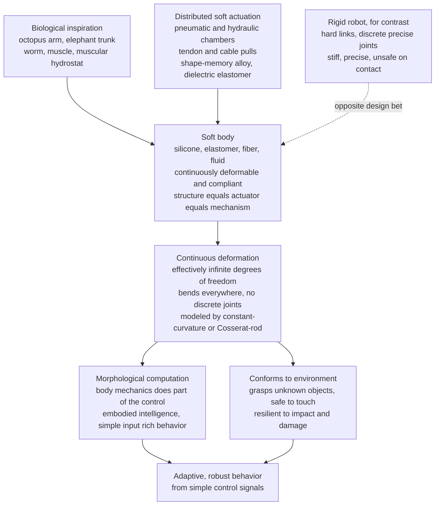

# 🐙 Soft Robotics and Bioinspired Design

> [!abstract] TL;DR
> Almost every robot ever built is a **skeleton** — rigid links joined at a handful of precise, motorized joints — because rigidity is what makes motion *predictable* and easy to compute. **Soft robotics takes the opposite bet.** It builds machines out of **compliant, deformable materials** — silicone, elastomers, fabrics, fibers, and fluids — bodies that **bend everywhere at once** rather than at discrete hinges. The inspiration is biology, which never evolved a rigid steel arm: an **octopus** has no bones yet squeezes through a gap the size of its eyeball and grips a jar; an **elephant trunk**, a **worm**, a **muscle** all move through *continuous* deformation. Soft robots are actuated by **inflating pneumatic chambers (PneuNets), pulling tendons, heating shape-memory alloys, or charging dielectric elastomers ("artificial muscles")**, and their bodies deform continuously — mathematically an **effectively infinite number of degrees of freedom**, described not by joint angles but by **continuum mechanics** (piecewise-constant-curvature and Cosserat-rod models). In exchange for the engineer's beloved **precision**, they buy three things biology perfected: **compliance** (they are inherently **safe to touch** and conform to whatever they grasp), **resilience** (they absorb impacts and survive damage that would shatter a rigid link), and **morphological computation** (the body's own mechanics does part of the "control," offloading intelligence into the material — *embodied intelligence*). The costs are equally sharp: infinite-DOF bodies are **hard to model and control precisely**, **sensing their own deformation** is difficult, forces are **modest and slow**, and elastomers **fatigue**. This note is the frontier where robotics meets **biology, biophysics, materials science, and complex-systems thinking**.

---

## Intuition

**Analogy — the octopus versus the steel arm.** Watch an octopus. It has no bones, no joints, no fixed skeleton — its arm is essentially a boneless muscular hydrostat — and yet it does things no industrial robot can: it **pours its whole body through a gap the size of its eyeball**, wraps around and grips a jar of any shape it has never encountered, changes the stiffness of its arm on demand, and swims by continuous rippling. It is a masterpiece of **soft, boneless dexterity**. Now picture the archetypal factory robot: a chain of hard steel links pivoting at a few precise joints. It can place a weld to a tenth of a millimetre a million times over — but drop a stray bolt in its path and it will crush it or crash, and let it touch a human at speed and someone gets hurt. It is **stiff, precise, and unforgiving**.

That contrast *is* the field. **Rigid robots** win at precision because their geometry is fixed and computable — you know exactly where every point is from a handful of joint angles. **Soft robots** throw that certainty away on purpose. By making the *whole body* out of rubber, fluid, and fiber that **deforms to its environment**, they gain the octopus's superpowers — **conforming, compliant, safe, resilient, adaptive** — at the price of the very predictability that made rigid robots easy. Where a rigid arm computes a grasp, a soft gripper simply **wraps and molds itself around the object**, letting the material's own physics figure out the contact. The bet of soft robotics is that for a huge class of tasks — handling delicate or unknown objects, working alongside people, squeezing through rubble, wearing on a human limb — **compliance beats precision**, and the body itself can be made to do part of the thinking.

---

## How It Works

### Core Mechanics

1. **The design inversion: material as mechanism.** A rigid robot separates *structure* (stiff links) from *actuation* (motors at joints) from *control* (a computer). A soft robot **fuses them**. The body is a continuous elastic medium (silicone/elastomer, often fiber-reinforced), and it *is* the mechanism: where you put stiff fibers, soft chambers, and pull points determines how it moves. Behavior is designed into **geometry and material** as much as into code.

2. **Soft actuation — how you make rubber move.** Because there are no motors-at-joints, force is generated in distributed, "muscle-like" ways:
   - **Fluidic (pneumatic / hydraulic).** Embedded chambers are pressurized; asymmetric wall stiffness (thick on one face, an inextensible strain-limiting layer on the other) converts uniform pressure into **bending**. The canonical design is the **PneuNet** (pneumatic network) — a strip of accordion chambers that curls when inflated. Fast, high-power, but needs a compressor and valves.
   - **Tendon / cable-driven.** Cables routed through a continuous elastic backbone are pulled from the base (motors kept off-body); pulling one side bends the backbone. This is how most **continuum robots** and robotic "trunks" and steerable catheters work.
   - **Shape-memory alloy (SMA).** Nitinol wires *contract* when heated by an electric current (they "remember" a shorter phase). Silent and muscle-like but slow (limited by cooling) and low-efficiency.
   - **Dielectric elastomer actuators (DEAs) — "artificial muscles."** A soft elastomer film sandwiched between compliant electrodes; a high voltage squeezes it thinner and it **expands in area**. Fast and efficient, but needs kilovolts. Related electroactive polymers and ionic actuators round out the "artificial muscle" family.

3. **Continuous deformation, not discrete joints.** A rigid arm's shape is fixed by *n* joint angles — a finite configuration space. A soft body bends *everywhere along its length*, so describing its shape is, in principle, describing a **continuous curve** — **effectively infinite degrees of freedom**. This is the defining mathematical fact of the field and the source of both its power and its difficulty.

4. **Modeling the infinite-DOF body.** Two workhorse abstractions tame the continuum:
   - **Piecewise-Constant-Curvature (PCC).** Approximate the soft arm as a chain of **circular arcs**, each with a single curvature $\kappa$ (and possibly torsion). Actuation (pressures, tendon pulls) maps to per-segment curvature; integrating the curvature gives the smooth backbone shape. Cheap, elegant, and the standard first model — assumes negligible gravity/load bending within a segment.
   - **Cosserat rod theory.** The full **continuum-mechanics** treatment: the backbone is an elastic rod with position *and* orientation at every arc-length point, obeying differential equations that balance internal elastic bending/twisting/shear against external loads and actuation. Accurate under gravity and contact, but a boundary-value problem you must solve numerically.
   - Beyond slender arms, arbitrary soft shells and volumes need **finite-element (FEM)** elasticity or mass-spring lumped models.

5. **Compliance and inherent safety.** A rigid joint is (ideally) infinitely stiff — hit something and force spikes instantly. A soft body has **low mechanical impedance**: touch an obstacle and it *deforms*, spreading and limiting the contact force automatically. This makes soft robots **intrinsically safe for human contact** and gentle on fragile objects — safety is a *material property*, not something a controller must compute in time.

6. **Conforming and resilience.** The same compliance lets a soft body **passively conform** to unknown objects and terrain — a soft gripper wraps around a tomato, an egg, or an irregular part with no model of its shape — and lets it **survive damage**: elastomer bodies absorb impacts, and a squashed or partly torn soft robot often keeps functioning where a bent rigid link is scrap.

7. **Morphological computation — the body as computer.** The deepest idea. Because the material's own mechanics *automatically* produces useful, complex, adaptive responses (a soft finger conforms; a passive elastic leg rebounds; an elastic swimmer sheds vortices), the **body offloads work the controller would otherwise have to do**. Control is *outsourced to physics* — the morphology and material "compute" part of the behavior. This is **embodied intelligence**: intelligence distributed into the body, not concentrated in a brain, so that a very *simple* control signal (one inflate command) yields a rich, adaptive action (a full conforming grasp).

8. **The unavoidable trade.** All of this is bought by surrendering **precision**. Infinite-DOF bodies resist exact forward/inverse models, deform under their own weight and payload, are hard to sense, produce modest and often slow forces, and drift as materials fatigue. Soft robotics is the disciplined art of deciding *when that trade is worth it*.

### Flow / Architecture



---

## Key Concepts

### 🟢 Secondary — the plain-language picture

- **Two kinds of robots.** Most robots are like **skeletons**: hard bones, a few stiff joints, very precise. Soft robots are like **octopus arms or elephant trunks**: bendy rubber all over, no bones, and they squish to fit whatever they touch.
- **Why bother being soft?** Three wins. They are **safe** — a rubber arm that bumps you just squishes, it can't crush you. They **grab anything** — a soft hand wraps around an egg, a ball, or a weird-shaped toy without needing to know its exact shape. They are **tough** — drop them, squash them, they bounce back where a metal arm would snap.
- **How do you move rubber?** You **pump air into hidden pockets** so it puffs up and curls (like a party-favor whistle uncoiling), or you **pull hidden strings**, or you use special wires that **shrink when they get warm**. There's no motor at an elbow — the whole body bends.
- **The clever trick — let the body do the thinking.** A soft hand doesn't need a computer to figure out *exactly* how to hold a strawberry. You just tell it "close," and the **rubber automatically molds around the fruit**. The body's own squishiness does part of the job for free.
- **The catch.** Because a soft robot bends *everywhere*, it's **hard to know exactly where its tip is**, it can't push very hard, and it wears out like an old rubber band. Precision is the price of softness.

### 🟡 Undergraduate — the working machinery

- **Infinite degrees of freedom.** A rigid arm has a shape set by *n* joint angles. A soft/continuum arm bends continuously, so its shape is a whole **curve** — formally infinite-dimensional. Every model is a scheme for compressing that curve into a few numbers.
- **Piecewise-Constant-Curvature (PCC).** The standard reduced model: chop the backbone into segments of constant curvature $\kappa_i$ (each a circular arc). The forward map "actuation $\to$ curvature $\to$ Cartesian shape" is: $\theta(s)=\theta_0+\int_0^s \kappa\,ds'$, then $\big(x(s),y(s)\big)=\big(\int\cos\theta\,ds,\int\sin\theta\,ds\big)$. Inverse kinematics maps a target tip pose back to segment curvatures. Elegant, but assumes each segment truly bends into a constant-curvature arc (breaks under gravity/load).
- **Actuator physics in one line each.** *Fluidic*: bending $\propto$ pressure via wall-stiffness asymmetry + strain-limiting layer (PneuNet). *Tendon*: curvature $\propto$ cable tension / offset from neutral axis. *SMA*: strain from martensite→austenite phase change on heating. *DEA*: Maxwell stress $\sigma \propto \varepsilon_r\varepsilon_0 (V/t)^2$ squeezes the film thinner and wider.
- **Compliance = low impedance.** Model a soft contact as a spring: force $F=k\,\delta$ with a **small** stiffness $k$. Small $k$ means a given intrusion $\delta$ produces small force — automatic force limiting, the mathematical root of intrinsic safety and conforming grasping.
- **Underactuation on purpose.** A soft/underactuated gripper has *fewer* control inputs than shape DOFs. Squeezing an object, the extra DOFs **passively distribute** to fit the object's contour — the mechanism, not the controller, solves the grasp geometry.
- **Morphological computation, concretely.** If passive body dynamics already produce a useful mapping from input to behavior (a conforming curl, an elastic bounce, a self-stabilizing gait), the controller need only *nudge* it. The body implements a chunk of the input→output function in hardware.
- **Bioinspiration as engineering, not decoration.** Muscular hydrostats (octopus arm, tongue, trunk) keep constant volume, so squeezing in one direction elongates another — a real design principle borrowed into fiber-constrained soft actuators. Worm **peristalsis** and snake **anisotropic friction** are directly copied for soft locomotion.

### 🔴 Graduate — the frontier machinery

- **Cosserat-rod / geometrically-exact models.** The rigorous continuum model: the backbone is a curve of frames $g(s)\in SE(3)$; internal wrench balances applied load and actuation via the Cosserat equilibrium ODEs, with a constitutive law relating strain (bending, torsion, shear, extension) to internal stress. Solving is a **boundary-value problem** (shooting/collocation); it captures gravity, tip loads, and contact that PCC cannot. Discretized variants (Piecewise-Constant-Strain, Geometric Variable-Strain) trade fidelity for speed.
- **The control problem.** Infinite-DOF, nonlinear, viscoelastic (hysteresis, creep, rate-dependence), and hard to sense. Approaches: (i) **model-based** on PCC/Cosserat with Jacobian/inverse-kinematics control; (ii) **model-free / data-driven** — learn the actuation→shape map with neural nets or Gaussian processes and do learning-based or **model-predictive control**; (iii) **reduced-order / Koopman** operator methods. Precision remains far below rigid robots.
- **Proprioception is unsolved-ish.** A soft body has no encoders. Estimating its own deforming shape needs **embedded soft sensors** — liquid-metal/conductive-elastomer strain gauges, capacitive/optical (stretchable fiber-Bragg) sensors, magnetic and pneumatic self-sensing — all of which are themselves soft, hysteretic, and drift-prone. Sensor-body co-design is an open frontier.
- **Variable stiffness / stiffness modulation.** Real animals stiffen and soften on demand. Engineered analogues: **granular / layer jamming** (a membrane of grains or sheets goes rigid under vacuum — the basis of the **universal jamming gripper**), phase-change (low-melting alloys, thermoplastics), and antagonistic pressurization. Lets one body switch between compliant-safe and stiff-precise.
- **Morphological computation, formalized.** Framed via reservoir computing (the soft body as a physical **reservoir** whose rich nonlinear dynamics a trivial linear readout can exploit) and embodiment theory (Pfeifer): quantify how much of the input–output mapping is realized by body mechanics versus neural control. Design goal: **maximize** the useful computation delegated to morphology.
- **Fabrication as a bottleneck.** Multi-material **3D/4D printing**, soft lithography (molding silicone around sacrificial cores), fiber-embedding, and shape-morphing prints define what geometries — and thus what behaviors — are even buildable. The field is fabrication-limited as much as theory-limited.
- **Biohybrid and living-material frontier.** Actuation by *real* muscle: **biohybrid robots** driven by cultured cardiac or skeletal muscle cells on soft scaffolds (e.g. a stingray-like swimmer, muscle-powered walkers), plus stimuli-responsive gels, self-healing elastomers, and living materials — blurring the line between machine and organism and linking soft robotics back to **cell mechanics** and **molecular motors**.

---

## Python Demo

Two experiments make the central claim — *continuous deformation instead of discrete joints, and material that conforms* — tangible.

**(a) Piecewise-Constant-Curvature continuum arm vs a rigid-link arm.** We drive a soft arm by specifying a **curvature per segment** (the stand-in for pressures/tendon pulls), integrate the curvature into a **smooth, continuously-bending backbone**, and plot several actuations reaching toward targets — a gentle C, a hard C, and an **S-shape** (opposite curvatures) impossible for a short rigid arm. Beside them we draw a **3-link rigid arm** reaching a similar point through **sharp angular joints**, so the difference between *bending everywhere* and *pivoting at hinges* is visible at a glance.

**(b) A soft gripper conforming around an object.** We model each soft finger as an **inextensible chain of nodes** with an **actuated rest curl** (the "muscle" pulling it closed) plus a **non-penetration constraint** against a circular object. Relaxing these constraints, the finger deforms from its free curl to **drape and conform onto the object's surface** — two fingers together forming a compliant, shape-matching grasp that needs no model of the object. We plot the free (unobstructed) curl dashed and the conformed shape solid to expose the deformation.

```python
# Soft robotics: (a) a piecewise-constant-curvature continuum arm vs a rigid arm,
#                (b) a soft two-finger gripper conforming around an object.
# Only numpy + matplotlib.
import numpy as np
import matplotlib.pyplot as plt

# =====================================================================
# (a) PIECEWISE-CONSTANT-CURVATURE (PCC) continuum arm
#     actuation -> per-segment curvature -> smooth continuous backbone
# =====================================================================
def pcc_backbone(kappas, seg_len, n_per=40, base=(0.0, 0.0), theta0=np.pi/2):
    """Integrate piecewise-constant curvature into a smooth planar backbone.
    kappas : list of per-segment curvatures (1/m); each segment is a circular arc.
    Returns an (M,2) array of points along the continuously-bending centerline."""
    pts = [np.array(base, float)]
    theta = theta0                      # initial tangent direction
    ds = seg_len / n_per                # arc-length step
    for k in kappas:
        for _ in range(n_per):
            theta += k * ds             # curvature integrates to tangent angle
            pts.append(pts[-1] + ds * np.array([np.cos(theta), np.sin(theta)]))
    return np.array(pts)

def rigid_arm(link_len, joint_angles, base=(0.0, 0.0)):
    """A rigid N-link planar arm: straight links meeting at discrete angular joints."""
    pts = [np.array(base, float)]
    theta = 0.0
    for a in joint_angles:
        theta += a                      # each joint adds a discrete angle
        pts.append(pts[-1] + link_len * np.array([np.cos(theta), np.sin(theta)]))
    return np.array(pts)

SEG = 0.5                                # 3 segments of length 0.5 -> total length 1.5
actuations = {
    "gentle C  (k=0.4)":      [0.4, 0.4, 0.4],
    "strong C  (k=1.6)":      [1.6, 1.6, 1.6],
    "S-shape  (k=+2,0,-2)":   [2.0, 0.0, -2.0],
    "reach right (k=-1.2)":   [-1.2, -1.2, -1.2],
}

# =====================================================================
# (b) SOFT GRIPPER: fingers with an actuated curl that CONFORM to a circle
# =====================================================================
def conform_finger(kappa, seg_len, N, base, theta0, center, R,
                   iters=600, elastic=0.12):
    """Inextensible node-chain finger with an actuated rest-curl `kappa` that
    deforms to drape onto (conform around) a circular object of radius R.
    Constraint relaxation: elastic pull to rest shape + non-penetration + inextensibility."""
    template = pcc_backbone([kappa], seg_len*(N-1), n_per=N-1,
                            base=base, theta0=theta0)   # free actuated curl (N nodes)
    nodes = template.copy()
    c = np.asarray(center, float)
    for _ in range(iters):
        nodes += elastic * (template - nodes)                 # elastic memory of the curl
        for i in range(len(nodes)):                           # non-penetration with object
            d = nodes[i] - c
            dist = np.hypot(*d)
            if dist < R:
                nodes[i] = c + (R + 1e-3) * d / (dist + 1e-12)
        nodes[0] = template[0]                                # anchor the base
        for i in range(1, len(nodes)):                        # inextensibility (Gauss-Seidel)
            d = nodes[i] - nodes[i-1]
            L = np.hypot(*d)
            if L > 1e-12:
                nodes[i] = nodes[i-1] + seg_len * d / L
    return template, nodes

N_NODE, SEG_F, R = 34, 0.055, 0.35
obj = (0.0, 0.0)
# two fingers approaching from the left, curling to pinch the object symmetrically
tplA, fingA = conform_finger(+2.7, SEG_F, N_NODE, base=(-0.95,  0.60),
                             theta0=-0.35, center=obj, R=R)
tplB, fingB = conform_finger(-2.7, SEG_F, N_NODE, base=(-0.95, -0.60),
                             theta0=+0.35, center=obj, R=R)

all_nodes = np.vstack([fingA, fingB])
pen = max(0.0, R - min(np.hypot(*(p - np.asarray(obj))) for p in all_nodes))
print(f"(a) S-shape tip = {pcc_backbone(actuations['S-shape  (k=+2,0,-2)'], SEG)[-1]}")
print(f"(b) conformed fingers: max object penetration = {pen:.4f} m (~0 = conforming)")

# ------------------------------- Plots -------------------------------
fig, ax = plt.subplots(1, 2, figsize=(14, 6.6))

# (a) continuum arm (smooth) vs rigid arm (angular)
cmap = plt.cm.viridis(np.linspace(0.15, 0.85, len(actuations)))
for (label, ks), col in zip(actuations.items(), cmap):
    bb = pcc_backbone(ks, SEG)
    ax[0].plot(bb[:, 0], bb[:, 1], lw=3, color=col, label=f"soft: {label}")
    ax[0].plot(bb[-1, 0], bb[-1, 1], 'o', color=col, ms=7)
rig = rigid_arm(SEG, [np.radians(75), np.radians(-55), np.radians(45)])
ax[0].plot(rig[:, 0], rig[:, 1], '-', color='0.35', lw=2.5, marker='s', ms=9,
           label="rigid 3-link arm (angular joints)")
ax[0].plot(0, 0, 'k^', ms=13, label="base")
ax[0].set(title="(a) Soft continuum arm bends EVERYWHERE (smooth curvature)\n"
                "rigid arm pivots at a few DISCRETE joints",
          xlabel="x (m)", ylabel="y (m)")
ax[0].axis('equal'); ax[0].grid(alpha=.3); ax[0].legend(loc='upper left', fontsize=8)

# (b) soft gripper conforming around the object
theta = np.linspace(0, 2*np.pi, 200)
ax[1].fill(obj[0] + R*np.cos(theta), obj[1] + R*np.sin(theta),
           color='#f4a259', alpha=.85, zorder=1, label="object")
for tpl, fing, cc in [(tplA, fingA, '#1f77b4'), (tplB, fingB, '#d62728')]:
    ax[1].plot(tpl[:, 0], tpl[:, 1], '--', color=cc, lw=1.6, alpha=.7,
               label="free actuated curl (no object)")
    ax[1].plot(fing[:, 0], fing[:, 1], '-', color=cc, lw=4, solid_capstyle='round',
               label="conformed soft finger")
    ax[1].plot(fing[0, 0], fing[0, 1], 's', color=cc, ms=9)
ax[1].set(title="(b) Soft gripper CONFORMS around an object\n"
                "same actuation, body deforms to hug the surface",
          xlabel="x (m)", ylabel="y (m)")
ax[1].axis('equal'); ax[1].grid(alpha=.3)
handles, labels = ax[1].get_legend_handles_labels()   # de-duplicate legend
seen = dict(zip(labels, handles))
ax[1].legend(seen.values(), seen.keys(), loc='lower right', fontsize=8)

plt.tight_layout(); plt.show()
```

**What the two panels show.** **(a)** Each soft-arm curve is one *continuous bend* produced by a curvature command — no vertices, no hinges — and the **S-shape** (curving one way then the other) is a configuration a short rigid arm simply cannot form; beside them the **rigid 3-link arm** reaches through unmistakable **angular corners**. That visual difference — *smooth curvature everywhere* versus *rotation at discrete joints* — is the whole geometric story of soft robotics, and the reason its shape lives in an effectively infinite-dimensional space that PCC compresses into a few curvatures. **(b)** Two soft fingers begin as free curls (dashed) that would pass straight through the object; enforcing only *inextensibility* and *non-penetration*, their bodies **deform to drape onto the object's surface** (solid), producing a compliant, shape-matching pinch with **no model of the object's geometry** — the material's physics computes the grasp. This is morphological computation and conforming compliance in a dozen lines: the same "close" command yields a grasp automatically fitted to whatever shape it meets.

---

## Real-World Applications

- **Delicate and food-handling grasping.** Fin-ray-effect and pneumatic soft grippers (Soft Robotics Inc., Festo) pick fragile, irregular, or variable items — ripe fruit, pastries, live seafood, e-commerce miscellany — that would bruise or slip in a rigid gripper, precisely because the fingers **conform** and self-limit force. Related to the vault's *Robotic Manipulation and Grasping*, but replacing exact grasp planning with material compliance.
- **The universal jamming gripper.** A balloon of coffee-grounds-like granules pressed onto an object then **vacuum-jammed** rigid, grasping arbitrary shapes with one air line — the textbook demonstration of variable stiffness and morphological grasping.
- **Minimally invasive surgery and medical robots.** Tendon-driven **continuum robots** and steerable catheters (e.g. concentric-tube and multi-backbone systems) snake through vasculature and body lumens; their inherent compliance is **safer against delicate tissue** than rigid tools. Soft actuators also drive assistive and rehabilitation devices.
- **Wearables and exosuits.** Soft, fabric-based **exosuits** (Harvard Wyss) apply assistive forces to human joints through textile and pneumatic actuators — lightweight and compliant enough to be worn, directly leveraging inherent safety in shared human contact (the domain of *Human-Robot Interaction and Safety*).
- **Search, rescue, and confined-space robots.** Vine/growing robots that **eversion-grow** from their tip and worm-like peristaltic crawlers thread through rubble and pipes where rigid *Legged and Mobile Robot Locomotion* platforms cannot fit — soft bodies squeeze and conform to unknown terrain.
- **Bioinspired locomotion and swimmers.** Soft fish and octopus robots (Laschi's octopus arm; MIT's SoFi soft robotic fish; biohybrid stingray) swim by continuous body deformation, quieter and gentler around marine life — soft *Actuators, Sensors, and Embedded Robotics* in action.
- **Adaptive industrial fixturing and human-safe cobots.** Compliant end-effectors and soft skins let collaborative robots absorb unexpected contact, a materials-level contribution to the safety story that *The Reach and Future of Robotics and Control* argues will define human-adjacent machines.

---

## Common Pitfalls

- **Assuming you can model/control it like a rigid arm.** A soft body has **effectively infinite DOF** and nonlinear, viscoelastic behavior (hysteresis, creep, rate-dependence). PCC is only a coarse approximation and *breaks under gravity, payload, and contact*; expecting rigid-robot-level forward/inverse kinematics leads to large tip errors. Use Cosserat/FEM or data-driven models, and design tasks that tolerate imprecision.
- **Forgetting that you can't see your own shape (sensing deformation).** With no joint encoders, the robot often **does not know its own configuration**. Embedded soft strain/curvature sensors are themselves hysteretic, drift-prone, and hard to fabricate; poor proprioception silently degrades every controller built on top. Budget for sensing from the start.
- **Expecting strong, fast, precise motion.** Soft actuators are typically **low-force, slow (SMA cooling, pneumatic fill times), and low-bandwidth**, and elastomers deform under load. Do not spec a soft robot for a high-force, high-speed, tight-tolerance task — that is exactly where rigid robots win.
- **Ignoring material fatigue and lifetime.** Elastomers and pneumatic chambers **crack, creep, delaminate, and tear** after repeated cycling; SMA wires degrade; strain-limiting layers debond. A soft robot that works in the lab may fail after thousands of cycles. Design for fatigue (see the vault's *fatigue and failure* materials note), pressure limits, and easy replacement.
- **Fabrication reproducibility.** Molded/printed silicone is sensitive to mixing ratio, cure, trapped bubbles, and bonding; two "identical" actuators can behave differently, so a model tuned to one unit may not transfer. Control **fabrication tolerances** and calibrate per-unit, or use closed-loop control robust to variation.
- **Precision loss and drift under load and repetition.** Even a well-modeled soft arm **sags, drifts, and hysteretically lags** as it bends under gravity and its own history. Open-loop actuation-to-shape maps degrade over time; without feedback, accuracy erodes.
- **Treating morphological computation as magic.** Offloading control to the body only works if the morphology is *designed* to produce the desired mapping. Bolting a soft skin onto a bad design does not conjure embodied intelligence — the body's mechanics must be co-designed with the task.

---

## Related Concepts

This note sits in the **Systems, Humans, and Frontiers** arc of the robotics vault and is the compliant counterpoint to the field's rigid mainstream. It rests on *Robot Dynamics and Equations of Motion* and *Forward/Inverse Kinematics* — but replaces their finite joint-angle configuration space with a continuous, infinite-DOF one; its conforming grippers reframe *Robotic Manipulation and Grasping* around material compliance instead of exact grasp planning; its inherent safety is the hardware side of *Human-Robot Interaction and Safety*; its worm/vine/octopus crawlers extend *Legged and Mobile Robot Locomotion*; its air chambers, tendons, SMA, and soft sensors are the soft wing of *Actuators, Sensors, and Embedded Robotics*; and its blurring of machine and organism is a headline theme of *The Reach and Future of Robotics and Control*. (Those five siblings are prose-only — they are not yet written as notes.)

- [[Robot_Dynamics_and_Equations_of_Motion]] — the rigid-body manipulator equation soft robotics *replaces* with continuum mechanics; the contrast defines the field.
- [[Forward_Kinematics]] — finite joint-angle → pose maps; PCC is the soft analogue, curvature → smooth backbone.
- [[Inverse_Kinematics]] — mapping a target pose back to actuation; for soft arms it becomes an ill-posed infinite-DOF problem.
- [[Configuration_Space_and_Motion_Planning]] — a soft body's configuration space is infinite-dimensional, breaking classical C-space planning.
- [[Nonlinear_Control_and_Lyapunov_Stability]] — the nonlinear, model-uncertain control tools soft robots need; compliance also aids stability guarantees.
- [[Biomechanics_of_Movement]] — the biophysics of muscle, tendon, and animal motion that soft robotics reverse-engineers.
- [[Molecular_Motors_and_Mechanochemistry]] — biological actuation (muscle, motor proteins) that "artificial muscles" and biohybrid actuators imitate.
- [[The_Cytoskeleton_and_Cell_Mechanics]] — how living cells generate and bear force through soft, active materials — the microscale template.
- [[The_Musculoskeletal_System]] — the biological muscle-and-bone system whose *boneless* alternatives (hydrostats) inspire soft designs.
- [[Morphogenesis_and_Pattern_Formation]] — how bodies self-shape in biology, informing soft/4D-printed morphing structures.
- [[Natural_Selection_and_Adaptation]] — evolution's long optimization of soft, compliant bodies that engineers now borrow.
- [[Polymer_Mechanics_and_Viscoelasticity]] — the constitutive mechanics (hysteresis, creep) of the elastomers soft robots are made of.
- [[Stress_Strain_and_Elastic_Moduli]] — the elasticity fundamentals behind bending, compliance, and the strain-limiting layer trick.
- [[Composite_Materials_and_Fiber_Reinforcement]] — fiber-reinforced actuators steer soft deformation into useful bending/twisting.
- [[Dielectrics_Piezoelectrics_and_Ferroelectrics]] — the physics of dielectric-elastomer "artificial muscle" actuators.
- [[Biomaterials_and_Biocompatibility]] — material requirements for medical, wearable, and biohybrid soft robots.
- [[Fatigue_Creep_and_High_Temperature_Failure]] — why soft-robot elastomers and chambers degrade over cycles (a core pitfall).
- [[Emergence_and_Self_Organization]] — morphological computation as behavior *emerging* from body–environment coupling.
- [[Complex_Adaptive_Systems]] — embodied intelligence as a body-plus-controller-plus-environment adaptive system.
- [[Cybernetics_and_Control]] — the embodiment/feedback tradition that frames body-as-controller.
- [[Oscillations_and_SHM]] — the mass-spring elasticity underlying lumped soft-body and conforming-contact models.
- [[Microfluidics_and_Biological_Flows]] — the fluid mechanics of pneumatic/hydraulic soft actuation and soft fluidic circuits.

---

## Review Questions

### 🟢 Secondary
1. Using the octopus-versus-steel-arm picture, give three things a soft robot can do that a rigid factory robot cannot, and name the one big thing the rigid robot does *better*.
2. Name two different ways to make a soft robot move (without using a motor at a joint), and explain in one sentence each how they work.

### 🟡 Undergraduate
3. Explain what "effectively infinite degrees of freedom" means for a soft continuum arm and how the **piecewise-constant-curvature** model tames it into a few numbers. Why does the S-shape in the demo reveal something a rigid arm cannot do?
4. Define **morphological computation** and connect it to the demo's conforming gripper: what part of the "grasp" is done by the controller, and what part by the material?
5. Why is a soft robot **inherently safe** for human contact? Frame the answer in terms of mechanical impedance / contact stiffness, and explain why this safety is *not* something the controller has to compute in time.

### 🔴 Graduate
6. Contrast the **PCC** and **Cosserat-rod** models: what does each assume, what does each capture, and in what situation (gravity, payload, contact) does PCC fail while Cosserat succeeds?
7. Soft-robot **proprioception** is a major open problem. Explain why, describe two embedded soft-sensing modalities, and discuss how poor shape sensing limits both model-based and data-driven control.
8. You must choose between a soft and a rigid robot for a task. List the quantitative axes on which soft robots lose (force, speed, bandwidth, precision, fatigue life) and the axes on which they win (safety, conformability, resilience), and describe a task where **variable stiffness** (e.g. jamming) lets one machine capture both regimes.

---

## Sources

- Rus, D. & Tolley, M. T. — "Design, fabrication and control of soft robots," *Nature* **521**, 467–475 (2015) — the field-defining review of soft-robot materials, actuation, and control.
- Trivedi, D., Rahn, C. D., Kier, W. M. & Walker, I. D. — "Soft robotics: Biological inspiration, state of the art, and future research," *Applied Bionics and Biomechanics* **5**(3), 99–117 (2008) — bioinspiration and continuum modeling foundations.
- Laschi, C., Mazzolai, B. & Cianchetti, M. — "Soft robotics: Technologies and systems pushing the boundaries of robot abilities," *Science Robotics* **1**(1), eaah3690 (2016); and Laschi et al. octopus-inspired continuum arm work.
- Pfeifer, R. & Bongard, J. — *How the Body Shapes the Way We Think: A New View of Intelligence* (MIT Press, 2006) — the definitive treatment of embodiment and morphological computation.
- Brown, E. et al. — "Universal robotic gripper based on the jamming of granular material," *PNAS* **107**(44), 18809–18814 (2010) — jamming and morphological grasping.

---

#robotics #soft-robotics #bioinspired #compliance #morphological-computation
