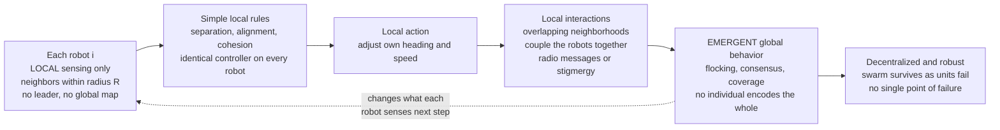

# 🐜 Swarm and Multi-Robot Systems

> [!abstract] TL;DR
> Instead of one expensive, complex robot, deploy **many simpler ones** and let coordination *emerge*. There are two ends of a spectrum. **Multi-robot systems** are teams — often heterogeneous, sometimes with a coordinator — that cooperate on explicit problems: **task allocation** (who does what), **formation control**, **coverage**, and **distributed exploration / SLAM**. **Swarm robotics** pushes to the biological extreme: **large numbers of cheap, near-identical, decentralized robots** with only **local sensing and communication**, inspired by ant colonies and bird flocks. The magic is **emergence** — a coherent global behavior (flocking, consensus, aggregation, collective transport) arises from **simple local rules** that no individual robot understands or controls. This buys three prized properties: **robustness** (no single point of failure — the swarm survives as individuals die), **scalability** (the same rules run for 10 or 10,000), and **flexibility**. The catch is the **inverse problem**: designing local rules that reliably produce a *desired* global behavior is hard, and **verifying** emergent behavior is harder still.

---

## Intuition

**Analogy — the colony that has no architect.** A single ant is nearly helpless: it has a pinhead brain, poor eyesight, and no idea what the colony is doing. Yet a colony of the same ants builds living bridges out of its own bodies to span gaps, farms fungus in climate-controlled chambers, forages along optimized trails, and wages coordinated war — with **no leader, no blueprint, and no ant that comprehends the whole**. Each ant simply follows a few local rules ("follow the pheromone gradient," "if you bump a gap, latch on"). The intelligence is not *in* any ant; it is a property of **millions of tiny local interactions** aggregated over the colony.

Swarm robotics chases exactly that magic. Rather than engineering one brilliant, brittle, million-dollar robot, you deploy **hundreds of cheap, dumb, interchangeable ones** that each sense only their immediate neighbors and follow the same simple rules. From those purely **local** interactions — no central controller, no global map — a useful **global** behavior falls out: a flock that moves as one, a team that spreads to cover an area, a group that agrees on a common heading, a cluster that hauls an object too heavy for any single unit. And because the behavior lives in the *collective* rather than any individual, the swarm **degrades gracefully**: shoot down a third of the drones and the flock reforms and flies on. That trade — giving up the power and legibility of one smart machine to gain the robustness and scale of a mindless multitude — is the whole subject.

---

## How It Works

### Core mechanics

The design pattern is the same whether you have 5 cooperating robots or 5,000 swarming ones — only the scale, homogeneity, and degree of decentralization change.

1. **Local sensing.** Each robot perceives only its **neighborhood** — other robots within a communication or sensing radius $R$, plus nearby obstacles and the local environment. There is no global map and, in a true swarm, no robot has a unique identity or a bird's-eye view.
2. **Simple local rules.** Every robot runs the **same** small controller mapping *what it senses* to *what it does*. The canonical example is Reynolds' **boids**: three steering rules using only nearby neighbors — **separation** (avoid crowding), **alignment** (match neighbors' heading), **cohesion** (steer toward the local center of mass).
3. **Local interaction.** Because neighborhoods overlap, each robot's action changes what its neighbors sense, which changes *their* actions. This coupling — mediated either by **explicit communication** (radio messages) or by **stigmergy** (leaving marks in the environment, like pheromone trails, that others read later) — is what stitches individuals into a system.
4. **Emergent global behavior.** Iterated across the population, these local interactions produce a coherent, system-level pattern — a flock, a formation, a consensus heading, a dispersed sensing lattice — that is **not explicitly programmed anywhere** and that no single robot represents.
5. **Decentralized coordination.** Nobody is in charge. Coordination is distributed across the whole population, which is why the swarm has **no single point of failure**: remove any robot (even many) and the rules keep producing the behavior with the survivors.

**Multi-robot vs swarm — the spectrum.** *Multi-robot systems* often keep a few robots, allow heterogeneity and roles, and may use a coordinator or explicit negotiation (auction-based **task allocation**, leader-follower **formation control**, partitioned **coverage**, merged **distributed SLAM** maps). *Swarm robotics* pushes to the other extreme: many homogeneous units, strictly local information, fully decentralized, valuing **robustness, scalability, and flexibility** above optimality. Real deployments live somewhere on this line.

**The inverse problem (the hard part).** The *forward* direction is easy — pick local rules, simulate, watch what emerges. The direction engineers actually want is the *inverse*: **given a desired global behavior, what local rules produce it?** There is no general recipe. Because emergence is nonlinear and history-dependent, small rule changes can flip the collective outcome, and behaviors that were never intended (deadlocks, oscillations, fragmentation) can appear. This is why swarm engineering leans on biological inspiration, evolutionary/learning search, and heavy simulation.

### Flow / architecture



---

## Key Concepts

### 🟢 Secondary — the plain-language picture

- **Many simple beats one complex.** The core bet of swarm robotics: hundreds of cheap, dumb, identical robots can do things one expensive smart robot cannot — chiefly *survive damage* and *scale up*.
- **Local rules, global behavior.** Each robot follows a few rules based only on what is nearby. The impressive group behavior — a flock, a formation — is **emergent**: it appears from the interactions, not from any master plan.
- **No boss.** Coordination is **decentralized**. There is no leader whose loss stops the swarm; that is exactly why swarms are so robust.
- **Flocking in three rules.** Bird-like flocking needs only: don't crowd your neighbors (**separation**), point the way they point (**alignment**), and drift toward their center (**cohesion**).
- **The trade.** You give up the raw capability and predictability of one clever machine to gain robustness, scale, and flexibility from the crowd.

### 🟡 Undergraduate — the working machinery

- **Reynolds' boids (1987).** The founding model. Each agent computes three steering vectors from neighbors within a radius, blends them with weights, and caps its speed. From random starts, a **coherent flock self-organizes** — the classic demonstration that flocking is a local, distributed behavior.
- **Consensus / agreement.** Robots on a **communication graph** repeatedly average their state with neighbors: $\dot{x}_i = \sum_{j \in \mathcal N_i}(x_j - x_i)$. All values converge to a common one — the **rendezvous** (agree on a meeting point) or **agreement on heading** behind flocking. Vectorized over the swarm this is $\dot{\mathbf x} = -L\mathbf x$, where $L$ is the graph **Laplacian**.
- **Formation control.** Instead of averaging to a single point, robots hold **desired relative offsets**, producing a rigid shape (line, wedge, grid) that translates and rotates as one — leader-follower, virtual-structure, or behavior-based variants.
- **Coverage / dispersion.** Robots spread to *maximize sensing area* rather than clump — repelling from each other and from covered regions, tiling a region (a **Voronoi**-style deployment) for monitoring or search.
- **Aggregation and foraging.** Aggregation (gather into a cluster, like cockroaches under shelter) and foraging (search, retrieve, return — often using **stigmergic** virtual pheromones) are staple swarm behaviors borrowed directly from social insects.
- **Explicit communication vs stigmergy.** Robots coordinate either by **sending messages** (explicit, bandwidth-limited, range-limited) or by **modifying the environment** so others read it later (**stigmergy** — indirect, robust, memory-in-the-world). Ant pheromone trails are the archetype.
- **Robustness, scalability, flexibility.** The three swarm virtues: **robustness** (graceful degradation, no single point of failure), **scalability** (behavior invariant to swarm size — same rules for 10 or 10,000), **flexibility** (one swarm re-tasked across problems).

### 🔴 Graduate — the theoretical and practical edges

- **Consensus and algebraic graph theory.** For $\dot{\mathbf x} = -L\mathbf x$ on a graph with Laplacian $L$, consensus is reached iff the graph is **connected**; the *rate* of convergence is set by the **algebraic connectivity** $\lambda_2$ (the second-smallest eigenvalue / **Fiedler value**). Directed graphs converge iff they contain a **spanning tree**. This links swarm coordination directly to spectral graph theory (Olfati-Saber, Fax, Murray). Discrete-time averaging with a doubly-stochastic weight matrix gives the same result.
- **Provable flocking.** Olfati-Saber's flocking framework derives boids-like behavior from a **collective potential** plus velocity consensus, and *proves* (via a Lyapunov/energy argument) that the flock stays cohesive, collision-free, and velocity-matched — turning Reynolds' heuristic into guaranteed behavior on the right assumptions.
- **The inverse / design problem, formally.** There is no general map from *desired global specification* to *local rules*. Practical routes: **behavior-based decomposition**, **evolutionary swarm robotics** (evolve controllers in simulation), **multi-agent reinforcement learning** (learn local policies whose emergent effect is rewarded), and **local-to-global proofs** for restricted rule classes. All fight the **reality gap** between simulation and hardware.
- **Task allocation.** Deciding who does what: **market/auction-based** methods (robots bid on tasks), **threshold-based** methods (insect-inspired response thresholds), and the **optimal assignment** problem (Hungarian algorithm) for the centralized case. Decentralizing it while staying near-optimal is an active area.
- **Self-stabilization and fault tolerance.** A well-designed swarm rule should be **self-stabilizing** — recover the target behavior from *any* perturbed state, including after failures — the continuous-domain cousin of the distributed-systems property. Byzantine (maliciously faulty) robots are a harder, newer threat.
- **Verification of emergent behavior.** The deepest open challenge: because the global behavior is not explicitly encoded, you cannot read the code to know it is safe. Approaches include **formal methods / model checking** on abstracted swarm models, **statistical / probabilistic verification**, and mean-field / **macroscopic** models (treat the swarm as a density field, PDE) — but scalable guarantees remain elusive.
- **Micro-macro modeling.** Two complementary lenses: **microscopic** (simulate every robot) and **macroscopic** (rate equations / Fokker-Planck for the population fractions). The macroscopic view predicts swarm-level dynamics cheaply and is central to *designing* and *analyzing* collective behavior.
- **Communication and coordination overhead.** More coordination needs more communication, which does *not* scale for free: bandwidth, interference, and latency grow with density. The art is achieving global coordination with **strictly local, bounded** communication — often the binding constraint on real swarms.

---

## Python Demo

We reproduce the founding result of the field: **flocking emerges from purely local rules**. We simulate `N = 120` agents on a periodic arena. Each agent senses **only neighbors within a radius $R$** and steers by Reynolds' three rules — **separation** (push off close neighbors), **alignment** (match neighbors' heading), **cohesion** (drift toward the neighbor center of mass) — with a capped turning rate and constant speed. From **random positions and random headings** (total disorder), a single coherent flock **self-organizes**. We quantify emergence with the **polarization order parameter** $\varphi = \lVert \frac{1}{N}\sum_i \hat{\mathbf v}_i \rVert$, which runs from $0$ (chaotic headings) to $1$ (perfect alignment). To show **robustness**, we rerun with **heterogeneous** robots (each with a different speed and perception radius) and confirm order still emerges despite the individual variation.

```python
# Boids flocking: coherent collective motion emerging from LOCAL rules only.
import numpy as np
import matplotlib.pyplot as plt

# ---- Global parameters ----
N      = 120        # number of simple agents (robots)
L      = 100.0      # square arena side, periodic (torus) boundaries
r_sep  = 3.0        # separation kicks in below this range
w_sep, w_ali, w_coh = 1.5, 1.0, 1.0   # rule weights
turn   = 0.35       # steering agility: how fast heading rotates toward desired
steps  = 300

def wrap_delta(d):
    """Minimum-image displacement on a torus of side L (nearest copy)."""
    return (d + L / 2) % L - L / 2

def simulate(seed, heterogeneous=False, snaps=()):
    """Run the swarm. Returns polarization over time and requested snapshots."""
    rng = np.random.default_rng(seed)
    pos = rng.uniform(0, L, (N, 2))                 # random positions
    ang = rng.uniform(0, 2 * np.pi, N)              # random headings -> disorder
    if heterogeneous:                                # individual variation
        v0 = rng.uniform(0.7, 1.3, N)               # different cruising speeds
        Ri = rng.uniform(6.0, 10.0, N)              # different perception radii
    else:
        v0 = np.full(N, 1.0)
        Ri = np.full(N, 8.0)
    vel = np.c_[np.cos(ang), np.sin(ang)] * v0[:, None]

    phis, frames = [], {}
    for t in range(steps):
        hd = vel / v0[:, None]                       # unit headings
        phis.append(np.linalg.norm(hd.mean(axis=0)))  # polarization order param
        if t in snaps:
            frames[t] = (pos.copy(), hd.copy())

        # pairwise displacements (j - i) with periodic boundaries
        diff = wrap_delta(pos[None, :, :] - pos[:, None, :])   # (N,N,2)
        dist = np.linalg.norm(diff, axis=2)                    # (N,N)
        np.fill_diagonal(dist, np.inf)                         # ignore self

        desired = hd.copy()
        for i in range(N):
            nb = dist[i] < Ri[i]                     # LOCAL neighbors only
            if not nb.any():
                continue
            coh = diff[i][nb].mean(axis=0)            # toward neighbor centroid
            ali = hd[nb].mean(axis=0)                 # average neighbor heading
            close = nb & (dist[i] < r_sep)
            sep = (-(diff[i][close] / dist[i][close, None] ** 2).sum(axis=0)
                   if close.any() else 0.0)          # push off close neighbors
            d = w_coh * coh + w_ali * ali + w_sep * sep
            n = np.linalg.norm(d)
            if n > 1e-9:
                desired[i] = d / n                   # unit desired heading

        # steer toward desired at bounded rate, keep speed constant
        new_dir = (1 - turn) * hd + turn * desired
        nn = np.linalg.norm(new_dir, axis=1, keepdims=True)
        new_dir = new_dir / np.where(nn < 1e-9, 1, nn)
        vel = new_dir * v0[:, None]
        pos = (pos + vel) % L                        # move + wrap on torus
    return np.array(phis), frames

snaps = (0, 25, 90, steps - 1)
phi_hom, frames = simulate(3, heterogeneous=False, snaps=snaps)
phi_het, _      = simulate(3, heterogeneous=True)

# ---------------- Plots ----------------
fig, ax = plt.subplots(2, 3, figsize=(15, 9))
titles = ['t = 0  random headings (disordered)',
          f't = {snaps[1]}  local clusters form',
          f't = {snaps[2]}  a flock emerges',
          f't = {snaps[3]}  single coherent flock']
cells = [ax[0, 0], ax[0, 1], ax[0, 2], ax[1, 0]]
for a, t, title in zip(cells, snaps, titles):
    p, h = frames[t]
    col = (np.arctan2(h[:, 1], h[:, 0]) + np.pi) / (2 * np.pi)   # color by heading
    a.quiver(p[:, 0], p[:, 1], h[:, 0], h[:, 1], col, cmap='hsv',
             scale=28, width=0.006, pivot='mid')
    a.set_title(title); a.set_xlim(0, L); a.set_ylim(0, L)
    a.set_aspect('equal'); a.set_xticks([]); a.set_yticks([])

# order parameter over time: emergence quantified
ax[1, 1].plot(phi_hom, lw=2, color='navy')
ax[1, 1].axhline(1.0, ls='--', color='grey', lw=1)
ax[1, 1].set_title('Order parameter: flock polarization')
ax[1, 1].set_xlabel('time step')
ax[1, 1].set_ylabel('|mean heading|  (0 chaos, 1 aligned)')
ax[1, 1].set_ylim(0, 1.05)

# robustness: same emergence despite per-agent variation
ax[1, 2].plot(phi_hom, lw=2, label='identical robots')
ax[1, 2].plot(phi_het, lw=2, label='heterogeneous robots')
ax[1, 2].set_title('Robustness: order emerges despite variation')
ax[1, 2].set_xlabel('time step'); ax[1, 2].set_ylabel('polarization')
ax[1, 2].set_ylim(0, 1.05); ax[1, 2].legend()

plt.tight_layout(); plt.show()
print(f"polarization: start={phi_hom[0]:.2f}  end={phi_hom[-1]:.2f}  "
      f"(heterogeneous end={phi_het[-1]:.2f})")
```

The printout tells the story quantitatively: polarization starts near **0** (random headings) and climbs toward **1** as the swarm aligns — from *no* coordinating signal, only local rules. The four quiver snapshots show the visual emergence: a disordered scatter of arrows at `t = 0`, local clusters knitting together by `t = 25`, a recognizable flock by `t = 90`, and one coherent swarm streaming in a common direction by the end. The final panel shows the **robustness** claim: even when every robot has a different speed and perception radius, the same collective order emerges — the behavior lives in the interactions, not in the uniformity of the parts.

---

## Real-World Applications

- **Drone light shows and aerial swarms.** Intel, Skydio, and military programs (DARPA's OFFSET, the Perdix micro-drones) fly hundreds-to-thousands of coordinated UAVs. Shows are choreographed, but the underlying **collision avoidance and formation keeping** are local, decentralized behaviors — the same family as autonomous aerial swarms for surveillance and search covered under aerial and autonomous vehicles.
- **Warehouse robotics.** Amazon (Kiva) fleets run **hundreds of mobile robots** sharing a floor: decentralized-ish **path coordination, traffic management, and task allocation** to shuttle shelves — a large multi-robot system where throughput comes from the collective, not any one unit. Their movement builds on mobile-robot locomotion and planning.
- **Search and rescue.** Swarms of ground and aerial robots **disperse to cover** disaster areas, sharing maps and dividing the search — robustness matters because individual robots are expected to fail in rubble, dust, and smoke. This leans directly on distributed exploration and simultaneous localization and mapping.
- **Environmental monitoring.** Fleets of autonomous surface/underwater vehicles and drones perform **distributed sensing** — tracking oil spills, algal blooms, atmospheric plumes, or coral health — where a *spatially spread* swarm samples a field far better than one platform.
- **Precision agriculture.** Coordinated ground and aerial robots split fields for **planting, weeding, and monitoring**, allocating rows and sharing coverage maps — a multi-robot task-allocation and coverage problem at farm scale.
- **Nature as the benchmark.** Kilobot experiments (Rubenstein et al., a **1,024-robot** swarm forming shapes) and the Harvard **TERMES** termite-inspired construction robots are the field's landmark demonstrations that thousands of trivially simple units can **self-assemble** and **build** using only local rules.

---

## Common Pitfalls

- **The inverse problem underestimated.** Designers assume that if the rules "look right," the global behavior will follow. It often does not — emergence is nonlinear, and small rule or weight changes can flip the collective outcome. Treat local-rule design as **search** (evolve/learn/sweep in simulation), not hand-tuning, and never trust one intended behavior to be the only emergent one.
- **Communication limits ignored.** Rules that quietly assume every robot hears every other (or has unbounded bandwidth) fail as the swarm grows: interference and latency rise with density. Design for **strictly local, bounded** communication from the start, and measure coordination overhead as a function of $N$.
- **Scalability vs coordination tension.** Tighter coordination usually needs more information exchange, which does not scale for free. Behaviors that are crisp at $N=10$ can bog down or oscillate at $N=1000$. Test at the **target scale**, not a convenient small one.
- **Deadlock and collisions.** Purely reactive rules can trap robots in **livelock** (two units endlessly dodging the same way) or **deadlock** (a jam at a doorway), and separation that is too weak causes collisions while too strong causes fragmentation. Add symmetry-breaking (small randomness, priorities) and verify collision-freedom explicitly.
- **Unintended emergent failures.** The same emergence that produces the desired flock can produce **undesired** collective modes — clustering into a useless blob, splitting into subgroups, or synchronized oscillation. Because these are not written in any robot's code, they are easy to miss until deployment. Stress-test with adversarial initial conditions and perturbations.
- **Verification neglected.** You cannot certify a swarm by reading one robot's controller — the behavior is a system property. Skipping **verification of emergent behavior** (via macroscopic models, statistical checks, or model checking on abstractions) is the difference between a demo and a deployable, safety-relevant system.
- **The reality gap.** Controllers evolved or tuned in simulation exploit simulator quirks and collapse on hardware, where sensing is noisy, timing is jittery, and robots are not identical. Add **noise and heterogeneity** in simulation and validate on real units early.

---

## Related Concepts

- [[Emergence_and_Self_Organization]] — the core principle: coherent global order arising from local interactions with no central control; swarms are its flagship engineered example.
- [[Complex_Adaptive_Systems]] — a swarm *is* a CAS — many simple adaptive agents whose interactions produce system-level behavior and robustness.
- [[Agent_Based_Modeling]] — the computational method used to design and study swarms; boids is a canonical agent-based model.
- [[Cellular_Automata]] — the simplest formal proof that complex global patterns can come from purely local update rules — the conceptual ancestor of swarm behavior.
- [[Network_Dynamics_and_Contagion]] — swarm coordination rides a (dynamic) interaction graph; how information and behavior spread depends on its structure.
- [[The_Consensus_Problem]] — distributed agreement in computing; robotic **consensus / rendezvous** is its continuous, geometric cousin (average with neighbors until you agree).
- [[Leader_Election]] — many multi-robot tasks need a temporary coordinator; swarms trade away elected leaders for leaderless robustness.
- [[Gossip_and_Epidemic_Protocols]] — information percolates through a swarm by local neighbor exchange, exactly like epidemic/gossip spreading.
- [[Multi_Agent_Systems]] — the AI framing of many interacting autonomous agents; swarm robotics is its embodied, physically-constrained instance.
- [[Multi_Agent_and_Inverse_RL]] — learning multi-robot policies rather than hand-designing local rules — one attack on the inverse problem.
- [[Reinforcement_Learning]] — a route to *learn* local controllers whose emergent effect is rewarded, instead of deriving them by hand.
- [[Spatial_and_Network_Games]] — cooperation and collective behavior emerging on spatial interaction graphs; the game-theoretic view of why local rules stabilize.
- [[Agent_Based_Models_of_Society]] — the same boids/local-rule modeling applied to human collectives.
- [[Simulating_Collective_Behavior_and_Social_Movements]] — flocking-style models scaled up to crowds and social movements.
- [[Graph_Representation]] — the communication/interaction graph and its Laplacian are the mathematical substrate of consensus and formation control.
- [[Robotics_and_Control_Overview]] — the field map placing swarms and multi-robot systems within the broader robotics and control stack.

---

## Review Questions

### 🟢 Secondary
1. Using the ant-colony analogy, explain what "emergence" means and why a swarm of simple robots can be **more robust** than one advanced robot even though each individual is far less capable.

### 🟡 Undergraduate
2. State Reynolds' three boids rules and, for each, describe exactly **what a robot senses** and **how it steers**. Why can these purely *local* rules produce a globally coherent flock with no leader and no shared plan?
3. Contrast **explicit communication** with **stigmergy** as coordination mechanisms. Give one swarm behavior naturally implemented with each, and explain a scaling advantage stigmergy has over broadcasting messages.

### 🔴 Graduate
4. Robotic **consensus** can be written as $\dot{\mathbf x} = -L\mathbf x$ with graph Laplacian $L$. What graph condition guarantees the swarm reaches agreement, and which spectral quantity governs how fast? What does this predict about a swarm whose communication graph momentarily disconnects?
5. You are handed a *desired* global behavior (say, uniformly cover a building's floor while avoiding collisions) and must produce **local rules** that achieve it. Explain why this **inverse problem** has no general solution, outline two practical approaches you would use, and describe how you would **verify** that the emergent behavior is correct and free of unintended collective failures before deployment.

---

## Sources

- Reynolds, C. W. — "Flocks, Herds, and Schools: A Distributed Behavioral Model," *ACM SIGGRAPH Computer Graphics*, 21(4), pp. 25–34 (1987). *(the original boids model.)*
- Brambilla, M., Ferrante, E., Birattari, M., & Dorigo, M. — "Swarm Robotics: A Review from the Swarm Engineering Perspective," *Swarm Intelligence*, 7(1), pp. 1–41 (2013).
- Şahin, E. — "Swarm Robotics: From Sources of Inspiration to Domains of Application," in *Swarm Robotics* (LNCS 3342), Springer, pp. 10–20 (2005).
- Olfati-Saber, R. — "Flocking for Multi-Agent Dynamic Systems: Algorithms and Theory," *IEEE Transactions on Automatic Control*, 51(3), pp. 401–420 (2006).
- Olfati-Saber, R., Fax, J. A., & Murray, R. M. — "Consensus and Cooperation in Networked Multi-Agent Systems," *Proceedings of the IEEE*, 95(1), pp. 215–233 (2007).

---

#robotics #swarm-robotics #multi-robot-systems #emergence #consensus
