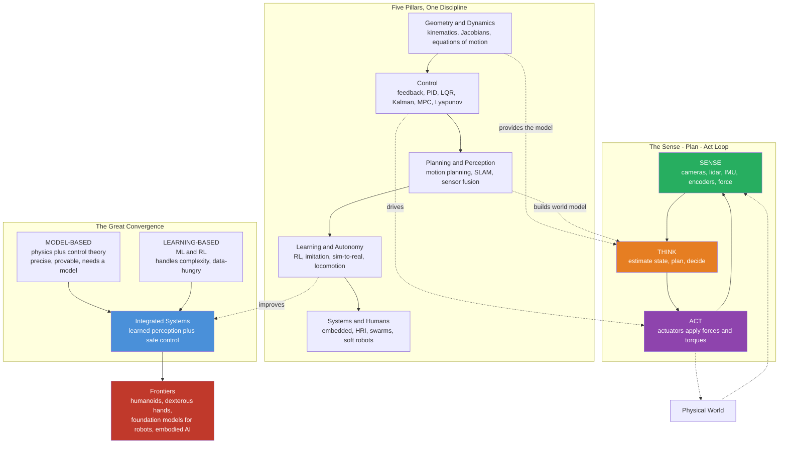

# 🌐 The Reach and Future of Robotics and Control

> [!abstract] TL;DR
> This is the **capstone** of the whole vault — the synthesis and the horizon. Robotics and control is the century-long project of giving machines the loop that every living thing is born with: **sense → think → act → repeat**. The vault traced that loop through five pillars: **geometry and dynamics** (where is the body, what forces move it), **classical control** (feedback and PID), **modern and optimal control** (state-space, LQR, Kalman, MPC, Lyapunov), **planning and perception** (motion planning, SLAM, sensor fusion), and **learning and autonomy** (RL, imitation, sim-to-real, locomotion). The unifying idea is **closing the loop**; the defining tension is **model-based** methods (physics plus control theory — precise, provable, but needing a model) versus **learning-based** methods (ML and RL — handling messy complexity, but data-hungry and hard to guarantee); and the story of the moment is their **convergence**. The frontier — general-purpose **humanoids**, dexterous **manipulation**, robust **legged locomotion**, **foundation models** and large behavior models for robots, **safe learning and verification**, human-robot collaboration, soft and swarm systems — is where robotics fuses with AI into **embodied intelligence**. The honest reckoning is equally real: the **sim-to-real gap**, the **long tail** of edge cases, formal **safety and verification**, and the chasm between a viral demo and a system reliable enough to deploy.

---

## Intuition

**Analogy — the robot leaves the cage.** For most of a century, the word "robot" meant one thing: a caged industrial arm, bolted to a factory floor, welding the same seam a million times behind a safety fence, blind to everything outside its programmed arc. It was strong, precise, and profoundly *stupid* — it did not know if the part had arrived, it could not react if you stepped into its path, and it would happily swing into empty air if the world disagreed with its script. That machine was **open-loop muscle without instinct**.

Now look around. Robots vacuum our living rooms, drive our streets, fly themselves through the sky, thread instruments through a beating heart, and walk over earthquake rubble on four legs or two. The fence is gone. The single deepest reason is that these machines finally have the thing the caged arm never did: **a loop that closes**. They *sense* the world, *estimate* where they and everything else are, *decide* what to do, *act*, and immediately measure the consequences — many times per second, faster than reality can push back. The whole discipline of robotics and control is the slow, mathematical gift of that loop — the sense-think-act reflex that living things are simply *born* with, and that machines must be *given*, one equation at a time.

We are living through the moment that loop finally leaves the cage. The geometry that tells a body where its hand is, the control theory that cancels its errors, the estimation that fuses its noisy senses, the planning that gives it foresight, and — newest of all — the **learning** that lets it acquire skills too complex to write down by hand: these are converging into machines that adapt, generalize, and work safely *beside* us rather than fenced away from us. This note steps back from the individual tools and asks the capstone question: how far does that loop now reach, and where is it going?

---

## How It Works

The vault is not a list of unrelated techniques; it is **one loop, made rigorous five times over**. Every pillar makes a different part of *sense → think → act* precise, and every pillar ultimately serves the same job: turning a pile of motors and sensors into a machine that behaves *on purpose* despite an uncertain world.

- **Geometry and dynamics — where is the body, what moves it.** [[Rigid_Body_Motion_and_Homogeneous_Transforms]] gives the language of pose; [[Forward_Kinematics]] maps joint angles to end-effector position and [[Inverse_Kinematics]] solves the harder reverse; [[Velocity_Kinematics_and_the_Jacobian]] relates joint rates to Cartesian motion; and [[Robot_Dynamics_and_Equations_of_Motion]] gives the forces behind it all. This is the *model* everything else builds on.
- **Classical control — hold and track despite disturbance.** [[Feedback_Control_Fundamentals]] is the reflex arc; [[PID_Control]] is its workhorse form; [[Transfer_Functions_and_Frequency_Response]], [[Stability_Routh_Hurwitz_and_Root_Locus]], and [[Bode_Nyquist_and_Loop_Shaping]] analyze *when* the loop stays stable; [[State_Space_Models_in_Control]] reframes it all as $\dot x = Ax + Bu$.
- **Modern and optimal control — do it optimally, even blind.** [[Controllability_and_Observability]] asks whether a robot can even be steered and sensed; [[Pole_Placement_and_Full_State_Feedback]] and [[LQR_Optimal_Control]] design the feedback; [[Kalman_Filtering_and_State_Estimation]] reconstructs the hidden state from noisy sensors; [[Model_Predictive_Control]] optimizes over the future under constraints; [[Nonlinear_Control_and_Lyapunov_Stability]] proves it will not diverge.
- **Planning and perception — where to go, what is out there.** [[Configuration_Space_and_Motion_Planning]] and [[Sampling_Based_Planning_RRT_and_PRM]] find collision-free paths; [[Trajectory_Optimization_and_Generation]] makes them dynamically feasible; [[Robot_Perception_and_Sensor_Fusion]], [[Simultaneous_Localization_and_Mapping]], and [[Robot_Pose_Estimation_and_Visual_Odometry]] build the world model the planner needs.
- **Learning and autonomy — acquire what you cannot hand-derive.** [[Reinforcement_Learning]] and imitation learning grow policies for contact-rich skills; [[Adaptive_and_Robust_Control]] copes with changing dynamics; [[Legged_and_Mobile_Robot_Locomotion]] turns "controlled falling" into robust walking; and the *sim-to-real* problem is the crux of getting any of it onto hardware.

The recurring axis across the entire field is **model-based versus learning-based**. Physics and control theory give *provable guarantees* when you have a good model — but the real world is contact-rich, high-dimensional, and often un-modellable. Machine learning thrives exactly there — but is data-hungry and hard to certify. The frontier is not one side winning; it is **convergence**: learned perception feeding a model-based controller, a learned policy wrapped in a control-theoretic safety layer, or model-based simulation generating the data a policy learns from. Pushed further, the emerging vision is **foundation models for robots** — large behavior models pre-trained across many tasks and embodiments — fusing robotics with AI into *embodied intelligence*.



---

## Key Concepts

### 🟢 Secondary — the big picture

- **A robot is a loop, not a machine.** The defining act of robotics is *closing the loop* — wiring sensing back to action so the machine corrects its own errors. That one idea separates a modern robot from the caged arm that only ever acted and hoped.
- **The whole field is sense → think → act.** Everything — geometry, control, estimation, planning, learning — is a way of making one stage of that loop rigorous. Read the vault as five deep answers to one shallow question.
- **Two ways to get skill: derive it or learn it.** *Model-based* robotics writes the physics down and controls it precisely. *Learning-based* robotics lets the machine practice until it works. Modern systems increasingly do both.
- **The frontier is robots that leave the cage.** Autonomy means working in the open, messy, human world — not behind a fence executing one fixed motion.

### 🟡 Undergraduate — the working synthesis

- **The classical → modern → learned arc.** Control matured in three waves: **classical** (single-loop feedback, PID, frequency-domain stability), **modern/optimal** (state-space, LQR, Kalman, MPC, Lyapunov — multivariable and provably optimal), and **learned** (RL and imitation for skills no one can hand-code). Each wave absorbed the last rather than replacing it.
- **Estimation is the hidden half of the loop.** Sensors are noisy and states are hidden. The [[Kalman_Filtering_and_State_Estimation]] family fuses a dynamics model with measurements so the controller acts on a *clean* estimate — without it, high-gain control amplifies noise into instability.
- **Planning and control are different time-scales of the same job.** Planning decides *where to go* over seconds (paths, trajectories, SLAM maps); control decides *how to get there* over milliseconds (tracking, stabilizing). A trajectory the dynamics cannot execute is a planning failure, not a control one.
- **Autonomy is a stack, not a switch.** Perception → estimation → planning → control → actuation, closed at every level. "Full autonomy" is the whole stack working together reliably in the open world.

### 🔴 Graduate — the frontier and its tension

- **Model-based versus learning-based, precisely.** Model-based control offers **guarantees** (stability certificates, constraint satisfaction, sample efficiency) but degrades when the model is wrong. Learning-based control offers **generality** (contact-rich manipulation, vision-driven policies) but is data-hungry, brittle off-distribution, and hard to certify. The research frontier is *integration*: safe RL, control-theoretic shields around learned policies, learned dynamics inside MPC, differentiable simulators.
- **Sim-to-real and the reality gap.** Policies trained in fast simulation must survive on hardware where friction, contact, latency, and actuator dynamics differ. **Domain randomization**, system identification, and teacher-student privileged learning shrink the gap but never fully close it.
- **Foundation models for robots.** The emerging bet: pre-train large **behavior / vision-language-action models** across many tasks and embodiments, then adapt — importing the generalization of large models into embodied control. Open questions: data scarcity for physical interaction, real-time inference, and safety.
- **Verification and the long tail.** Deployment is gated less by average performance than by the **rare, dangerous edge case**. Formal verification, runtime monitoring, and provable safety envelopes are the discipline separating an impressive demo from a certifiable product.

---

## Python Demo

One figure, the whole arc. Four panels trace the vault's spine in a single view — **classical/optimal control → estimation → planning → learning** — all on the same simple dynamics so the connections are literal, not metaphorical. Panel 1 stabilizes a system with an **LQR** feedback gain (computed by iterating the Riccati equation, numpy only). Panel 2 tracks a **planned trajectory** weaving through obstacles. Panel 3 runs a **Kalman filter** recovering a truth signal from noisy measurements. Panel 4 has a policy **learn** a controller from scratch by random search — and its learned gain converges toward the very LQR gain of panel 1, the field's model-based and learning-based halves meeting in one plot.

```python
# The whole vault in one figure: control -> estimation -> planning -> learning.
# Pure numpy + matplotlib (no scipy). Runnable as-is.
import numpy as np
import matplotlib.pyplot as plt

rng = np.random.default_rng(0)

# ============================================================================
# Shared plant: a discrete double integrator (a 1-DOF robot joint / point mass).
#   state x = [position, velocity];  input u = force/acceleration command.
# ============================================================================
dt = 0.05
A = np.array([[1.0, dt],
              [0.0, 1.0]])
B = np.array([[0.5 * dt * dt],
              [dt]])
Q = np.diag([10.0, 1.0])     # penalize position error heavily, velocity mildly
R = np.array([[0.10]])       # penalize control effort

def dlqr(A, B, Q, R, iters=1000):
    """Discrete LQR gain by iterating the Riccati recursion until it converges."""
    P = Q.copy()
    K = np.zeros((B.shape[1], A.shape[0]))
    for _ in range(iters):
        S = R + B.T @ P @ B
        K = np.linalg.solve(S, B.T @ P @ A)          # K = (R + B'PB)^-1 B'PA
        P = Q + A.T @ P @ A - A.T @ P @ B @ K
    return K

K_lqr = dlqr(A, B, Q, R)     # optimal feedback gain (the "model-based" answer)

# ---------------------------------------------------------------------------
# Panel 1: LQR step response -- feedback stabilizes and tracks a setpoint.
# ---------------------------------------------------------------------------
N1 = 120
t1 = np.arange(N1) * dt
ref = np.array([1.0, 0.0])                # drive position to 1.0, velocity to 0
x = np.array([0.0, 0.0])
pos_hist = np.zeros(N1)
for k in range(N1):
    pos_hist[k] = x[0]
    u = float(-K_lqr @ (x - ref))         # SENSE error -> ACT (optimal feedback)
    x = A @ x + (B.flatten() * u)

# ---------------------------------------------------------------------------
# Panel 2: a PLANNED trajectory weaving through obstacles, then TRACKED.
# ---------------------------------------------------------------------------
obstacles = [(3.0, 2.0, 0.7), (5.2, 3.4, 0.7), (7.0, 1.4, 0.7)]   # (cx, cy, r)
waypoints = np.array([[0.0, 0.0], [2.0, 2.6], [4.0, 1.1],
                      [6.0, 3.4], [8.2, 1.3], [10.0, 3.0]])         # collision-free plan
seg = np.linspace(0.0, 1.0, len(waypoints))
s = np.linspace(0.0, 1.0, 240)
rx = np.interp(s, seg, waypoints[:, 0])   # planned reference path
ry = np.interp(s, seg, waypoints[:, 1])
px, py = rx[0], ry[0]                      # tracker starts on the path
tx, ty = [px], [py]
for i in range(len(rx)):                   # first-order tracker follows the plan
    px += 0.12 * (rx[i] - px)
    py += 0.12 * (ry[i] - py)
    tx.append(px); ty.append(py)

# ---------------------------------------------------------------------------
# Panel 3: a KALMAN FILTER recovering truth from noisy measurements (2D CV).
# ---------------------------------------------------------------------------
M = 80
tt = np.linspace(0.0, 2.2 * np.pi, M)
truth = np.stack([3.0 * np.sin(tt), 2.0 * np.sin(0.5 * tt)], axis=1)   # curved path
meas = truth + rng.normal(0.0, 0.35, truth.shape)                      # noisy sensor

F = np.array([[1, dt, 0, 0], [0, 1, 0, 0],
              [0, 0, 1, dt], [0, 0, 0, 1]], dtype=float)   # constant-velocity model
H = np.array([[1, 0, 0, 0], [0, 0, 1, 0]], dtype=float)    # we only measure position
Qk = np.eye(4) * 0.02
Rk = np.eye(2) * 0.35 ** 2
xk = np.array([meas[0, 0], 0.0, meas[0, 1], 0.0])
Pk = np.eye(4)
est = np.zeros((M, 2))
for i in range(M):
    xk = F @ xk                                            # predict
    Pk = F @ Pk @ F.T + Qk
    y = meas[i] - H @ xk                                   # innovation
    S = H @ Pk @ H.T + Rk
    Kg = Pk @ H.T @ np.linalg.inv(S)                       # Kalman gain
    xk = xk + Kg @ y                                       # update
    Pk = (np.eye(4) - Kg @ H) @ Pk
    est[i] = [xk[0], xk[2]]

# ---------------------------------------------------------------------------
# Panel 4: LEARNING a controller from scratch by random search on the SAME
# plant -- reward improves and the learned gain converges toward K_lqr.
# ---------------------------------------------------------------------------
def rollout_reward(k, N=60):
    """Negative LQR cost of the linear policy u = -k.x from a disturbed start."""
    xs = np.array([1.0, 0.0]); cost = 0.0
    for _ in range(N):
        u = -(k[0] * xs[0] + k[1] * xs[1])
        cost += 10.0 * xs[0] ** 2 + 1.0 * xs[1] ** 2 + 0.10 * u ** 2
        xs = A @ xs + (B.flatten() * u)
        if not np.isfinite(cost) or cost > 1e6:           # diverged: bail out
            return -1e6
    return -cost

k = np.array([0.1, 0.1])                  # a bad initial policy
best_r = rollout_reward(k)
curve = []
for it in range(300):                     # simple evolutionary / random search
    cand = k + 0.30 * rng.standard_normal(2)
    r = rollout_reward(cand)
    if r > best_r:
        best_r, k = r, cand
    curve.append(best_r)
k_learned = k

print("LQR gain (model-based):   ", np.round(K_lqr.flatten(), 3))
print("Learned gain (from search):", np.round(k_learned, 3))

# ---------------------------------------------------------------------------
# Assemble the dashboard
# ---------------------------------------------------------------------------
fig, ax = plt.subplots(2, 2, figsize=(13, 9))

ax[0, 0].axhline(1.0, ls='--', color='k', lw=1, label='setpoint')
ax[0, 0].plot(t1, pos_hist, color='seagreen', lw=2, label='LQR-controlled position')
ax[0, 0].set_title('1. Control: LQR feedback stabilizes to target')
ax[0, 0].set_xlabel('time [s]'); ax[0, 0].set_ylabel('position [m]')
ax[0, 0].legend(fontsize=8)

for (cx, cy, r) in obstacles:
    ax[0, 1].add_patch(plt.Circle((cx, cy), r, color='lightcoral', alpha=0.7))
ax[0, 1].plot(rx, ry, 'b--', lw=1.5, label='planned path')
ax[0, 1].plot(tx, ty, 'darkorange', lw=2, label='tracked trajectory')
ax[0, 1].plot(rx[0], ry[0], 'go'); ax[0, 1].plot(rx[-1], ry[-1], 'rs')
ax[0, 1].set_title('2. Planning: track a path around obstacles')
ax[0, 1].set_xlabel('x [m]'); ax[0, 1].set_ylabel('y [m]')
ax[0, 1].axis('equal'); ax[0, 1].legend(fontsize=8)

ax[1, 0].plot(truth[:, 0], truth[:, 1], 'g-', lw=2, label='ground truth')
ax[1, 0].scatter(meas[:, 0], meas[:, 1], s=12, color='gray', alpha=0.6, label='noisy measurements')
ax[1, 0].plot(est[:, 0], est[:, 1], 'b-', lw=1.8, label='Kalman estimate')
ax[1, 0].set_title('3. Estimation: Kalman filter tracks truth through noise')
ax[1, 0].set_xlabel('x [m]'); ax[1, 0].set_ylabel('y [m]')
ax[1, 0].axis('equal'); ax[1, 0].legend(fontsize=8)

ax[1, 1].plot(curve, color='purple', lw=2)
ax[1, 1].set_title('4. Learning: policy improves toward the optimal controller')
ax[1, 1].set_xlabel('search iteration'); ax[1, 1].set_ylabel('best reward (negative cost)')

fig.suptitle('Robotics and Control in one view: classical control -> planning -> estimation -> learning',
             fontsize=13, y=1.00)
plt.tight_layout()
plt.show()
```

What the dashboard shows, read as the vault's arc: **(1)** feedback turns an inert joint into one that finds and holds its target; **(2)** a planner's collision-free path is realized by a tracker; **(3)** estimation recovers a clean state from a noisy sensor stream — the hidden half of every real loop; and **(4)** a policy *learns* a good controller with zero physics knowledge, its gain drifting toward the LQR solution derived analytically in panel 1. The model-based and learning-based halves of robotics, meeting on the same page.

---

## Real-World Applications

The reach of the loop, sector by sector:

- **Manufacturing.** The original home — [[Inverse_Kinematics]] plus tightly tuned joint control give FANUC, KUKA, and ABB arms sub-millimeter repeatability; the frontier is force-controlled, vision-guided arms that leave the fence for collaborative "cobot" work beside people.
- **Logistics and warehouses.** Fleets of differential-drive mobile robots (Amazon/Kiva) shuttle shelves; bin-picking arms use learned grasping and 3D perception to handle unstructured inventory — one of the largest real deployments of robot learning.
- **Autonomous vehicles.** Waymo and others fuse lidar, radar, and camera through Kalman-style estimation and [[Simultaneous_Localization_and_Mapping]], plan collision-free trajectories, and track them with [[Model_Predictive_Control]] — a full autonomy stack on wheels.
- **Drones and aerial robots.** Inherently unstable, they fly only because an IMU-driven feedback loop corrects attitude hundreds of times a second; agile flight and delivery push MPC and learned control to their limits.
- **Medical and surgical robotics.** Teleoperated systems (da Vinci) map a surgeon's motion to instruments with bilateral force feedback; the frontier is supervised autonomy for suturing and steady-hand microsurgery.
- **Agriculture.** Autonomous tractors, fruit-picking arms, and weeding robots combine outdoor perception, GPS-fused localization, and dexterous manipulation on soft, variable targets.
- **Space.** Mars rovers (Curiosity, Perseverance) do onboard visual odometry and autonomous navigation under multi-minute communication delay; robotic arms and free-flyers service and assemble in orbit — autonomy where teleoperation is physically impossible.
- **Service and home robots.** Vacuums, lawn mowers, and delivery bots brought SLAM and autonomy into ordinary homes; elder-care and assistive robots are an aging world's rising demand.
- **Search and rescue.** Legged and tracked robots enter collapsed buildings, mines, and disaster zones too dangerous for people — the harshest test of robust [[Legged_and_Mobile_Robot_Locomotion]] and perception.
- **Humanoids.** The most ambitious bet — general-purpose two-armed, two-legged robots (Boston Dynamics Atlas, Figure, Tesla Optimus, Agility Digit) meant to work in spaces built for humans, fusing dynamic locomotion, dexterous manipulation, and increasingly large behavior models.

---

## Common Pitfalls

The field's honest challenges — the reasons the future is harder than the demos suggest:

- **The sim-to-real gap.** A policy flawless in simulation can fail instantly on hardware because contact, friction, latency, and actuator dynamics are modeled imperfectly. Domain randomization and system identification shrink it; nothing erases it. *Trusting a simulator is the single most common way robot learning disappoints.*
- **Safety and formal verification.** Average-case competence is not enough — a robot that works 99.9% of the time can still injure someone or crash. Proving what a system will *never* do, especially with learned components, is largely unsolved. Deployment is gated by the worst case, not the mean.
- **The long tail of edge cases.** The demo handles the common 95%; reliable products must handle the rare, weird 5% — the plastic bag on the highway, the toddler behind the car, the object never seen in training. Most engineering effort lives in that tail.
- **Generalization.** Robots that master one task in one setting often fail to transfer to a new object, layout, or embodiment. Brittleness off the training distribution is the core reason robot learning has not yet had its "GPT moment."
- **The demo-to-deployment chasm.** A viral video is a best-case, curated take; a deployed product must run unattended, all day, on cheap hardware, without a pilot. The gap between the two is measured in years and is routinely underestimated.
- **Over-hype and the credibility cost.** Robotics has cycled through inflated promises — humanoids, self-driving "next year," household robots — for decades. Overselling erodes trust and starves the field in the next downturn. Honesty about limits is a professional obligation.
- **Energy, actuation, and hardware limits.** Biological muscle still vastly out-performs motors in energy density and compliance; batteries limit legged robots to hours; dexterous hands remain fragile and expensive. Software has outrun the physical substrate.
- **Ethics, labor, and autonomy.** Automation reshapes jobs, autonomous systems raise questions of responsibility when they fail, and robots that share our space raise safety and privacy stakes. These are engineering constraints, not afterthoughts — see [[AI_Ethics_Overview]] and [[Autonomy_Accountability_and_Moral_Machines]].

---

## Related Concepts

**The five pillars of this vault (the synthesis):**

- **Geometry and dynamics** — [[Robotics_and_Control_Overview]] (the field map), [[Rigid_Body_Motion_and_Homogeneous_Transforms]], [[Forward_Kinematics]], [[Inverse_Kinematics]], [[Velocity_Kinematics_and_the_Jacobian]], [[Robot_Dynamics_and_Equations_of_Motion]] — the *model* every controller and planner stands on.
- **Classical control** — [[Feedback_Control_Fundamentals]], [[PID_Control]], [[Transfer_Functions_and_Frequency_Response]], [[Stability_Routh_Hurwitz_and_Root_Locus]], [[Bode_Nyquist_and_Loop_Shaping]], [[State_Space_Models_in_Control]] — the first wave: single-loop feedback made rigorous.
- **Modern and optimal control** — [[Controllability_and_Observability]], [[Pole_Placement_and_Full_State_Feedback]], [[LQR_Optimal_Control]], [[Kalman_Filtering_and_State_Estimation]], [[Model_Predictive_Control]], [[Nonlinear_Control_and_Lyapunov_Stability]] — the second wave: multivariable, optimal, provable.
- **Planning and perception** — [[Configuration_Space_and_Motion_Planning]], [[Sampling_Based_Planning_RRT_and_PRM]], [[Trajectory_Optimization_and_Generation]], [[Robot_Perception_and_Sensor_Fusion]], [[Simultaneous_Localization_and_Mapping]], [[Robot_Pose_Estimation_and_Visual_Odometry]] — deciding *where to go* and knowing *what is there*.
- **Learning and autonomy** — [[Adaptive_and_Robust_Control]], [[Legged_and_Mobile_Robot_Locomotion]] — the third wave: skill by adaptation and practice, and the systems that walk the world.

**Cross-vault connections:**

- [[Reinforcement_Learning]] — the AI-ML foundation of learning-based control, from locomotion to manipulation policies.
- [[State_Feedback_Control]] — the signals-and-systems root of pole placement, LQR, and observers this vault applies to robots.
- [[Feedback_Loops_and_Causality]] — the systems-thinking essence of *closing the loop*, shared with every self-regulating system.
- [[Cybernetics_and_Control]] — the historical origin of goal-seeking machines and negative feedback, robotics' intellectual ancestor.
- [[Emergence_and_Self_Organization]] — the principle behind swarms and multi-robot systems, where global behavior arises from local rules.
- [[AI_Ethics_Overview]] — the ethics of autonomous, embodied decision-making as robots leave the cage.
- [[Autonomy_Accountability_and_Moral_Machines]] — responsibility, safety, and blame when autonomous systems act and fail.

*(Not yet in the vault, referenced in prose above: reinforcement learning for control, imitation learning, sim-to-real transfer, robotic manipulation and grasping, actuators/sensors/embedded robotics, human-robot interaction and safety, swarm and multi-robot systems, soft and bioinspired robotics, aerial and autonomous vehicles — the remaining Learning-and-Autonomy and Systems-Humans-Frontiers notes.)*

---

## Review Questions

### 🟢 Secondary
1. The note argues that a modern robot differs from a caged industrial arm not mainly in strength or precision but in *one structural feature*. What is it, and why does it let the robot leave the fence?

### 🟡 Undergraduate
2. Trace a single control task through all four panels of the demo: how do *control*, *planning*, *estimation*, and *learning* each contribute a different piece of the sense-plan-act loop? Why can none of them be dropped for a robot operating in the real world?
3. Explain the "classical → modern → learned" arc of control as three waves that *absorbed* rather than *replaced* one another. Give one capability each wave added that the previous could not provide.

### 🔴 Graduate
4. State the model-based versus learning-based tension precisely: what does each side guarantee, and where does each break down? Describe two concrete ways modern systems *integrate* them (e.g., a safety shield around a learned policy, or learned dynamics inside MPC).
5. A humanoid startup shows a flawless demo of a robot folding laundry and declares the problem solved. Using the sim-to-real gap, the long tail, verification, and the demo-to-deployment chasm, argue why reliable deployment may still be years away — and name what evidence would actually convince you.
6. "Foundation models will do for robots what they did for language." Argue both sides: why embodied interaction data, real-time inference, and safety make robotics harder than text — and why cross-embodiment pre-training might still generalize. What would a genuine robotics "GPT moment" require?

---

## Sources

- Siciliano, B., & Khatib, O. (eds.) — *Springer Handbook of Robotics*, 2nd ed. (Springer, 2016). The definitive reference across the whole discipline.
- Lynch, K. M., & Park, F. C. — *Modern Robotics: Mechanics, Planning, and Control* (Cambridge University Press, 2017). The modern synthesis of geometry, planning, and control.
- Thrun, S., Burgard, W., & Fox, D. — *Probabilistic Robotics* (MIT Press, 2005). The probabilistic backbone of estimation, SLAM, and perception.
- Brooks, R. A. — *Intelligence without Representation*, Artificial Intelligence 47 (1991). The foundational argument for embodied, situated intelligence over world-model-heavy AI.
- Kroemer, O., Niekum, S., & Konidaris, G. — *A Review of Robot Learning for Manipulation: Challenges, Representations, and Algorithms*, Journal of Machine Learning Research 22 (2021). A survey of the learning-based frontier and its open problems.

---

#robotics #control-theory #autonomy #robot-learning #capstone
