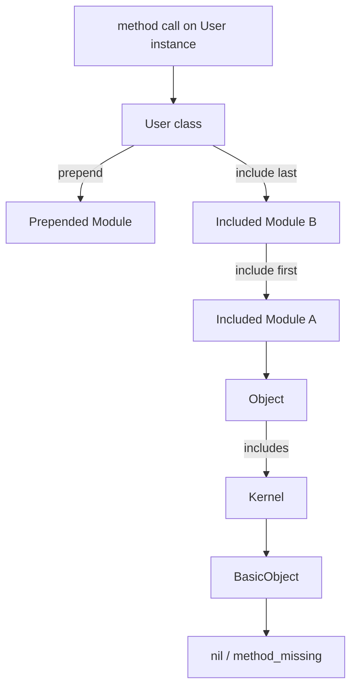

# Ruby Modules and Mixins

> [!abstract] TL;DR
> Ruby solves the multiple-inheritance problem through modules. A module serves as a namespace to group related constants/methods, or as a mixin that injects behavior into classes. `include` adds module methods as instance methods; `extend` adds them as class methods; `prepend` inserts them *before* the class in the lookup chain. Understanding the ancestor chain is essential for predictable method resolution.

---

## Intuition

**Analogy:** A module is a behavior pack — like a DLC for a video game class. `Dog < Animal` gives you the base game (inheritance); `include Swimmable` installs the swimming DLC (mixin). Unlike inheritance, you can install multiple behavior packs, and `prepend` lets you wrap existing methods like an onion layer — the module's version runs first and can call `super` to invoke the original.

The ancestor chain is the lookup order Ruby walks when a method is called: `Object.ancestors` shows the full chain for every object.

---

## Module as Namespace

```ruby
module Payments
  class Invoice
    attr_reader :total

    def initialize(total)
      @total = total
    end
  end

  class Refund
    def initialize(invoice)
      @invoice = invoice
    end
  end

  CURRENCY = "USD"

  def self.process(invoice)
    "Processing #{invoice.total} #{CURRENCY}"
  end
end

invoice = Payments::Invoice.new(99.99)
Payments.process(invoice)
Payments::CURRENCY   # => "USD"
```

---

## include — Instance Method Mixins

```ruby
module Greetable
  def greet
    "Hello, I am #{name}"    # expects including class to have #name
  end

  def farewell
    "Goodbye from #{name}"
  end
end

module Auditable
  def log_action(action)
    "[#{Time.now}] #{self.class.name}##{action}"
  end
end

class User
  include Greetable
  include Auditable

  attr_reader :name

  def initialize(name)
    @name = name
  end
end

user = User.new("Alice")
user.greet         # => "Hello, I am Alice"
user.log_action("create")  # works

# Ancestor chain (most specific first)
User.ancestors
# => [User, Auditable, Greetable, Object, Kernel, BasicObject]
# Note: last included module appears first in chain
```

---

## extend — Class Method Mixins

```ruby
module Findable
  def find(id)
    "#{self.name} with id #{id}"
  end

  def all
    "All #{self.name} records"
  end
end

class Product
  extend Findable
  # extend makes module methods into class methods
end

Product.find(42)   # => "Product with id 42"
Product.all        # => "All Product records"

# Contrast with include:
# include  → module methods become INSTANCE methods
# extend   → module methods become CLASS methods

# You can extend a single object too
logger = Object.new
logger.extend(Auditable)
logger.log_action("test")  # only this instance gets the method
```

---

## prepend — Method Wrapping

```ruby
module Logged
  def save
    puts "Before save"
    result = super     # calls the ORIGINAL save method in the class
    puts "After save"
    result
  end
end

class Article
  prepend Logged     # Logged is inserted BEFORE Article in chain

  def save
    puts "Saving article..."
    true
  end
end

article = Article.new
article.save
# Before save
# Saving article...
# After save

Article.ancestors
# => [Logged, Article, Object, ...]
# prepend puts the module BEFORE the class
```

---

## Comparable and Enumerable

These two modules are Ruby's most powerful built-in mixins:

```ruby
# Comparable — define <=> and get <, <=, >, >=, between?, clamp, sort for free
class Temperature
  include Comparable

  attr_reader :degrees

  def initialize(degrees)
    @degrees = degrees
  end

  def <=>(other)
    @degrees <=> other.degrees    # spaceship operator
  end

  def to_s
    "#{@degrees}°"
  end
end

temps = [Temperature.new(30), Temperature.new(20), Temperature.new(25)]
temps.sort          # uses <=>
temps.min           # => 20°
temps.max           # => 30°
Temperature.new(22).between?(Temperature.new(20), Temperature.new(25))  # => true

# Enumerable — define each and get map, select, reject, find, reduce, sort, etc.
class WordCollection
  include Enumerable

  def initialize(text)
    @words = text.split
  end

  def each(&block)    # only required method for Enumerable
    @words.each(&block)
  end
end

words = WordCollection.new("the quick brown fox")
words.map(&:upcase)       # => ["THE", "QUICK", "BROWN", "FOX"]
words.select { |w| w.length > 3 }  # => ["quick", "brown"]
words.sort                # alphabetical sort via <=>
words.min                 # => "brown" (alphabetically)
words.count               # => 4
words.include?("fox")     # => true
```

---

## ActiveSupport::Concern Pattern

Rails uses `ActiveSupport::Concern` to write cleaner mixins that include both instance and class methods without the boilerplate:

```ruby
require "active_support/concern"

module Publishable
  extend ActiveSupport::Concern

  included do
    # This block runs in the context of the including class
    scope :published, -> { where(published: true) }
    validates :published_at, presence: true, if: :published?
  end

  # Instance methods
  def publish!
    update!(published: true, published_at: Time.current)
  end

  def unpublish!
    update!(published: false, published_at: nil)
  end

  # Class methods block
  module ClassMethods
    def recent_published(limit = 10)
      published.order(published_at: :desc).limit(limit)
    end
  end
end

class Article < ApplicationRecord
  include Publishable
  # Gets: scope :published, instance#publish!, instance#unpublish!,
  # class method Article.recent_published
end
```

---

## Ancestor Chain Diagram



---

## Common Pitfalls

- **`include` order matters** — last included module has highest priority (appears earlier in ancestor chain). `include A; include B` → B's methods shadow A's for the same method name.
- **Calling `super` in a mixin** — a mixin method calling `super` continues up the ancestor chain. If no parent defines the method, `NoMethodError` from `BasicObject` is raised. Check with `defined?(super)` or rescue.
- **`extend` vs `include` confusion** — `include` adds instance methods; `extend` adds class methods. A common pattern is to define both in one module using `self.included` or `ActiveSupport::Concern`.
- **Circular dependency in Concerns** — `Concern A includes B; B includes A` causes a module inclusion loop. Flatten the dependency or use composition instead.
- **`Enumerable#sort` vs `sort_by`** — `sort` calls `<=>` on element pairs (O(n log n) comparisons); `sort_by { |e| e.key }` computes the key once per element then sorts. For expensive key computations, `sort_by` is significantly faster.

---

## Review Questions

1. Explain the difference between `include`, `extend`, and `prepend`. Give a concrete use case for each.
2. How does `Comparable` work? What single method must you define, and what methods does the module provide in return?
3. A module `M` is included into class `A`, and `A` has a method `greet`. Module `M` also defines `greet` and calls `super`. What happens? Trace the ancestor chain for `A.new.greet`.
4. Why does Rails use `ActiveSupport::Concern` instead of plain modules for large mixins? What problem does `included do` solve?

---

#Ruby #Rails
