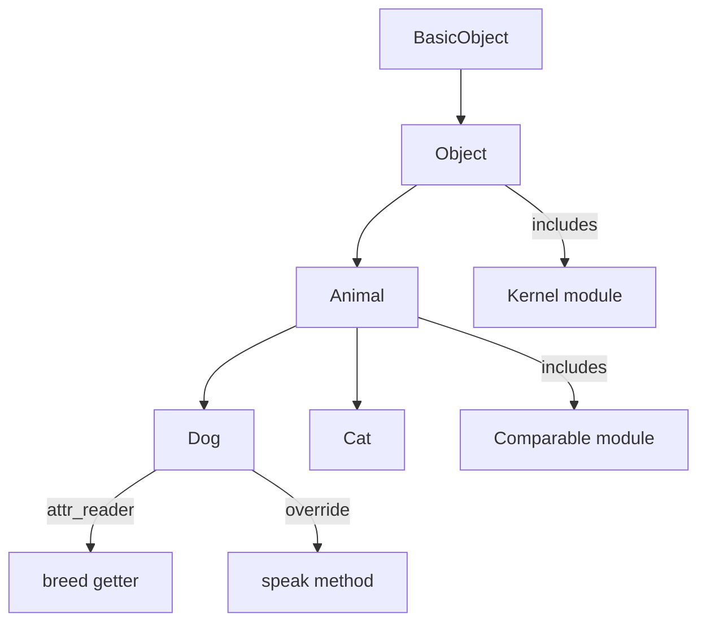

# Ruby OOP

> [!abstract] TL;DR
> Ruby is a pure OO language — every value is an object, and behavior is defined through classes, inheritance, and mixins. Classes use `initialize` for construction, `attr_accessor` for generated getters/setters, and `self` to distinguish class from instance methods. Ruby's single inheritance is extended by mixins (`include`/`extend`) and `method_missing` enables dynamic dispatch for metaprogramming.

---

## Intuition

**Analogy:** Ruby classes are like blueprints that come alive. Unlike Java where the class is a static declaration, Ruby classes are *open objects* — you can reopen them, add methods at runtime, and they respond dynamically to method calls they don't know about. The class itself is just an instance of `Class`, which is an instance of `Module`, which is an instance of `Object`. Everything is alive.

This openness is power and responsibility. Rails uses it extensively: `belongs_to :user` in a model is just a class-level method call that dynamically generates methods.

---

## Class Definition

```ruby
class Animal
  # Class-level instance variable (preferred over @@)
  @count = 0

  def self.count
    @count
  end

  # initialize is the constructor
  def initialize(name, species)
    @name    = name       # instance variable
    @species = species
    Animal.instance_variable_get(:@count)
    self.class.instance_variable_set(:@count,
      self.class.instance_variable_get(:@count).to_i + 1)
  end

  # Generated getters and setters
  attr_reader   :species     # generates def species; @species; end
  attr_writer   :name        # generates def name=(val); @name = val; end
  attr_accessor :age         # generates both getter and setter

  # Instance method
  def speak
    "#{@name} says: ..."
  end

  # Custom getter with logic
  def name
    @name.capitalize
  end

  def to_s
    "#{@name} (#{@species})"
  end

  # Equality
  def ==(other)
    other.is_a?(Animal) && @name == other.name && @species == other.species
  end
end

dog = Animal.new("rex", "dog")
dog.name     # => "Rex"
dog.species  # => "dog"
dog.age = 3
puts dog     # => "rex (dog)" — calls to_s
```

---

## Inheritance

```ruby
class Dog < Animal    # single inheritance with <
  def initialize(name, breed)
    super(name, "Canis lupus familiaris")   # calls parent initialize
    @breed = breed
  end

  attr_reader :breed

  # Override parent method
  def speak
    "#{name} barks: Woof!"
  end

  # Call parent version with super
  def to_s
    "#{super} [#{@breed}]"   # super without args passes all current args
  end
end

rex = Dog.new("rex", "German Shepherd")
rex.speak    # => "Rex barks: Woof!"
puts rex     # => "rex (Canis lupus familiaris) [German Shepherd]"

# Type checking
rex.is_a?(Dog)     # => true
rex.is_a?(Animal)  # => true  (inheritance chain)
rex.kind_of?(Dog)  # => true  (alias for is_a?)
rex.instance_of?(Dog)    # => true
rex.instance_of?(Animal) # => false  (strict check — no inheritance)
rex.respond_to?(:speak)  # => true
rex.respond_to?(:fly)    # => false
```

---

## Access Control

```ruby
class Person
  def initialize(name, password)
    @name     = name
    @password = password
  end

  def greeting
    "Hi, I'm #{@name}"
  end

  def authenticate(password)
    validate_password(password)   # private methods callable from inside
  end

  protected

  def share_data_with(other_person)
    # accessible from instances of the same class or subclass
    { name: @name }
  end

  private

  def validate_password(input)
    input == @password
  end
end
```

---

## Object Introspection and method_missing

```ruby
class FlexibleConfig
  def initialize
    @settings = {}
  end

  # Called when a method doesn't exist
  def method_missing(name, *args)
    key = name.to_s
    if key.end_with?("=")
      @settings[key.chomp("=")] = args.first
    elsif @settings.key?(key)
      @settings[key]
    else
      super    # IMPORTANT: always call super to preserve normal behavior
    end
  end

  # Must accompany method_missing — respond_to? should stay truthful
  def respond_to_missing?(name, include_private = false)
    key = name.to_s.chomp("=")
    @settings.key?(key) || super
  end
end

config = FlexibleConfig.new
config.host = "localhost"    # triggers method_missing
config.port = 5432
config.host                  # => "localhost"
config.respond_to?(:host)    # => true (via respond_to_missing?)
```

---

## Object Lifecycle: freeze, dup, clone

```ruby
# freeze — makes object immutable
config = { host: "localhost" }.freeze
# config[:host] = "remote"   # FrozenError!
config.frozen?               # => true

# Constants should always be frozen
DEFAULT_HEADERS = { "Content-Type" => "application/json" }.freeze

# dup — shallow copy, unfrozen
a = [1, 2, 3].freeze
b = a.dup
b.frozen?   # => false — dup strips frozen status
b << 4      # works fine

# clone — shallow copy, preserves frozen status
c = a.clone
c.frozen?   # => true — clone preserves frozen status
# c << 4   # FrozenError!

# Deep copy — use Marshal for complex objects
original = { user: { name: "Alice", tags: [1, 2, 3] } }
deep = Marshal.load(Marshal.dump(original))
deep[:user][:tags] << 4
original[:user][:tags]   # => [1, 2, 3] — unaffected
```

---

## Class Diagram



---

## Common Pitfalls

- **Forgetting `super` in `initialize`** — if a subclass defines `initialize` without calling `super`, the parent's setup code never runs. Always call `super` unless you intentionally want to bypass the parent.
- **`method_missing` without `respond_to_missing?`** — objects with `method_missing` lie to callers about what methods they respond to. Always define `respond_to_missing?` alongside `method_missing`.
- **`super` vs `super()`** — `super` passes all current method arguments; `super()` passes none. This distinction matters when you want to forward args vs call with no args.
- **Mutable default argument objects** — `def greet(opts = {})` is safe (new hash each call). But `@defaults = {}` in a class body is a class-level instance variable shared across all instances — use `initialize` instead.
- **`dup` vs `clone` for frozen objects** — `dup` removes the frozen status, `clone` preserves it. Decide based on whether the copy should remain immutable.

---

## Review Questions

1. What is the difference between `is_a?`, `kind_of?`, and `instance_of?`? Give one scenario where their results diverge.
2. Why must `respond_to_missing?` always be defined alongside `method_missing`? What breaks if it's absent?
3. Explain the difference between `super` and `super()` in an `initialize` method. When would you use each?
4. A frozen hash is passed as a default method argument. A caller calls `.merge!` on it. What happens and how would you fix the method signature?

---

#Ruby #Rails
