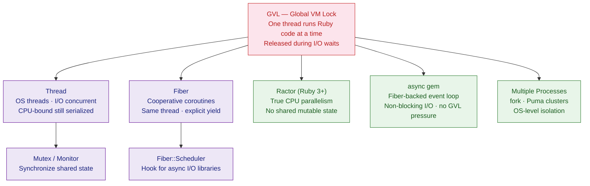

# Ruby Concurrency

> [!abstract] TL;DR
> Ruby (MRI) has a Global VM Lock (GVL, formerly GIL) that allows only one thread to execute Ruby code at a time — but I/O waits release the lock, making threads effective for I/O-bound work. Fibers are cooperative coroutines for fine-grained flow control. Ractors (Ruby 3+) achieve true parallelism by isolating shared state. The `async` gem provides event-loop concurrency built on Fibers without any GVL constraint. For CPU-heavy work, multiple processes (Puma clusters) remain the pragmatic choice.

---

## Intuition

**Analogy:** MRI Ruby's concurrency is a restaurant kitchen with one head chef (the GVL). Multiple waiters (threads) can take orders simultaneously (I/O operations) because taking an order does not need the stove. But only one person can cook at a time. Fibers are that same head chef switching attention between pots on the stove — cooperative, no extra cooks required. Ractors hire completely independent chefs with their own kitchens and equipment — true parallelism, but they can only exchange food through a pass-through window (message passing), never sharing the same cutting board (mutable state).

---

## How It Works



---

## Threads

MRI threads map to real OS threads but share the GVL. They shine for **I/O-bound** work:

```ruby
require 'net/http'

# 5 HTTP requests run concurrently — each releases GVL while waiting
threads = 5.times.map do |i|
  Thread.new do
    uri  = URI("https://httpbin.org/delay/1")
    body = Net::HTTP.get(uri)
    puts "Thread #{i} done"
  end
end
threads.each(&:join)  # all 5 finish in ~1s, not ~5s

# ----------------------------------------------------------------
# Shared state MUST be protected with a Mutex
mutex   = Mutex.new
counter = 0

10.times.map do
  Thread.new { 1_000.times { mutex.synchronize { counter += 1 } } }
end.each(&:join)

puts counter  # => 10000 — correct

# ----------------------------------------------------------------
# Thread-safe Queue for producer / consumer
queue = Queue.new

producer = Thread.new { 5.times { |i| queue << i }; queue << :stop }
consumer = Thread.new { loop { break if (v = queue.pop) == :stop; puts v } }
[producer, consumer].each(&:join)
```

---

## Fibers

Fibers are **cooperative coroutines** — they never preempt each other and always live on the same OS thread:

```ruby
# Basic resumable execution
fiber = Fiber.new do
  puts "A"
  Fiber.yield      # suspend; control returns to caller
  puts "B"
  Fiber.yield
  puts "C"
end

fiber.resume  # A
fiber.resume  # B
fiber.resume  # C
# fiber.resume here would raise FiberError: dead fiber called

# ----------------------------------------------------------------
# Fibers as lazy infinite generators
integers = Fiber.new do
  n = 0
  loop { Fiber.yield(n); n += 1 }
end

p 5.times.map { integers.resume }  # => [0, 1, 2, 3, 4]

# ----------------------------------------------------------------
# Fiber::Scheduler (Ruby 3.0+) — hook for non-blocking I/O
# Libraries like async gem implement the scheduler interface so that
# blocking calls (sleep, IO.read) are intercepted and turned into
# cooperative fiber yields automatically
```

---

## Ractors — True Parallelism (Ruby 3+)

Each Ractor has its own GVL — Ruby code inside different Ractors **runs in parallel**:

```ruby
# CPU-bound work in parallel
workers = 4.times.map do |i|
  Ractor.new(i) do |id|
    total = (1..2_000_000).sum   # pure computation
    "Ractor #{id}: #{total}"
  end
end
workers.each { |r| puts r.take }

# ----------------------------------------------------------------
# Message passing — the only way to communicate
r = Ractor.new do
  value = Ractor.receive          # blocks until message arrives
  Ractor.yield(value ** 2)        # send result back to caller
end

r.send(7)
puts r.take  # => 49

# ----------------------------------------------------------------
# Sharing objects: must be frozen (immutable) or explicitly moved
LOOKUP = { "pi" => 3.14159 }.freeze   # shareable — frozen
# bad  = [1, 2, 3]                    # not shareable — raises Ractor::IsolationError

safe_data = Ractor.make_shareable({ key: "value" })
r2 = Ractor.new(safe_data) { |d| puts d[:key] }
r2.take
```

---

## async gem — Event-Loop Concurrency

The `async` gem (gem `async`) wraps Fibers in a Reactor for seamless non-blocking I/O:

```ruby
# gem 'async', 'async-http'
require 'async'
require 'async/http/internet'

Async do |task|
  internet = Async::HTTP::Internet.new

  # Launch concurrent sub-tasks — each is a Fiber
  subtasks = %w[/get /uuid /ip].map do |path|
    task.async { internet.get("https://httpbin.org#{path}") }
  end

  subtasks.each do |t|
    response = t.wait
    puts "#{response.status} from #{response.request.path}"
  end
ensure
  internet&.close
end

# Result: all 3 requests fire concurrently on a single OS thread
```

---

## EventMachine (Legacy)

EventMachine uses the Reactor pattern with callbacks — common in older Ruby codebases:

```ruby
require 'eventmachine'
require 'em-http'

EM.run do
  request = EM::HttpRequest.new('https://httpbin.org/get').get

  request.callback do
    puts "Done: #{request.response_header.status}"
    EM.stop
  end

  request.errback { puts "Error"; EM.stop }
end
# Callback-heavy; async gem is the modern replacement
```

---

## Concurrency vs Parallelism

| Mechanism | True Parallel | I/O Concurrent | Memory | Best For |
|---|---|---|---|---|
| **Threads** | No (GVL) | Yes | ~1 MB/thread | Concurrent DB/HTTP calls |
| **Fibers** | No | No (manual) | ~4 KB/fiber | Generators, parsers, coroutines |
| **Ractors** | Yes | Yes | Separate GVL | CPU-bound computation |
| **async gem** | No (1 thread) | Yes | Minimal | High-concurrency I/O |
| **Multiple processes** | Yes | Yes | Full copy | Production web servers |
| **JRuby/TruffleRuby** | Yes | Yes | JVM overhead | Drop-in MRI replacement |

---

## Common Pitfalls

- **Race condition without Mutex** — `counter += 1` is a read-modify-write: two threads can interleave and lose updates. Always protect shared mutation with `Mutex#synchronize`.
- **Deadlock** — Thread A holds mutex-1 and waits for mutex-2; Thread B holds mutex-2 and waits for mutex-1. Acquire multiple mutexes in a consistent global order, or use `Mutex#try_lock`.
- **Dead Fiber error** — calling `Fiber#resume` after the Fiber's block has returned raises `FiberError: dead fiber called`. Check completion or rescue the error.
- **Ractor::IsolationError** — passing a non-frozen mutable object (Array, Hash) into a Ractor raises this error. Use `.freeze` or `Ractor.make_shareable`.
- **async incompatibility** — standard blocking gems (e.g., `pg` without `async-pg`) block the event loop inside an `Async` block. Always use async-aware adapters.
- **Forgetting `join`** — threads created and not joined are killed when the main thread exits. Always call `thread.join` or store threads and join them.

---

## Review Questions

1. What is the GVL/GIL, and why does it prevent CPU-bound parallelism but not I/O concurrency in MRI Ruby?
2. What is the key difference between a Thread and a Fiber in terms of scheduling model and memory footprint?
3. What constraint does Ractor impose on objects passed between Ractors, and why is this necessary for true parallelism?
4. A Rails application makes 20 slow external API calls on every page load. Which concurrency mechanism would you use to parallelize these calls without changing the Ruby runtime? Write a sketch.

---

#Ruby #Concurrency #Threads #Fibers #Ractors #GVL
