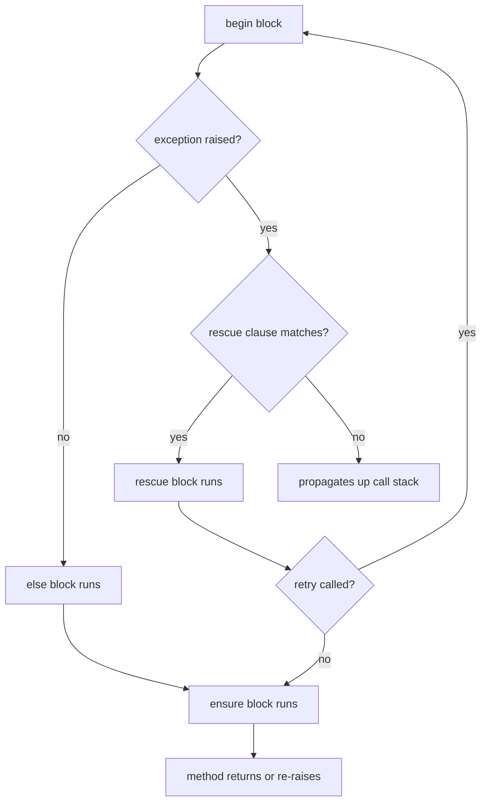

# Ruby Error Handling

> [!abstract] TL;DR
> Ruby exceptions form a hierarchy rooted at `Exception`, with `StandardError` as the practical base for application errors. The `begin`/`rescue`/`ensure`/`else`/`raise` construct is flexible — `rescue` can appear inline in methods without `begin`, multiple clauses handle different error types, and `retry` re-executes the `begin` block. Custom exceptions inherit from `StandardError` and can carry structured context.

---

## Intuition

**Analogy:** Ruby's exception system is like a multi-level escalation procedure. A network error first hits the most specific rescue (retrying the request), then a broader one (logging the failure), then `ensure` (closing the connection regardless). The hierarchy means you can rescue broadly (`StandardError`) or surgically (`ActiveRecord::RecordNotFound`). `raise` and `fail` are synonyms — use `raise` for raising new errors, `fail` is idiomatic in some teams for logical failures.

---

## Exception Hierarchy

```
Exception
├── ScriptError
│   ├── LoadError
│   ├── NotImplementedError
│   └── SyntaxError
├── SignalException
│   └── Interrupt      ← Ctrl+C
├── SystemExit         ← exit(0)
├── NoMemoryError
└── StandardError      ← RESCUE THIS (not Exception)
    ├── RuntimeError   ← raise "message" with no class
    ├── ArgumentError
    ├── TypeError
    ├── NameError
    │   └── NoMethodError
    ├── IOError
    │   └── EOFError
    ├── IndexError
    ├── KeyError
    ├── StopIteration
    ├── ZeroDivisionError
    ├── Errno::ENOENT  ← File not found
    ├── Errno::ECONNREFUSED
    └── ... (application custom exceptions)
```

---

## Basic Structure

```ruby
# Full begin/rescue/else/ensure
begin
  result = Integer(user_input)   # raises ArgumentError if not a valid integer
  data   = fetch_from_api(result)
rescue ArgumentError => e
  puts "Invalid input: #{e.message}"
  result = 0
rescue Errno::ECONNREFUSED, Errno::ETIMEDOUT => e
  puts "Network error: #{e.message}"
  result = nil
rescue StandardError => e
  # Catch-all for unexpected errors — log but don't silently swallow
  logger.error("Unexpected: #{e.class}: #{e.message}\n#{e.backtrace.first(5).join("\n")}")
  raise   # re-raise the same exception
else
  # Only runs if NO exception was raised in begin block
  puts "Success: #{result}"
ensure
  # ALWAYS runs — connection cleanup, file close, etc.
  close_connection if defined?(connection)
end
```

---

## rescue in Methods (Inline Form)

```ruby
# No begin needed — rescue applies to entire method body
def parse_config(path)
  YAML.safe_load(File.read(path))
rescue Errno::ENOENT
  {}   # file missing — return empty config
rescue Psych::SyntaxError => e
  raise "Bad YAML in #{path}: #{e.message}"
end

# One-liner rescue (use sparingly)
def safe_divide(a, b)
  a / b rescue 0
end
```

---

## raise and fail

```ruby
# raise with message (creates RuntimeError)
raise "Something went wrong"

# raise with class and message
raise ArgumentError, "Expected positive integer, got #{n}"

# raise with class and full constructor args
raise CustomError.new(user_id: 42, action: :delete)

# Re-raise the current exception (in rescue block)
rescue StandardError => e
  logger.error(e)
  raise   # preserves original backtrace and exception type

# fail — synonym for raise (idiomatic in some teams)
fail "Not implemented" unless respond_to?(:compute)
```

---

## Custom Exceptions

```ruby
# Hierarchy of custom errors
class AppError < StandardError; end

class ValidationError < AppError
  attr_reader :field, :value

  def initialize(field, value, message = nil)
    @field   = field
    @value   = value
    super(message || "Invalid #{field}: #{value.inspect}")
  end
end

class AuthorizationError < AppError
  def initialize(user, resource, action)
    super("User #{user.id} cannot #{action} #{resource.class.name}##{resource.id}")
  end
end

class ExternalServiceError < AppError
  attr_reader :service, :status_code

  def initialize(service, status_code, body)
    @service     = service
    @status_code = status_code
    super("#{service} returned #{status_code}: #{body[0..100]}")
  end
end

# Usage
def update_age(user, age)
  raise ValidationError.new(:age, age, "Age must be between 0 and 150") unless (0..150).cover?(age)
  user.update!(age: age)
end

begin
  update_age(user, -5)
rescue ValidationError => e
  puts "Field: #{e.field}, Value: #{e.value}, Message: #{e.message}"
end
```

---

## retry for Transient Failures

```ruby
MAX_RETRIES = 3
RETRY_DELAY = 1  # seconds

def fetch_with_retry(url)
  attempts = 0

  begin
    attempts += 1
    response = HTTParty.get(url, timeout: 10)
    raise ExternalServiceError.new("API", response.code, response.body) unless response.success?
    response.parsed_response

  rescue ExternalServiceError, Net::ReadTimeout, Errno::ECONNREFUSED => e
    if attempts < MAX_RETRIES
      sleep(RETRY_DELAY * (2 ** (attempts - 1)))  # exponential backoff: 1s, 2s, 4s
      retry
    else
      raise  # re-raise after exhausting retries
    end
  end
end

# Or use the 'retryable' gem pattern
def with_retries(max: 3, on: StandardError, &block)
  attempts = 0
  begin
    attempts += 1
    block.call(attempts)
  rescue *Array(on) => e
    raise if attempts >= max
    sleep(2 ** attempts)
    retry
  end
end

with_retries(max: 3, on: [Net::ReadTimeout, Errno::ECONNREFUSED]) do |attempt|
  puts "Attempt #{attempt}"
  HTTParty.get("https://api.example.com/data")
end
```

---

## ensure for Resource Cleanup

```ruby
def process_upload(file_path)
  file    = File.open(file_path, "rb")
  db_conn = Database.connect

  begin
    data = file.read
    db_conn.insert(data)
  rescue IOError, Database::Error => e
    logger.error("Upload failed: #{e.message}")
    raise UploadError, "Processing failed: #{e.message}"
  ensure
    file&.close          # safe navigation — closes even if open failed
    db_conn&.disconnect
  end
end

# Prefer the block form which handles cleanup automatically:
def process_upload_v2(file_path)
  File.open(file_path, "rb") do |file|     # auto-closed
    Database.transaction do                 # auto-rolled back on error
      data = file.read
      Database.insert(data)
    end
  end
end
```

---

## Exception Flow Diagram



---

## Common Pitfalls

- **Rescuing `Exception`** — catches `Interrupt` (Ctrl+C), `SignalException`, and `SystemExit`. Use `StandardError` unless you specifically need to handle those. This is the most common Ruby mistake.
- **Silent rescue** — `rescue; nil` hides all errors including bugs. At minimum, log: `rescue => e; logger.error(e); nil`.
- **`retry` without a counter** — unbounded `retry` creates infinite loops on persistent errors. Always limit with an attempts counter.
- **`ensure` return value** — if `ensure` contains a `return` statement, it silently discards the rescued exception's return value. Never use explicit `return` in `ensure` blocks.
- **Backtrace preservation on re-raise** — using `raise e` (with an exception variable) creates a new backtrace from the current line. Use bare `raise` (no argument) inside a rescue block to preserve the original backtrace.

---

## Review Questions

1. Why is `rescue Exception` dangerous? Name two specific exception types it catches that would prevent normal program shutdown.
2. Explain the difference between `raise e` and bare `raise` inside a rescue block. What information is lost with `raise e`?
3. A network call fails with `Errno::ECONNREFUSED`. Write a `begin`/`rescue`/`retry` block that retries up to 3 times with 1s, 2s, 4s delays (exponential backoff), then re-raises.
4. What does the `else` clause in a `begin`/`rescue`/`else`/`ensure` block do? Give a scenario where using it is cleaner than alternatives.

---

#Ruby #Rails
