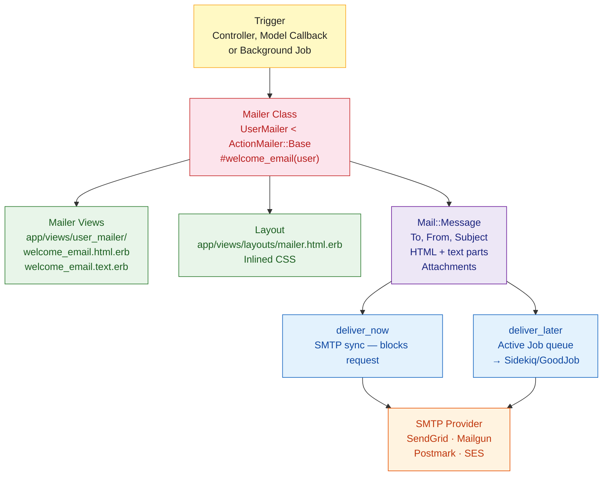

# Rails Action Mailer

> [!abstract] TL;DR
> Action Mailer is Rails' built-in email framework. Mailer classes inherit from `ActionMailer::Base` and look like controllers — they have methods that render views (`.html.erb` and `.text.erb`) and produce `Mail::Message` objects. Emails are delivered synchronously via `deliver_now` or asynchronously via `deliver_later` (Active Job + Sidekiq). CSS must be inlined for email clients. The `letter_opener` gem shows emails in the browser during development instead of sending them.

---

## Intuition

**Analogy:** Action Mailer is a second controller layer dedicated to email. Where an HTTP controller renders HTML for a browser, a mailer renders HTML and plain text for an email client. Both have instance variables, layouts, partials, helpers, and views. The key difference: an email is a one-way push to an unreliable client (Gmail, Outlook) that may render your HTML differently than Chrome does — so CSS must be inlined and layouts must be table-based or pre-tested.

---

## How It Works



---

## Mailer Class

```bash
# Generate a mailer
rails generate mailer UserMailer welcome_email password_reset confirmation
```

```ruby
# app/mailers/application_mailer.rb
class ApplicationMailer < ActionMailer::Base
  default from: "noreply@myapp.com"
  layout "mailer"
end

# app/mailers/user_mailer.rb
class UserMailer < ApplicationMailer
  # Called as: UserMailer.welcome_email(@user).deliver_later
  def welcome_email(user)
    @user      = user
    @login_url = login_url   # URL helpers available in mailers

    mail(
      to:      user.email,
      subject: "Welcome to MyApp, #{user.first_name}!"
    )
  end

  def password_reset(user, token)
    @user  = user
    @token = token
    @reset_url = edit_password_reset_url(token, email: user.email)

    mail(
      to:      user.email,
      subject: "Reset your MyApp password",
      reply_to: "support@myapp.com"
    )
  end

  # Email with attachment
  def monthly_report(user, pdf_path)
    @user = user
    attachments["report-#{Date.today}.pdf"] = File.read(pdf_path)

    mail(to: user.email, subject: "Your Monthly Report")
  end

  # Multipart email with inline image
  def promo_email(user)
    @user = user
    attachments.inline["banner.png"] = File.read(Rails.root.join("app/assets/images/banner.png"))

    mail(to: user.email, subject: "This month's offer")
  end
end
```

---

## Mailer Views

Action Mailer renders both HTML and plain text automatically when both views exist:

```erb
<%# app/views/user_mailer/welcome_email.html.erb %>
<!DOCTYPE html>
<html>
<body>
  <h1>Welcome, <%= @user.first_name %>!</h1>
  <p>Thanks for joining MyApp. Your account is ready.</p>
  <p>
    <%= link_to "Log in to MyApp", @login_url,
                style: "background:#007bff;color:#fff;padding:10px 20px;text-decoration:none;border-radius:4px" %>
  </p>
  <p>Questions? Reply to this email — we reply within 24 hours.</p>
</body>
</html>
```

```text
# app/views/user_mailer/welcome_email.text.erb
Welcome, <%= @user.first_name %>!

Thanks for joining MyApp. Your account is ready.

Log in here: <%= @login_url %>

Questions? Reply to this email — we reply within 24 hours.
```

```erb
<%# app/views/layouts/mailer.html.erb — shared email layout %>
<!DOCTYPE html>
<html>
<head>
  <meta http-equiv="Content-Type" content="text/html; charset=utf-8" />
  <style>
    /* Styles here get inlined by premailer-rails gem automatically */
    body { font-family: Arial, sans-serif; color: #333; }
    h1   { color: #007bff; }
    .footer { font-size: 12px; color: #999; margin-top: 40px; }
  </style>
</head>
<body>
  <%= yield %>
  <div class="footer">
    <p>MyApp Inc · 123 Main St · Unsubscribe: <%= unsubscribe_url %></p>
  </div>
</body>
</html>
```

---

## Delivery Configuration

```ruby
# config/environments/production.rb
config.action_mailer.delivery_method      = :smtp
config.action_mailer.perform_deliveries   = true
config.action_mailer.raise_delivery_errors = true
config.action_mailer.default_url_options  = { host: "myapp.com", protocol: "https" }

config.action_mailer.smtp_settings = {
  address:              "smtp.sendgrid.net",
  port:                 587,
  domain:               "myapp.com",
  user_name:            "apikey",
  password:             ENV["SENDGRID_API_KEY"],
  authentication:       :plain,
  enable_starttls_auto: true
}

# config/environments/development.rb  — letter_opener shows emails in browser
config.action_mailer.delivery_method     = :letter_opener
config.action_mailer.perform_deliveries  = true
config.action_mailer.default_url_options = { host: "localhost", port: 3000 }

# config/environments/test.rb  — capture emails without sending
config.action_mailer.delivery_method     = :test
config.action_mailer.perform_deliveries  = true
```

---

## Inlined CSS with premailer-rails

Most email clients strip `<style>` tags. The `premailer-rails` gem automatically inlines CSS before delivery:

```ruby
# Gemfile
gem "premailer-rails"
gem "nokogiri"   # required by premailer

# No configuration needed — it hooks into ActionMailer automatically
# CSS in <style> tags is moved inline:
# <p style="font-family:Arial;color:#333;">Hello</p>
```

---

## Background Delivery with Active Job

```ruby
# Deliver immediately (blocks request — avoid in controllers)
UserMailer.welcome_email(@user).deliver_now

# Deliver via Active Job queue (preferred in controllers/models)
UserMailer.welcome_email(@user).deliver_later

# Deliver at a specific time
UserMailer.promo_email(@user).deliver_later(wait: 1.hour)
UserMailer.promo_email(@user).deliver_later(wait_until: Time.zone.parse("2026-08-01 09:00"))

# Use specific queue
UserMailer.welcome_email(@user).deliver_later(queue: :mailers)
```

```ruby
# config/application.rb — configure mailer queue
config.action_mailer.deliver_later_queue_name = :mailers

# Sidekiq configuration (sidekiq.yml)
:queues:
  - [critical, 3]
  - [mailers, 2]
  - [default, 1]
```

---

## Mailer Previews

Previews let you view emails in the browser at `/rails/mailers/` without sending:

```ruby
# test/mailers/previews/user_mailer_preview.rb
class UserMailerPreview < ActionMailer::Preview
  def welcome_email
    UserMailer.welcome_email(User.first)
  end

  def password_reset
    user  = User.first
    token = user.generate_reset_password_token
    UserMailer.password_reset(user, token)
  end

  def monthly_report
    UserMailer.monthly_report(User.first, Rails.root.join("tmp/sample.pdf").to_s)
  end
end

# Visit: http://localhost:3000/rails/mailers/user_mailer/welcome_email
```

---

## Testing Mailers

```ruby
# spec/mailers/user_mailer_spec.rb
RSpec.describe UserMailer, type: :mailer do
  describe "#welcome_email" do
    let(:user) { create(:user, first_name: "Alice", email: "alice@example.com") }
    let(:mail) { described_class.welcome_email(user) }

    it "renders the subject" do
      expect(mail.subject).to eq("Welcome to MyApp, Alice!")
    end

    it "sends to the user email" do
      expect(mail.to).to eq(["alice@example.com"])
    end

    it "renders from noreply" do
      expect(mail.from).to eq(["noreply@myapp.com"])
    end

    it "includes the user name in the body" do
      expect(mail.body.encoded).to include("Alice")
    end
  end
end

# spec/requests/users_spec.rb — integration test
RSpec.describe "POST /users" do
  it "enqueues a welcome email" do
    expect {
      post "/users", params: { user: { email: "new@test.com", password: "secret" } }
    }.to have_enqueued_mail(UserMailer, :welcome_email)
  end
end
```

---

## Trade-offs

| Delivery Method | Use Case | Pros | Cons |
|---|---|---|---|
| `deliver_now` | Critical transactional emails | Immediate, simple | Blocks request; failures crash action |
| `deliver_later` | Most emails | Non-blocking; retryable | Requires job worker; slight delay |
| `:letter_opener` | Development | Visual preview in browser | Dev only |
| `:test` | Tests | No SMTP needed; inspectable | Dev/test only |
| `:sendmail` | Small scale | No SMTP config | Server must have sendmail |

---

## Common Pitfalls

- **CSS not inlined** — email clients (Outlook, Gmail) strip `<style>` blocks. Without `premailer-rails` or manual inline styles, your emails look unstyled. Always inline CSS.
- **Missing `default_url_options`** — URL helpers in mailers need a `host` since there is no HTTP request context. Missing this raises `ArgumentError: Missing host to link to`.
- **Calling `deliver_now` in a controller** — synchronous delivery in a controller blocks the response until the SMTP server responds (can be seconds). Always use `deliver_later`.
- **Forgetting the text template** — if only `.html.erb` exists, Gmail's "plain text" view is empty. Always create a `.text.erb` companion.
- **Previews querying production data** — Preview classes run in development but query your development database. Use `User.first` with seed data, not hardcoded IDs that may not exist.

---

## Review Questions

1. How does Action Mailer resemble an HTTP controller? List three things they share.
2. Why must CSS be inlined in HTML emails, and which gem automates this in Rails?
3. Explain the difference between `deliver_now` and `deliver_later`. When is each appropriate?
4. How do mailer previews work, and why are they useful during development?

---

#Ruby #Rails #ActionMailer #Email #SMTP #BackgroundJobs
