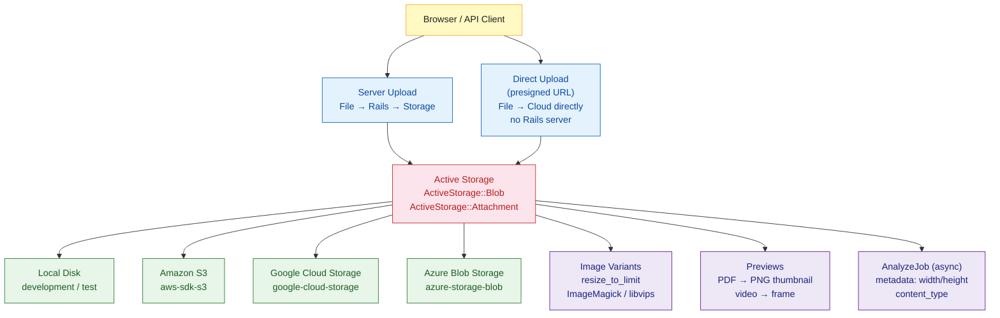

# Rails Active Storage

> [!abstract] TL;DR
> Active Storage is Rails' built-in file attachment framework (since Rails 5.2). It provides a unified API for local disk storage, Amazon S3, Google Cloud Storage, and Azure Blob Storage. Attachments are declared on models (`has_one_attached`, `has_many_attached`), processed via background jobs, and image variants are generated on demand using ImageMagick or libvips. Direct uploads let browsers upload straight to the cloud, bypassing the Rails server entirely.

---

## Intuition

**Analogy:** Before Active Storage, attaching a file to a model was like building your own postal system — you chose the storage location, wrote the tracking logic, handled URLs manually, and integrated the image processor yourself. Active Storage is a managed courier service: you hand it a file and say "deliver this to S3 and give me a tracking URL." It handles routing, receipts, image transformations, direct-upload shortcuts, and even previews for PDFs and videos. You interact with one API regardless of whether files live on disk, S3, or Azure.

---

## How It Works



---

## Setup

```bash
# Generate Active Storage tables (blobs, attachments, variant_records)
rails active_storage:install
rails db:migrate
```

```yaml
# config/storage.yml
local:
  service: Disk
  root: <%= Rails.root.join("storage") %>

amazon:
  service: S3
  access_key_id:     <%= ENV["AWS_ACCESS_KEY_ID"] %>
  secret_access_key: <%= ENV["AWS_SECRET_ACCESS_KEY"] %>
  region:            us-east-1
  bucket:            <%= ENV["AWS_BUCKET"] %>

google:
  service: GCS
  credentials: <%= Rails.root.join("path/to/keyfile.json") %>
  project:     my-project
  bucket:      my-bucket

azure:
  service: AzureStorage
  storage_account_name: account_name
  storage_access_key:   <%= ENV["AZURE_STORAGE_KEY"] %>
  container:            my-container
```

```ruby
# config/environments/production.rb
config.active_storage.service = :amazon

# config/environments/development.rb
config.active_storage.service = :local
```

---

## Model Attachments

```ruby
# app/models/user.rb
class User < ApplicationRecord
  has_one_attached :avatar                 # single file
  has_many_attached :documents             # multiple files

  # Validation — use active_storage_validations gem or custom validator
  validate :avatar_content_type

  private

  def avatar_content_type
    if avatar.attached? && !avatar.content_type.in?(%w[image/png image/jpeg image/webp])
      errors.add(:avatar, "must be a PNG, JPEG, or WebP")
    end
  end
end

# app/models/product.rb
class Product < ApplicationRecord
  has_one_attached :cover_image
  has_many_attached :gallery_images

  # Eager load attachments to avoid N+1 queries
  scope :with_cover, -> { with_attached_cover_image }
end
```

---

## Controllers — Upload and Delete

```ruby
# app/controllers/users_controller.rb
class UsersController < ApplicationController
  def update
    @user = User.find(params[:id])

    if @user.update(user_params)
      redirect_to @user, notice: "Profile updated"
    else
      render :edit, status: :unprocessable_entity
    end
  end

  def purge_avatar
    @user = User.find(params[:id])
    @user.avatar.purge_later  # async deletion via Active Job
    redirect_to edit_user_path(@user)
  end

  private

  def user_params
    params.require(:user).permit(:name, :email, :avatar, documents: [])
  end
end
```

```erb
<%# app/views/users/edit.html.erb %>
<%= form_with model: @user do |f| %>
  <%= f.label :avatar, "Profile Photo" %>
  <%= f.file_field :avatar, accept: "image/*", direct_upload: true %>

  <% if @user.avatar.attached? %>
    <%= image_tag @user.avatar, class: "avatar-preview" %>
    <%= button_to "Remove", purge_avatar_user_path(@user), method: :delete,
                  data: { confirm: "Remove avatar?" } %>
  <% end %>

  <%# Multiple file upload %>
  <%= f.label :documents, "Attach Documents" %>
  <%= f.file_field :documents, multiple: true, direct_upload: true %>

  <%= f.submit "Save" %>
<% end %>
```

---

## Image Variants

Variants are generated lazily on first request and cached:

```ruby
# app/models/user.rb — declare variants (Rails 7+)
class User < ApplicationRecord
  has_one_attached :avatar do |attachable|
    attachable.variant :thumb,  resize_to_fill: [100, 100]
    attachable.variant :medium, resize_to_limit: [400, 400]
    attachable.variant :og,     resize_to_fill: [1200, 630], format: :jpeg
  end
end

# In a controller or view:
# user.avatar.variant(:thumb) — uses pre-declared variant
# user.avatar.variant(resize_to_fill: [200, 200]) — ad-hoc variant
```

```ruby
# config/application.rb — choose processor
config.active_storage.variant_processor = :vips      # libvips (fast, recommended)
# config.active_storage.variant_processor = :mini_magick  # ImageMagick (legacy)
```

```erb
<%# Display variants in views %>
<%= image_tag @user.avatar.variant(:thumb) %>
<%= image_tag @user.avatar.variant(:medium) %>

<%# Check if attached before rendering %>
<% if @user.avatar.attached? %>
  <%= image_tag @user.avatar.variant(resize_to_fill: [80, 80]),
                alt: @user.name, class: "rounded-full" %>
<% end %>

<%# Eager-load attachment + variant_records in index %>
<%# In controller: @users = User.with_attached_avatar %>
<% @users.each do |user| %>
  <%= image_tag user.avatar.variant(:thumb) if user.avatar.attached? %>
<% end %>
```

---

## Direct Uploads

Direct uploads let the browser upload straight to S3, skipping the Rails server for the file bytes:

```javascript
// app/javascript/application.js
import * as ActiveStorage from "@rails/activestorage"
ActiveStorage.start()
```

```erb
<%# Use direct_upload: true on file field %>
<%= f.file_field :avatar, direct_upload: true %>
```

The flow:
1. Browser requests a presigned URL from Rails (`/rails/active_storage/direct_uploads`)
2. Rails creates an `ActiveStorage::Blob` record and returns presigned URL
3. Browser uploads file directly to S3
4. On form submit, only the signed blob ID is sent to Rails — not the file itself

---

## Previews

Active Storage generates image previews for non-image files:

```ruby
# Supported out of the box (requires poppler for PDF, ffmpeg for video)
@document.preview(resize_to_limit: [200, 200])   # PDF → PNG thumbnail
@video.preview(resize_to_limit: [400, 300])       # video → first frame

# In view
<%= image_tag @document.preview(:thumb) if @document.previewable? %>
```

---

## Trade-offs and Backends

| Backend | Cost | Latency | CDN | Setup Complexity |
|---|---|---|---|---|
| **Local Disk** | Free | Fastest (local) | No | None |
| **Amazon S3** | Pay per GB + requests | Low with CloudFront | Yes (CloudFront) | Low |
| **Google Cloud Storage** | Pay per GB | Low | Yes (Cloud CDN) | Low |
| **Azure Blob** | Pay per GB | Low | Yes (Azure CDN) | Low |
| **libvips** | Free | Faster than MiniMagick | — | apt install libvips |
| **ImageMagick** | Free | Slower, larger memory | — | apt install imagemagick |

---

## Common Pitfalls

- **N+1 on attachments** — iterating `@users.each { |u| image_tag u.avatar.url }` issues one query per user. Use the `with_attached_*` scope: `User.with_attached_avatar`.
- **`purge` vs `purge_later`** — `purge` deletes synchronously (blocks the request). `purge_later` enqueues a background job. Use `purge_later` in controllers.
- **Forgetting CORS for direct uploads** — S3 bucket CORS must allow PUT requests from the Rails app's origin, otherwise direct uploads fail with a CORS error.
- **Storing files in `/tmp` in production** — Heroku and other ephemeral filesystems reset `/tmp` between dyno restarts. Always use a cloud backend in production.
- **Missing `active_storage_validations` gem** — Rails has no built-in content type or size validation. Add the gem or write a custom validator; otherwise any file type can be uploaded.
- **Unprocessed variants in tests** — variant processing may not work in test without a processor installed. Configure `config.active_storage.service = :test` and skip variant assertions.

---

## Review Questions

1. What are the two database tables Active Storage creates, and what does each store?
2. Explain the direct upload flow: what requests happen, and why is it preferable for large files?
3. What is the difference between `purge` and `purge_later`, and when should you use each?
4. Your app displays user avatars in a list of 100 users. How do you prevent N+1 queries on the avatar attachment?

---

#Ruby #Rails #ActiveStorage #FileUploads #S3 #ImageProcessing
