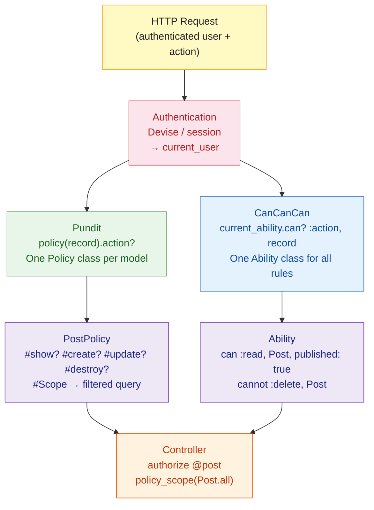

# Rails Authorization

> [!abstract] TL;DR
> Authorization answers "can this authenticated user do this action on this resource?" — distinct from authentication ("who are you?"). Rails has two dominant libraries: **Pundit** uses plain Ruby policy objects (one class per model) that are easy to test and reason about; **CanCanCan** centralizes all permissions in a single `Ability` class using a DSL. Both support record-level authorization and scope-based query filtering. Pundit is the modern preference for explicit, auditable policies.

---

## Intuition

**Analogy:** Authentication is the bouncer at the door checking your ID. Authorization is every locked room inside the venue — different doors open for staff, VIPs, and performers. Pundit gives each room its own lock and key (policy per model). CanCanCan gives the head of security one master list of who can go where (one `Ability` class for all rules). Pundit's approach means changing the "edit conference room" rule only touches one file and won't accidentally unlock the "delete stage" door.

---

## How It Works



---

## Pundit

### Policy Objects

Each model gets its own policy class in `app/policies/`:

```ruby
# app/policies/post_policy.rb
class PostPolicy < ApplicationPolicy
  # user   → current_user (injected by Pundit)
  # record → the Post instance being authorized

  def index?
    true   # anyone can list posts
  end

  def show?
    record.published? || user_owns_record?
  end

  def create?
    user.present?   # must be logged in
  end

  def update?
    user_owns_record? || user.admin?
  end

  def destroy?
    user.admin?
  end

  # Scope — filters the ActiveRecord query for index actions
  class Scope < ApplicationPolicy::Scope
    def resolve
      if user&.admin?
        scope.all
      else
        scope.where(published: true)
          .or(scope.where(user: user))
      end
    end
  end

  private

  def user_owns_record?
    record.user_id == user&.id
  end
end
```

```ruby
# app/policies/application_policy.rb  (generated by `rails g pundit:install`)
class ApplicationPolicy
  attr_reader :user, :record

  def initialize(user, record)
    @user   = user
    @record = record
  end

  def index?  = false
  def show?   = false
  def create? = false
  def update? = false
  def destroy? = false

  class Scope
    def initialize(user, scope)
      @user  = user
      @scope = scope
    end

    def resolve = raise NotImplementedError
    private attr_reader :user, :scope
  end
end
```

### Controllers with Pundit

```ruby
# app/controllers/posts_controller.rb
class PostsController < ApplicationController
  # Ensure every action calls authorize — raises if forgotten
  after_action :verify_authorized, except: :index
  after_action :verify_policy_scoped, only: :index

  def index
    @posts = policy_scope(Post)   # calls PostPolicy::Scope#resolve
  end

  def show
    @post = Post.find(params[:id])
    authorize @post               # calls PostPolicy#show?
  end

  def update
    @post = Post.find(params[:id])
    authorize @post               # calls PostPolicy#update?
    if @post.update(post_params)
      redirect_to @post
    else
      render :edit, status: :unprocessable_entity
    end
  end

  def destroy
    @post = Post.find(params[:id])
    authorize @post
    @post.destroy
    redirect_to posts_path
  end

  private

  def post_params
    params.require(:post).permit(:title, :body, :published)
  end
end
```

### Testing Pundit Policies

```ruby
# spec/policies/post_policy_spec.rb
RSpec.describe PostPolicy do
  subject { described_class }

  let(:admin)  { create(:user, admin: true) }
  let(:author) { create(:user) }
  let(:other)  { create(:user) }
  let(:post)   { create(:post, user: author, published: false) }

  permissions :update? do
    it "grants access to the author"   { expect(subject).to permit(author, post) }
    it "grants access to admins"       { expect(subject).to permit(admin, post) }
    it "denies access to other users"  { expect(subject).not_to permit(other, post) }
  end

  permissions :destroy? do
    it "only allows admins" { expect(subject).to permit(admin, post) }
    it "denies authors"     { expect(subject).not_to permit(author, post) }
  end
end
```

---

## CanCanCan

CanCanCan centralizes all rules in a single `Ability` class:

```ruby
# app/models/ability.rb
class Ability
  include CanCan::Ability

  def initialize(user)
    user ||= User.new  # guest user with no attributes

    if user.admin?
      can :manage, :all   # admin can do everything
    else
      # Anyone can read published posts
      can :read, Post, published: true

      if user.persisted?
        # Authors can manage their own posts
        can :create, Post
        can [:update, :destroy], Post, user_id: user.id

        # Users can manage their own profile
        can :manage, User, id: user.id

        # Cannot delete posts with comments (business rule)
        cannot :destroy, Post do |post|
          post.comments.any?
        end
      end
    end
  end
end
```

```ruby
# app/controllers/posts_controller.rb (CanCanCan style)
class PostsController < ApplicationController
  load_and_authorize_resource  # auto-loads @post and checks ability

  def index
    # @posts already loaded and scoped by CanCanCan
  end

  def show
    # @post already loaded and authorized
  end

  def update
    if @post.update(post_params)
      redirect_to @post
    else
      render :edit, status: :unprocessable_entity
    end
  end
end
```

---

## Role-Based Access Control (RBAC)

Implementing roles manually with Pundit:

```ruby
# db/migrate/..._add_role_to_users.rb
add_column :users, :role, :string, default: "member", null: false

# app/models/user.rb
class User < ApplicationRecord
  ROLES = %w[member editor admin].freeze
  validates :role, inclusion: { in: ROLES }

  def admin?  = role == "admin"
  def editor? = role == "editor" || admin?
  def member? = true
end

# app/policies/article_policy.rb
class ArticlePolicy < ApplicationPolicy
  def publish?
    user.editor?   # editors and admins can publish
  end

  def feature?
    user.admin?    # only admins can feature articles
  end
end
```

Multi-role with a `roles` table:

```ruby
# Many-to-many: users <-> roles through user_roles
class User < ApplicationRecord
  has_many :user_roles
  has_many :roles, through: :user_roles

  def has_role?(role_name)
    roles.exists?(name: role_name)
  end
end

# Policy using multi-role
class DashboardPolicy < ApplicationPolicy
  def show?
    user.has_role?("admin") || user.has_role?("manager")
  end
end
```

---

## Authorization in Views

```erb
<%# Only show Edit button if current_user can update %>
<% if policy(@post).update? %>
  <%= link_to "Edit", edit_post_path(@post), class: "btn" %>
<% end %>

<% if policy(@post).destroy? %>
  <%= button_to "Delete", @post, method: :delete, data: { confirm: "Sure?" } %>
<% end %>

<%# Pundit helper for CanCanCan-style in views %>
<% if can?(:update, @post) %>  <%# CanCanCan syntax %>
  <%= link_to "Edit", edit_post_path(@post) %>
<% end %>
```

---

## Pundit vs CanCanCan

| Aspect | Pundit | CanCanCan |
|---|---|---|
| Rule location | One file per model (`*_policy.rb`) | Single `ability.rb` for all rules |
| Explicitness | Very explicit — `authorize @post` | Implicit with `load_and_authorize_resource` |
| Testability | Policy classes are POROs — easy to unit test | Ability spec tests the whole class |
| Complexity scaling | Scales well — isolated policies | `Ability` grows large in complex apps |
| Custom actions | Simple — add `def publish?` | `can :publish, Post` — also simple |
| Error on missing auth | `Pundit::NotAuthorizedError` | `CanCan::AccessDenied` |
| Community preference | Modern standard | Mature, still widely used |

---

## Common Pitfalls

- **Forgetting `after_action :verify_authorized`** — without this guard, controllers silently skip authorization on new actions. Always set it on `ApplicationController` and use `skip_after_action` only when genuinely needed.
- **Authorizing the class vs an instance** — `authorize Post` checks `PostPolicy#index?`; `authorize @post` checks `PostPolicy#show?` (or the action method). Check which object you pass.
- **N+1 in policy scopes** — `policy_scope` filters records but if each record then calls `record.user`, you get N+1. Use `includes(:user)` inside `Scope#resolve`.
- **CanCanCan `cannot` after `can`** — rules are additive. A `cannot` after a `can` blocks access. Order matters: `can :manage, :all` followed by `cannot :destroy, Post` correctly restricts destroy.
- **Exposing IDs in URLs** — authorization does not prevent ID enumeration. Use UUIDs or verify that `policy_scope` always returns only records the user can see.

---

## Review Questions

1. What is the difference between authentication and authorization? Why are they separate concerns?
2. In Pundit, what is the `Scope` class for, and how does it differ from the regular policy methods?
3. An admin can do everything, editors can publish but not delete, and members can only read. Model this in Pundit using role methods.
4. Why does Pundit recommend `after_action :verify_authorized` in controllers? What problem does it prevent?

---

#Ruby #Rails #Authorization #Pundit #CanCanCan #Security #RBAC
