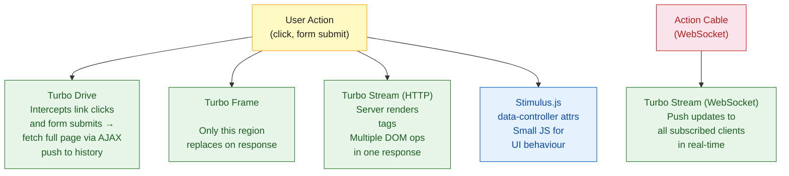

# Rails Hotwire

> [!abstract] TL;DR
> Hotwire (HTML Over The Wire) is the default Rails 7+ frontend stack that delivers SPA-like interactivity without writing JavaScript. It consists of three parts: **Turbo Drive** (replaces full-page loads with AJAX navigation), **Turbo Frames** (replace page fragments independently), and **Turbo Streams** (push targeted DOM updates over WebSocket or HTTP). **Stimulus.js** handles the small amount of JavaScript needed for interactive widgets. Together they eliminate 90% of custom JavaScript in most Rails apps.

---

## Intuition

**Analogy:** Traditional Rails sends complete HTML pages — like mailing a new newspaper every time the reader turns a page. SPAs (React/Vue) send JSON and rebuild the page in the browser — like sending raw data and expecting the reader to typeset their own newspaper. Hotwire takes a middle path: the server sends pre-rendered HTML snippets ("just the sports section") and the browser surgically replaces the right piece of the page. The newspaper is typeset by professionals (the server with ERB/Ruby), delivered precisely where needed, with no client-side typesetting required.

---

## How It Works



---

## Turbo Drive

Turbo Drive intercepts all `<a>` clicks and `<form>` submits and replaces the `<body>` via AJAX — preserving the `<head>` and therefore avoiding JS/CSS re-parse:

```ruby
# config/importmap.rb — Turbo is included by default in Rails 7+
pin "turbo-rails", to: "turbo.js"

# No changes needed in controllers — Turbo Drive is transparent
# Opt out of Turbo for a specific link:
```

```erb
<%# Opt out of Turbo Drive for a specific link %>
<%= link_to "Download PDF", report_path(@report), data: { turbo: false } %>

<%# Or disable for a whole form %>
<%= form_with model: @upload, data: { turbo: false } do |f| %>
  ...
<% end %>
```

---

## Turbo Frames

A `<turbo-frame>` is an independently updatable region. When a link inside a frame is clicked, only that frame's content is replaced:

```erb
<%# app/views/posts/index.html.erb %>
<%= turbo_frame_tag "post_list" do %>
  <% @posts.each do |post| %>
    <div>
      <%= link_to post.title, post_path(post) %>
      <%# This link target is also wrapped in turbo-frame "post_list",
          so only this region updates — not the whole page %>
    </div>
  <% end %>
<% end %>

<%# app/views/posts/show.html.erb %>
<%= turbo_frame_tag "post_list" do %>
  <h2><%= @post.title %></h2>
  <p><%= @post.body %></p>
  <%= link_to "Back", posts_path %>
<% end %>
```

Inline editing with a frame:

```erb
<%# Clicking "Edit" loads the edit form IN PLACE, no page change %>
<%= turbo_frame_tag dom_id(@post) do %>
  <p><%= @post.title %></p>
  <%= link_to "Edit", edit_post_path(@post) %>
<% end %>

<%# edit.html.erb %>
<%= turbo_frame_tag dom_id(@post) do %>
  <%= form_with model: @post do |f| %>
    <%= f.text_field :title %>
    <%= f.submit "Save" %>
  <% end %>
<% end %>
```

---

## Turbo Streams

Turbo Streams send server-rendered operations (`append`, `prepend`, `replace`, `update`, `remove`, `before`, `after`) that target DOM elements by ID:

```ruby
# app/controllers/posts_controller.rb
def create
  @post = Post.new(post_params)

  if @post.save
    respond_to do |format|
      format.turbo_stream  # renders create.turbo_stream.erb
      format.html { redirect_to posts_path }
    end
  else
    render :new, status: :unprocessable_entity
  end
end
```

```erb
<%# app/views/posts/create.turbo_stream.erb %>
<%# Prepend new post to list AND clear the form %>
<%= turbo_stream.prepend "posts", partial: "posts/post", locals: { post: @post } %>
<%= turbo_stream.replace "new_post_form", partial: "posts/form",
                          locals: { post: Post.new } %>
```

**Broadcasting over WebSocket** (real-time push to all subscribers):

```ruby
# app/models/post.rb
class Post < ApplicationRecord
  after_create_commit -> { broadcast_prepend_to "posts" }
  after_update_commit -> { broadcast_replace_to "posts" }
  after_destroy_commit -> { broadcast_remove_to  "posts" }
end
```

```erb
<%# Subscribe any page to "posts" stream %>
<%= turbo_stream_from "posts" %>

<div id="posts">
  <%= render @posts %>
</div>
```

---

## Stimulus.js

Stimulus adds lightweight JavaScript behaviour via `data-controller` HTML attributes. It does not manage state or render HTML — that is the server's job:

```javascript
// app/javascript/controllers/counter_controller.js
import { Controller } from "@hotwired/stimulus"

export default class extends Controller {
  static targets = ["count"]
  static values  = { count: { type: Number, default: 0 } }

  increment() {
    this.countValue++
  }

  countValueChanged() {
    this.countTarget.textContent = this.countValue
  }
}
```

```erb
<%# Any HTML element can become a Stimulus controller %>
<div data-controller="counter">
  <span data-counter-target="count">0</span>
  <button data-action="click->counter#increment">+1</button>
</div>
```

---

## StimulusReflex

StimulusReflex extends Stimulus with server-side reflexes — a browser event triggers a server-side Ruby method that re-renders the page via Turbo Streams, all with minimal JavaScript:

```ruby
# app/reflexes/search_reflex.rb
class SearchReflex < ApplicationReflex
  def search
    @posts = Post.where("title LIKE ?", "%#{element.value}%")
    morph "#search-results", render("posts/results", posts: @posts)
  end
end
```

```erb
<input data-reflex="input->Search#search" placeholder="Search..." />
<div id="search-results">
  <%= render "posts/results", posts: @posts %>
</div>
```

---

## Hotwire vs SPA Frameworks

| Feature | Hotwire | React / Vue SPA |
|---|---|---|
| HTML rendering | Server (ERB/Haml) | Client (JSX/templates) |
| State management | Server + Session | Client state (Redux, Pinia) |
| JavaScript needed | Minimal (Stimulus) | All UI logic |
| Initial page load | Fast (full HTML) | Slow (JS bundle parse) |
| Real-time updates | Turbo Streams + Action Cable | WebSocket + client re-render |
| SEO | Excellent (SSR by default) | Needs SSR setup |
| Team skills | Ruby developer friendly | Requires JS specialists |
| Complexity ceiling | Limited for complex UIs | Can handle any UI complexity |

---

## Common Pitfalls

- **Missing `turbo-frame` ID on response** — if the response doesn't contain a matching `<turbo-frame id="...">`, Turbo replaces the frame with nothing (blank region). Always wrap both the link target and the response in matching IDs.
- **Form redirect after Turbo Stream** — returning `redirect_to` from a `format.turbo_stream` block causes a full Turbo Drive navigation. Return `format.turbo_stream` and render the stream template, with `format.html { redirect_to ... }` as the fallback.
- **Status 422 for invalid forms** — Turbo requires `status: :unprocessable_entity` (422) on failed form submissions to detect the error and re-render. Omitting it causes Turbo to do nothing.
- **Broadcasting before commit** — using `after_create` instead of `after_create_commit` broadcasts before the DB transaction commits. Always use `_commit` callbacks for broadcasts.
- **Stimulus `connect()` not called** — if Stimulus doesn't find the controller file in the importmap or esbuild manifest, it silently does nothing. Check `data-controller` matches the filename (kebab-case).

---

## Review Questions

1. Explain the difference between Turbo Drive, Turbo Frames, and Turbo Streams. When would you choose each?
2. Why does Turbo require `status: :unprocessable_entity` on failed form submissions?
3. A user posts a new comment and all other users on the same page should see it appear instantly. Which Hotwire feature handles this and what Rails model hook enables it?
4. What role does Stimulus.js play in the Hotwire stack, and what does it explicitly NOT do (by design)?

---

#Ruby #Rails #Hotwire #Turbo #Stimulus #WebSockets
