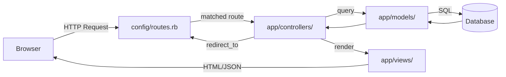
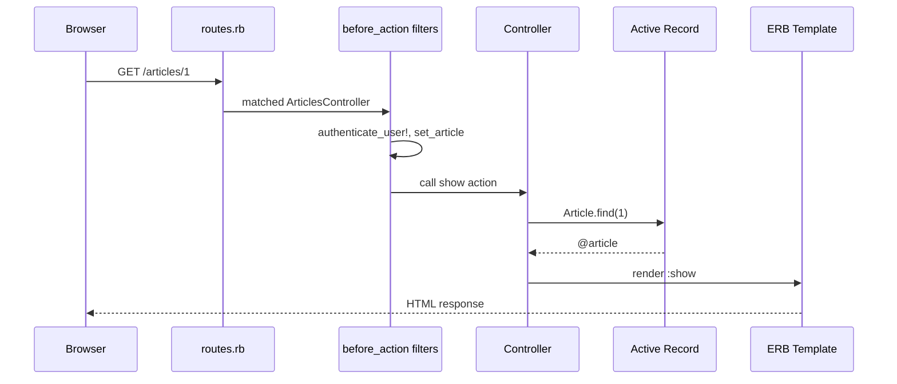

# Rails Overview

> [!abstract] TL;DR
> Ruby on Rails is an opinionated MVC web framework built around "Convention over Configuration" — you follow naming conventions and Rails provides routing, ORM, views, mailer, jobs, and WebSockets out of the box with minimal boilerplate. The `rails` CLI generates scaffold, migrations, and tests; the directory structure is standardized so every Rails app looks familiar regardless of who wrote it.

---

## Intuition

**Analogy:** Rails is a well-organized city grid — every building (model, controller, view) has a predictable address. If you know the conventions, you can navigate any Rails app on day one. Django is similar, but Rails goes further: `rails generate scaffold Post title:string body:text` creates the model, migration, controller, views, routes, and tests in one command. Convention eliminates decisions so you focus on the unique parts of your application.

The price of conventions is that fighting them is painful. When your domain doesn't fit MVC or your naming deviates from Rails' expectations, friction builds rapidly.

---

## Core Principles

**Convention over Configuration (CoC):**
- Model `User` → table `users` (pluralized snake_case)
- Controller `UsersController` → routes `/users`
- View at `app/views/users/index.html.erb`
- Foreign key `user_id` links to `users` table

**Don't Repeat Yourself (DRY):**
- `has_many :posts` generates `user.posts`, `user.posts.build`, `user.post_ids=` etc.
- Helpers, concerns, and concerns centralize shared behavior

**MVC Architecture:**



---

## Rails Directory Structure

```
myapp/
├── app/
│   ├── controllers/        ← Action Controller subclasses
│   │   └── application_controller.rb
│   ├── models/             ← Active Record subclasses
│   │   └── application_record.rb
│   ├── views/              ← ERB/Slim/Haml templates
│   │   └── layouts/application.html.erb
│   ├── helpers/            ← View helper modules
│   ├── jobs/               ← Active Job subclasses
│   ├── mailers/            ← Action Mailer subclasses
│   ├── channels/           ← Action Cable channels
│   └── assets/             ← CSS, JS, images (Sprockets)
├── bin/
│   ├── rails               ← rails CLI entry point
│   └── bundle
├── config/
│   ├── routes.rb           ← URL routing
│   ├── database.yml        ← DB connection config
│   ├── application.rb      ← App-wide config
│   └── environments/       ← dev/test/prod configs
├── db/
│   ├── schema.rb           ← current DB schema snapshot
│   └── migrate/            ← migration files (timestamped)
├── Gemfile                 ← gem dependencies
├── Gemfile.lock
└── test/ (or spec/)        ← test files
```

---

## The rails CLI

| Command | Effect |
|---|---|
| `rails new myapp --database=postgresql` | Generate new app with Postgres |
| `rails new myapp --api` | API-only mode (no views) |
| `rails server` / `rails s` | Start Puma dev server |
| `rails console` / `rails c` | IRB with app loaded |
| `rails generate model Post title:string` | Generate model + migration |
| `rails generate controller Posts index show` | Generate controller + views |
| `rails generate scaffold Article title:string body:text` | Full CRUD scaffold |
| `rails db:create` | Create database |
| `rails db:migrate` | Run pending migrations |
| `rails db:rollback` | Undo last migration |
| `rails db:seed` | Run `db/seeds.rb` |
| `rails routes` | List all registered routes |
| `rails test` / `rspec` | Run test suite |
| `rails assets:precompile` | Compile assets for production |

---

## Rails Components

**Active Record** — ORM that maps Ruby classes to database tables:
```ruby
class Article < ApplicationRecord
  belongs_to :user
  has_many :comments
  validates :title, presence: true
end
```

**Action Controller** — handles HTTP requests and responses:
```ruby
class ArticlesController < ApplicationController
  before_action :authenticate_user!
  before_action :set_article, only: [:show, :edit, :update, :destroy]

  def index
    @articles = Article.all.order(created_at: :desc)
  end

  def show; end   # @article set by before_action

  private

  def set_article
    @article = Article.find(params[:id])
  end
end
```

**Action View** — ERB templates with helpers:
```erb
<!-- app/views/articles/index.html.erb -->
<% @articles.each do |article| %>
  <%= link_to article.title, article_path(article) %>
<% end %>
```

**Action Mailer** — email sending with templates:
```ruby
class UserMailer < ApplicationMailer
  def welcome_email(user)
    @user = user
    mail(to: @user.email, subject: "Welcome to MyApp!")
  end
end
UserMailer.welcome_email(user).deliver_later
```

**Active Job** — background job interface (backend: Sidekiq, Resque, etc.):
```ruby
class ProcessUploadJob < ApplicationJob
  queue_as :default

  def perform(file_id)
    file = UploadedFile.find(file_id)
    file.process!
  end
end
ProcessUploadJob.perform_later(file.id)
```

**Action Cable** — WebSocket real-time features:
```ruby
class ChatChannel < ApplicationCable::Channel
  def subscribed
    stream_from "chat_#{params[:room]}"
  end
end
ActionCable.server.broadcast("chat_general", { message: "Hello!" })
```

---

## Rails Request Lifecycle



---

## Common Pitfalls

- **Skipping `rails db:migrate` after adding a migration** — the schema is not applied until migration runs. Symptoms: `ActiveRecord::StatementInvalid: no such column`. Always run after `generate model` or `generate migration`.
- **Forgetting `--api` flag** — generating a standard Rails app when you only need an API pulls in views, assets, and browser-session middleware you won't use. Use `rails new myapp --api` for pure API projects.
- **God controllers** — cramming business logic into controllers violates Single Responsibility. Move complex logic to service objects (`app/services/`) or model methods.
- **`rails console` mutations in production** — `rails c -e production` is connected to the live database. Always use `--sandbox` flag for exploratory queries: `rails c --sandbox`.
- **Generator noise** — `rails generate scaffold` creates many files you may not need. Review generated files; delete unused helpers, assets, and tests.

---

## Review Questions

1. Explain "Convention over Configuration" with two concrete examples of how Rails infers behavior from naming alone.
2. What is the difference between `rails generate model`, `rails generate controller`, and `rails generate scaffold`? What files does each create?
3. Where does business logic belong in Rails? Name three alternatives to putting it in the controller, with one use case each.
4. Trace a `GET /articles/1` request through Rails: from routing, through controller callbacks, to Active Record query, to template rendering.

---

#Ruby #Rails
