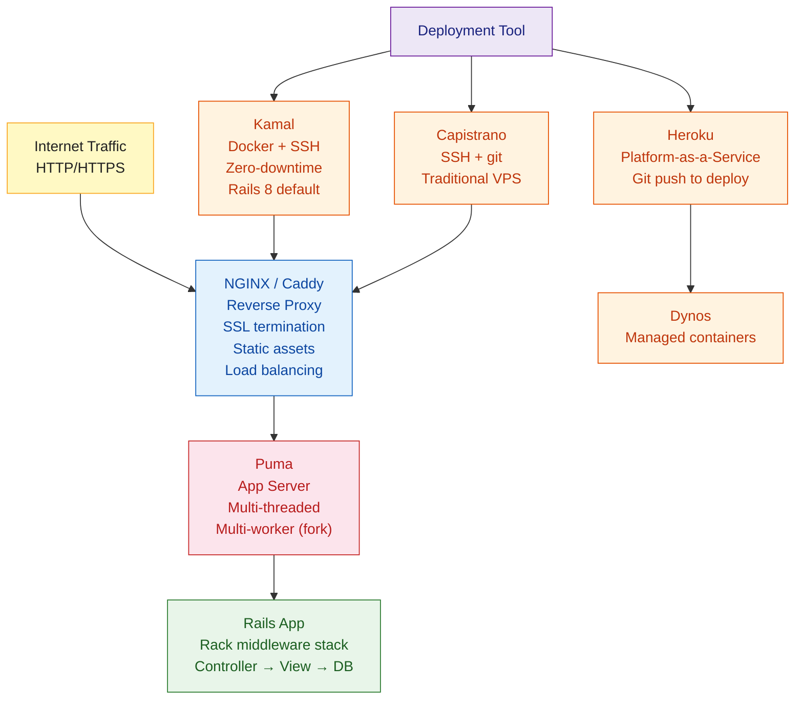

# Rails Deployment

> [!abstract] TL;DR
> Deploying Rails in production means choosing a deployment tool, configuring Puma (the default app server), wiring up NGINX as a reverse proxy, and managing the asset pipeline. The modern default is **Kamal** (Docker-based, introduced by DHH, ships with Rails 8) — zero-downtime deploys via `kamal deploy`. **Capistrano** remains popular for SSH-based deploys without Docker. **Heroku** is the simplest option for small teams. All production deploys require precompiled assets, database migrations, and proper environment variables.

---

## Intuition

**Analogy:** Deploying a Rails app is like opening a restaurant in a new city. Puma is the kitchen — it processes orders (HTTP requests). NGINX is the front-of-house — it greets customers, handles the queue, serves pre-made items (static assets) directly, and passes cooking orders to the kitchen. Kamal is the franchise operations team — it installs the whole kitchen-plus-front-of-house setup on any server in one command, rolls out updates without closing for the night (zero-downtime), and can roll back if the new chef burns things.

---

## How It Works



---

## Kamal (Rails 8 Default)

Kamal deploys any Dockerized application to any server via SSH — no Kubernetes required:

```bash
# Install and initialize
gem install kamal
kamal init          # creates config/deploy.yml and Dockerfile
```

```yaml
# config/deploy.yml
service: myapp
image:   my-dockerhub-user/myapp

servers:
  web:
    - 192.168.1.10
    - 192.168.1.11
  workers:
    hosts:
      - 192.168.1.12
    cmd: bundle exec sidekiq

proxy:
  ssl: true
  host: myapp.com

registry:
  username: my-dockerhub-user
  password:
    - KAMAL_REGISTRY_PASSWORD   # reads from .env

env:
  secret:
    - RAILS_MASTER_KEY
    - DATABASE_URL
  clear:
    RAILS_ENV: production
    WEB_CONCURRENCY: "2"

accessories:
  db:
    image: postgres:16
    host: 192.168.1.10
    env:
      secret:
        - POSTGRES_PASSWORD
    volumes:
      - /var/lib/postgresql/data:/var/lib/postgresql/data
```

```bash
# Deploy commands
kamal setup            # first-time: install Docker, pull image, start containers
kamal deploy           # zero-downtime redeploy: build → push → swap containers
kamal rollback         # revert to previous image
kamal app logs         # tail app logs
kamal app exec "bin/rails console"  # open console on server
kamal app exec --reuse "bin/rails db:migrate"  # run migrations
```

---

## Puma Configuration

Puma is the default Rails app server. It uses a **master + worker** model (forking) for parallelism:

```ruby
# config/puma.rb
max_threads_count = ENV.fetch("RAILS_MAX_THREADS", 5)
min_threads_count = ENV.fetch("RAILS_MIN_THREADS") { max_threads_count }
threads min_threads_count, max_threads_count

# Workers = OS processes (each has its own GVL copy)
# On a 4-core server, 2-4 workers is typical
workers ENV.fetch("WEB_CONCURRENCY", 2)

# Port / socket
if ENV["RAILS_ENV"] == "production"
  bind "unix://#{Dir.pwd}/tmp/sockets/puma.sock"  # UNIX socket for NGINX
else
  port ENV.fetch("PORT", 3000)
end

environment ENV.fetch("RAILS_ENV") { "development" }

# Code to run in each worker after forking
on_worker_boot do
  ActiveRecord::Base.establish_connection if defined?(ActiveRecord)
end

# Preload application before forking (copy-on-write efficiency)
preload_app!

plugin :tmp_restart  # restart on `touch tmp/restart.txt`
```

---

## NGINX Configuration

```nginx
# /etc/nginx/sites-available/myapp
upstream puma {
  server unix:///path/to/myapp/tmp/sockets/puma.sock;
}

server {
  listen 80;
  server_name myapp.com;
  return 301 https://$server_name$request_uri;
}

server {
  listen 443 ssl http2;
  server_name myapp.com;

  ssl_certificate     /etc/letsencrypt/live/myapp.com/fullchain.pem;
  ssl_certificate_key /etc/letsencrypt/live/myapp.com/privkey.pem;

  root /path/to/myapp/public;

  # Serve precompiled assets directly — bypass Puma entirely
  location ^~ /assets/ {
    gzip_static on;
    expires     max;
    add_header  Cache-Control public;
  }

  location / {
    try_files $uri/index.html $uri @puma;
  }

  location @puma {
    proxy_set_header X-Forwarded-For   $proxy_add_x_forwarded_for;
    proxy_set_header X-Forwarded-Proto https;
    proxy_set_header Host              $http_host;
    proxy_redirect   off;
    proxy_pass       http://puma;
  }

  error_page 500 502 503 504 /500.html;
  client_max_body_size 10M;
  keepalive_timeout 10;
}
```

---

## Capistrano (SSH-Based Deploy)

```ruby
# Gemfile
group :development do
  gem "capistrano"
  gem "capistrano-rails"
  gem "capistrano-bundler"
  gem "capistrano-rbenv"
  gem "capistrano3-puma"
end

# Capfile
require "capistrano/setup"
require "capistrano/deploy"
require "capistrano/rbenv"
require "capistrano/bundler"
require "capistrano/rails/assets"
require "capistrano/rails/migrations"
require "capistrano/puma"
install_plugin Capistrano::Puma
```

```ruby
# config/deploy.rb
lock "~> 3.19"

set :application, "myapp"
set :repo_url,    "git@github.com:me/myapp.git"
set :deploy_to,   "/var/www/myapp"
set :rbenv_ruby,  "3.3.0"

append :linked_files,  ".env", "config/database.yml", "config/master.key"
append :linked_dirs,   "log", "tmp/pids", "tmp/cache", "tmp/sockets",
                        "public/system", "storage"

set :keep_releases, 5
```

```bash
cap production deploy                 # full deploy
cap production deploy:rollback        # revert to previous release
cap production puma:restart
cap production rails:console          # open remote console
```

---

## Asset Pipeline in Production

```bash
# Precompile assets before deploy (Kamal/Capistrano do this automatically)
RAILS_ENV=production bundle exec rails assets:precompile

# Assets land in public/assets/ with digest fingerprints:
# public/assets/application-a1b2c3d4.js
# public/assets/application-e5f6g7h8.css

# Clean old compiled assets (keep last 2 versions)
RAILS_ENV=production bundle exec rails assets:clean

# Importmap-based (Rails 7+, default) — no Node.js needed
# Propshaft or Sprockets — choose in Gemfile
```

---

## Heroku

```bash
# Initial setup
heroku create myapp
heroku addons:create heroku-postgresql:mini
heroku config:set RAILS_MASTER_KEY=$(cat config/master.key)
heroku config:set RAILS_ENV=production

# Deploy
git push heroku main

# Run migrations after deploy
heroku run rails db:migrate

# Scale dynos
heroku ps:scale web=2 worker=1

# One-off tasks
heroku run rails console
heroku logs --tail

# Procfile defines process types
# Procfile:
# web:    bundle exec puma -C config/puma.rb
# worker: bundle exec sidekiq -C config/sidekiq.yml
# release: bundle exec rails db:migrate
```

---

## Deployment Comparison

| Tool | Approach | Docker | Zero-Downtime | Setup Complexity | Cost Model |
|---|---|---|---|---|---|
| **Kamal** | SSH + Docker | Required | Yes | Medium | Own servers |
| **Capistrano** | SSH + git | Optional | With Puma plugin | Medium | Own servers |
| **Heroku** | Platform-as-a-Service | No | Yes (rolling) | Very low | Per dyno |
| **Render** | PaaS / Docker | Optional | Yes | Low | Per service |
| **Fly.io** | Docker | Required | Yes | Low-Medium | Per machine |
| **AWS ECS / GKE** | Container orchestration | Required | Yes | High | Per resource |

---

## Common Pitfalls

- **Assets not precompiled** — forgetting `assets:precompile` results in a 404 for JS/CSS in production. Kamal builds this into the Docker image; Capistrano runs it as a deploy task.
- **Missing `SECRET_KEY_BASE`** — Rails production requires `SECRET_KEY_BASE` or `RAILS_MASTER_KEY` (for credentials). Without it, the app boots to a crash.
- **Database connection pool exhaustion** — with `WEB_CONCURRENCY=4` workers and `RAILS_MAX_THREADS=5` threads, the database pool needs at least 20 connections. Set `pool: <%= ENV.fetch("RAILS_MAX_THREADS", 5) %>` in `database.yml`.
- **Running migrations before restarting** — deploying code that references a new column before migrating causes `ActiveRecord::StatementInvalid`. Always migrate before restart (or use Kamal's `release` hook).
- **Forgetting `force_ssl`** in production — without `config.force_ssl = true`, cookies may be sent over HTTP. Always enable in `production.rb`.

---

## Review Questions

1. What is Kamal and how does it differ from Capistrano in its deployment model?
2. Why should NGINX serve static assets directly rather than passing them to Puma?
3. A Puma server with 2 workers and 5 threads — how many database connections does the connection pool need minimum?
4. What environment variables are mandatory for a Rails app to boot in production, and where are they managed?

---

#Ruby #Rails #Deployment #Kamal #Capistrano #Heroku #Puma #NGINX
