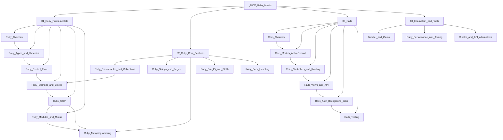

# Ruby and Ruby on Rails — Master MOC

> **About:** 20 notes across 4 sections covering the Ruby language from first principles through metaprogramming, and Ruby on Rails from MVC architecture through authentication, background jobs, and testing. Includes tooling, gem ecosystem, and alternative frameworks (Sinatra, Grape, Hanami).

---

## Vault Structure

---

## Sections

### 01 — Ruby Fundamentals
*6 notes · Language core, object model, OOP*

| Note | Topic | Difficulty |
|---|---|---|
| [[Ruby_Overview]] | Philosophy, MRI/JRuby, REPL, RubyGems, Bundler, rbenv | Beginner |
| [[Ruby_Types_and_Variables]] | Everything is object, variable scoping, symbols vs strings, truthy/falsy | Beginner |
| [[Ruby_Control_Flow]] | if/unless, case/when (===), loops, next/break/retry, exceptions | Beginner |
| [[Ruby_Methods_and_Blocks]] | def, keyword args, splat, visibility, yield, Proc vs Lambda | Intermediate |
| [[Ruby_OOP]] | Classes, initialize, attr_accessor, inheritance, method_missing | Intermediate |
| [[Ruby_Modules_and_Mixins]] | Namespaces, include/extend/prepend, Comparable, Enumerable, Concern | Intermediate |

---

### 02 — Ruby Core Features
*5 notes · Stdlib, metaprogramming, collections*

| Note | Topic | Difficulty |
|---|---|---|
| [[Ruby_Enumerables_and_Collections]] | Array/Hash methods, Enumerable, lazy evaluation, Enumerator | Intermediate |
| [[Ruby_Strings_and_Regex]] | Interpolation, heredocs, string methods, Regexp, named captures | Intermediate |
| [[Ruby_Metaprogramming]] | Open classes, define_method, send, method_missing, class_eval, DSLs | Advanced |
| [[Ruby_File_IO_and_Stdlib]] | File/IO, CSV, JSON, YAML, ERB, Net::HTTP, magic keywords | Intermediate |
| [[Ruby_Error_Handling]] | Exception hierarchy, begin/rescue/ensure, custom exceptions, retry | Intermediate |

---

### 03 — Rails
*6 notes · MVC, Active Record, controllers, views, auth, testing*

| Note | Topic | Difficulty |
|---|---|---|
| [[Rails_Overview]] | CoC, MVC, directory structure, rails CLI, components | Beginner |
| [[Rails_Models_ActiveRecord]] | Migrations, validations, associations, scopes, N+1, callbacks | Intermediate |
| [[Rails_Controllers_and_Routing]] | routes.rb, 7 RESTful actions, filters, strong params, respond_to | Intermediate |
| [[Rails_Views_and_API]] | ERB, partials, helpers, forms, API mode, serializers, CORS | Intermediate |
| [[Rails_Auth_Background_Jobs]] | Devise, JWT, Pundit, Active Job, Sidekiq, cron scheduling | Advanced |
| [[Rails_Testing]] | RSpec, FactoryBot, Capybara, VCR, mocks/doubles, DatabaseCleaner | Intermediate |

---

### 04 — Ecosystem and Tools
*3 notes · Gems, performance, alternatives*

| Note | Topic | Difficulty |
|---|---|---|
| [[Bundler_and_Gems]] | Gemfile, version constraints, bundle commands, popular gems, gemspec | Beginner |
| [[Ruby_Performance_and_Tooling]] | RuboCop, benchmark-ips, stackprof, memory_profiler, Ractors, Fibers | Advanced |
| [[Sinatra_and_API_Alternatives]] | Rack, Sinatra DSL, Grape, Hanami, Sorbet type checking | Intermediate |

---

## Learning Paths

### Path A — Ruby Developer (Language Mastery)

Build a solid foundation in the Ruby language before touching frameworks.

1. [[Ruby_Overview]] — understand the philosophy and ecosystem
2. [[Ruby_Types_and_Variables]] — everything is an object
3. [[Ruby_Control_Flow]] — conditionals, loops, exceptions
4. [[Ruby_Methods_and_Blocks]] — blocks, procs, lambdas (Ruby's superpower)
5. [[Ruby_OOP]] — classes, inheritance, open classes
6. [[Ruby_Modules_and_Mixins]] — mixins, Comparable, Enumerable
7. [[Ruby_Enumerables_and_Collections]] — Array/Hash methods, lazy evaluation
8. [[Ruby_Strings_and_Regex]] — string manipulation, regex
9. [[Ruby_Error_Handling]] — robust exception handling
10. [[Ruby_Metaprogramming]] — DSLs, open classes, define_method
11. [[Ruby_File_IO_and_Stdlib]] — stdlib utilities
12. [[Bundler_and_Gems]] — project dependency management
13. [[Ruby_Performance_and_Tooling]] — profiling, linting, Ractors

---

### Path B — Rails Full-Stack Developer

Covers the complete Rails stack for building production web applications.

1. [[Ruby_Overview]] → [[Ruby_Types_and_Variables]] → [[Ruby_Methods_and_Blocks]] — enough Ruby
2. [[Rails_Overview]] — CoC, MVC, project structure
3. [[Rails_Models_ActiveRecord]] — ORM, migrations, associations
4. [[Rails_Controllers_and_Routing]] — RESTful routes, strong params
5. [[Rails_Views_and_API]] — ERB, forms, layouts
6. [[Rails_Auth_Background_Jobs]] — Devise + Pundit + Sidekiq
7. [[Rails_Testing]] — RSpec + FactoryBot + Capybara
8. [[Bundler_and_Gems]] — gem ecosystem
9. [[Ruby_OOP]] + [[Ruby_Modules_and_Mixins]] — deepen Ruby knowledge
10. [[Ruby_Metaprogramming]] — understand Rails magic

---

### Path C — Rails API Backend Developer

Focused on building JSON APIs with Rails, without the view layer.

1. [[Ruby_Overview]] → [[Ruby_Types_and_Variables]] → [[Ruby_Methods_and_Blocks]] — Ruby essentials
2. [[Rails_Overview]] — understand `--api` flag and API mode
3. [[Rails_Models_ActiveRecord]] — models, queries, N+1 prevention
4. [[Rails_Controllers_and_Routing]] — namespaced routes, strong params, respond_to JSON
5. [[Rails_Views_and_API]] — serializers, CORS, API versioning
6. [[Rails_Auth_Background_Jobs]] — JWT auth, Pundit policies, Sidekiq
7. [[Rails_Testing]] — request specs, mocks, VCR for HTTP
8. [[Bundler_and_Gems]] — ecosystem gems (faraday, pagy, serializers)
9. [[Sinatra_and_API_Alternatives]] — when Grape or Sinatra beats Rails
10. [[Ruby_Performance_and_Tooling]] — profiling and optimization

---

## Key Concepts Quick Reference

| Concept | Location |
|---|---|
| `yield` and blocks | [[Ruby_Methods_and_Blocks]] |
| Symbols vs strings | [[Ruby_Types_and_Variables]] |
| `include` vs `extend` vs `prepend` | [[Ruby_Modules_and_Mixins]] |
| N+1 query prevention | [[Rails_Models_ActiveRecord]] |
| Strong parameters | [[Rails_Controllers_and_Routing]] |
| Active Job + Sidekiq | [[Rails_Auth_Background_Jobs]] |
| Lazy enumerators | [[Ruby_Enumerables_and_Collections]] |
| `method_missing` | [[Ruby_OOP]], [[Ruby_Metaprogramming]] |
| Exception hierarchy | [[Ruby_Error_Handling]] |
| Ractors (parallelism) | [[Ruby_Performance_and_Tooling]] |
| Convention over Configuration | [[Rails_Overview]] |
| Devise + Pundit | [[Rails_Auth_Background_Jobs]] |
| Rack middleware | [[Sinatra_and_API_Alternatives]] |

---

## Related Vaults

- [[_MOC_SystemDesign_Master]] — system design patterns applicable to Rails architectures
- [[_MOC_Database_Master]] — SQL and database internals behind Active Record
- [[_MOC_DevOps_Master]] — deploying Rails apps with Docker, Kamal, CI/CD

---

#Ruby #Rails
