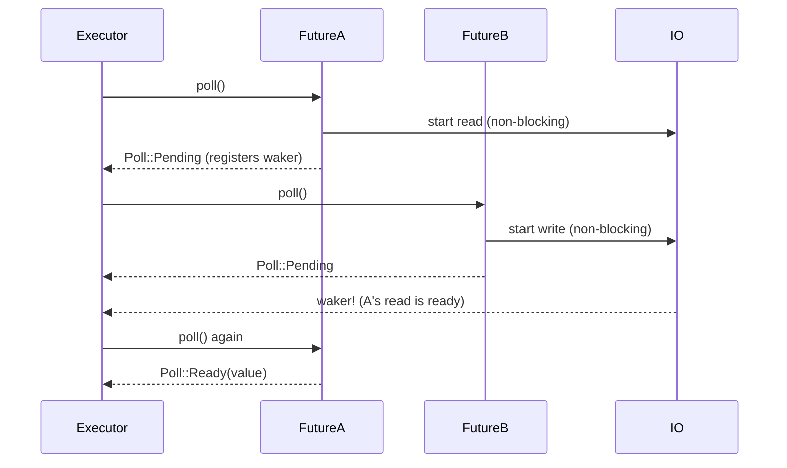

# Rust Async Await

> [!abstract] TL;DR
> Rust's async/await enables cooperative multitasking without a runtime built into the language. `async fn` returns a `Future` — a lazy state machine that does nothing until `.await`ed by an executor. Unlike Go goroutines or JavaScript promises, Rust futures don't run until polled. You must explicitly choose a runtime (Tokio, async-std) to drive them. This design gives Rust zero-overhead async with full control over the execution model.

---

## Intuition

**Why not threads for everything?** OS threads are expensive (~8KB stack, kernel scheduling overhead). When you're waiting for 10,000 HTTP responses, 10,000 OS threads would be wasteful. Async allows one OS thread to manage thousands of in-flight async operations by switching between them cooperatively whenever one is blocked on I/O.

**Why does Rust need an explicit runtime?** Rust's design philosophy: don't pay for what you don't use. Building a runtime into the language forces every Rust program to carry it, even embedded systems with no async needs. By keeping the runtime external, you choose: Tokio for production, smol for tiny environments, a custom runtime for specialized hardware.

**The key mental model:** An `async fn` is a state machine. Each `.await` point is a potential suspension point — the async function saves its state and yields control back to the executor, which can run other tasks while this one waits.

---

## async fn and Future

```rust
// async fn returns a Future — a computation that will eventually produce a value
async fn fetch_data(url: &str) -> String {
    // Simulating an async I/O wait
    tokio::time::sleep(std::time::Duration::from_millis(100)).await;
    format!("data from {url}")
}

// The return type is actually impl Future<Output = String>
// These are equivalent:
async fn fetch_a() -> String { String::from("hello") }
fn fetch_b() -> impl std::future::Future<Output = String> {
    async { String::from("hello") }
}

// The Future trait (simplified):
// trait Future {
//     type Output;
//     fn poll(self: Pin<&mut Self>, cx: &mut Context) -> Poll<Output>;
// }
// You never call poll() directly — the executor does.
```

---

## Running Async Code — Executors

Futures do nothing until polled. You need an executor:

```rust
// Using tokio (most common choice)
#[tokio::main]  // macro that sets up the Tokio runtime and calls .block_on(main())
async fn main() {
    let result = fetch_data("https://example.com").await;
    println!("{result}");
}

// Without the macro (explicit):
fn main() {
    let rt = tokio::runtime::Runtime::new().unwrap();
    rt.block_on(async {
        let result = fetch_data("https://example.com").await;
        println!("{result}");
    });
}

// async-std alternative (different runtime):
// #[async_std::main]
// async fn main() { ... }
```

---

## Concurrent Execution — join! and select!

`.await` is sequential — the next `.await` doesn't start until the previous one completes. For concurrency, use `join!` or `select!`:

```rust
use tokio::join;
use tokio::select;
use std::time::Duration;

async fn task_a() -> &'static str {
    tokio::time::sleep(Duration::from_millis(100)).await;
    "A done"
}

async fn task_b() -> &'static str {
    tokio::time::sleep(Duration::from_millis(50)).await;
    "B done"
}

#[tokio::main]
async fn main() {
    // Sequential — total time: 100 + 50 = 150ms
    let a = task_a().await;
    let b = task_b().await;

    // Concurrent — total time: max(100, 50) = 100ms
    let (a, b) = join!(task_a(), task_b());
    println!("{a}, {b}");  // "A done, B done"

    // tokio::join! waits for ALL futures to complete
    // The results are in order regardless of completion order

    // select! — race futures, take the FIRST to complete
    let result = select! {
        a = task_a() => format!("A won: {a}"),
        b = task_b() => format!("B won: {b}"),
    };
    println!("{result}");  // "B won: B done" (B is faster)
    // The OTHER future is DROPPED (cancelled) when one wins
}
```

---

## Spawning Tasks

`tokio::task::spawn` creates a concurrent task that runs independently (analogous to spawning a thread):

```rust
#[tokio::main]
async fn main() {
    // spawn a task — runs concurrently with the current async fn
    let handle = tokio::task::spawn(async {
        tokio::time::sleep(Duration::from_millis(100)).await;
        42
    });

    // Do other work while the task runs concurrently
    println!("doing other work...");

    // Await the handle to get the result
    let result = handle.await.unwrap();  // JoinHandle<T> — .await returns Result<T, JoinError>
    println!("task result: {result}");

    // Spawn multiple tasks and gather results
    let handles: Vec<_> = (0..5)
        .map(|i| tokio::task::spawn(async move {
            tokio::time::sleep(Duration::from_millis(i * 10)).await;
            i * i
        }))
        .collect();

    let results: Vec<u64> = futures::future::join_all(handles)
        .await
        .into_iter()
        .map(|r| r.unwrap())
        .collect();

    println!("{:?}", results);  // [0, 1, 4, 9, 16]
}
```

---

## async Blocks and Move

```rust
async fn example() {
    let data = String::from("hello");

    // async block — creates a Future inline
    let fut = async {
        // captures data by reference
        println!("{data}");
    };
    fut.await;

    // async move block — takes ownership of captures
    let name = String::from("Alice");
    let fut2 = async move {
        // owns name — needed when the future outlives the current scope
        println!("{name}");
    };
    tokio::task::spawn(fut2).await.unwrap();  // spawn requires 'static (owned) futures
}
```

---

## async in Traits — RPITIT and async-trait

Prior to Rust 1.75, `async fn` in traits was not stable. Now it is (Rust 1.75+), but with limitations for object safety:

```rust
// Rust 1.75+ — async fn directly in traits (static dispatch OK)
trait Processor {
    async fn process(&self, input: &str) -> String;
}

struct MyProcessor;

impl Processor for MyProcessor {
    async fn process(&self, input: &str) -> String {
        tokio::time::sleep(Duration::from_millis(10)).await;
        format!("processed: {input}")
    }
}

// For dyn Trait (dynamic dispatch), use the async-trait crate:
// [dependencies] async-trait = "0.1"
use async_trait::async_trait;

#[async_trait]
trait DynProcessor: Send + Sync {
    async fn process(&self, input: &str) -> String;
}
```

---

## Error Handling in Async Code

```rust
use anyhow::Result;

async fn fetch_and_parse(url: &str) -> Result<serde_json::Value> {
    let response = reqwest::get(url).await?;  // ? works in async fn
    let json = response.json::<serde_json::Value>().await?;
    Ok(json)
}

#[tokio::main]
async fn main() -> Result<()> {
    let data = fetch_and_parse("https://api.example.com/data").await?;
    println!("{:?}", data);
    Ok(())
}
```

---

## Flow Diagram



---

## Common Pitfalls

- **Blocking inside async** — calling `std::thread::sleep()`, `std::fs::read()`, or any synchronous blocking operation inside `async fn` blocks the entire thread — all other tasks on that thread are starved. Use `tokio::time::sleep`, `tokio::fs`, or `tokio::task::spawn_blocking` for CPU-bound or sync work.
- **Forgetting `await`** — `let result = fetch_data("url");` creates the Future but doesn't run it. You get the Future as a value with no computation. Always `await` async expressions.
- **`spawn` requires `'static`** — `tokio::task::spawn` requires the Future to be `'static` (no borrows from the outer scope). Use `move` to capture owned data.
- **Select and cancellation** — when `select!` picks one branch, the other future is dropped (cancelled). If the dropped future had partially completed work (e.g., partially written a file), that work is lost. Design for cancellation safety.
- **Holding a `Mutex` across an await** — holding `std::sync::MutexGuard` across an `.await` can deadlock or prevents the future from being `Send`. Use `tokio::sync::Mutex` instead (which is async-aware).

---

## Review Questions

1. What does `async fn` return? What does it mean that Rust futures are "lazy"? When does the computation actually start?
2. Explain the difference between `join!(a, b)` and `a.await; b.await`. When would you use each?
3. Why does `tokio::task::spawn` require the future to be `'static`? How do you work around this if you need to share a reference into the spawned task?
4. You call a synchronous HTTP library (`reqwest` blocking client) inside an `async fn` handler in Axum. What problem does this cause, and how do you fix it?

---

#Rust #async #await #futures #concurrency #tokio
