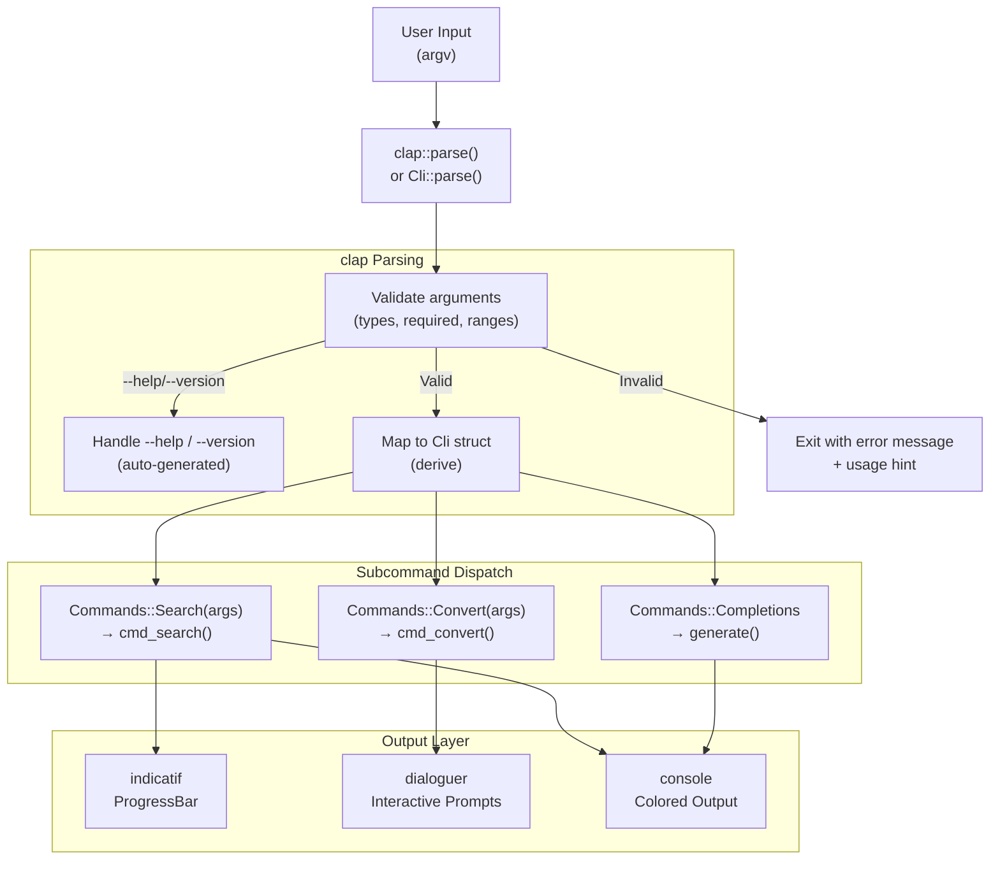

# Rust CLI

> [!abstract] TL;DR
> clap is the standard Rust library for CLI argument parsing — its derive API lets you declare your CLI as a Rust struct with attributes, and clap generates all parsing, help text, error messages, and validation. Pair it with indicatif for progress bars, dialoguer for interactive prompts, and clap_complete for shell completion scripts. The result is a polished, professional CLI binary with minimal boilerplate.

---

## Analogy and Intuition

clap is to CLI argument parsing what [[Rust_Serde|Serde]] is to serialization — it is the undisputed standard library that you reach for first. Just as Serde's `#[derive(Serialize, Deserialize)]` generates all the serialization code from your struct definition, clap's `#[derive(Parser)]` generates all argument parsing, validation, and help text from your struct. You declare the shape of your CLI in Rust types; clap handles the rest.

The derive API is the recommended approach for most CLIs. The builder API (creating the CLI programmatically) is available when you need runtime-generated argument definitions or want to minimize compile-time dependencies.

---

## Cargo Setup

```toml
[dependencies]
clap = { version = "4", features = ["derive"] }
clap_complete = "4"        # shell completion generation
indicatif = "0.17"         # progress bars and spinners
dialoguer = "0.11"         # interactive prompts
console = "0.15"           # colored terminal output (used internally by dialoguer)
anyhow = "1.0"             # ergonomic error handling for CLI applications

[dev-dependencies]
assert_cmd = "2.0"         # test CLI invocations
predicates = "3.0"         # test output assertions
```

---

## clap Derive API — Basic Structure

```rust
use clap::{Parser, Subcommand, Args, ValueEnum};

/// A mini file processing tool — top-level CLI definition.
/// The doc comment becomes the help text shown by `--help`.
#[derive(Parser, Debug)]
#[command(
    name = "filetool",
    version = "1.0.0",
    about = "A mini file utility with search and convert subcommands",
    long_about = None,
)]
struct Cli {
    /// Global verbosity flag (can be repeated: -v, -vv, -vvv)
    #[arg(short, long, action = clap::ArgAction::Count, global = true)]
    verbose: u8,

    /// Path to a config file (optional)
    #[arg(short, long, value_name = "FILE", global = true)]
    config: Option<std::path::PathBuf>,

    #[command(subcommand)]
    command: Commands,
}

#[derive(Subcommand, Debug)]
enum Commands {
    /// Search files for a pattern
    Search(SearchArgs),
    /// Convert file encoding or format
    Convert(ConvertArgs),
    /// Generate shell completions
    Completions {
        /// Shell to generate completions for
        #[arg(value_enum)]
        shell: clap_complete::Shell,
    },
}

/// Arguments for the `search` subcommand
#[derive(Args, Debug)]
struct SearchArgs {
    /// The pattern to search for (regex supported)
    pattern: String,

    /// Files or directories to search in
    #[arg(default_value = ".")]
    paths: Vec<std::path::PathBuf>,

    /// Maximum number of results to show
    #[arg(short = 'n', long, default_value_t = 100)]
    max_results: usize,

    /// Case-insensitive search
    #[arg(short, long)]
    ignore_case: bool,

    /// Output format
    #[arg(short, long, value_enum, default_value_t = OutputFormat::Plain)]
    format: OutputFormat,
}

/// Arguments for the `convert` subcommand
#[derive(Args, Debug)]
struct ConvertArgs {
    /// Input file path
    #[arg(value_name = "INPUT")]
    input: std::path::PathBuf,

    /// Output file path
    #[arg(value_name = "OUTPUT")]
    output: std::path::PathBuf,

    /// Source encoding
    #[arg(long, default_value = "utf-8")]
    from_encoding: String,

    /// Target encoding
    #[arg(long, default_value = "utf-8")]
    to_encoding: String,

    /// Overwrite output if it exists
    #[arg(long)]
    force: bool,
}

/// Restricted output format choices — clap enforces this automatically
#[derive(ValueEnum, Clone, Debug)]
enum OutputFormat {
    Plain,
    Json,
    Csv,
}
```

---

## Full Working Example

```rust
// src/main.rs — complete, compilable CLI application
use clap::{CommandFactory, Parser, Subcommand, Args, ValueEnum};
use clap_complete::{generate, Shell};
use std::io;

#[derive(Parser, Debug)]
#[command(name = "filetool", version, about = "A mini file utility")]
struct Cli {
    #[arg(short, long, action = clap::ArgAction::Count, global = true)]
    verbose: u8,

    #[command(subcommand)]
    command: Commands,
}

#[derive(Subcommand, Debug)]
enum Commands {
    /// Search files for a text pattern
    Search(SearchArgs),
    /// Convert a text file (currently: count words)
    Convert(ConvertArgs),
    /// Generate shell completions
    Completions { shell: Shell },
}

#[derive(Args, Debug)]
struct SearchArgs {
    pattern: String,
    #[arg(default_value = ".")]
    path: std::path::PathBuf,
    #[arg(short, long)]
    ignore_case: bool,
    #[arg(short = 'n', long, default_value_t = 50)]
    max_results: usize,
    #[arg(short, long, value_enum, default_value_t = OutputFmt::Plain)]
    format: OutputFmt,
}

#[derive(Args, Debug)]
struct ConvertArgs {
    input: std::path::PathBuf,
    #[arg(short, long)]
    count_words: bool,
}

#[derive(ValueEnum, Clone, Debug)]
enum OutputFmt {
    Plain,
    Json,
}

fn cmd_search(args: &SearchArgs, verbose: u8) {
    if verbose > 0 {
        eprintln!("[debug] Searching for '{}' in {:?}", args.pattern, args.path);
    }
    let pattern = if args.ignore_case {
        args.pattern.to_lowercase()
    } else {
        args.pattern.clone()
    };
    // In a real tool, walk the path with walkdir and match lines
    println!("Searching for '{}' (max {} results)", pattern, args.max_results);
    match args.format {
        OutputFmt::Json => println!(r#"{{"query": "{}", "results": []}}"#, pattern),
        OutputFmt::Plain => println!("No results found."),
    }
}

fn cmd_convert(args: &ConvertArgs) -> anyhow::Result<()> {
    let content = std::fs::read_to_string(&args.input)?;
    if args.count_words {
        let word_count = content.split_whitespace().count();
        println!("Word count: {}", word_count);
    } else {
        println!("File size: {} bytes", content.len());
    }
    Ok(())
}

fn main() -> anyhow::Result<()> {
    let cli = Cli::parse();

    match &cli.command {
        Commands::Search(args) => cmd_search(args, cli.verbose),
        Commands::Convert(args) => cmd_convert(args)?,
        Commands::Completions { shell } => {
            let mut cmd = Cli::command();
            generate(*shell, &mut cmd, "filetool", &mut io::stdout());
        }
    }

    Ok(())
}
```

---

## Shell Completions with clap_complete

```rust
// Generate completions at runtime (triggered by a subcommand)
use clap_complete::{generate, Shell};
use clap::CommandFactory;

// Inside your completions subcommand handler:
fn generate_completions(shell: Shell) {
    let mut cmd = Cli::command();
    generate(shell, &mut cmd, "filetool", &mut std::io::stdout());
}

// Usage:
//   filetool completions bash  >> ~/.bash_completion
//   filetool completions zsh   >> ~/.zfunc/_filetool
//   filetool completions fish  > ~/.config/fish/completions/filetool.fish
```

```bash
# Install completions (bash example)
filetool completions bash >> ~/.bash_completion
source ~/.bash_completion

# zsh
filetool completions zsh > ~/.zfunc/_filetool
# Add to .zshrc: fpath=(~/.zfunc $fpath); autoload -U compinit; compinit
```

---

## indicatif — Progress Bars and Spinners

```rust
use indicatif::{ProgressBar, ProgressStyle, MultiProgress};
use std::time::Duration;

fn demo_progress_bar() {
    // Simple determinate progress bar
    let pb = ProgressBar::new(100);
    pb.set_style(
        ProgressStyle::with_template(
            "{spinner:.green} [{elapsed_precise}] [{bar:40.cyan/blue}] {pos}/{len} {msg}"
        )
        .unwrap()
        .progress_chars("#>-"),
    );

    for i in 0..100 {
        pb.set_message(format!("Processing item {}", i));
        pb.inc(1);
        std::thread::sleep(Duration::from_millis(20));
    }
    pb.finish_with_message("Done");
}

fn demo_spinner() {
    // Indeterminate spinner for unknown-duration tasks
    let spinner = ProgressBar::new_spinner();
    spinner.set_style(
        ProgressStyle::with_template("{spinner:.blue} {msg}")
            .unwrap()
            .tick_strings(&[".", "..", "...", "...."]),
    );
    spinner.set_message("Connecting to server...");
    spinner.enable_steady_tick(Duration::from_millis(120));

    std::thread::sleep(Duration::from_secs(2)); // simulate work
    spinner.finish_with_message("Connected");
}

fn demo_multi_progress() {
    // Multiple bars updating simultaneously
    let multi = MultiProgress::new();

    let pb1 = multi.add(ProgressBar::new(50));
    let pb2 = multi.add(ProgressBar::new(100));

    let style = ProgressStyle::with_template("[{bar:30}] {pos}/{len}")
        .unwrap();
    pb1.set_style(style.clone());
    pb2.set_style(style);

    // IMPORTANT: use pb.println() not println!() when a progress bar is active
    // regular println! interleaves with the bar output and corrupts the display
    pb1.println("Starting download...");

    for i in 0..=50 {
        pb1.set_position(i);
        if i % 2 == 0 { pb2.inc(1); }
        std::thread::sleep(Duration::from_millis(30));
    }
    pb1.finish();
    pb2.finish();
}
```

---

## dialoguer — Interactive Prompts

```rust
use dialoguer::{theme::ColorfulTheme, Confirm, Input, Select, MultiSelect, Password};

fn interactive_setup() -> anyhow::Result<()> {
    let theme = ColorfulTheme::default();

    // Text input with validation
    let username: String = Input::with_theme(&theme)
        .with_prompt("Enter username")
        .validate_with(|input: &String| {
            if input.len() < 3 {
                Err("Username must be at least 3 characters")
            } else if input.contains(' ') {
                Err("Username cannot contain spaces")
            } else {
                Ok(())
            }
        })
        .interact_text()?;

    // Password input (hidden)
    let password = Password::with_theme(&theme)
        .with_prompt("Enter password")
        .with_confirmation("Confirm password", "Passwords do not match")
        .interact()?;

    // Single selection from a list
    let environments = &["development", "staging", "production"];
    let env_idx = Select::with_theme(&theme)
        .with_prompt("Select environment")
        .default(0)
        .items(environments)
        .interact()?;
    let environment = environments[env_idx];

    // Multiple selection
    let features = &["logging", "metrics", "tracing", "auth"];
    let selected = MultiSelect::with_theme(&theme)
        .with_prompt("Select features to enable")
        .items(features)
        .interact()?;

    // Yes/No confirmation
    let confirmed = Confirm::with_theme(&theme)
        .with_prompt(format!(
            "Create project '{}' in {} with {} features?",
            username, environment, selected.len()
        ))
        .default(true)
        .interact()?;

    if confirmed {
        println!("Creating project for user '{}'...", username);
    }

    Ok(())
}
```

---

## clap Builder API (Brief Reference)

```rust
// Builder API — more verbose but no derive dependency
use clap::{Command, Arg, ArgAction};

fn build_cli() -> Command {
    Command::new("mytool")
        .version("1.0")
        .about("A simple tool")
        .arg(
            Arg::new("verbose")
                .short('v')
                .long("verbose")
                .action(ArgAction::Count)
                .help("Increase verbosity"),
        )
        .arg(
            Arg::new("output")
                .short('o')
                .long("output")
                .value_name("FILE")
                .help("Output file path"),
        )
        .subcommand(
            Command::new("run")
                .about("Run the tool")
                .arg(Arg::new("input").required(true)),
        )
}

fn main() {
    let matches = build_cli().get_matches();
    let verbosity = matches.get_count("verbose");
    let output = matches.get_one::<String>("output");
    println!("verbosity={}, output={:?}", verbosity, output);
}
```

---

## Argument Parsing Flow — Mermaid Diagram



---

## Trade-offs Table

| Feature | clap derive | clap builder | argh | lexopt |
|---------|-------------|--------------|------|--------|
| Ergonomics | Excellent (struct-based) | Verbose | Good | Minimal |
| Compile time | Slower (proc macro) | Faster | Fast | Very fast |
| Binary size impact | Moderate | Moderate | Small | Minimal |
| Help text generation | Automatic, rich | Automatic | Automatic | Manual |
| Subcommand support | Full | Full | Full | Manual |
| Shell completions | Via clap_complete | Via clap_complete | No | No |
| Runtime flexibility | Low (static types) | High (dynamic) | Low | Medium |
| Validation | Built-in (value_enum, ranges) | Built-in | Limited | Manual |
| Best for | Most CLIs | Dynamic CLIs, plugins | Simple tools | Minimal deps |

---

## Common Pitfalls

- **Long clap compile times** — clap with the derive feature uses procedural macros that can add noticeable compile time to large projects. Mitigate by enabling only the features you need (`features = ["derive"]` without `"cargo"`), and by structuring your binary so that the CLI definition lives in a separate small crate.

- **Flatten vs subcommand confusion** — `#[command(flatten)]` merges another `Args` struct's fields into the current command's argument list, while `#[command(subcommand)]` creates a distinct subcommand. Using `flatten` when you meant `subcommand` results in unexpected positional argument conflicts.

- **Not using `value_enum` for restricted choices** — using a `String` argument when only a fixed set of values is valid means clap cannot validate the input and the user gets a confusing runtime error (or no error at all). Always use `#[derive(ValueEnum)]` on an enum and `value_enum` for argument types with a fixed set of options.

- **`println!` corrupting progress bar output** — when a `ProgressBar` is active, calling `println!` directly interleaves output with the progress bar rendering and produces garbled output. Use `pb.println("message")` or `multi.println("message")` instead, which suspends and resumes the bar around the print.

- **Missing `use clap::CommandFactory`** — the `CommandFactory` trait must be in scope to call `Cli::command()` for shell completion generation. Forgetting the import causes a confusing "method not found" error.

---

## Review Questions

1. What is the difference between clap's derive API and the builder API? Give a concrete scenario where the builder API is the better choice despite its verbosity.
2. You have a `--format` argument that should only accept `plain`, `json`, or `csv`. How do you use clap's `ValueEnum` derive to enforce this, and what does the auto-generated help text look like?
3. How do you generate shell completion scripts for your CLI? Walk through the steps to install bash completions from a `completions` subcommand.
4. You are using indicatif to display a progress bar while processing a list of files, and you also want to print log messages during processing. Why does `println!` not work correctly, and what is the correct API to use instead?

---

#Rust #CLI #clap #indicatif #dialoguer #command-line #shell-completions
