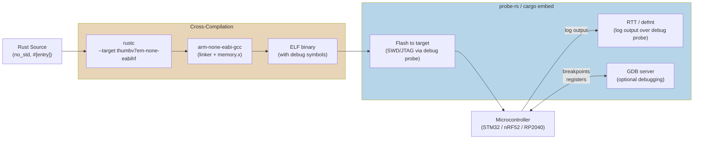

# Rust Embedded

> [!abstract] TL;DR
> Rust's `no_std` mode strips the standard library down to `core` — no heap allocation, no OS, no file system — enabling Rust to run on bare-metal microcontrollers. The embedded ecosystem is built around `embedded-hal` traits for hardware-agnostic drivers, `cortex-m-rt` for ARM Cortex-M startup, `probe-rs` for flashing and debugging, and `RTIC` for real-time interrupt-driven concurrency. Rust brings memory safety guarantees and a modern toolchain to a domain historically dominated by C.

---

## Analogy and Intuition

Writing `no_std` Rust is like camping without a hotel. At a hotel (std Rust), everything is provided: a heap allocator for dynamic memory, an OS thread scheduler, a file system, network sockets, and a comfortable runtime. When you go camping (no_std Rust), you bring only what you need. No heap allocator unless you explicitly pack one (like `embedded-alloc`). No threads unless you set up the stack yourself. No file system — you write directly to hardware registers. Nothing you rely on at home is available unless you explicitly pack it in your `Cargo.toml`.

This constraint is not a limitation — it is the feature. When you know exactly what resources exist and have proved at compile time that your code does not misuse memory or cause data races, you get the reliability that aerospace, medical, and automotive industries require.

---

## `no_std` — What You Keep and What You Lose

```rust
// At the top of your embedded crate — no standard library
#![no_std]
// For bare-metal targets: no OS startup, no main() wrapper
#![no_main]

// What you KEEP: the core library
// - core::option::Option<T>
// - core::result::Result<T, E>
// - core::iter, core::slice, core::str, core::mem, core::ptr
// - core::fmt (formatting infrastructure — but not println!)
// - core::sync::atomic (atomics, fences)
// - core::hint, core::convert, core::ops

// What you LOSE (without explicit crates):
// - std::collections::HashMap/Vec/String (need alloc crate + allocator)
// - std::io (no file system, no stdin/stdout)
// - std::thread (no OS threads)
// - std::sync::Mutex (use cortex_m::interrupt::free instead)
// - std::time::Instant (no OS clock — use hardware timers)

// You MUST provide a panic handler
use core::panic::PanicInfo;

#[panic_handler]
fn panic(_info: &PanicInfo) -> ! {
    // On embedded: halt the processor or blink an error LED
    // Never use format strings here — core::fmt pulls in a lot of code
    loop {}
}
```

### Optional: Enabling the Alloc Crate

```rust
// To use Vec, String, Box, Arc in no_std (requires an allocator)
#![no_std]
extern crate alloc;

use alloc::vec::Vec;
use alloc::string::String;

// Set up the global allocator (embedded-alloc for microcontrollers)
// [dependencies]
// embedded-alloc = "0.6"
use embedded_alloc::LlffHeap as Heap;

#[global_allocator]
static HEAP: Heap = Heap::empty();

// In your entry point, initialize the heap before using alloc types:
// unsafe { HEAP.init(HEAP_MEM.as_ptr() as usize, HEAP_SIZE) }
```

---

## Target Setup and Cross-Compilation

```bash
# Add the ARM Cortex-M4F target (used by STM32F4, nRF52, etc.)
rustup target add thumbv7em-none-eabihf
# thumbv7em = Thumb-2, ARMv7-M (Cortex-M4/M7)
# none      = no OS
# eabihf    = embedded ABI, hard-float (hardware FPU)

# Other common embedded targets:
rustup target add thumbv6m-none-eabi     # Cortex-M0/M0+ (no hardware multiply)
rustup target add thumbv7m-none-eabi     # Cortex-M3
rustup target add thumbv8m.main-none-eabihf  # Cortex-M33 (TrustZone)
rustup target add riscv32imac-unknown-none-elf  # RISC-V (ESP32-C3, etc.)
```

```toml
# .cargo/config.toml — project-level build configuration
[build]
# Specify the default target so you don't need --target on every command
target = "thumbv7em-none-eabihf"

[target.thumbv7em-none-eabihf]
# The linker — use arm-none-eabi-gcc or the LLVM lld
linker = "arm-none-eabi-gcc"
# Runner: how to run/flash the binary (probe-rs in this case)
runner = "probe-rs run --chip STM32F411CEUx"

[unstable]
build-std = ["core", "compiler_builtins"]  # build core from source (for LTO)
```

```toml
# Cargo.toml for an STM32 embedded project
[package]
name = "led-blink"
version = "0.1.0"
edition = "2021"

[dependencies]
cortex-m = { version = "0.7", features = ["critical-section-single-core"] }
cortex-m-rt = "0.7"        # startup/reset handler for ARM Cortex-M
panic-halt = "1.0"          # panic = halt; very small, good for production
defmt = "0.3"               # efficient logging (deferred formatting)
defmt-rtt = "0.4"           # send defmt output over RTT (Real-Time Transfer)
probe-rs-target = "0.1"

# Board-specific HAL (Hardware Abstraction Layer)
# Replace with the HAL for your specific chip:
stm32f4xx-hal = { version = "0.21", features = ["stm32f411"] }
# Other examples:
# nrf52840-hal = "0.18"
# rp-hal = { package = "rp2040-hal", version = "0.10" }

[profile.release]
opt-level = 3
lto = true
codegen-units = 1
debug = true    # keep debug info for probe-rs even in release
```

---

## cortex-m-rt — Startup and Entry Point

```rust
// src/main.rs — bare metal entry point for ARM Cortex-M
#![no_std]
#![no_main]

use cortex_m_rt::entry;
use panic_halt as _;  // choose a panic handler by importing it

// memory.x — linker script (defines FLASH and RAM regions for your chip)
// This file lives in the project root; cortex-m-rt finds it automatically.
// Example memory.x:
// MEMORY {
//     FLASH : ORIGIN = 0x08000000, LENGTH = 512K
//     RAM   : ORIGIN = 0x20000000, LENGTH = 128K
// }

// The #[entry] macro generates the reset handler and vector table entries
#[entry]
fn main() -> ! {
    // Initialization code runs here once after reset
    // Setup peripherals, clocks, etc.

    loop {
        // Your main loop — must never return (hence -> !)
    }
}
```

---

## embedded-hal — Hardware Abstraction Layer Traits

The key insight of `embedded-hal` is that device drivers should be written against *traits*, not concrete hardware types. A driver for an SSD1306 OLED display should work with any I2C bus on any microcontroller — it just needs something that implements `embedded_hal::i2c::I2c`.

```rust
// A hardware-agnostic LED driver written against embedded-hal traits
use embedded_hal::digital::OutputPin;
use core::fmt::Debug;

pub struct Led<P: OutputPin> {
    pin: P,
    state: bool,
}

impl<P: OutputPin> Led<P>
where
    P::Error: Debug,
{
    pub fn new(pin: P) -> Self {
        Led { pin, state: false }
    }

    pub fn on(&mut self) {
        self.pin.set_high().unwrap();
        self.state = true;
    }

    pub fn off(&mut self) {
        self.pin.set_low().unwrap();
        self.state = false;
    }

    pub fn toggle(&mut self) {
        if self.state { self.off() } else { self.on() }
    }
}

// This Led<P> driver works with ANY HAL that implements OutputPin:
// stm32f4xx_hal::gpio::Pin<Output<PushPull>>
// nrf52840_hal::gpio::Pin<Output<PushPull>>
// rp2040_hal::gpio::Pin<PushPull, Output>
// embedded_hal_mock::pin::Mock (for unit tests on desktop!)
```

---

## Full Example — LED Blink on STM32F4

```rust
// src/main.rs — blink an LED on STM32F411 (Cortex-M4)
#![no_std]
#![no_main]

use cortex_m_rt::entry;
use stm32f4xx_hal::{
    pac,                          // Peripheral Access Crate (register-level access)
    prelude::*,                   // HAL extension traits
    gpio::Speed,
};
use panic_halt as _;

#[entry]
fn main() -> ! {
    // Take ownership of the device peripherals (singleton pattern)
    let dp = pac::Peripherals::take().unwrap();
    let cp = cortex_m::Peripherals::take().unwrap();

    // Configure the system clock (84 MHz for STM32F411)
    let rcc = dp.RCC.constrain();
    let clocks = rcc.cfgr
        .use_hse(25.MHz())
        .sysclk(84.MHz())
        .freeze();

    // Configure the delay source using SysTick
    let mut delay = cp.SYST.delay(&clocks);

    // Configure PA5 (the onboard LED on Nucleo-F411) as a push-pull output
    let gpioa = dp.GPIOA.split();
    let mut led = gpioa.pa5
        .into_push_pull_output()
        .speed(Speed::Low);

    // Blink forever
    loop {
        led.set_high();
        delay.delay_ms(500u32);
        led.set_low();
        delay.delay_ms(500u32);
    }
}
```

---

## Memory-Mapped I/O and PAC

```rust
// Direct register access via PAC (Peripheral Access Crate)
// PACs are generated from SVD files using svd2rust
use stm32f4xx_hal::pac;

let dp = pac::Peripherals::take().unwrap();

// Enable the GPIOA clock in the RCC register
// (HALs do this for you, but this shows the underlying approach)
dp.RCC.ahb1enr.modify(|_, w| w.gpioaen().enabled());

// Set PA5 as output in the MODER register
dp.GPIOA.moder.modify(|_, w| unsafe { w.moder5().bits(0b01) }); // output mode

// Set PA5 high in the ODR register (Output Data Register)
dp.GPIOA.odr.modify(|_, w| w.odr5().set_bit());

// Read PA5's input in the IDR register (Input Data Register)
let is_high = dp.GPIOA.idr.read().idr5().bit_is_set();
```

---

## defmt — Efficient Embedded Logging

```rust
// defmt: Deferred Formatting — sends format strings by index, not by value
// The host (probe-rs) reconstructs the message from a lookup table
// This is dramatically smaller than core::fmt formatting on device
#![no_std]
#![no_main]

use defmt_rtt as _;   // use RTT as the defmt transport
use panic_probe as _;  // send panic info via defmt

#[cortex_m_rt::entry]
fn main() -> ! {
    defmt::info!("System initialized");
    defmt::debug!("Configuring peripherals...");

    let x: u32 = 42;
    defmt::info!("x = {}", x);

    // defmt::panic! halts and sends panic info over RTT
    // much better than panic_halt for debugging
    if x == 0 {
        defmt::panic!("x must not be zero");
    }

    loop {
        defmt::trace!("Main loop iteration");
    }
}
```

```bash
# cargo embed flashes and opens a defmt log session
cargo embed --release

# cargo run (with probe-rs runner configured in .cargo/config.toml) also works
cargo run --release
```

---

## probe-rs — Flashing and Debugging

```bash
# Install probe-rs
cargo install probe-rs-tools --locked

# List connected probes (ST-Link, J-Link, CMSIS-DAP, etc.)
probe-rs list

# Flash a binary to the target chip
probe-rs download --chip STM32F411CEUx target/thumbv7em-none-eabihf/release/led-blink

# Flash and run
probe-rs run --chip STM32F411CEUx target/thumbv7em-none-eabihf/release/led-blink

# Start a GDB server for debugging with arm-none-eabi-gdb
probe-rs gdb --chip STM32F411CEUx

# cargo-embed: higher-level runner that handles defmt decoding
# embed.toml (project root):
# [default.general]
# chip = "STM32F411CEUx"
# [default.rtt]
# enabled = true
# [default.gdb]
# enabled = false
cargo embed --release
```

---

## RTIC — Real-Time Interrupt-Driven Concurrency

RTIC (Real-Time Interrupt-driven Concurrency) is a framework for building safe concurrent embedded applications. It uses Rust's type system and the ARM Cortex-M interrupt priority hardware to eliminate data races at compile time without a traditional OS or locks.

```rust
// src/main.rs — RTIC application
#![no_std]
#![no_main]

use panic_halt as _;

#[rtic::app(device = stm32f4xx_hal::pac, peripherals = true)]
mod app {
    use stm32f4xx_hal::{
        gpio::{Output, Pin, PushPull},
        prelude::*,
        timer::{CounterMs, Event},
        pac::TIM2,
    };

    // Shared resources — accessible from multiple tasks
    // RTIC generates safe accessor methods using priority-based critical sections
    #[shared]
    struct Shared {
        led: Pin<'A', 5, Output<PushPull>>,
        counter: u32,
    }

    // Local resources — owned by a single task (no sharing, no locks needed)
    #[local]
    struct Local {
        timer: CounterMs<TIM2>,
    }

    // init task: runs once at startup, returns (Shared, Local)
    #[init]
    fn init(ctx: init::Context) -> (Shared, Local) {
        let dp = ctx.device;
        let cp = ctx.core;

        let rcc = dp.RCC.constrain();
        let clocks = rcc.cfgr.sysclk(84.MHz()).freeze();

        let gpioa = dp.GPIOA.split();
        let led = gpioa.pa5.into_push_pull_output();

        // Set up TIM2 to fire an interrupt every 500ms
        let mut timer = dp.TIM2.counter_ms(&clocks);
        timer.start(500.millis()).unwrap();
        timer.listen(Event::Update);

        (
            Shared { led, counter: 0 },
            Local { timer },
        )
    }

    // idle task: runs when no interrupts are pending (lowest priority)
    #[idle]
    fn idle(_ctx: idle::Context) -> ! {
        loop {
            // Put CPU to sleep until next interrupt (reduces power consumption)
            cortex_m::asm::wfi();
        }
    }

    // TIM2 interrupt handler — fires every 500ms
    // priority = 1 means it can be preempted by higher-priority tasks
    #[task(binds = TIM2, local = [timer], shared = [led, counter])]
    fn tim2_handler(ctx: tim2_handler::Context) {
        // Clear the interrupt flag
        ctx.local.timer.clear_interrupt(stm32f4xx_hal::timer::Event::Update);

        // Lock shared resources (RTIC uses priority-ceiling protocol)
        ctx.shared.led.lock(|led| led.toggle());
        ctx.shared.counter.lock(|count| {
            *count += 1;
            // defmt::info!("Blink count: {}", count);
        });
    }
}
```

---

## Build Pipeline — Mermaid Diagram



---

## Critical Sections

```rust
use cortex_m::interrupt;

// cortex_m::interrupt::free() creates a critical section by disabling interrupts
// Use this instead of std::sync::Mutex when sharing data with interrupt handlers
static mut SHARED_COUNTER: u32 = 0;

fn increment_from_main() {
    // Safe because we disable interrupts for the duration of the closure
    interrupt::free(|_cs| {
        // SAFETY: interrupts are disabled; no race possible
        unsafe { SHARED_COUNTER += 1; }
    });
}

// With RTIC, critical sections are generated automatically based on
// task priorities — no manual interrupt::free() needed
```

---

## Trade-offs Table

| Feature | Rust Embedded | C/C++ Embedded | MicroPython | Arduino (C++) |
|---------|--------------|----------------|-------------|---------------|
| Memory safety | Compile-time guaranteed | Manual (unsafe) | GC (runtime) | Manual |
| Performance | Near-C (zero-cost abstractions) | Native C | Slow (interpreter) | Near-C |
| Binary size | Small (no_std, 20-100KB typical) | Very small | Large (interpreter) | Small |
| Ecosystem maturity | Growing (embedded-hal) | Very mature | Moderate | Very mature |
| Ease of start | Moderate (toolchain setup) | Easy (IDE-based) | Very easy | Very easy |
| RTOS support | RTIC (built-in), FreeRTOS via FFI | FreeRTOS, Zephyr | No | FreeRTOS |
| Async support | embassy (async/await for embedded) | None native | No | No |
| Debugging | probe-rs, GDB, defmt | GDB, J-Link | REPL | Serial.print |
| Hardware support | ARM, RISC-V, AVR (limited) | All architectures | ARM, RISC-V, Xtensa | AVR, ARM |
| Type safety | Strong (PAC, HAL traits) | Weak (void*, casts) | Dynamic | Weak |

---

## Common Pitfalls

- **Stack overflow on embedded — no guard pages** — unlike a desktop OS, embedded targets have no MMU and no guard pages. A stack overflow silently corrupts the heap or vector table and causes random undefined behavior, not a clean crash. Allocate sufficient stack in `memory.x`, use static buffers (`static mut [u8; N]`) instead of stack-allocated arrays, and use `stack-sizes` or `probe-rs` stack analysis to verify at runtime.

- **Forgetting `#[inline(never)]` on no_std functions increases code size** — without `std`, LLVM may inline aggressively and pull in large amounts of formatting infrastructure. Mark rarely-called functions (especially error paths) with `#[inline(never)]` and avoid `core::fmt` in hot paths. Use `defmt` instead of `write!` for logging.

- **`defmt` vs `core::fmt` — use defmt in embedded code** — `core::fmt` (what `format_args!`, `write!`, and `write_str` use) generates code that stores format strings in flash and runs them on-device. `defmt` sends only a format string index over the wire and reconstructs the message on the host. defmt output can be 10-100x smaller in flash usage and transmit 10x faster over RTT.

- **ITM vs RTT for debugging** — ITM (Instrumentation Trace Macrocell) is ARM's built-in tracing mechanism, but it requires a specific TPIU clock setup and is notoriously fragile with certain probes and boards. RTT (Real-Time Transfer via J-Link protocol) works on any SWD-capable probe without clock configuration and is what `defmt-rtt` uses. Prefer RTT unless you have a specific reason for ITM.

- **Holding shared state in `static mut` is unsafe** — while `static mut` is the go-to pattern in C embedded code, it is `unsafe` in Rust and requires manual justification. Use RTIC's shared resource system, `cortex_m::interrupt::Mutex<Cell<T>>`, or `critical-section` crate abstractions to handle shared state safely without unsafely accessing mutable statics.

- **PAC access without HAL is verbose and error-prone** — writing directly to PAC register bitfields is correct but requires reading datasheets carefully and handling reserved bits. Always prefer the HAL (Hardware Abstraction Layer) built on top of the PAC; fall back to direct PAC access only when the HAL does not expose the feature you need.

---

## Review Questions

1. What is the difference between `#![no_std]` and `#![no_main]`? Can you have one without the other? Give a concrete example of a case where you use `no_std` but not `no_main`.
2. Explain the embedded-hal trait design philosophy. Why does writing a driver against `embedded_hal::i2c::I2c` instead of a concrete type (like `stm32f4xx_hal::i2c::I2c<I2C1, ...>`) make the driver reusable?
3. RTIC eliminates data races without traditional mutexes. What mechanism does it use instead, and how does the priority ceiling protocol prevent priority inversion?
4. Compare probe-rs and OpenOCD as embedded debug probes for Rust. What does probe-rs offer that makes it better integrated with the Rust ecosystem?

---

#Rust #embedded #no_std #cortex-m #embedded-hal #RTIC #probe-rs #microcontroller
