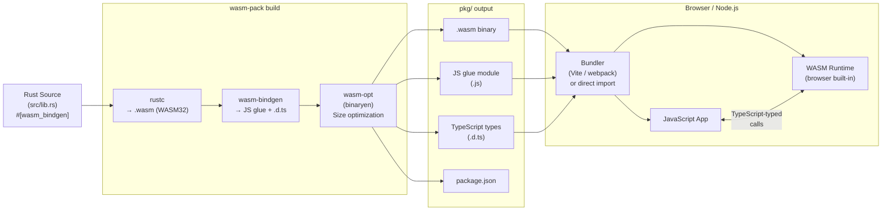

# Rust WebAssembly

> [!abstract] TL;DR
> Rust compiles to WebAssembly via wasm-pack and wasm-bindgen, enabling near-native performance in the browser with zero garbage collection pauses. wasm-bindgen is the bridge that translates Rust types to JavaScript types and vice versa. The wasm-pack CLI handles the full build pipeline — compile, optimize, and package for npm. Leptos is a full-stack reactive framework built on WASM that enables React-like component development in pure Rust.

---

## Analogy and Intuition

Rust + WASM is the dream team for web performance. Rust provides zero-cost abstractions and deterministic memory management with no GC pauses. WASM provides a sandboxed, near-native execution environment that any modern browser can run. wasm-bindgen is the bridge that makes Rust types and JavaScript types speak to each other — it automatically generates the JavaScript glue code that converts between the two type systems so you never write `TextDecoder`/`TextEncoder` boilerplate by hand.

Think of wasm-bindgen as an FFI (Foreign Function Interface) layer with automated bindings generation. You annotate Rust functions and types with `#[wasm_bindgen]`, and the toolchain generates a `.js` module that wraps your `.wasm` binary with a clean JavaScript API.

---

## Build Tool Setup

```bash
# Install wasm-pack — the primary build tool for Rust WASM
cargo install wasm-pack

# Add the WASM target to rustup
rustup target add wasm32-unknown-unknown

# Install wasm-opt (from the binaryen toolkit) for size optimization
# macOS:
brew install binaryen
# Ubuntu/Debian:
apt-get install binaryen
# Windows: download from https://github.com/WebAssembly/binaryen/releases
```

```toml
# Cargo.toml for a WASM library crate
[package]
name = "my-wasm-lib"
version = "0.1.0"
edition = "2021"

[lib]
# WASM requires a cdylib (C-compatible dynamic library)
crate-type = ["cdylib", "rlib"]

[dependencies]
wasm-bindgen = "0.2"
web-sys = { version = "0.3", features = [
    "Window",
    "Document",
    "Element",
    "HtmlElement",
    "console",
    "CanvasRenderingContext2d",
    "HtmlCanvasElement",
] }
js-sys = "0.3"
wasm-bindgen-futures = "0.4"   # for async/await in WASM
console_error_panic_hook = "0.1"  # better panic messages in browser console
serde = { version = "1.0", features = ["derive"] }
serde-wasm-bindgen = "0.6"    # bridge Serde types to/from JsValue

[profile.release]
# Size optimizations for WASM
opt-level = 'z'        # optimize for size (not speed)
lto = true             # link-time optimization (smaller binary)
codegen-units = 1      # better optimization at cost of parallel compilation
panic = "abort"        # smaller panic infrastructure

[dev-dependencies]
wasm-bindgen-test = "0.3"
```

---

## wasm-bindgen — Core Concepts

### Exporting Rust to JavaScript

```rust
// src/lib.rs
use wasm_bindgen::prelude::*;

// Initialize better panic messages (call once at startup)
pub fn set_panic_hook() {
    #[cfg(feature = "console_error_panic_hook")]
    console_error_panic_hook::set_once();
}

// Simple exported function — appears as a JS function
#[wasm_bindgen]
pub fn add(a: u32, b: u32) -> u32 {
    a + b
}

// Export a function that takes and returns strings
#[wasm_bindgen]
pub fn greet(name: &str) -> String {
    format!("Hello, {}!", name)
}

// Export a struct with methods — appears as a JS class
#[wasm_bindgen]
pub struct WordCounter {
    text: String,
}

#[wasm_bindgen]
impl WordCounter {
    // Constructor — called as new WordCounter(text) in JS
    #[wasm_bindgen(constructor)]
    pub fn new(text: &str) -> WordCounter {
        set_panic_hook();
        WordCounter {
            text: text.to_string(),
        }
    }

    // Count total words
    pub fn word_count(&self) -> usize {
        self.text.split_whitespace().count()
    }

    // Count occurrences of a specific word
    pub fn count_word(&self, word: &str) -> usize {
        self.text
            .split_whitespace()
            .filter(|w| w.to_lowercase() == word.to_lowercase())
            .count()
    }

    // Return the top N most frequent words as a JSON string
    pub fn top_words(&self, n: usize) -> String {
        use std::collections::HashMap;
        let mut counts: HashMap<&str, usize> = HashMap::new();
        for word in self.text.split_whitespace() {
            *counts.entry(word).or_insert(0) += 1;
        }
        let mut sorted: Vec<(&&str, &usize)> = counts.iter().collect();
        sorted.sort_by(|a, b| b.1.cmp(a.1));
        let top: Vec<String> = sorted
            .into_iter()
            .take(n)
            .map(|(word, count)| format!(r#"{{"word":"{}","count":{}}}"#, word, count))
            .collect();
        format!("[{}]", top.join(","))
    }

    // Getter property — accessed as counter.character_count in JS
    #[wasm_bindgen(getter)]
    pub fn character_count(&self) -> usize {
        self.text.len()
    }
}
```

### Importing JavaScript Functions into Rust

```rust
use wasm_bindgen::prelude::*;

// Import JS functions from the global scope
#[wasm_bindgen]
extern "C" {
    // Bind to window.alert()
    fn alert(s: &str);

    // Bind to console.log() — takes a JsValue for flexibility
    #[wasm_bindgen(js_namespace = console)]
    fn log(s: &str);

    // Bind with a different Rust name than the JS name
    #[wasm_bindgen(js_namespace = console, js_name = log)]
    fn log_value(v: &JsValue);
}

// Convenience macro that mirrors println! but goes to the browser console
macro_rules! console_log {
    ($($t:tt)*) => (log(&format_args!($($t)*).to_string()))
}

#[wasm_bindgen]
pub fn trigger_alert(message: &str) {
    alert(message);
}

#[wasm_bindgen]
pub fn log_from_rust(message: &str) {
    console_log!("Rust says: {}", message);
}
```

---

## HTML/JavaScript Integration

```html
<!-- index.html -->
<!DOCTYPE html>
<html>
<head>
    <meta charset="utf-8">
    <title>Rust WASM Word Counter</title>
</head>
<body>
    <h1>Word Counter (powered by Rust + WASM)</h1>
    <textarea id="input" rows="10" cols="50" placeholder="Type or paste text here..."></textarea>
    <br>
    <button id="analyze">Analyze</button>
    <div id="results"></div>

    <script type="module">
        // Import the generated wasm-bindgen JS glue module
        import init, { WordCounter } from './pkg/my_wasm_lib.js';

        async function run() {
            // Initialize the WASM module (fetches and instantiates the .wasm file)
            await init();

            document.getElementById('analyze').addEventListener('click', () => {
                const text = document.getElementById('input').value;

                // Use WordCounter just like a regular JS class
                const counter = new WordCounter(text);

                const wordCount = counter.word_count();
                const charCount = counter.character_count; // getter property
                const topWords = JSON.parse(counter.top_words(5));

                document.getElementById('results').innerHTML = `
                    <p>Words: ${wordCount}</p>
                    <p>Characters: ${charCount}</p>
                    <h3>Top 5 words:</h3>
                    <ul>${topWords.map(w => `<li>${w.word}: ${w.count}</li>`).join('')}</ul>
                `;

                // Free the Rust memory (WASM structs implement JS finalizer)
                counter.free();
            });
        }

        run();
    </script>
</body>
</html>
```

```bash
# Build for browser (outputs to pkg/)
wasm-pack build --target web

# Build for bundler (webpack, vite, rollup) — uses ES modules
wasm-pack build --target bundler

# Build for Node.js — uses require()
wasm-pack build --target nodejs

# Build in release mode with size optimization
wasm-pack build --release --target web

# The pkg/ directory contains:
# - my_wasm_lib_bg.wasm   (the compiled WASM binary)
# - my_wasm_lib.js        (JS glue code generated by wasm-bindgen)
# - my_wasm_lib.d.ts      (TypeScript type definitions — auto-generated!)
# - package.json          (npm package descriptor)
```

---

## web-sys — Browser Web APIs from Rust

```rust
use wasm_bindgen::prelude::*;
use web_sys::{window, Document, Element, HtmlCanvasElement, CanvasRenderingContext2d};

#[wasm_bindgen]
pub fn draw_to_canvas(canvas_id: &str) -> Result<(), JsValue> {
    // Access the browser's window object
    let window = window().ok_or("no window")?;
    let document: Document = window.document().ok_or("no document")?;

    // Get the canvas element by ID
    let canvas = document
        .get_element_by_id(canvas_id)
        .ok_or("canvas not found")?
        .dyn_into::<HtmlCanvasElement>()?;

    // Get the 2D rendering context
    let ctx = canvas
        .get_context("2d")?
        .ok_or("no 2d context")?
        .dyn_into::<CanvasRenderingContext2d>()?;

    // Draw on the canvas using web-sys bindings
    ctx.set_fill_style(&JsValue::from_str("blue"));
    ctx.fill_rect(10.0, 10.0, 200.0, 100.0);
    ctx.set_fill_style(&JsValue::from_str("white"));
    ctx.set_font("24px Arial");
    ctx.fill_text("Rust + WASM", 30.0, 65.0)?;

    Ok(())
}

// Add an event listener from Rust
#[wasm_bindgen]
pub fn setup_click_handler(element_id: &str) -> Result<(), JsValue> {
    let document = window().unwrap().document().unwrap();
    let element = document
        .get_element_by_id(element_id)
        .ok_or("element not found")?;

    // Create a JS closure that Rust owns
    let closure = Closure::wrap(Box::new(move |_event: web_sys::MouseEvent| {
        web_sys::console::log_1(&"Element clicked from Rust!".into());
    }) as Box<dyn FnMut(_)>);

    element.add_event_listener_with_callback("click", closure.as_ref().unchecked_ref())?;

    // Leak the closure so it lives as long as the page
    // (alternatively, store it in a Rust struct to control its lifetime)
    closure.forget();

    Ok(())
}
```

---

## js-sys — JavaScript Built-in Types

```rust
use wasm_bindgen::prelude::*;
use js_sys::{Array, Date, Promise};

#[wasm_bindgen]
pub fn create_js_array(items: Vec<String>) -> Array {
    let array = Array::new();
    for item in items {
        array.push(&JsValue::from_str(&item));
    }
    array
}

#[wasm_bindgen]
pub fn get_timestamp() -> f64 {
    // js_sys::Date gives access to JavaScript's Date object
    Date::now() // milliseconds since Unix epoch
}

// Return a JS Promise from Rust (bridges Rust Future to JS Promise)
#[wasm_bindgen]
pub fn fetch_data_async(url: String) -> Promise {
    use wasm_bindgen_futures::future_to_promise;

    future_to_promise(async move {
        // Simulate async work
        let result = format!("Fetched data from: {}", url);
        Ok(JsValue::from_str(&result))
    })
}
```

---

## Async in WASM with wasm-bindgen-futures

```rust
use wasm_bindgen::prelude::*;
use wasm_bindgen_futures::JsFuture;
use web_sys::{Request, RequestInit, Response};

#[wasm_bindgen]
pub async fn fetch_json(url: &str) -> Result<JsValue, JsValue> {
    // Build a fetch request
    let opts = RequestInit::new();
    let request = Request::new_with_str_and_init(url, &opts)?;

    // Call window.fetch() and await it as a Rust Future
    let window = web_sys::window().unwrap();
    let resp_value = JsFuture::from(window.fetch_with_request(&request)).await?;

    // The response is a JS Response object — cast it
    let resp: Response = resp_value.dyn_into()?;

    // Read the body as JSON and await that too
    let json = JsFuture::from(resp.json()?).await?;
    Ok(json)
}
```

---

## Leptos — Reactive Framework for Rust WASM

```rust
// Cargo.toml additions for Leptos
// [dependencies]
// leptos = { version = "0.7", features = ["csr"] }   # client-side rendering

use leptos::prelude::*;

// A simple reactive counter component
#[component]
pub fn Counter() -> impl IntoView {
    // create_signal returns a read/write pair — the reactivity primitive
    let (count, set_count) = signal(0i32);

    // create_memo computes a derived value that updates when count changes
    let doubled = move || count.get() * 2;

    view! {
        <div>
            <p>"Count: " {count}</p>
            <p>"Doubled: " {doubled}</p>
            <button on:click=move |_| set_count.update(|n| *n += 1)>
                "Increment"
            </button>
            <button on:click=move |_| set_count.set(0)>
                "Reset"
            </button>
        </div>
    }
}

// A component that fetches data asynchronously
#[component]
pub fn UserList() -> impl IntoView {
    // create_resource fetches data reactively
    let users = Resource::new(
        || (),  // no dependency — runs once on mount
        |_| async move {
            // In a real app, this would be a fetch call
            vec!["Alice".to_string(), "Bob".to_string(), "Charlie".to_string()]
        },
    );

    view! {
        <Suspense fallback=move || view! { <p>"Loading..."</p> }>
            {move || {
                users.get().map(|user_list| {
                    view! {
                        <ul>
                            {user_list.into_iter().map(|name| {
                                view! { <li>{name}</li> }
                            }).collect_view()}
                        </ul>
                    }
                })
            }}
        </Suspense>
    }
}

// Entry point for a Leptos CSR app
pub fn main() {
    console_error_panic_hook::set_once();
    mount_to_body(|| view! { <Counter /> })
}
```

---

## Build Pipeline — Mermaid Diagram



---

## Size Optimization

```toml
# Cargo.toml — release profile for small WASM binaries
[profile.release]
opt-level = 'z'      # 'z' = smallest size, '3' = fastest speed, 's' = balanced
lto = true           # link-time optimization (removes dead code across crates)
codegen-units = 1    # single codegen unit = better optimization
panic = "abort"      # removes unwinding infrastructure (~10-20KB savings)
strip = true         # strip debug symbols from the binary
```

```bash
# wasm-opt additional optimization (after wasm-pack build)
wasm-opt -Oz -o pkg/my_wasm_lib_bg_opt.wasm pkg/my_wasm_lib_bg.wasm
# -Oz = optimize for size, can reduce binary by 10-30% further

# Check binary size
ls -lh pkg/*.wasm

# Use wee_alloc as a smaller allocator (feature flag)
# [dependencies]
# wee_alloc = "0.4"
# Then in lib.rs:
# #[global_allocator]
# static ALLOC: wee_alloc::WeeAlloc = wee_alloc::WeeAlloc::INIT;
```

---

## Trade-offs Table

| Feature | Rust WASM | Go WASM | C++ (Emscripten) | Pure JS |
|---------|-----------|---------|------------------|---------|
| Binary size | Small-medium (50-500KB) | Large (2MB+ runtime) | Medium (varies) | Zero (interpreted) |
| Runtime perf | Near-native, no GC | Near-native, GC pauses | Near-native | JIT compiled |
| Memory safety | Compile-time guaranteed | GC (safe) | Manual (unsafe) | GC (safe) |
| GC pauses | None | Yes (Go GC) | None | Yes (JS GC) |
| JS interop | wasm-bindgen (excellent) | Limited | Emscripten (good) | Native |
| Tooling maturity | Good (wasm-pack) | Moderate | Good | Excellent |
| Async/await | Via wasm-bindgen-futures | Native goroutines | Manual | Native |
| DOM access | web-sys (verbose) | Not idiomatic | Via JS bindings | Native |
| Best for | Compute-heavy modules | Full app ports | Legacy C++ code | General web |

---

## Common Pitfalls

- **JsValue vs concrete types** — wasm-bindgen functions that pass complex data between JS and Rust must use `JsValue` or types it can convert from/to. Returning a Rust `Vec<MyStruct>` directly does not work; serialize to JSON via `serde-wasm-bindgen` or return a `js_sys::Array`. Use wasm-bindgen's auto-generated `.d.ts` TypeScript definitions to catch these mismatches early.

- **Large binary sizes** — a naive `wasm-pack build` without release optimizations can produce multi-megabyte WASM files. Always build with `--release`, set `opt-level = 'z'` and `lto = true` in the release profile, and run `wasm-opt` for an additional 10-30% reduction.

- **Async in WASM requires `wasm-bindgen-futures`** — standard Rust async executors (Tokio, async-std) do not run in WASM. Use `wasm_bindgen_futures::spawn_local` to drive Futures in the browser's event loop, and `JsFuture::from(js_promise)` to await JavaScript Promises as Rust Futures.

- **SharedArrayBuffer security requirements for threads** — WASM threads via `wasm-bindgen-rayon` or `std::thread` require `SharedArrayBuffer`, which browsers only allow on pages served with `Cross-Origin-Opener-Policy: same-origin` and `Cross-Origin-Embedder-Policy: require-corp` headers. Many hosts do not set these by default, breaking threaded WASM unexpectedly.

- **Forgetting `closure.forget()`** — Rust closures passed to JS event listeners via `Closure::wrap` are owned by Rust and will be dropped (and deallocated) when they go out of scope. If the JS side still holds a reference, calling the closure after it is freed causes undefined behavior. Either call `.forget()` to leak it (leak its Rust memory so it lives forever) or store it in a long-lived Rust struct.

---

## Review Questions

1. What does `wasm-pack build --target web` output in the `pkg/` directory? What is the role of each generated file?
2. You have a Rust function that takes a `Vec<MyStruct>` and returns a `HashMap<String, usize>`. Why does wasm-bindgen reject this signature, and what are two ways to resolve it?
3. Explain the difference between `wasm-bindgen-futures::spawn_local` and `wasm-bindgen-futures::future_to_promise`. When would you use each?
4. Your WASM binary is 800KB. List four concrete steps you would take to reduce the binary size, ordered from highest to lowest expected impact.

---

#Rust #WebAssembly #WASM #wasm-bindgen #wasm-pack #web-sys #Leptos
