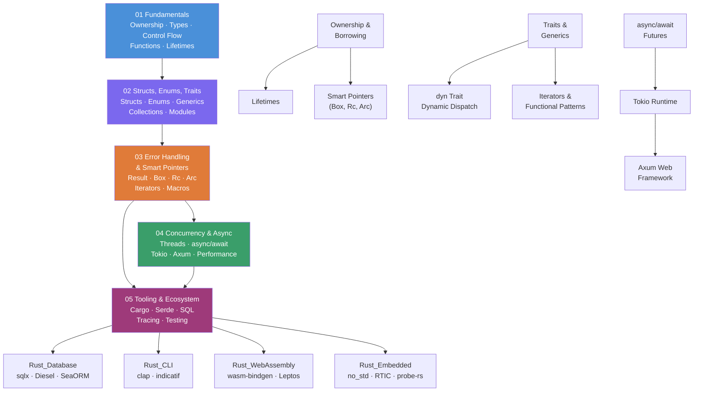

# Rust Master MOC

> [!abstract] About This Vault
> **29 notes across 5 sections** — a complete Rust knowledge vault covering the ownership system, type-driven design, error handling, fearless concurrency, and the production web ecosystem. Each note includes real Rust code, pitfalls from experience, and review questions for active recall.

---

## Knowledge Map



---

## Sections at a Glance

| Section | Notes | Core Concepts | Difficulty |
|---------|-------|--------------|------------|
| **01 Fundamentals** | 6 | Ownership, borrowing, lifetimes, types, control flow, closures | Beginner → Intermediate |
| **02 Structs, Enums, Traits** | 5 | Structs, enums, generics, collections, module system | Beginner → Intermediate |
| **03 Error Handling & Smart Pointers** | 5 | Result, Box/Rc/Arc/RefCell, dyn Trait, iterators, macros | Intermediate |
| **04 Concurrency & Async** | 5 | OS threads, async/await, Tokio, Axum, performance | Intermediate → Advanced |
| **05 Tooling & Ecosystem** | 8 | Cargo, Serde, web stack (reqwest/sqlx/tracing), testing, databases, CLI, WASM, embedded | Beginner → Advanced |

---

## Section 01 — Fundamentals

The foundational concepts that make Rust unique. The ownership and borrowing system is Rust's core differentiator — understand these before moving on.

| Note | Key Topics |
|------|-----------|
| [[Rust_Overview]] | Value proposition, Cargo CLI, edition system, use cases, rustup |
| [[Rust_Types_and_Variables]] | let/let mut, scalar types, tuples, arrays, shadowing, Copy trait |
| [[Rust_Control_Flow]] | if/else expressions, loop/while/for, match (exhaustive), if let, match guards |
| [[Rust_Functions_and_Closures]] | fn, return types, closures, Fn/FnMut/FnOnce, move closures, function pointers |
| [[Ownership_and_Borrowing]] | Ownership rules, move semantics, &T/&mut T, borrow rules, slices, NLL |
| [[Lifetimes]] | Lifetime annotations `'a`, elision rules, structs with references, 'static |

---

## Section 02 — Structs, Enums, Traits

Rust's type system and how to compose behavior. Traits replace inheritance; generics enable zero-cost polymorphism.

| Note | Key Topics |
|------|-----------|
| [[Structs_and_Methods]] | Struct declaration, impl blocks, &self/&mut self/self, #[derive] macros |
| [[Enums_and_Pattern_Matching]] | ADTs, Option<T>, Result<T,E>, exhaustive match, @ bindings, destructuring |
| [[Traits_and_Generics]] | Trait definition, monomorphization, trait bounds, impl Trait, orphan rule |
| [[Rust_Collections]] | Vec, HashMap (entry API), String vs &str, BTreeMap, iterator basics |
| [[Rust_Modules_and_Crates]] | mod, pub visibility, use paths, Cargo.toml, workspaces, crates.io |

---

## Section 03 — Error Handling & Smart Pointers

Production-grade Rust patterns: explicit error handling, controlled heap allocation, runtime polymorphism, and metaprogramming.

| Note | Key Topics |
|------|-----------|
| [[Rust_Error_Handling]] | Result<T,E>, ? operator, From trait, thiserror (libraries), anyhow (apps) |
| [[Smart_Pointers]] | Box<T>, Rc<T>, RefCell<T>, Rc<RefCell<T>>, Arc<T>, Weak<T>, Cow<T> |
| [[Trait_Objects_and_Dynamic_Dispatch]] | dyn Trait, vtable, fat pointers, object safety, Box<dyn Trait>, dyn Any |
| [[Iterators_and_Functional_Patterns]] | Iterator trait, lazy adaptors, collect, fold, custom iterators, rayon |
| [[Rust_Macros]] | macro_rules!, declarative macros, procedural macros, #[derive], common macros |

---

## Section 04 — Concurrency & Async

Rust's fearless concurrency: compile-time data race prevention, async/await for I/O, and the Tokio ecosystem.

| Note | Key Topics |
|------|-----------|
| [[Rust_Threads]] | thread::spawn, Arc<Mutex<T>>, RwLock, Send/Sync traits, channels, Rayon |
| [[Rust_Async_Await]] | async fn, Future trait, executors, join!/select!, move closures, async traits |
| [[Tokio_Runtime]] | #[tokio::main], task::spawn, sync (Mutex/Semaphore), channels (mpsc/oneshot/broadcast/watch), time |
| [[Rust_Web_with_Axum]] | Router, extractors (Path/Query/Json/State), error handling, Tower middleware, testing |
| [[Rust_Performance]] | Flamegraphs, criterion benchmarks, SoA vs AoS, unsafe, repr(C), SIMD, zero-copy |

---

## Section 05 — Tooling & Ecosystem

The full Rust toolchain, production web stack, and specialty domains.

| Note | Key Topics |
|------|-----------|
| [[Cargo_and_Toolchain]] | cargo fmt/clippy/test/bench/doc, build.rs, feature flags, cross-compilation, #[cfg] |
| [[Rust_Serde]] | Serialize/Deserialize derive, field attributes, enum representations, serde_json Value, custom serialization |
| [[Rust_Web_Ecosystem]] | reqwest, sqlx (compile-time queries), deadpool-redis, tracing, OpenTelemetry, Prometheus metrics |
| [[Rust_Testing]] | Unit tests, integration tests, doc tests, #[should_panic], mockall, proptest |
| [[Rust_Database]] | sqlx async compile-time queries, Diesel QueryDSL + migrations, SeaORM ActiveModel, connection pools |
| [[Rust_CLI]] | clap derive API, subcommands, ValueEnum, shell completions, indicatif progress bars, dialoguer |
| [[Rust_WebAssembly]] | wasm-bindgen, wasm-pack, web-sys/js-sys, Leptos, WASM in Node.js, wasm-opt size optimization |
| [[Rust_Embedded]] | no_std/no_main, embedded-hal traits, cortex-m-rt, RTIC tasks/resources, probe-rs, defmt |

---

## Learning Paths

### Path A — Systems Programming
*Goal: Write OS components, device drivers, CLI tools, embedded firmware*

```
Rust_Overview
  → Rust_Types_and_Variables
  → Rust_Control_Flow
  → Ownership_and_Borrowing   ← spend extra time here
  → Lifetimes
  → Rust_Functions_and_Closures
  → Structs_and_Methods
  → Enums_and_Pattern_Matching
  → Rust_Error_Handling
  → Smart_Pointers             ← Box/Rc/Arc
  → Rust_Performance           ← unsafe, repr(C), SIMD, cache layout
  → Cargo_and_Toolchain        ← build.rs, cross-compilation, #[cfg]
```

### Path B — Web Backend
*Goal: Build production REST APIs, connect to PostgreSQL/Redis, add observability*

```
Rust_Overview
  → Rust_Types_and_Variables
  → Ownership_and_Borrowing   ← essentials
  → Structs_and_Methods
  → Enums_and_Pattern_Matching
  → Traits_and_Generics
  → Rust_Error_Handling        ← thiserror + anyhow
  → Rust_Serde                 ← JSON serialization
  → Rust_Async_Await           ← futures model
  → Tokio_Runtime              ← channels, sync primitives
  → Rust_Web_with_Axum         ← routes, extractors, middleware
  → Rust_Web_Ecosystem         ← reqwest, sqlx, tracing, metrics
  → Rust_Testing               ← mockall for database layer
  → Cargo_and_Toolchain        ← feature flags, CI setup
```

### Path C — Async & Concurrency Deep Dive
*Goal: Understand Rust's concurrency model, write custom runtimes or high-performance services*

```
Ownership_and_Borrowing      ← prerequisite: understand Send/Sync foundations
  → Lifetimes
  → Traits_and_Generics      ← trait objects, generics
  → Smart_Pointers           ← Arc/Mutex patterns
  → Rust_Threads             ← OS threads, channels, rayon
  → Rust_Async_Await         ← Future trait, poll model
  → Tokio_Runtime            ← full Tokio API
  → Iterators_and_Functional_Patterns  ← parallel iterators
  → Rust_Performance         ← profiling concurrent code
  → Trait_Objects_and_Dynamic_Dispatch ← dyn Trait for plugin architectures
```

---

## Key Concept Cross-References

| If you're struggling with... | Read these notes |
|------------------------------|-----------------|
| Why `let s2 = s1` invalidates `s1` | [[Ownership_and_Borrowing]], [[Rust_Types_and_Variables]] (Copy trait) |
| Lifetime annotation errors | [[Lifetimes]], [[Ownership_and_Borrowing]] |
| When to use `Box` vs `Rc` vs `Arc` | [[Smart_Pointers]], [[Rust_Threads]] |
| `async fn` not running | [[Rust_Async_Await]] — futures are lazy, need `.await` |
| Borrow checker fighting you | [[Ownership_and_Borrowing]] — NLL section; [[Smart_Pointers]] for escape hatches |
| `impl Trait` vs `dyn Trait` | [[Trait_Objects_and_Dynamic_Dispatch]], [[Traits_and_Generics]] |
| Error propagation with `?` | [[Rust_Error_Handling]], [[Enums_and_Pattern_Matching]] |
| Choosing a channel type | [[Tokio_Runtime]] — mpsc/oneshot/broadcast/watch table |
| Making JSON work | [[Rust_Serde]] |
| Testing code with database calls | [[Rust_Testing]] — mockall section |
| sqlx compile-time query checking | [[Rust_Database]] |
| Diesel vs sqlx vs SeaORM | [[Rust_Database]] |
| clap derive API subcommands | [[Rust_CLI]] |
| Shell completion generation | [[Rust_CLI]] |
| wasm-bindgen JS↔Rust bridge | [[Rust_WebAssembly]] |
| Leptos reactive components | [[Rust_WebAssembly]] |
| no_std bare-metal setup | [[Rust_Embedded]] |
| RTIC task priorities and resources | [[Rust_Embedded]] |

---

## Rust Compared to Other Languages

| Concept | Python/Java equivalent | Rust mechanism |
|---------|----------------------|----------------|
| Garbage collection | GC | Ownership (compile-time drop) |
| Null pointers | None/null | `Option<T>` — must handle both |
| Exceptions | try/catch | `Result<T, E>` — explicit |
| Interfaces | interface/ABC | `trait` |
| Generics | generics/templates | Generics + monomorphization |
| Threads | Thread class | `thread::spawn` + `Arc<Mutex<T>>` |
| Async/await | asyncio/CompletableFuture | `async fn` + Tokio runtime |
| Inheritance | extends | Trait composition (no inheritance) |
| Reflection | isinstance/getattr | `dyn Any` + `downcast_ref` |

---

#Rust #MOC #index
