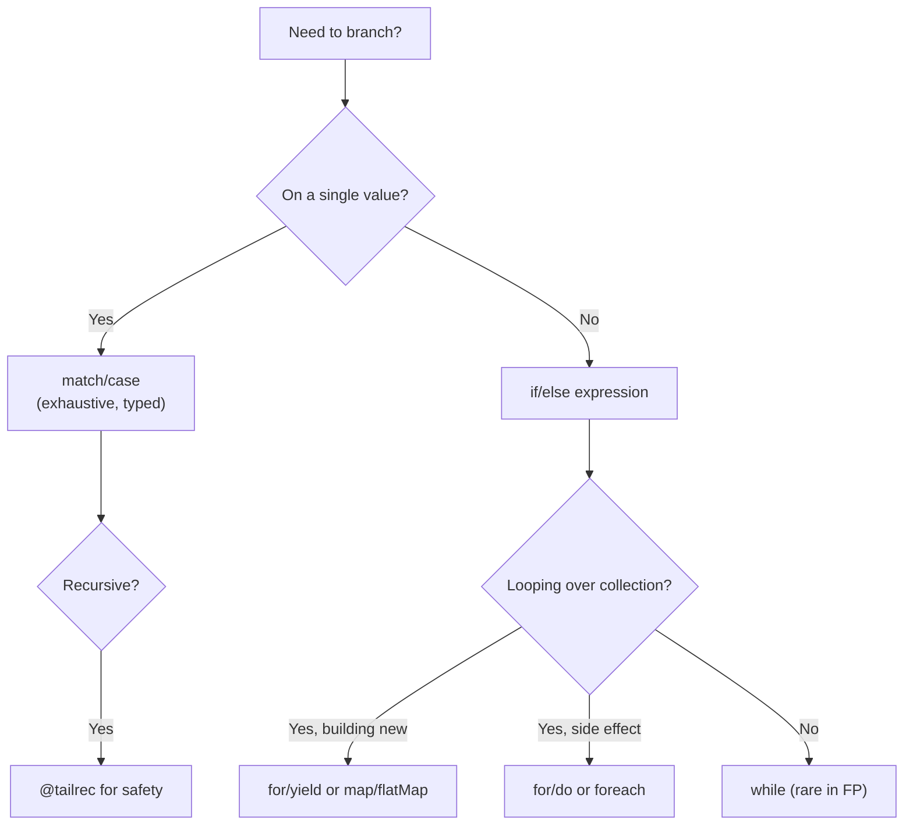

# Scala Control Flow

> [!abstract] TL;DR
> In Scala, nearly every control structure is an **expression** that returns a value — `if/else`, `match`, `try/catch`, and `for/yield` all produce values rather than executing side effects. This eliminates statement-oriented code and enables composition. The `@tailrec` annotation ensures tail-recursive functions are optimised to loops by the compiler.

---

## Intuition

Java's control flow is statement-based: `if` and `switch` do things but return nothing. Scala's control flow is **expression-based**: every construct produces a value. This means you can assign the result of a `match` to a `val`, return a `try` block from a function, or embed an `if` inside a string template — the whole language becomes one large expression evaluator.

---

## How It Works

### if/else as Expression

```scala
// Returns a value — assign directly to val
val abs = if x >= 0 then x else -x

// Multi-line expression if
val grade: String =
  if score >= 90 then "A"
  else if score >= 80 then "B"
  else if score >= 70 then "C"
  else "F"

// if without else returns Unit — avoid for expressions
val bad = if condition then 42    // type: AnyVal (Int | Unit) — don't do this
```

### match / case — Pattern Matching

```scala
// Basic match on value
val dayType = day match
  case "Saturday" | "Sunday" => "Weekend"
  case _                      => "Weekday"

// Match with guards (additional condition after if)
val classify = (n: Int) => n match
  case 0           => "zero"
  case n if n < 0  => s"negative ($n)"
  case n if n > 100 => "large"
  case n           => s"small positive ($n)"

// Nested patterns — match on structure
case class Point(x: Int, y: Int)

def describe(p: Point): String = p match
  case Point(0, 0)       => "origin"
  case Point(x, 0)       => s"on x-axis at $x"
  case Point(0, y)       => s"on y-axis at $y"
  case Point(x, y)       => s"at ($x, $y)"
```

### for Comprehensions — Generators and yield

```scala
// Generator with guard — pure iteration
for
  i <- 1 to 5
  if i % 2 == 0
do println(i)               // 2, 4

// yield — builds a new collection
val squares = for
  i <- 1 to 5
  if i % 2 != 0
yield i * i                 // Vector(1, 9, 25)

// Multiple generators — nested loops (Cartesian product)
val pairs = for
  x <- List(1, 2)
  y <- List("a", "b")
yield (x, y)
// List((1,a),(1,b),(2,a),(2,b))

// for comprehension over Option — desugars to flatMap/map
def parseAge(s: String): Option[Int] = s.toIntOption.filter(_ > 0)

val result: Option[String] = for
  raw  <- Option("25")
  age  <- parseAge(raw)
yield s"Valid age: $age"    // Some("Valid age: 25")
```

### try / catch / finally

```scala
// try is an expression — assign the result
val parsed: Int =
  try s.toInt
  catch
    case _: NumberFormatException => -1
  finally
    println("always runs")          // but finally's value is discarded

// Pattern matching in catch clauses
def readFile(path: String): Either[String, String] =
  try
    Right(scala.io.Source.fromFile(path).mkString)
  catch
    case e: java.io.FileNotFoundException => Left(s"File not found: ${e.getMessage}")
    case e: java.io.IOException           => Left(s"IO error: ${e.getMessage}")
```

### Tail Recursion with @tailrec

```scala
import scala.annotation.tailrec

// WITHOUT @tailrec — stack overflow on large n
def factorial(n: Int): BigInt =
  if n <= 1 then 1 else n * factorial(n - 1)   // NOT tail call

// WITH @tailrec — compiler converts to a loop
def factorialTR(n: Int): BigInt =
  @tailrec
  def loop(acc: BigInt, remaining: Int): BigInt =
    if remaining <= 1 then acc
    else loop(acc * remaining, remaining - 1)   // tail call: loop is last expression
  loop(1, n)

// @tailrec on public method
@tailrec
def sum(xs: List[Int], acc: Int = 0): Int = xs match
  case Nil    => acc
  case h :: t => sum(t, acc + h)               // tail call
```

### throw as Expression

```scala
// throw returns Nothing — fits any type context
def getOrFail(opt: Option[Int]): Int =
  opt.getOrElse(throw new NoSuchElementException("empty"))

// In a match arm — valid because Nothing <: Int
val safe: Int = input match
  case Some(v) => v
  case None    => throw RuntimeException("no value")
```

## Control Flow Decision Guide



## Common Pitfalls

| # | Pitfall | Fix |
|---|---------|-----|
| 1 | Non-exhaustive `match` compiles but throws `MatchError` at runtime | Use `sealed` traits so the compiler warns about missing cases |
| 2 | `for` with `yield` over `List` + `Option` gives `List[Option[T]]` not `List[T]` | Use `flatMap` or `collect` when mixing monads |
| 3 | Recursive function not tail-recursive — `@tailrec` fails to compile | Accumulate result in a helper parameter; last call must be the recursive call |
| 4 | `if` without `else` in expression context infers `Unit` | Always provide `else` when using `if` as an expression |
| 5 | `finally` block's value is discarded silently | Use `finally` only for cleanup (closing resources), never for return values |

## Review Questions

1. How does for/yield desugar? What method does `if i % 2 == 0` guard translate to?
2. What condition must be met for `@tailrec` to compile successfully?
3. Why can `throw` appear in any position where a value is expected in Scala?

---

Related: [[Scala_Types_and_Variables]] | [[Scala_Pattern_Matching]] | [[Scala_Functions]] | [[Scala_Error_Handling_FP]]

#Scala
