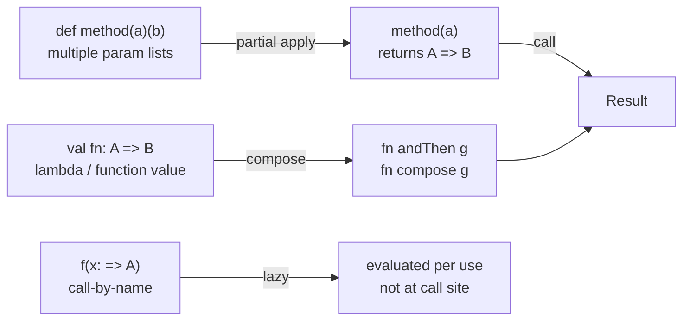

# Scala Functions

> [!abstract] TL;DR
> Scala treats functions as first-class values. A `def` defines a method; a `val` with a function type holds a function value. Higher-order functions, partial application, currying via multiple parameter lists, and call-by-name parameters give Scala its FP power. Scala 3's `using` clauses replace implicit parameters for clean, structured context passing.

---

## Intuition

Scala blurs the line between methods and functions deliberately. Methods (defined with `def`) live on objects and benefit from the JVM's dispatch. Function values (lambdas stored in `val`) are objects of type `FunctionN[A, B]`. When you pass a method where a function is expected, Scala silently lifts it — called **eta-expansion**. This lets you use OOP and FP interchangeably.

---

## How It Works

### Methods vs Function Values

```scala
// Method: defined on an object, not a value itself
def add(a: Int, b: Int): Int = a + b

// Function value: an object; can be stored, passed, returned
val addFn: (Int, Int) => Int = (a, b) => a + b

// Eta-expansion: lift a method into a function value
val addLifted: (Int, Int) => Int = add      // Scala 3 syntax (no _ needed)

// Shorthand: anonymous function
val double: Int => Int = _ * 2             // _ is the single parameter
val sumTwo: (Int, Int) => Int = _ + _      // _ for each positional param
```

### Higher-Order Functions

```scala
// Accepting a function as parameter
def applyTwice(f: Int => Int, x: Int): Int = f(f(x))

println(applyTwice(_ * 3, 2))   // 18 (2 → 6 → 18)

// Returning a function
def multiplier(factor: Int): Int => Int = x => x * factor

val triple = multiplier(3)
val tenX   = multiplier(10)
println(triple(5))    // 15
println(tenX(5))      // 50

// Standard HOFs on collections
val nums = List(1, 2, 3, 4, 5)
nums.map(_ * 2)                   // List(2,4,6,8,10)
nums.filter(_ % 2 == 0)           // List(2,4)
nums.foldLeft(0)(_ + _)           // 15
nums.flatMap(n => List(n, -n))    // List(1,-1,2,-2,3,-3,4,-4,5,-5)
```

### Multiple Parameter Lists and Currying

```scala
// Multiple parameter lists — enables partial application and cleaner syntax
def add(a: Int)(b: Int): Int = a + b

val add5: Int => Int = add(5)    // partial application — fix first list
println(add5(3))                 // 8

// Idiomatic: last parameter list for lambda to enable clean DSL
def withLogger(label: String)(block: => Unit): Unit =
  println(s"[$label] start")
  block
  println(s"[$label] end")

withLogger("DB"):
  println("executing query")
// [DB] start  /  executing query  /  [DB] end

// curried conversion of a regular 2-arg function
val addRegular: (Int, Int) => Int = _ + _
val addCurried: Int => Int => Int = addRegular.curried
val increment: Int => Int         = addCurried(1)
```

### Call-by-Name Parameters — Lazy Evaluation

```scala
// Call-by-value (default): argument evaluated BEFORE the call
// Call-by-name (=>): argument evaluated EACH TIME it is used in body

def or(a: Boolean, b: => Boolean): Boolean =
  if a then true else b       // b not evaluated if a is true

def risky(): Boolean =
  throw RuntimeException("evaluated!")

println(or(true, risky()))    // true — risky() never called
// println(or(false, risky())) // throws — b is evaluated

// Building a custom lazy while (for illustration)
def repeat(cond: => Boolean)(body: => Unit): Unit =
  if cond then
    body
    repeat(cond)(body)
```

### Implicit/given Parameters (Context Passing, Scala 3)

```scala
// given instance — provides implicit value automatically
given defaultConfig: Config = Config(timeout = 30, retries = 3)

// using parameter — requests a contextual value
def fetch(url: String)(using cfg: Config): String =
  s"GET $url [timeout=${cfg.timeout}]"

fetch("https://api.example.com")       // uses defaultConfig automatically
fetch("https://api.example.com")(using Config(5, 1))  // override explicitly

// Context bounds — shorthand for using clauses
def maxOf[A: Ordering](a: A, b: A): A =
  if summon[Ordering[A]].gt(a, b) then a else b

println(maxOf(3, 7))          // 7
println(maxOf("cat", "dog"))  // "dog" — String's Ordering used
```

### Function Composition

```scala
val toInt:    String => Option[Int]  = _.toIntOption
val positive: Int    => Boolean      = _ > 0
val double:   Int    => Int          = _ * 2

// compose and andThen
val f: Int => Int    = double.andThen(_ + 1)   // double first, then +1
val g: Int => Int    = (_ + 1).compose(double) // same result via compose

// Function pipeline with andThen
val pipeline: String => String =
  (s: String) => s.trim
  andThen (_.toLowerCase)
  andThen (_.capitalize)

println(pipeline("  hELLO WORLD  "))  // Hello world
```

## Functions Reference Card



## Common Pitfalls

| # | Pitfall | Fix |
|---|---------|-----|
| 1 | Method not found when passing to HOF — method not lifted | Scala 3 auto eta-expands; in Scala 2 write `method _` |
| 2 | `_ * 2` placeholder ambiguous with multiple `_` meanings | Use named lambdas `x => x * 2` when context is unclear |
| 3 | Call-by-name parameter evaluated multiple times | If body uses `b` more than once, assign `val x = b` inside |
| 4 | `curried` on a function — not on a method with multiple parameter lists | Convert method to function value first, then call `.curried` |
| 5 | Overusing `implicit` (Scala 2) makes code hard to trace | Prefer Scala 3 `given`/`using` with explicit names |

## Review Questions

1. What is eta-expansion? When does Scala perform it automatically?
2. What is the difference between call-by-value and call-by-name? Give a use case for each.
3. How do multiple parameter lists enable currying and partial application in Scala?

---

Related: [[Scala_Control_Flow]] | [[Scala_Typeclasses]] | [[Scala_Collections]] | [[Scala_OOP]]

#Scala
