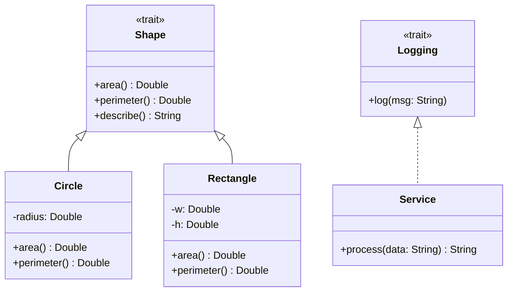

# Scala OOP

> [!abstract] TL;DR
> Scala's OOP model has `class` for regular classes, `case class` for immutable data (auto-generated `equals`/`hashCode`/`copy`/`unapply`), `object` for singletons, `trait` for rich mixins with state and default implementations, and `sealed class/trait` for exhaustively matchable hierarchies. Companion objects act as factories and hold static-like members.

---

## Intuition

Scala's OOP extends Java's with two key innovations: **traits** (far more powerful than interfaces — they can carry state, default methods, and even constructor parameters in Scala 3) and **case classes** (immutable value objects that work perfectly with pattern matching). Together they enable algebraic data types without any annotation frameworks.

---

## How It Works

### Classes and Constructor Parameters

```scala
// Constructor parameters become fields by default in Scala 3
class Person(val name: String, val age: Int):
  def greet: String = s"Hi, I'm $name, age $age"
  override def toString: String = s"Person($name, $age)"

val alice = Person("Alice", 30)
println(alice.greet)     // Hi, I'm Alice, age 30

// Private mutable state — use var, keep private
class Counter(initial: Int = 0):
  private var count = initial
  def increment(): Unit = count += 1
  def value: Int = count
```

### Case Classes — Immutable Data Objects

```scala
// case class auto-generates:
//   - equals / hashCode (structural, field-by-field)
//   - toString
//   - copy(field = newValue) for non-destructive updates
//   - unapply for pattern matching
//   - apply in companion (no new keyword needed)

case class Point(x: Double, y: Double)

val p1 = Point(1.0, 2.0)       // no `new` needed
val p2 = p1.copy(y = 5.0)      // Point(1.0, 5.0) — p1 unchanged
val p3 = Point(1.0, 2.0)

println(p1 == p3)               // true — structural equality
println(p1 eq p3)               // false — different objects

// Destructuring in match
p1 match
  case Point(0, 0)   => "origin"
  case Point(x, 0)   => s"x-axis at $x"
  case Point(x, y)   => s"point ($x, $y)"
```

### Traits — Mixins with State

```scala
// Trait: can have abstract + concrete members, state, constructor params (Scala 3)
trait Logging:
  val logPrefix: String = "[LOG]"
  def log(msg: String): Unit = println(s"$logPrefix $msg")

trait Timestamped:
  def timestamp: Long = System.currentTimeMillis()

// Mixin multiple traits with `with`
class Service extends Logging with Timestamped:
  def process(data: String): String =
    log(s"Processing at ${timestamp}")
    data.toUpperCase

// Trait as interface (abstract members)
trait Shape:
  def area: Double               // abstract
  def perimeter: Double          // abstract
  def describe: String =         // concrete default
    f"area=$area%.2f perimeter=$perimeter%.2f"

class Circle(radius: Double) extends Shape:
  def area: Double      = math.Pi * radius * radius
  def perimeter: Double = 2 * math.Pi * radius
```

### object Singleton

```scala
// object — single instance, no instantiation
object MathUtils:
  val PI = 3.14159265
  def clamp(v: Double, lo: Double, hi: Double): Double =
    math.max(lo, math.min(hi, v))

println(MathUtils.clamp(15.0, 0.0, 10.0))   // 10.0

// Case object — singleton + case class benefits
case object EmptyList
case object Quit
```

### Companion Objects — Factory and Static Members

```scala
// Companion object: same name as class, same file
// Has access to class's private members
class Email private (val address: String)

object Email:
  def apply(s: String): Option[Email] =    // smart constructor
    if s.contains("@") then Some(new Email(s))
    else None

  def unapply(e: Email): Some[String] = Some(e.address)

val valid   = Email("user@example.com")   // Some(Email)
val invalid = Email("notanemail")         // None

// Pattern matching uses companion's unapply
valid.foreach:
  case Email(addr) => println(s"Valid: $addr")
```

### Sealed Classes — Exhaustive Matching

```scala
// sealed: all subclasses must be in the same file
// Compiler warns if match is non-exhaustive

sealed trait Result[+A]
case class Success[A](value: A)   extends Result[A]
case class Failure(error: String) extends Result[Nothing]
case object Pending               extends Result[Nothing]

def handle[A](r: Result[A]): String = r match
  case Success(v)  => s"Got: $v"
  case Failure(e)  => s"Error: $e"
  case Pending     => "Still processing"
  // No wildcard needed — compiler verifies all cases covered
```

### OOP Hierarchy Diagram



## Common Pitfalls

| # | Pitfall | Fix |
|---|---------|-----|
| 1 | `case class` with mutable `var` fields — `copy` creates a shallow copy | Use `val` fields only in case classes; prefer immutability |
| 2 | Trait initialization order is complex with state | Use `lazy val` in traits or abstract `val` to avoid `NullPointerException` |
| 3 | Non-sealed trait — `match` on it compiles without exhaustiveness warnings | Always `seal` trait hierarchies used in pattern matching |
| 4 | Large case classes cause verbosity in `copy` chains | Use Monocle lenses for deep updates in nested structures |
| 5 | Companion object `apply` bypasses `private` constructor for subclasses | Always validate in `apply` and keep constructor `private` |

## Review Questions

1. What six things does the compiler auto-generate for a `case class`?
2. How does a `sealed trait` improve safety when used with pattern matching?
3. What is the relationship between a class and its companion object? What can the companion access?

---

Related: [[Scala_Types_and_Variables]] | [[Scala_Pattern_Matching]] | [[Scala_Immutability_and_ADTs]] | [[Scala_Functions]]

#Scala
