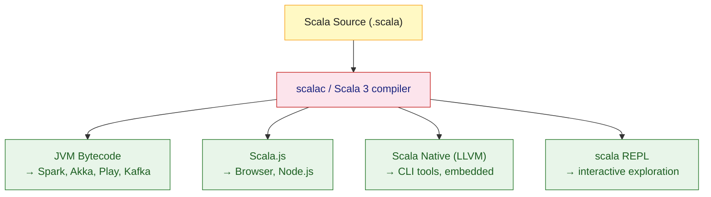

# Scala Overview

> [!abstract] TL;DR
> Scala is a statically typed JVM language that unifies object-oriented and functional programming. Scala 3 (Dotty, 2021) introduced a cleaner syntax, given/using for implicits, and union/intersection types. It compiles to JVM bytecode, JavaScript (Scala.js), and native binaries (Scala Native), and interoperates seamlessly with Java. Key use cases include Apache Spark, Akka, Kafka Streams, and Play Framework.

---

## Intuition

Think of Scala as **Java evolved toward Haskell** — you get the full JVM ecosystem and Java interop, but replace verbose boilerplate with expressive type-safe functional code. Unlike Kotlin (which modernises Java idioms), Scala prioritises **correctness through types**: immutable data, algebraic types, and pure functions that eliminate entire categories of bugs at compile time.

---

## How It Works

### Scala Compilation Targets



### Scala 2 vs Scala 3 at a Glance

| Feature | Scala 2 | Scala 3 (Dotty) |
|---|---|---|
| Implicits | `implicit val/def` | `given`/`using` (explicit names) |
| Enums | sealed trait + case objects | First-class `enum` keyword |
| Type lambdas | `({type F[X] = Either[String, X]})#F` | `[X] =>> Either[String, X]` |
| Indentation | Braces only | Optional braces (Python-like) |
| Union types | Not available | `String \| Int` |
| Intersection types | Not available | `Serializable & Closeable` |

### Scala in One File

```scala
// Scala 3 — run with: scala hello.scala
@main def hello(): Unit =
  // Case class: immutable, structural equality, pattern-matchable
  case class User(name: String, role: String)

  val users = List(
    User("Alice", "admin"),
    User("Bob",   "viewer"),
    User("Carol", "admin")
  )

  // Pattern matching + filter
  val admins = users.collect:
    case User(n, "admin") => n.toUpperCase

  admins.foreach(println)          // ALICE  CAROL

  // Option: safe null replacement
  def findUser(name: String): Option[User] =
    users.find(_.name == name)

  val greeting = findUser("Bob")
    .map(u => s"Hello, ${u.name} (${u.role})")
    .getOrElse("User not found")

  println(greeting)                // Hello, Bob (viewer)
```

### Java Interoperability

Scala and Java share the same JVM bytecode format. Any Java library is usable from Scala without a wrapper. Scala classes are callable from Java.

```scala
// Using Java libraries directly in Scala
import java.time.LocalDate
import java.util.{HashMap, ArrayList}

val today = LocalDate.now()                          // Java API, no adapter
val map   = new HashMap[String, Int]()
map.put("answer", 42)

// Scala List → Java List via JavaConverters
import scala.jdk.CollectionConverters.*
val javaList: java.util.List[String] = List("a", "b").asJava
```

## Scala in Industry

| Company | Use Case | Technology |
|---|---|---|
| LinkedIn | Data pipelines, real-time analytics | Kafka, Samza (Scala) |
| Twitter/X | Service-to-service messaging, timelines | Finagle, Scala |
| Netflix | Recommendation data processing | Spark, Scala |
| Databricks | Apache Spark core development | Scala throughout |
| Stripe | Type-safe backend services | Scala, http4s |

## sbt — The Standard Build Tool

```scala
// build.sbt
scalaVersion := "3.4.2"

libraryDependencies ++= Seq(
  "org.typelevel" %% "cats-core"   % "2.12.0",
  "io.circe"      %% "circe-core"  % "0.14.9",
  "org.scalatest" %% "scalatest"   % "3.2.18" % Test
)

// Run: sbt compile   sbt test   sbt run   sbt console (REPL with deps)
```

## Common Pitfalls

| # | Pitfall | Fix |
|---|---------|-----|
| 1 | Mixing `var` freely defeats immutability guarantees | Default to `val`; use `var` only at algorithm boundaries |
| 2 | Overusing `Any` type loses compile-time safety | Model data with sealed traits and case classes |
| 3 | Implicit conversions cause hard-to-trace bugs in Scala 2 | Prefer Scala 3 `given`/`using` which require explicit import |
| 4 | `null` escapes through Java interop | Wrap Java calls in `Option(javaResult)` immediately |
| 5 | `scalac` compile times can be slow on large projects | Use `sbt ~compile` incremental mode, or Bloop/Metals |

## Review Questions

1. What are the three compilation targets for Scala, and what is each used for?
2. Name two syntax-level differences between Scala 2 and Scala 3.
3. Why does Scala achieve seamless Java interop while still being a very different language?

---

Related: [[Scala_Types_and_Variables]] | [[Scala_OOP]] | [[Scala_Build_Tools]] | [[Scala_Spark_Basics]]

#Scala
