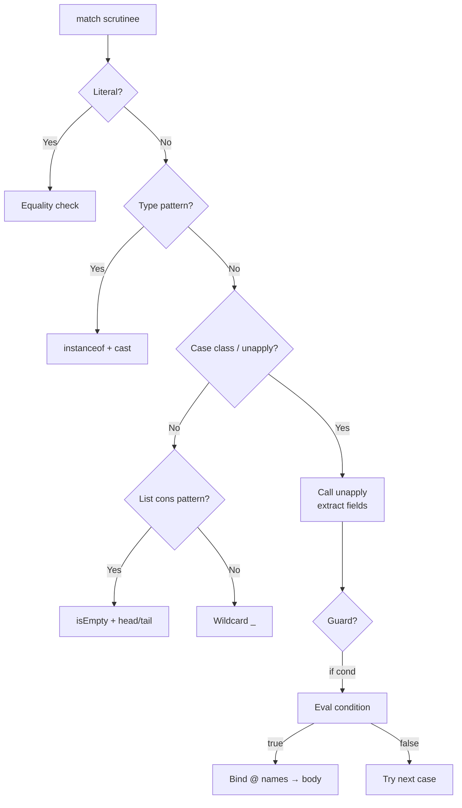

# Scala Pattern Matching

> [!abstract] TL;DR
> Scala's `match` expression is far more powerful than a `switch` statement — it deconstructs data structures, checks types, guards on conditions, binds sub-parts to names, and is guaranteed exhaustive for sealed hierarchies. Under the hood it uses `unapply` methods, which you can define for any class to make it pattern-matchable.

---

## Intuition

Pattern matching is Scala's superpower for working with **algebraic data types**. Instead of casting and null-checking, you describe the shape you expect and the compiler fills in variables automatically. Sealing a trait makes the match exhaustive: the compiler warns at compile time if you forget a case — eliminating an entire class of runtime `MatchError` bugs.

---

## How It Works

### Basic Syntax and Type Patterns

```scala
// Match on literal values
val msg = 418 match
  case 200 => "OK"
  case 404 => "Not Found"
  case 418 => "I'm a teapot"
  case _   => "Unknown"

// Type pattern — replaces instanceof + cast
def describe(x: Any): String = x match
  case n: Int    => s"Int: $n"
  case s: String => s"String of length ${s.length}"
  case lst: List[?] => s"List with ${lst.length} elements"
  case _         => "something else"
```

### Case Class Destructuring

```scala
case class Address(city: String, country: String)
case class Person(name: String, age: Int, address: Address)

def summary(p: Person): String = p match
  case Person("Alice", _, _)                    => "Found Alice"
  case Person(n, age, Address(_, "US")) if age >= 18 =>
    s"$n is an adult in the US"
  case Person(n, _, Address(city, _))           =>
    s"$n lives in $city"
```

### List Patterns — head :: tail

```scala
def listInfo[A](lst: List[A]): String = lst match
  case Nil          => "empty"
  case h :: Nil     => s"single element: $h"
  case h :: t       => s"head=$h, ${t.length} more"

listInfo(List())          // empty
listInfo(List(42))        // single element: 42
listInfo(List(1, 2, 3))  // head=1, 2 more

// Recursive sum using pattern matching
def sum(lst: List[Int]): Int = lst match
  case Nil    => 0
  case h :: t => h + sum(t)   // (add @tailrec version with accumulator)
```

### Tuple Matching

```scala
val coord = (3, 5)
val quadrant = coord match
  case (0, 0)         => "origin"
  case (x, 0)         => s"x-axis at $x"
  case (0, y)         => s"y-axis at $y"
  case (x, y) if x > 0 && y > 0 => "Q1"
  case (x, y) if x < 0 && y > 0 => "Q2"
  case _              => "Q3 or Q4"
```

### `@` Binding — Bind and Inspect

```scala
// @ lets you name the matched value AND inspect its parts
def processUser(p: Person): String = p match
  case admin @ Person("Alice", _, _) =>
    s"Admin found: ${admin.name}, routing to dashboard"
  case Person(n, age, addr @ Address(_, "UK")) =>
    s"$n in UK (${addr.city})"
  case other =>
    s"Regular user: ${other.name}"
```

### Guards — Conditional Patterns

```scala
// Guard: if condition after pattern — evaluated only when pattern matches
def classifyScore(score: Int): String = score match
  case s if s >= 90 => s"A ($s)"
  case s if s >= 80 => s"B ($s)"
  case s if s >= 60 => s"C ($s)"
  case s            => s"Fail ($s)"

// Guard with destructuring
case class Order(id: Int, amount: Double, status: String)

orders.collect:
  case Order(id, amt, "pending") if amt > 1000.0 =>
    s"High-value pending order #$id: $$$amt"
```

### Custom Extractors — unapply

```scala
// Define unapply to make any class pattern-matchable
object Email:
  def unapply(s: String): Option[(String, String)] =
    s.split("@").toList match
      case user :: domain :: Nil => Some((user, domain))
      case _                     => None

"alice@example.com" match
  case Email(user, domain) => println(s"user=$user domain=$domain")
  case _                   => println("not an email")
// user=alice domain=example.com

// unapplySeq — variable-length extraction
object Words:
  def unapplySeq(s: String): Some[List[String]] = Some(s.split(" ").toList)

"hello world scala" match
  case Words(first, rest @ _*) => println(s"First: $first, Rest: $rest")
```

### Exhaustiveness and Sealed Traits

```scala
sealed trait Expr
case class Num(n: Int)              extends Expr
case class Add(l: Expr, r: Expr)   extends Expr
case class Mul(l: Expr, r: Expr)   extends Expr

// Compiler ensures ALL cases are covered
def eval(e: Expr): Int = e match
  case Num(n)    => n
  case Add(l, r) => eval(l) + eval(r)
  case Mul(l, r) => eval(l) * eval(r)
// If you add `case Sub(...)` to Expr, compiler warns here — compile-time safety

val expr = Add(Num(3), Mul(Num(4), Num(2)))
println(eval(expr))   // 11
```

### Pattern Match Decision Flow



## Common Pitfalls

| # | Pitfall | Fix |
|---|---------|-----|
| 1 | `case s: List[Int]` — JVM type erasure; can't check inner type at runtime | Use `case s: List[?]` and check elements separately, or use typed wrappers |
| 2 | Guard fails silently — moves to next case instead of throwing | Log or use `assert` inside complex guards during debugging |
| 3 | `unapply` returns `Boolean` for presence-only checks | Return `Option[Unit]` or just `Boolean` — both are valid for presence patterns |
| 4 | Non-sealed trait match compiles without warning | Add `sealed` to all ADT base traits |
| 5 | `case _` early in match shadows all subsequent cases | Put catch-all last; IDE usually warns about unreachable cases |

## Review Questions

1. What method does the compiler invoke when a case class appears in a pattern? Where is it defined?
2. Why does `case s: List[Int]` produce a warning about type erasure?
3. What is the difference between `@` binding and a regular variable pattern?

---

Related: [[Scala_OOP]] | [[Scala_Control_Flow]] | [[Scala_Immutability_and_ADTs]] | [[Scala_Generics_and_Variance]]

#Scala
