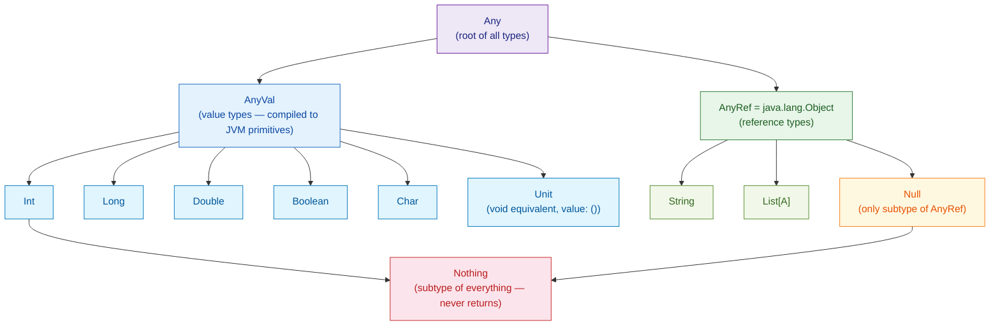

# Scala Types and Variables

> [!abstract] TL;DR
> Scala uses `val` for immutable bindings and `var` for mutable ones, with full type inference so annotations are usually optional. The type hierarchy is rooted at `Any`, splits into `AnyVal` (primitives) and `AnyRef` (objects), and bottoms out at `Nothing`. `Option[T]` replaces null throughout idiomatic Scala code.

---

## Intuition

Scala's type system is **unified**: every value — including `Int` and `Boolean` — is an object descending from `Any`. The compiler infers types from context, so you write clean code without sacrificing safety. The bottom type `Nothing` is the secret that lets `throw` and `???` work anywhere a value is expected.

---

## How It Works

### The Scala Type Hierarchy



### `val` vs `var` vs `def`

```scala
// val — immutable binding (recommended default)
val pi: Double = 3.14159           // explicit type annotation
val name = "Scala"                 // inferred: String

// var — mutable binding (avoid in FP code)
var counter = 0
counter += 1

// def — method / computed expression (re-evaluated each call)
def timestamp: Long = System.currentTimeMillis()

// lazy val — computed once, on first access
lazy val expensive = {
  println("computed!")
  42
}
// "computed!" prints only when expensive is first read
```

### Basic Types Deep Dive

```scala
// Numeric types
val i:  Int    = 42             // 32-bit, range ±2.1B
val l:  Long   = 42L            // 64-bit
val d:  Double = 3.14           // 64-bit IEEE 754
val f:  Float  = 3.14f          // 32-bit
val s:  Short  = 100            // 16-bit
val b:  Byte   = 0x0F           // 8-bit

// Numeric conversions — must be explicit (no implicit widening)
val asLong: Long   = i.toLong
val asStr:  String = i.toString

// String and Char
val ch: Char   = 'A'
val str: String = s"Pi is ${d.round}"   // string interpolation

// Unit — functions that return nothing
val result: Unit = println("side effect")  // result == ()

// Nothing — the bottom type; no values exist of this type
def fail(msg: String): Nothing = throw RuntimeException(msg)
// Nothing is a subtype of ALL types, so fail() fits anywhere
```

### Option[T] — The Null Replacement

```scala
// Option wraps a value that may or may not exist
def divide(a: Int, b: Int): Option[Double] =
  if b == 0 then None else Some(a.toDouble / b)

val result1 = divide(10, 2)   // Some(5.0)
val result2 = divide(10, 0)   // None

// Chain operations without null checks
val formatted: String = divide(10, 3)
  .map(r => f"$r%.2f")
  .getOrElse("undefined")     // "3.33"

// For-comprehension with Option
val sum: Option[Double] = for
  x <- divide(10, 2)
  y <- divide(6, 3)
yield x + y                   // Some(7.0)

// Wrapping Java nulls safely
val nullable: String | Null = System.getenv("HOME")  // Scala 3 explicit null
val safe: Option[String] = Option(nullable)           // None if null
```

### Type Inference and Annotations

```scala
// Compiler infers types from right-hand side
val xs = List(1, 2, 3)           // List[Int]
val m  = Map("a" -> 1, "b" -> 2) // Map[String, Int]

// Annotate when inference is wrong or for readability at API boundaries
def process(items: Seq[String]): Map[String, Int] =
  items.groupBy(identity).view.mapValues(_.length).toMap

// Explicit type ascription with as (Scala 3)
val n = 42: Long                 // forces Long, not Int
```

## Common Pitfalls

| # | Pitfall | Fix |
|---|---------|-----|
| 1 | Using `var` and mutating in loops | Replace with `foldLeft` or recursive `val` bindings |
| 2 | `Null` type is a subtype of `AnyRef` — Java interop leaks `null` | Always wrap Java results: `Option(javaCall())` |
| 3 | `Unit` returned inadvertently from an `if` without `else` | Ensure both branches of an expression-`if` return the same type |
| 4 | `Int` literals are 32-bit — overflow is silent | Use `Long` with `L` suffix for large numeric computations |
| 5 | Confusing `==` (structural equality) with `eq` (reference identity) | `==` calls `equals()` on case classes; use `eq` only for identity checks |

## Review Questions

1. What is the role of `Nothing` in Scala's type hierarchy, and why does it allow `throw` to appear in any expression position?
2. How does `Option[T]` eliminate `NullPointerException` compared to Java's nullable references?
3. What is the difference between `val`, `var`, `def`, and `lazy val`?

---

Related: [[Scala_Overview]] | [[Scala_Control_Flow]] | [[Scala_Immutability_and_ADTs]] | [[Scala_Pattern_Matching]]

#Scala
