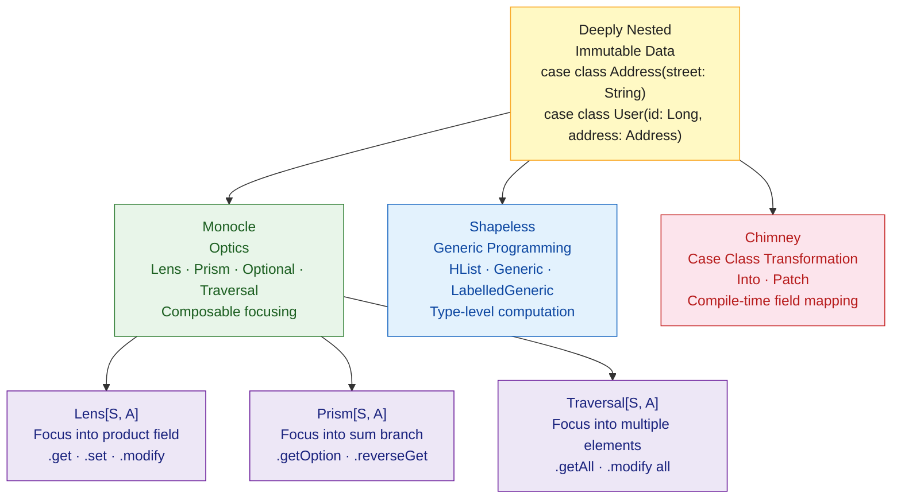

# Scala Advanced FP — Optics, Shapeless, and Chimney

> [!abstract] TL;DR
> Three libraries push Scala's type system to its limits for practical data transformation. **Monocle** provides composable optics — `Lens` (focus into a field), `Prism` (focus into a sum type branch), `Traversal` (focus into multiple elements) — making deeply-nested immutable updates readable. **Shapeless** gives generic programming over heterogeneous lists (`HList`) and case class shapes, enabling type-level computations. **Chimney** automates case class transformation and patching with compile-time safety, replacing tedious `.copy()` boilerplate.

---

## Intuition

**Analogy:** Working with deeply-nested immutable data structures is like editing a document in a filing cabinet inside a locked room inside a building — you have to check out the whole building, make a copy of the room, make a copy of the cabinet, make a copy of the document, change one word, and put everything back. **Optics (Monocle)** give you a laser pointer that reaches through all the layers: you say "change the word on page 3 of the document in cabinet B" and it handles the copying. **Shapeless** treats case classes as type-level lists of their fields, enabling generic algorithms that work on any case class. **Chimney** is an intelligent photocopier: given a `UserDTO`, it automatically produces a `User` by matching field names at compile time.

---

## How It Works



---

## Monocle — Optics

### Setup

```scala
// build.sbt
libraryDependencies += "dev.optics" %% "monocle-core"  % "3.2.0"
libraryDependencies += "dev.optics" %% "monocle-macro" % "3.2.0"  // @Lenses macro
```

### Lens — Focus into a Product Field

```scala
import monocle.Lens
import monocle.macros.GenLens

case class Address(street: String, city: String, zip: String)
case class User(id: Long, name: String, address: Address)

// Manual Lens
val addressLens: Lens[User, Address] =
  Lens[User, Address](_.address)(addr => user => user.copy(address = addr))

// Macro-derived Lens (much easier)
val streetLens: Lens[Address, String] = GenLens[Address](_.street)
val userAddressLens: Lens[User, Address] = GenLens[User](_.address)

// Compose lenses with andThen — "look inside address, then inside street"
val userStreetLens: Lens[User, String] = userAddressLens.andThen(streetLens)

val user = User(1L, "Alice", Address("123 Old St", "SF", "94105"))

// Read
userStreetLens.get(user)               // "123 Old St"

// Set (returns new User — immutable)
userStreetLens.set("456 New Ave")(user)
// User(1, "Alice", Address("456 New Ave", "SF", "94105"))

// Modify with a function
userStreetLens.modify(_.toUpperCase)(user)
// User(1, "Alice", Address("123 OLD ST", "SF", "94105"))

// Without Monocle — deeply nested copy is error-prone:
user.copy(address = user.address.copy(street = "456 New Ave"))
```

### Prism — Focus into a Sum Type Branch

```scala
import monocle.Prism

sealed trait Shape
case class Circle(radius: Double) extends Shape
case class Rectangle(w: Double, h: Double) extends Shape

// Prism focuses on Circle branch of Shape
val circlePrism: Prism[Shape, Double] =
  Prism[Shape, Double] {
    case Circle(r) => Some(r)
    case _         => None
  }(Circle.apply)

val shape: Shape = Circle(5.0)

circlePrism.getOption(shape)            // Some(5.0)
circlePrism.getOption(Rectangle(3, 4))  // None

circlePrism.modify(_ * 2)(shape)        // Circle(10.0)
circlePrism.modify(_ * 2)(Rectangle(3, 4))  // Rectangle(3, 4) — no-op on wrong branch

// Build from Circle(5.0)
circlePrism.reverseGet(5.0)             // Circle(5.0)
```

### Traversal — Focus into Multiple Elements

```scala
import monocle.Traversal

case class Cart(items: List[Item])
case class Item(name: String, price: Double)

// Focus on ALL prices in a list
val allPrices: Traversal[Cart, Double] =
  Traversal.fromTraverse[List, Item]
    .andThen(GenLens[Item](_.price))
    .asInstanceOf[Traversal[Cart, Double]]
// (Simplified; in practice use compose with each)

// Practical: apply discount to all items
val cart = Cart(List(Item("Book", 20.0), Item("Pen", 5.0)))

// Monocle Each for List
import monocle.function.all.*
val itemsTraversal: Traversal[Cart, Item] =
  GenLens[Cart](_.items).andThen(each[List[Item], Item])

val discounted = itemsTraversal
  .andThen(GenLens[Item](_.price))
  .modify(_ * 0.9)(cart)
// Cart(List(Item("Book",18.0), Item("Pen",4.5)))
```

---

## Shapeless — Generic Programming

### HList — Heterogeneous List

```scala
// build.sbt
libraryDependencies += "com.chuusai" %% "shapeless" % "2.3.12"
```

```scala
import shapeless.*

// HList: a list where each element can have a different type
val hlist: Int :: String :: Boolean :: HNil = 42 :: "hello" :: true :: HNil

// Pattern match on head and tail
val head: Int     = hlist.head    // 42
val tail          = hlist.tail    // "hello" :: true :: HNil
val second: String = tail.head   // "hello"

// Type-safe — unlike List[Any], each position has a precise type
```

### Generic — Derive HList from Case Class

```scala
import shapeless.*

case class User(id: Long, name: String, active: Boolean)

val gen = Generic[User]
// gen.Repr = Long :: String :: Boolean :: HNil

val user = User(1L, "Alice", true)

// Case class ↔ HList
val repr: Long :: String :: Boolean :: HNil = gen.to(user)
val back: User = gen.from(42L :: "Bob" :: false :: HNil)

// Generic enables type-class derivation for any case class
// This is how circe-generic, doobie, etc. auto-derive codecs
trait Printer[A]:
  def print(a: A): String

object Printer:
  given Printer[HNil] with
    def print(a: HNil) = ""

  given [H: Printer, T <: HList: Printer]: Printer[H :: T] with
    def print(ht: H :: T) =
      summon[Printer[H]].print(ht.head) + ", " + summon[Printer[T]].print(ht.tail)

  given [A](using gen: Generic[A], rp: Printer[gen.Repr]): Printer[A] with
    def print(a: A) = rp.print(gen.to(a))
```

---

## Chimney — Case Class Transformation

Chimney transforms between case classes automatically by matching field names:

```scala
// build.sbt
libraryDependencies += "io.scalaland" %% "chimney" % "1.3.0"
```

```scala
import io.scalaland.chimney.dsl.*

// Source — from API or external system
case class UserDTO(
  id: Long,
  firstName: String,
  lastName: String,
  emailAddress: String
)

// Domain model
case class User(
  id: Long,
  firstName: String,
  lastName: String,
  email: String          // different field name
)

val dto = UserDTO(1L, "Alice", "Smith", "alice@example.com")

// Basic transformation — matching fields copied automatically
val user: User = dto
  .into[User]
  .withFieldRenamed(_.emailAddress, _.email)  // map different field names
  .transform

// Computed field
case class FullUser(id: Long, fullName: String, email: String)

val fullUser: FullUser = dto
  .into[FullUser]
  .withFieldComputed(_.fullName, dto => s"${dto.firstName} ${dto.lastName}")
  .withFieldRenamed(_.emailAddress, _.email)
  .transform

// Patching — update only changed fields
case class UserPatch(email: Option[String], firstName: Option[String])

val patch = UserPatch(email = Some("new@example.com"), firstName = None)
val updated: User = user.patchUsing(patch)
// email updated; firstName unchanged

// If source has more fields, Chimney ignores them
// If target has a field missing from source → compile error unless you handle it
```

---

## Optics vs Alternatives

| Approach | Deep Update | Type Safety | Boilerplate | Use Case |
|---|---|---|---|---|
| `.copy(a = a.copy(b = ...))` | Nested, verbose | Yes | Very high | Simple, rare updates |
| **Monocle Lens** | Composable | Yes | Low (macro) | Domain model transformations |
| **Monocle Prism** | Sum type focus | Yes | Low | ADT branch operations |
| **Monocle Traversal** | Bulk updates | Yes | Moderate | Collections of records |
| **Shapeless Generic** | N/A | Yes | High | Library authors, codec derivation |
| **Chimney** | N/A | Yes | None | DTO ↔ domain model mapping |

---

## Common Pitfalls

- **Monocle composition order** — `lens1.andThen(lens2)` means "first zoom into lens1's target, then into lens2 within that." Reversing the order compiles but focuses on the wrong level.
- **`Traversal` modifies copies, not originals** — Scala is immutable. `traversal.modify(f)(data)` returns a new `data`; the original is unchanged. Reassign the result.
- **Shapeless compile times** — heavy use of Shapeless (especially `LabelledGeneric` and complex implicit searches) significantly increases compile times in Scala 2. Prefer Scala 3 which has better built-in metaprogramming.
- **Chimney missing field compile error** — if the target case class has a field that the source doesn't, Chimney fails to compile. You must provide `.withFieldConst` or `.withFieldComputed` for each missing field.
- **Shapeless vs Scala 3 metaprogramming** — many Shapeless use cases are superseded in Scala 3 by `Mirror`, `inline`, and `compiletime` APIs. Prefer Scala 3 native approaches for new code.

---

## Review Questions

1. What is the difference between a `Lens` and a `Prism` in Monocle? Give a use case for each.
2. Explain what `Generic[A].to(a)` returns in Shapeless and why this enables generic programming.
3. You have a `UserDTO` with `createdAt: String` and a `User` with `createdAt: LocalDate`. How would you transform between them using Chimney?
4. A list of `Order` objects each has a nested `Address`. How would you use a `Traversal` to capitalize all city names in all orders?

---

Related: [[Scala_Immutability_and_ADTs]] | [[Scala_Typeclasses]] | [[Scala_Generics_and_Variance]] | [[Cats_and_ZIO_Overview]]

#Scala #FunctionalProgramming #Monocle #Shapeless #Chimney #Optics #HList
