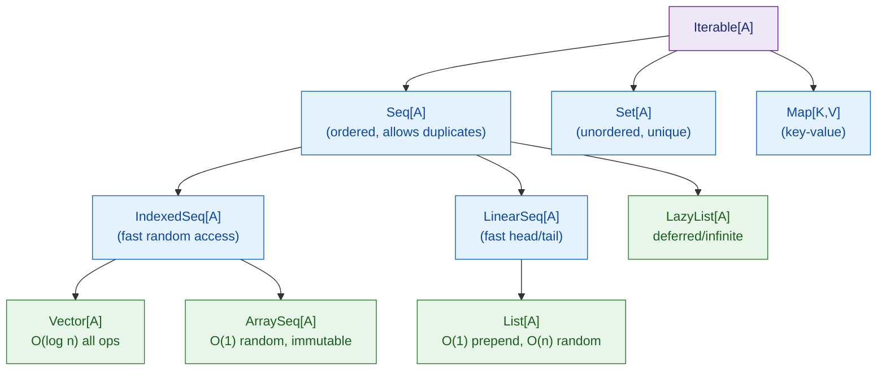

# Scala Collections

> [!abstract] TL;DR
> Scala's collection library has immutable and mutable variants. Immutable `List` (singly-linked, O(1) prepend), `Vector` (O(log n) random access), `Map`, and `Set` are the defaults. Rich HOF operations (`map`/`filter`/`flatMap`/`fold`/`groupBy`/`collect`) enable declarative data transformation. `LazyList` enables infinite sequences evaluated on demand.

---

## Intuition

Scala's immutable collections are like **persistent snapshots**: operations return new collections sharing structure with the old one. This is safe for concurrent code, easy to reason about, and often as efficient as mutation (structural sharing). When you need mutability for performance, the `scala.collection.mutable` package mirrors the same API.

---

## How It Works

### Collection Hierarchy Overview



### List — Singly Linked, Functional Core

```scala
// Construction — :: (cons) is O(1) prepend
val nums = List(1, 2, 3, 4, 5)
val more = 0 :: nums            // List(0,1,2,3,4,5) — O(1)
val also = nums :+ 6            // List(1,2,3,4,5,6) — O(n) append, avoid in loops

// Deconstruction in pattern matching
nums match
  case Nil        => "empty"
  case h :: Nil   => s"single: $h"
  case h :: t     => s"head=$h rest=${t.length} items"

// head/tail access
println(nums.head)    // 1
println(nums.tail)    // List(2,3,4,5)
println(nums.last)    // 5  — O(n), avoid
```

### Vector — Default for Most Use Cases

```scala
// Vector: persistent balanced trie — O(log₃₂ n) ≈ O(1) effectively
val v = Vector(10, 20, 30, 40, 50)
val updated = v.updated(2, 99)  // Vector(10,20,99,40,50) — O(log n)
val appended = v :+ 60          // O(log n)
val prepended = 5 +: v          // O(log n)

// Prefer Vector over List when:
// - Random access by index needed
// - Both prepend and append needed
println(v(2))                   // 30  — O(log n)
```

### Core Transformation Operations

```scala
val words = List("scala", "is", "functional", "and", "typed")

// map: transform each element
words.map(_.length)                        // List(5,2,10,3,5)
words.map(_.capitalize)                    // List(Scala, Is, Functional, And, Typed)

// filter: keep elements matching predicate
words.filter(_.length > 3)                 // List(scala, functional, typed)

// flatMap: transform + flatten (removes one layer of nesting)
words.flatMap(w => List(w, w.toUpperCase)) // List(scala, SCALA, is, IS, ...)

// foldLeft: accumulate — most general reduction
val totalLen = words.foldLeft(0)(_ + _.length)  // 25

// reduce: like fold but no initial value, throws on empty
words.map(_.length).reduce(_ + _)          // 25

// groupBy: partition into a Map
val byLength: Map[Int, List[String]] = words.groupBy(_.length)
// Map(5 -> List(scala, typed), 2 -> List(is), 10 -> List(functional), 3 -> List(and))

// zip / unzip
val pairs = words.zip(1 to 5)             // List((scala,1), (is,2), ...)
val (ws, ns) = pairs.unzip

// partition: split into (matching, non-matching)
val (long, short) = words.partition(_.length >= 5)

// collect: filter + map with partial function
val lengths: List[Int] = words.collect:
  case w if w.length > 3 => w.length      // List(5, 10, 5)

// scan: running accumulation (like fold but keeps all intermediates)
List(1,2,3,4,5).scanLeft(0)(_ + _)       // List(0,1,3,6,10,15)
```

### Map and Set Operations

```scala
// Immutable Map
val scores: Map[String, Int] = Map("Alice" -> 95, "Bob" -> 82, "Carol" -> 78)

scores.get("Alice")          // Some(95)
scores.getOrElse("Dave", 0)  // 0
scores + ("Dave" -> 91)      // new Map with Dave added
scores - "Bob"               // new Map without Bob
scores.map((k, v) => k -> v * 2)  // Scala 3 tuple destructuring in lambda

// Immutable Set
val a = Set(1, 2, 3, 4)
val b = Set(3, 4, 5, 6)
a | b                        // Set(1,2,3,4,5,6) — union
a & b                        // Set(3,4)          — intersection
a -- b                       // Set(1,2)          — difference
```

### for Comprehension Desugaring

```scala
// for/yield desugars to map/flatMap/filter
val result = for
  x <- List(1, 2, 3)
  y <- List(10, 20)
  if x + y > 12
yield (x, y)

// Equivalent to:
val same = List(1, 2, 3).flatMap { x =>
  List(10, 20).filter(y => x + y > 12).map(y => (x, y))
}
```

### LazyList — Infinite and Deferred Sequences

```scala
// LazyList: elements computed on demand, memoized
val naturals: LazyList[Int] = LazyList.from(1)  // infinite: 1, 2, 3, ...
val evens    = naturals.filter(_ % 2 == 0)
val first10  = evens.take(10).toList            // List(2,4,6,8,10,12,14,16,18,20)

// Fibonacci via LazyList (elegant definition)
def fibs: LazyList[BigInt] =
  def go(a: BigInt, b: BigInt): LazyList[BigInt] = a #:: go(b, a + b)
  go(0, 1)

fibs.take(10).toList   // List(0, 1, 1, 2, 3, 5, 8, 13, 21, 34)

// Views: like LazyList but NOT memoized — use for one-pass transformations
val view = (1 to 1_000_000).view.filter(_ % 2 == 0).map(_ * 3).take(5).toList
// Only 5 elements computed — no intermediate collections created
```

## Performance Cheat Sheet

| Collection | Prepend | Append | Random Access | Notes |
|---|---|---|---|---|
| `List` | O(1) | O(n) | O(n) | Best for recursive algorithms |
| `Vector` | O(log n) | O(log n) | O(log n) | General-purpose default |
| `ArraySeq` | O(n) | O(n) | O(1) | Immutable array wrapper |
| `Map` (hash) | — | O(1) | O(1) | `HashMap` under the hood |
| `Map` (tree) | — | O(log n) | O(log n) | `TreeMap` — sorted keys |

## Common Pitfalls

| # | Pitfall | Fix |
|---|---------|-----|
| 1 | `List :+` in a loop — O(n²) total | Prepend with `::` then reverse, or use `Vector`/`ListBuffer` |
| 2 | `list.last` on a long list — O(n) | Use `Vector` when last-element access is frequent |
| 3 | `LazyList` elements stored in memory via memoization | Use `.view` instead of `LazyList` for one-pass transformations |
| 4 | Calling `.toList` on `LazyList.from(1)` — infinite loop | Always call `.take(n)` before materialising an infinite stream |
| 5 | Mixing mutable and immutable collections accidentally | Check import: `scala.collection.mutable._` imports mutable; default is immutable |

## Review Questions

1. When should you choose `Vector` over `List`? What operation is `List` uniquely efficient for?
2. How does a `for/yield` comprehension desugar when there are two generators?
3. What is the difference between `LazyList` and a `View`? When do you prefer each?

---

Related: [[Scala_Immutability_and_ADTs]] | [[Scala_Functions]] | [[Scala_Generics_and_Variance]] | [[Scala_Error_Handling_FP]]

#Scala
