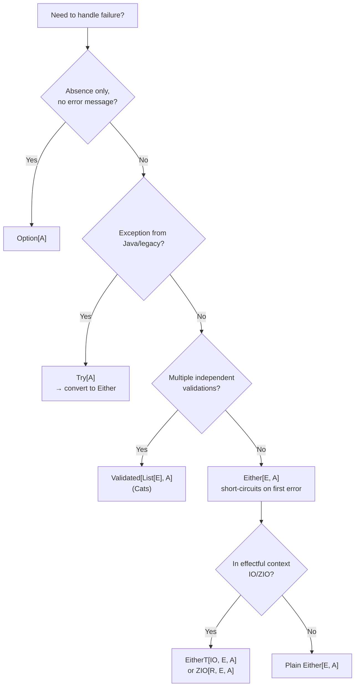

# Scala Error Handling FP

> [!abstract] TL;DR
> Functional error handling in Scala avoids exceptions as control flow. `Option[A]` handles absence, `Either[E, A]` handles expected business errors with short-circuit chaining, `Try[A]` wraps exception-throwing code, and Cats `Validated[E, A]` accumulates multiple errors independently. For effectful programs, `cats-effect IO` or `ZIO[R,E,A]` compose errors with effects.

---

## Intuition

Exceptions are like `goto` — they break the flow of your program invisibly. Functional error handling makes errors **part of the return type**: a function that can fail returns `Either[Error, Result]`, and callers are forced by the type system to handle both paths. This makes failures explicit, composable, and testable without try/catch scattered throughout the codebase.

---

## How It Works

### Option — Handling Absence

```scala
// Option[A] = Some(A) | None
// Use when: value may not exist, no error message needed

def findById(id: Int): Option[User] = cache.get(id)

// Chain operations — stops at first None
val result: Option[String] =
  findById(42)
    .filter(_.isActive)
    .map(u => u.email.toLowerCase)

// Provide default
val email: String = result.getOrElse("no-reply@example.com")

// orElse — fallback Option
val fromCacheOrDB: Option[User] =
  findInCache(42).orElse(findInDB(42))

// fold: handle both cases
val msg: String = result.fold("not found")(e => s"Found: $e")
```

### Either — Business Error Handling (Short-circuit)

```scala
// Either[E, A] = Left(E) | Right(A)
// Right-biased: map/flatMap operate on Right; Left short-circuits

sealed trait AppError
case class NotFound(id: Int)       extends AppError
case class Unauthorized(user: String) extends AppError
case class ValidationError(msg: String) extends AppError

def loadUser(id: Int): Either[AppError, User] =
  if id > 0 then Right(User(id, "Alice"))
  else Left(NotFound(id))

def checkPermission(user: User, resource: String): Either[AppError, User] =
  if user.hasPermission(resource) then Right(user)
  else Left(Unauthorized(user.name))

def readDocument(user: User, docId: Int): Either[AppError, Document] =
  Right(Document(docId, "content"))

// Chain with for-comprehension — stops at first Left
def getDocument(userId: Int, docId: Int): Either[AppError, Document] =
  for
    user <- loadUser(userId)
    auth <- checkPermission(user, "read")
    doc  <- readDocument(auth, docId)
  yield doc

// Pattern match to handle
getDocument(1, 100) match
  case Right(doc)               => println(s"Document: ${doc.content}")
  case Left(NotFound(id))       => println(s"User $id not found")
  case Left(Unauthorized(name)) => println(s"$name lacks permission")
  case Left(ValidationError(m)) => println(s"Invalid: $m")
```

### Try — Wrapping Exception-Throwing Code

```scala
import scala.util.{Try, Success, Failure}

// Try[A] = Success(A) | Failure(Throwable)
// Use at boundaries with Java/legacy code that throws

def parseConfig(json: String): Try[Config] =
  Try(JsonParser.parse(json).as[Config])   // any exception → Failure

// Convert to Either for idiomatic FP code
def loadConfig(path: String): Either[String, Config] =
  Try(scala.io.Source.fromFile(path).mkString)
    .flatMap(parseConfig)
    .toEither
    .left.map(_.getMessage)   // Throwable → String error message

// Chaining Try
val result: Try[Double] =
  for
    s    <- Try(System.getenv("SCALE").toDouble)
    base <- Try(System.getenv("BASE").toInt)
  yield base * s
```

### Validated — Accumulating Multiple Errors

```scala
import cats.data.Validated
import cats.data.Validated.{Valid, Invalid}
import cats.implicits.*

// Either short-circuits at first error
// Validated ACCUMULATES all errors independently — great for form validation

type ErrOr[A] = Validated[List[String], A]

def validateName(s: String): ErrOr[String] =
  if s.trim.nonEmpty then Valid(s.trim)
  else Invalid(List("Name cannot be empty"))

def validateAge(n: Int): ErrOr[Int] =
  if n >= 0 && n <= 150 then Valid(n)
  else Invalid(List(s"Age $n is out of range [0, 150]"))

def validateEmail(s: String): ErrOr[String] =
  if s.contains("@") then Valid(s)
  else Invalid(List(s"'$s' is not a valid email"))

// mapN — apply all validations; collect ALL errors
val result: ErrOr[User] =
  (validateName(""), validateAge(200), validateEmail("bad"))
    .mapN(User.apply)
// Invalid(List("Name cannot be empty", "Age 200...", "'bad' is not..."))
// ALL three errors collected, not just first
```

### Railway-Oriented Programming

```scala
// The "railway" metaphor: operations are either on the "success track" (Right)
// or the "error track" (Left); errors short-circuit to the error track

// Pure transformation on success track
def toUpperCase(s: String): Either[String, String] = Right(s.toUpperCase)
// Validation that can fail
def requireNonEmpty(s: String): Either[String, String] =
  if s.nonEmpty then Right(s) else Left("empty string")

// Compose with andThen (Cats) or for-comprehension
val pipeline: String => Either[String, String] =
  (requireNonEmpty _).andThen(toUpperCase)   // both on Right track

// Monad transformer: EitherT[F, E, A] — Either inside an effect F
import cats.data.EitherT
import cats.effect.IO

def loadUserIO(id: Int): EitherT[IO, AppError, User] =
  EitherT(IO(loadUser(id)))   // wraps Either[AppError, User] in IO

def loadDocIO(user: User): EitherT[IO, AppError, Document] =
  EitherT(IO(readDocument(user, 1)))

val program: EitherT[IO, AppError, String] =
  for
    user <- loadUserIO(1)
    doc  <- loadDocIO(user)
  yield doc.content   // clean sequencing, errors propagate automatically
```

### Error Handling Decision Tree



## Common Pitfalls

| # | Pitfall | Fix |
|---|---------|-----|
| 1 | Using `Try` for expected business errors — conflates exceptions with domain errors | Use `Either[DomainError, A]` for domain failures; `Try` only at exception boundaries |
| 2 | `Either` is right-biased in Scala 2.12+ but older code uses `.right.map` | Update to Scala 2.12+ or use Cats `Monad[Either[E, ?]]` |
| 3 | `Validated` doesn't have `flatMap` — can't use in for-comprehension directly | Use `andThen` for sequential validation or convert to `Either` when sequencing |
| 4 | Catching `Throwable` in `Try.recover` swallows `OutOfMemoryError` | Match only specific exceptions; let fatal errors propagate |
| 5 | Deeply nested `EitherT` transformers become hard to read | Use ZIO's built-in `R/E/A` structure which avoids manual transformer stacking |

## Review Questions

1. What is the key difference between `Either` and `Validated` for error accumulation?
2. When would you use `Try` vs `Either`? What is the idiomatic conversion from `Try` to `Either`?
3. What problem does `EitherT[IO, E, A]` solve that plain `IO[Either[E, A]]` doesn't?

---

Related: [[Scala_Immutability_and_ADTs]] | [[Scala_Typeclasses]] | [[Cats_and_ZIO_Overview]] | [[Scala_Control_Flow]]

#Scala
