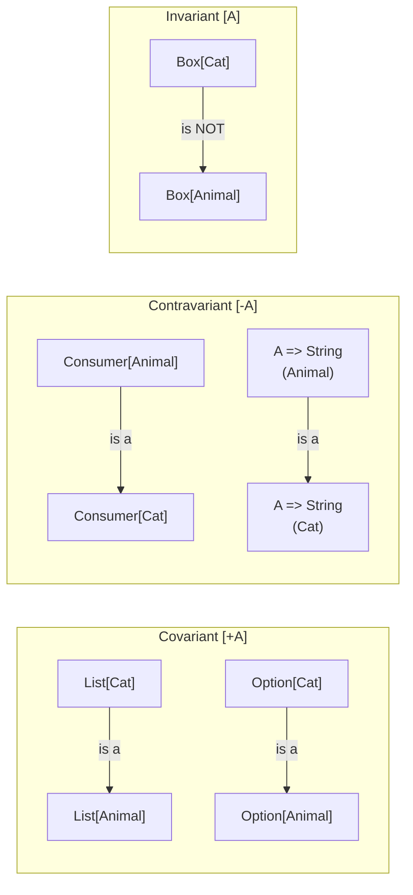

# Scala Generics and Variance

> [!abstract] TL;DR
> Scala's generic type system supports invariant `[A]`, covariant `[+A]`, and contravariant `[-A]` type parameters — making subtyping relationships explicit. Upper bounds `<:` and lower bounds `>:` constrain generics. Higher-kinded types `F[_]` allow abstraction over type constructors, enabling the typeclass pattern and effect systems like Cats/ZIO.

---

## Intuition

Java's generics are invariant by default and use wildcard hacks (`? extends T`) at use sites. Scala defines variance at the **class level** (`List[+A]`), which is checked by the compiler once. This means `List[Cat]` is automatically a `List[Animal]` wherever the covariance is safe — no wildcard needed. The compiler enforces that covariant types only appear in "output" positions and contravariant types only in "input" positions.

---

## How It Works

### Invariant Generics — Default

```scala
// Invariant: Box[Cat] is NOT a Box[Animal], even if Cat <: Animal
class Box[A](var content: A):
  def get: A = content
  def set(v: A): Unit = content = v

class Animal(val name: String)
class Cat(name: String) extends Animal(name)

val catBox: Box[Cat] = Box(Cat("Whiskers"))
// val animalBox: Box[Animal] = catBox  // COMPILE ERROR — invariant
// This is correct: if allowed, you could do animalBox.set(Dog("Rex"))
// which would corrupt catBox
```

### Covariance `[+A]` — "Producer" Types

```scala
// +A: if Cat <: Animal, then Producer[Cat] <: Producer[Animal]
// Safe when A only appears in OUTPUT positions (return types, vals)
class Producer[+A](val value: A):
  def get: A = value
  // def set(v: A): Unit = ???  // COMPILE ERROR — A in input position

// Immutable List is covariant — safe because elements never change
val cats: List[Cat] = List(Cat("Tom"), Cat("Jerry"))
val animals: List[Animal] = cats   // OK — covariant!
animals.map(_.name)                // works fine

// Option is covariant: Option[Cat] <: Option[Animal]
val optCat: Option[Cat] = Some(Cat("Felix"))
val optAnimal: Option[Animal] = optCat   // OK!
```

### Contravariance `[-A]` — "Consumer" Types

```scala
// -A: if Cat <: Animal, then Consumer[Animal] <: Consumer[Cat]
// "a function that handles any Animal can also handle a Cat"
class Consumer[-A]:
  def process(a: A): String = a.toString   // A in INPUT only

// Function1[-A, +B] — contravariant input, covariant output
val animalPrinter: Animal => String = a => s"Animal: ${a.name}"
val catPrinter: Cat => String = animalPrinter   // OK! Animal handler works for Cat
// Because if it can handle any Animal, it can definitely handle a Cat

// Ordering[-A]: if you can order Animals, you can order Cats
val animalOrdering: Ordering[Animal] = Ordering.by(_.name)
val catOrdering: Ordering[Cat] = animalOrdering   // OK — contravariant
```

### Upper and Lower Bounds

```scala
// Upper bound <: — A must be a subtype of Animal
def processAnimals[A <: Animal](items: List[A]): List[String] =
  items.map(_.name)                          // name is safe because A <: Animal

processAnimals(List(Cat("Tom")))             // OK
// processAnimals(List("not animal"))        // COMPILE ERROR

// Lower bound >: — A must be a supertype of Cat
// The classic use: covariant type in input position
class ImmutableList[+A]:
  def prepend[B >: A](elem: B): ImmutableList[B] = ???
  // B >: A ensures the result list is wide enough for both A and B

// Multiple bounds
def sorted[A <: Comparable[A] : Ordering](lst: List[A]): List[A] = lst.sorted
```

### Higher-Kinded Types — F[_]

```scala
// F[_] abstracts over a type constructor (a type that takes a type parameter)
// This enables writing code that works over List, Option, Either, IO, etc.

// Without HKT — separate overloads
def mapList[A, B](fa: List[A])(f: A => B): List[B]     = fa.map(f)
def mapOption[A, B](fa: Option[A])(f: A => B): Option[B] = fa.map(f)

// WITH HKT — one definition for all F that support mapping
trait Functor[F[_]]:
  def map[A, B](fa: F[A])(f: A => B): F[B]

given Functor[List] with
  def map[A, B](fa: List[A])(f: A => B): List[B] = fa.map(f)

given Functor[Option] with
  def map[A, B](fa: Option[A])(f: A => B): Option[B] = fa.map(f)

// Now write polymorphic code over any F with a Functor
def doubleAll[F[_]: Functor](fa: F[Int]): F[Int] =
  summon[Functor[F]].map(fa)(_ * 2)

doubleAll(List(1, 2, 3))     // List(2, 4, 6)
doubleAll(Option(5))         // Some(10)
```

### Type Lambda (Scala 3)

```scala
// Partially applied type constructors — Scala 3 type lambda syntax
// [X] =>> Either[String, X] is a type constructor that takes X

type EitherStr[X] = Either[String, X]   // type alias

// As a Functor instance for Either[String, ?]
given Functor[[X] =>> Either[String, X]] with
  def map[A, B](fa: Either[String, A])(f: A => B): Either[String, B] =
    fa.map(f)

// Using it
val result: Either[String, Int] = Right(5)
doubleAll[[X] =>> Either[String, X]](result)  // Right(10)
```

### Variance Summary



## Common Pitfalls

| # | Pitfall | Fix |
|---|---------|-----|
| 1 | Putting `+A` in input position — compile error | Change to invariant or add lower bound `B >: A` |
| 2 | HKT causes "kind mismatch" error — F given as `*` not `* -> *` | Declare `[F[_]]` not `[F]` when F needs to take a type parameter |
| 3 | Over-constraining with both upper and lower bounds — compile error if contradictory | Ensure lower bound `>: A` and upper bound `<: B` are compatible |
| 4 | Variance annotation on `var` field — always invariant | Use `val` for covariant class members; mutable state forces invariance |
| 5 | `Ordering[-A]` confusing direction — "contravariant means we need a MORE general instance" | Think of it as "if I can compare Animals, I can definitely compare Cats" |

## Review Questions

1. Why is `List[+A]` covariant safe, but `Box[+A]` with a `set` method would be unsafe?
2. Why is `Function1[-A, +B]` contravariant in `A`? Give a concrete example.
3. What problem do higher-kinded types `F[_]` solve? Why can't you use a regular `[A]` parameter instead?

---

Related: [[Scala_Typeclasses]] | [[Scala_Collections]] | [[Scala_OOP]] | [[Cats_and_ZIO_Overview]]

#Scala
