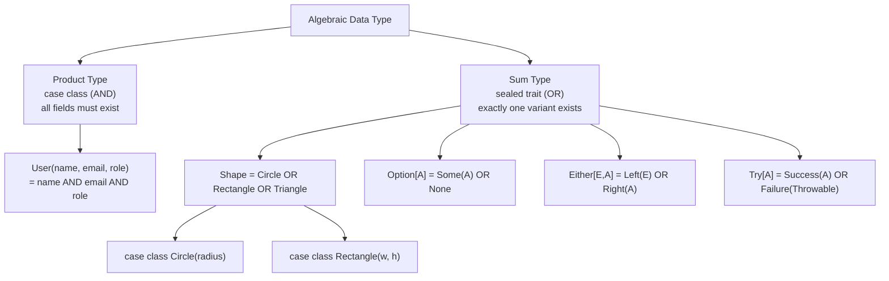

# Scala Immutability and ADTs

> [!abstract] TL;DR
> Scala's functional core is built on two ideas: prefer `val` (immutable bindings) over `var`, and model domain data as algebraic data types (ADTs). An ADT is either a **product type** (case class — AND of fields) or a **sum type** (sealed trait — OR of variants). `Option`, `Either`, and `Try` are the standard library's ADTs for absence, errors, and exceptions.

---

## Intuition

In Java you model data with mutable POJOs where any field can change at any time. In Scala FP you model data as **shapes**: a payment is either a CreditCard OR a BankTransfer (sum), and a CreditCard has a number AND an expiry (product). These shapes are sealed, exhaustively matchable, and immutable — once created, a value never changes, which makes code reasoning trivially easy.

---

## How It Works

### Immutability First

```scala
// val: the binding cannot be reassigned
val config = Map("host" -> "localhost", "port" -> "5432")
// config = Map()  // compile error: reassignment to val

// Immutable collections: operations return NEW collections
val xs   = List(1, 2, 3)
val more = xs :+ 4          // List(1,2,3,4) — xs unchanged
val prep = 0 :: xs          // List(0,1,2,3) — xs unchanged

// Persistent data structures share structure — O(1) prepend on List
// No copying needed; old version remains valid

// case class copy — non-destructive update
case class Config(host: String, port: Int, ssl: Boolean)
val prod = Config("db.prod.com", 5432, ssl = true)
val test = prod.copy(host = "localhost", ssl = false)
// prod is still valid and unchanged
```

### Product Types — case class (AND)

```scala
// A User IS (name AND email AND role)
case class User(name: String, email: String, role: Role)

// Nested product types
case class Address(street: String, city: String, zip: String)
case class Order(id: Long, user: User, items: List[Item], address: Address)

// Every combination of valid field values is a valid User/Order
// The type IS the schema — no validation framework needed for structure
```

### Sum Types — sealed trait (OR)

```scala
// A Shape IS either Circle OR Rectangle OR Triangle
sealed trait Shape
case class Circle(radius: Double)              extends Shape
case class Rectangle(w: Double, h: Double)    extends Shape
case class Triangle(base: Double, h: Double)  extends Shape

// Compute area — exhaustive match, compiler enforces completeness
def area(s: Shape): Double = s match
  case Circle(r)       => math.Pi * r * r
  case Rectangle(w, h) => w * h
  case Triangle(b, h)  => 0.5 * b * h
```

### Standard ADTs: Option, Either, Try

```scala
// ── Option[A] = Some(A) | None ──────────────────────────────────────────
// Represents optional value — replaces null

def findUser(id: Int): Option[User] = db.get(id)

val greeting: String =
  findUser(42)
    .map(u => s"Hello, ${u.name}")
    .getOrElse("Unknown user")

// ── Either[E, A] = Left(E) | Right(A) ───────────────────────────────────
// Right-biased error handling — Left is the error, Right is success

def validateAge(n: Int): Either[String, Int] =
  if n >= 0 && n <= 150 then Right(n)
  else Left(s"Invalid age: $n")

def validateEmail(s: String): Either[String, String] =
  if s.contains("@") then Right(s)
  else Left(s"Invalid email: $s")

// Chain validations with for-comprehension (short-circuits on first Left)
val result: Either[String, User] =
  for
    age   <- validateAge(25)
    email <- validateEmail("alice@example.com")
  yield User("Alice", email, Role.Viewer)

// ── Try[A] = Success(A) | Failure(Throwable) ────────────────────────────
// Wraps exception-throwing code in a pure value

import scala.util.{Try, Success, Failure}

def parseInt(s: String): Try[Int] = Try(s.toInt)

parseInt("42")   match
  case Success(n) => println(s"Parsed: $n")
  case Failure(e) => println(s"Error: ${e.getMessage}")

// Chaining Try
val result2: Try[Double] =
  for
    n <- parseInt("10")
    d <- parseInt("2")
  yield n.toDouble / d   // Success(5.0)
```

### ADT Modelling Best Practices

```scala
// Model a payment system with ADTs
sealed trait PaymentMethod
case class CreditCard(number: String, expiry: String, cvv: String) extends PaymentMethod
case class BankTransfer(iban: String, bic: String)                  extends PaymentMethod
case object Cash                                                     extends PaymentMethod

sealed trait PaymentResult
case class Approved(transactionId: String)  extends PaymentResult
case class Declined(reason: String)         extends PaymentResult
case class Pending(checkUrl: String)        extends PaymentResult

def process(method: PaymentMethod, amount: BigDecimal): PaymentResult =
  method match
    case CreditCard(num, exp, _) =>
      if amount > 10000 then Pending(s"manual-review/$num")
      else Approved(s"txn-${System.currentTimeMillis()}")
    case BankTransfer(iban, _) => Approved(s"transfer-$iban")
    case Cash                  => Approved("cash-payment")
```

### ADT Structure Diagram



## Common Pitfalls

| # | Pitfall | Fix |
|---|---------|-----|
| 1 | Using `null` when a value is absent | Always use `Option[T]` — `null` bypasses the type system |
| 2 | Using `Try` for business errors (not just exceptions) | Use `Either[DomainError, A]` for expected failures; `Try` only for exception boundaries |
| 3 | Non-sealed base traits — match won't warn about missing cases | Add `sealed` to every ADT base trait/class |
| 4 | `Either` left-biased in Scala < 2.12 — `map` maps over Left | Scala 2.12+ is right-biased; explicitly use `.right.map` in older code |
| 5 | Deep case class nesting makes `copy` chains verbose | Use Monocle `Lens` for deep immutable updates |

## Review Questions

1. What is the difference between a product type and a sum type? Give a real-world example of each.
2. When should you choose `Either` over `Try` for error handling?
3. Why are persistent immutable data structures efficient — don't they copy the whole structure on every change?

---

Related: [[Scala_OOP]] | [[Scala_Pattern_Matching]] | [[Scala_Error_Handling_FP]] | [[Scala_Collections]]

#Scala
