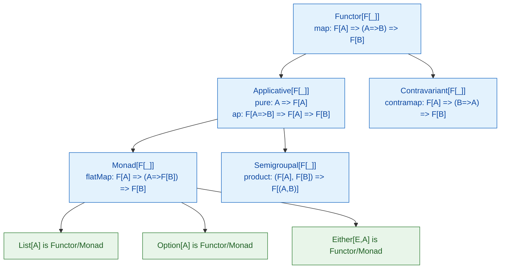

# Scala Typeclasses

> [!abstract] TL;DR
> Typeclasses are Scala's mechanism for **ad-hoc polymorphism** — adding behaviour to existing types without subclassing or modifying them. A typeclass is a trait defining an interface; `given` instances provide implementations for specific types; `using` parameters request them. Scala 3 makes this first-class with `given`/`using`. The Cats library builds an entire ecosystem (Functor, Monad, Applicative) on this pattern.

---

## Intuition

In Java, you extend behaviour by either modifying the class or creating a wrapper. In Scala's typeclass pattern you **add behaviour externally**: define a trait for the capability, provide a `given` instance for each type that should have it, and any function that requires the capability declares `using` on that trait. The compiler finds and injects the right instance automatically — zero boilerplate at call sites.

---

## How It Works

### Defining and Using a Typeclass

```scala
// Step 1: Define the typeclass — a trait with the capability
trait Show[A]:
  def show(a: A): String

// Step 2: Define given instances for specific types
given Show[Int] with
  def show(n: Int): String = s"Int($n)"

given Show[String] with
  def show(s: String): String = s""""$s""""

given Show[Boolean] with
  def show(b: Boolean): String = if b then "yes" else "no"

// Step 3: Write generic code using the typeclass
def print[A](a: A)(using s: Show[A]): Unit =
  println(s.show(a))

print(42)       // Int(42)
print("hello")  // "hello"
print(true)     // yes
```

### Context Bounds — Syntactic Sugar

```scala
// [A: Show] is shorthand for (using Show[A])
def printAll[A: Show](items: List[A]): Unit =
  items.foreach(a => println(summon[Show[A]].show(a)))
  // summon[T] retrieves the given instance for T

// Equivalent to:
def printAllVerbose[A](items: List[A])(using s: Show[A]): Unit =
  items.foreach(a => println(s.show(a)))
```

### Derived Instances — Compose Typeclasses

```scala
// Given a Show for A, automatically provide Show for List[A]
given [A: Show]: Show[List[A]] with
  def show(lst: List[A]): String =
    lst.map(summon[Show[A]].show).mkString("[", ", ", "]")

// Given Show for (A, B) when we have both
given [A: Show, B: Show]: Show[(A, B)] with
  def show(pair: (A, B)): String =
    s"(${summon[Show[A]].show(pair._1)}, ${summon[Show[B]].show(pair._2)})"

print(List(1, 2, 3))         // [Int(1), Int(2), Int(3)]
print((42, "scala"))         // (Int(42), "scala")
```

### Standard Library Typeclasses: Ordering and Numeric

```scala
// Ordering — comparison typeclass (already in stdlib)
def maximum[A: Ordering](lst: List[A]): Option[A] =
  lst.reduceOption(summon[Ordering[A]].max)

maximum(List(3, 1, 4, 1, 5))        // Some(5)
maximum(List("banana", "apple"))    // Some("banana")

// Custom Ordering instance
case class Person(name: String, age: Int)

given Ordering[Person] = Ordering.by(_.age)

val people = List(Person("Alice", 30), Person("Bob", 25), Person("Carol", 35))
people.sorted    // List(Bob 25, Alice 30, Carol 35)
people.max       // Carol 35
```

### Extension Methods — Typeclass Syntax

```scala
// Extension methods let you call typeclass ops as instance methods
extension [A: Show](a: A)
  def show: String = summon[Show[A]].show(a)
  def printMe(): Unit = println(a.show)

// Now you can write:
42.printMe()            // Int(42)
List(1,2,3).printMe()  // [Int(1), Int(2), Int(3)]
```

### Cats Typeclass Hierarchy (Overview)



### Cats Typeclass Usage

```scala
import cats.*
import cats.implicits.*

// Functor.map over any F that has a Functor instance
val doubled: Option[Int]       = Functor[Option].map(Some(5))(_ * 2)  // Some(10)
val mapped:  List[Int]         = List(1,2,3).fmap(_ + 10)             // List(11,12,13)

// Monad — flatMap + pure, works over Option/Either/List/IO
def process[F[_]: Monad](value: F[Int]): F[String] =
  value.flatMap(n => Monad[F].pure(s"result: $n"))

process(Option(42))           // Some("result: 42")
process(List(1, 2, 3))        // List("result: 1", "result: 2", "result: 3")

// Semigroup / Monoid — combine
"Hello, " |+| "World"         // "Hello, World"  (Semigroup[String])
List(1,2) |+| List(3,4)      // List(1,2,3,4)   (Semigroup[List])
Map("a" -> 1) |+| Map("b" -> 2, "a" -> 3)  // Map("a" -> 4, "b" -> 2)

// Traverse — sequence effects
List(Option(1), Option(2), Option(3)).sequence   // Some(List(1,2,3))
List(Option(1), None, Option(3)).sequence        // None
```

## Common Pitfalls

| # | Pitfall | Fix |
|---|---------|-----|
| 1 | Multiple `given` instances for the same type in scope cause ambiguity error | Use explicit imports or wrap in named given blocks |
| 2 | Importing `cats.implicits._` and also defining a local instance — conflicts | Import selectively: `cats.syntax.functor._` etc. |
| 3 | `summon[T]` throws at compile time if no `given` in scope | Ensure the `given` instance file is imported or in scope |
| 4 | Typeclass derivation for complex types is manual without Magnolia/Shapeless | Use `cats-core`'s `derives` mechanism or `magnolia` for auto-derivation |
| 5 | `given` across package boundaries requires explicit imports | Put `given` instances in companion objects for auto-import |

## Review Questions

1. What are the three components of the typeclass pattern in Scala 3?
2. How does a context bound `[A: Show]` desugar?
3. What is the difference between `Functor`, `Applicative`, and `Monad`? When does the distinction matter?

---

Related: [[Scala_Generics_and_Variance]] | [[Scala_Functions]] | [[Cats_and_ZIO_Overview]] | [[Scala_Error_Handling_FP]]

#Scala
