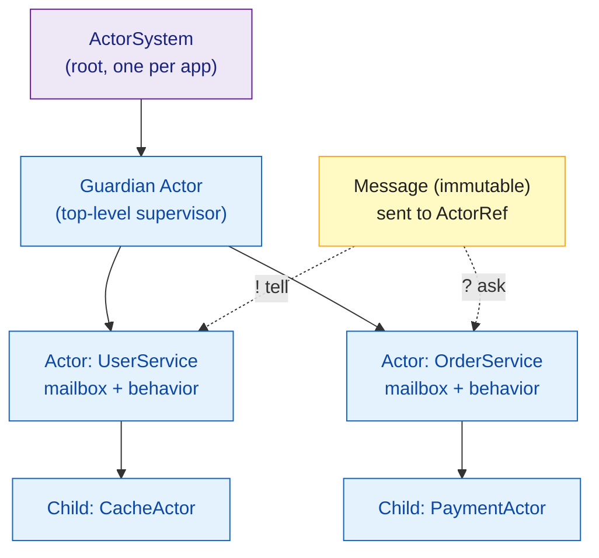

# Akka Actors Intro

> [!abstract] TL;DR
> Akka implements the **actor model** for JVM — isolated units of state that communicate only via immutable messages, never sharing memory. Each actor has a mailbox, a supervisor, and a behaviour. Akka Typed (since Akka 2.6) adds compile-time message type safety. Actors are the foundation of Akka HTTP, Akka Streams, Akka Cluster, and Apache Pekko (the community fork).

---

## Intuition

Think of actors like **workers in a company**: each has a specific job, an inbox, and never touches anyone else's desk. You pass work via messages; if a worker crashes, their manager (supervisor) decides whether to restart them, stop them, or escalate. No locks, no shared mutable state — concurrency bugs become structurally impossible.

---

## How It Works

### Actor Model Core Concepts



### Akka Typed — Type-Safe Actors

```scala
import akka.actor.typed.*
import akka.actor.typed.scaladsl.*

// Step 1: Define the message protocol
sealed trait CounterMessage
case class Increment(amount: Int)            extends CounterMessage
case class GetValue(replyTo: ActorRef[Int])  extends CounterMessage
case object Reset                            extends CounterMessage

// Step 2: Define behavior (immutable function from message to next behavior)
object Counter:
  def apply(initial: Int = 0): Behavior[CounterMessage] =
    behavior(initial)

  private def behavior(count: Int): Behavior[CounterMessage] =
    Behaviors.receiveMessage:
      case Increment(n)     => behavior(count + n)    // return new behavior with updated state
      case GetValue(replyTo) =>
        replyTo ! count                                 // send reply
        Behaviors.same                                  // same behavior
      case Reset             => behavior(0)

// Step 3: Create the ActorSystem
@main def run(): Unit =
  val system: ActorSystem[CounterMessage] = ActorSystem(Counter(), "counter-system")

  system ! Increment(5)
  system ! Increment(3)

  // Ask pattern — request/response with Future
  import akka.actor.typed.scaladsl.AskPattern.*
  import scala.concurrent.duration.*
  given timeout: Timeout = Timeout(3.seconds)
  given scheduler: Scheduler = system.scheduler

  val valueFuture = system.ask(GetValue.apply)
  // valueFuture: Future[Int] — will be 8
```

### Stateful Actor with Context

```scala
object ChatRoom:
  sealed trait Command
  case class Join(name: String, replyTo: ActorRef[String]) extends Command
  case class Post(msg: String)                              extends Command
  case object Leave                                         extends Command

  def apply(): Behavior[Command] = empty

  private def empty: Behavior[Command] =
    Behaviors.receive: (ctx, msg) =>
      msg match
        case Join(name, replyTo) =>
          ctx.log.info(s"$name joined")
          active(List((name, replyTo)))
        case _ => Behaviors.same

  private def active(members: List[(String, ActorRef[String])]): Behavior[Command] =
    Behaviors.receive: (ctx, msg) =>
      msg match
        case Join(name, replyTo) =>
          active((name, replyTo) :: members)
        case Post(text) =>
          members.foreach((_, ref) => ref ! text)
          Behaviors.same
        case Leave =>
          if members.isEmpty then empty else active(members.tail)
```

### Supervision — Fault Tolerance

```scala
// Supervision: what to do when a child actor throws
val supervised: Behavior[Command] =
  Behaviors.supervise(MyActor())
    .onFailure[RuntimeException](SupervisorStrategy.restart)

// Strategy options:
// .restart       — restart actor from initial behavior (state lost)
// .resume        — continue with current state (skip the failed message)
// .stop          — stop actor permanently
// .restart.withLimit(3, 10.seconds) — restart max 3 times in 10 seconds

// OneForOne vs AllForOne (classic Akka)
// OneForOne: only the failing child is restarted (default)
// AllForOne: all children restart when any one fails
```

### Ask Pattern — Request/Response

```scala
import akka.actor.typed.scaladsl.AskPattern.*
import scala.concurrent.duration.*
import scala.concurrent.Future

given timeout: Timeout  = Timeout(5.seconds)
given system:  ActorSystem[?] = ???

// ask sends a message and returns a Future of the response
val result: Future[Int] =
  counterRef.ask(replyTo => GetValue(replyTo))

// In for-comprehension
for
  count <- counterRef.ask(GetValue.apply)
  _      = println(s"Current count: $count")
yield ()
```

### Actor vs Future vs IO — Decision Guide

| Concern | Future | Actor | Cats Effect IO |
|---|---|---|---|
| Simple async | Best | Overkill | Good |
| Stateful component | Hard | Best | Good with Ref |
| Distributed system | No | Best (Cluster) | No |
| Message ordering | None | Mailbox guarantee | N/A |
| Fault tolerance | recover | Supervision tree | retry |
| Type safety | Yes | Akka Typed | Yes |

## Common Pitfalls

| # | Pitfall | Fix |
|---|---------|-----|
| 1 | Closing over mutable state in actor `receive` — not thread safe | Keep all state as parameters to `behavior(state)` function |
| 2 | Sending mutable objects as messages — defeats actor isolation | Always send immutable `case class` messages (no `var` fields) |
| 3 | Using `Await.result` in actor `receive` — blocks actor thread | Use `context.pipeToSelf` to convert Future result to a message |
| 4 | Creating too many top-level actors — bypasses supervision hierarchy | Create actors as children; use `context.spawn` inside existing actors |
| 5 | Classic Akka untyped messages — lose type safety | Use Akka Typed; protocol defined as `sealed trait` |

## Review Questions

1. Why can the actor model eliminate data race conditions structurally?
2. What is the difference between `tell (!)` and `ask (?)`? When should you use each?
3. What does `Behaviors.same` return in Akka Typed, and why is it more efficient than returning the current behavior?

---

Related: [[Scala_Futures_and_Promises]] | [[Scala_Build_Tools]] | [[Play_Framework]] | [[Cats_and_ZIO_Overview]]

#Scala
