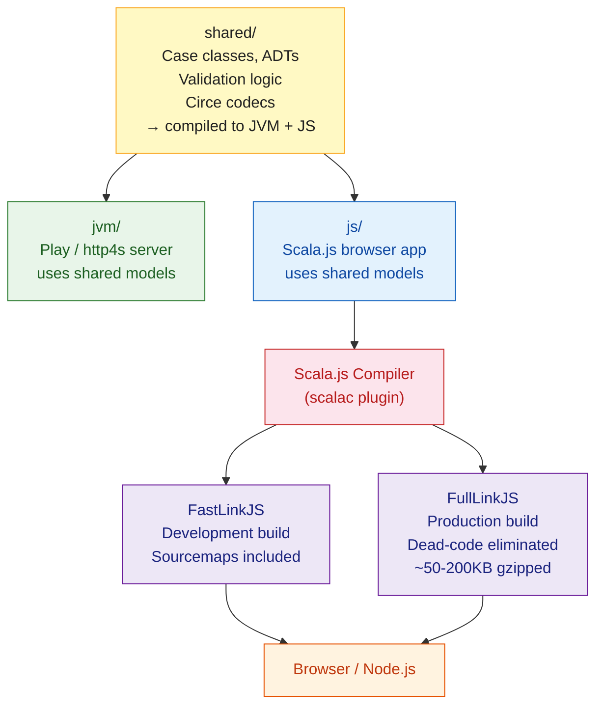

# Scala.js

> [!abstract] TL;DR
> Scala.js compiles Scala code to JavaScript, enabling type-safe frontend development in the same language as the backend. The Scala.js compiler (a scalac plugin) emits optimized JS — whole-program dead-code elimination makes production bundles comparable to hand-written JS. JS interop is via typed **Facades** (`.d.ts`-like type definitions). UI frameworks include **Laminar** (reactive FRP), **scalajs-react** (React bindings), and **Tyrian** (Elm-architecture). Sharing domain model and validation logic between server and browser is a primary use case.

---

## Intuition

**Think of Scala.js as TypeScript but with Scala's type system.** TypeScript adds types to JavaScript; Scala.js replaces JavaScript with Scala entirely, then compiles to JS. You get sealed traits, pattern matching, case classes, and the full Cats ecosystem — all running in the browser. The payoff: the same `User` case class, the same `validateEmail` function, and the same `CirceCodec` can live in a `shared` module compiled to both JVM and JS.

---

## How It Works



---

## Build Setup

Scala.js projects use sbt with the `sbt-scalajs` plugin and often a cross-build structure:

```scala
// project/plugins.sbt
addSbtPlugin("org.scala-js"  % "sbt-scalajs"         % "1.16.0")
addSbtPlugin("org.portable-scala" % "sbt-scalajs-crossproject" % "1.3.2")

// build.sbt — cross-project: shared + jvm + js
import org.scalajs.linker.interface.ModuleSplitStyle

lazy val shared = crossProject(JSPlatform, JVMPlatform)
  .crossType(CrossType.Pure)
  .in(file("shared"))
  .settings(
    scalaVersion := "3.4.2",
    libraryDependencies ++= Seq(
      "io.circe" %%% "circe-core"    % "0.14.9",
      "io.circe" %%% "circe-generic" % "0.14.9"
    )
  )

lazy val sharedJVM = shared.jvm
lazy val sharedJS  = shared.js

lazy val frontend = project.in(file("frontend"))
  .enablePlugins(ScalaJSPlugin)
  .dependsOn(sharedJS)
  .settings(
    scalaVersion    := "3.4.2",
    scalaJSUseMainModuleInitializer := true,
    libraryDependencies ++= Seq(
      "com.raquo"   %%% "laminar"   % "17.0.0",
      "org.scala-js" %%% "scalajs-dom" % "2.8.0"
    ),
    // ESModule output for bundler (Vite/webpack)
    scalaJSLinkerConfig ~= { _.withModuleKind(ModuleKind.ESModule) }
  )
```

```bash
# Development build (fast, with sourcemaps)
sbt frontend/fastLinkJS

# Production build (optimized, dead-code eliminated)
sbt frontend/fullLinkJS
```

---

## JavaScript Interop — Facades

Facades are Scala type definitions for JavaScript APIs, analogous to TypeScript `.d.ts` files:

```scala
import scala.scalajs.js
import scala.scalajs.js.annotation.*

// Facade for a JS library object
@js.native
@JSGlobal("moment")
object Moment extends js.Object:
  def apply(date: String): MomentInstance = js.native

@js.native
trait MomentInstance extends js.Object:
  def format(pattern: String): String = js.native
  def add(amount: Int, unit: String): MomentInstance = js.native

// Usage — type-safe access to JS library
val formatted = Moment("2026-07-30").format("MMMM Do YYYY")

// Interop with JS objects
val config: js.Dynamic = js.Dynamic.literal(
  host = "localhost",
  port = 3000
)

// Convert between Scala and JS collections
import scala.scalajs.js.JSConverters.*
val scalaList = List(1, 2, 3)
val jsArray   = scalaList.toJSArray          // js.Array[Int]
val backToScala = jsArray.toList             // List[Int]
```

---

## scalajs-react — React Bindings

```scala
// build.sbt — add scalajs-react
libraryDependencies += "com.github.japgolly.scalajs-react" %%% "core" % "2.1.1"

// A React component in Scala
import japgolly.scalajs.react.*
import japgolly.scalajs.react.vdom.html_<^.*

object CounterComponent:
  case class State(count: Int)

  val component = ScalaComponent.builder[Unit]("Counter")
    .initialState(State(0))
    .renderS { ($, state) =>
      <.div(
        <.h2(s"Count: ${state.count}"),
        <.button(
          ^.onClick --> $.modState(s => s.copy(count = s.count + 1)),
          "Increment"
        ),
        <.button(
          ^.onClick --> $.modState(s => s.copy(count = s.count - 1)),
          "Decrement"
        )
      )
    }
    .build

  // Mount to DOM
  def main(args: Array[String]): Unit =
    component().renderIntoDOM(
      org.scalajs.dom.document.getElementById("app")
    )
```

---

## Laminar — Reactive UI (FRP)

Laminar uses functional reactive programming (FRP) — no virtual DOM, no diffing:

```scala
import com.raquo.laminar.api.L.*
import org.scalajs.dom

object App:
  // EventBus and Signal replace setState
  val countVar: Var[Int] = Var(0)

  val counterApp: Element =
    div(
      h2(
        "Count: ",
        child.text <-- countVar.signal.map(_.toString)
      ),
      button(
        "Increment",
        onClick --> { _ => countVar.update(_ + 1) }
      ),
      button(
        "Decrement",
        onClick --> { _ => countVar.update(_ - 1) }
      ),
      // Derived signal — recomputes when countVar changes
      p(
        child.text <-- countVar.signal.map(n =>
          if n > 5 then "High!" else "Low."
        )
      )
    )

  def main(args: Array[String]): Unit =
    val appContainer = dom.document.getElementById("app")
    render(appContainer, counterApp)
```

---

## Shared Logic — the Main Use Case

```scala
// shared/src/main/scala/myapp/model/User.scala
// Compiles to both JVM (Play backend) and JS (Laminar frontend)
package myapp.model

import io.circe.*
import io.circe.generic.semiauto.*

case class User(id: Long, name: String, email: String)

object User:
  given Encoder[User] = deriveEncoder
  given Decoder[User] = deriveDecoder

  // Validation runs on both client AND server — no duplication
  def validate(name: String, email: String): Either[String, Unit] =
    if name.trim.isEmpty then Left("Name is required")
    else if !email.contains("@") then Left("Invalid email")
    else Right(())
```

---

## Scala.js vs Alternatives

| Approach | Type Safety | Code Sharing | Ecosystem | Bundle Size | Learning Curve |
|---|---|---|---|---|---|
| **Scala.js** | Full Scala types | Yes (crossproject) | Growing | 50-300KB | High |
| **TypeScript** | Structural types | Via npm packages | Massive | Depends | Medium |
| **Elm** | Total (no runtime errors) | No (separate lang) | Small | Very small | Medium |
| **ClojureScript** | Dynamic (+ Spec) | With Clojure backend | Moderate | Medium | High |
| **Kotlin/JS** | Full Kotlin types | Yes (MPP) | Growing | Medium | Medium |

---

## Common Pitfalls

- **`%%%` vs `%%`** — use `%%%` for cross-compiled Scala.js libraries (e.g., Circe, Laminar). Using `%%` adds the JVM artifact to the JS classpath, causing link errors.
- **Global JS state in facades** — `@JSGlobal` facades assume the JS global exists at runtime. If the script isn't loaded, you get a JS `ReferenceError`. Use `@JSGlobalScope` for safety checks.
- **`js.Dynamic` evades the type system** — `js.Dynamic` is an escape hatch that disables type checking. Minimize its use; write proper facades instead.
- **FastLinkJS vs FullLinkJS in production** — forgetting to switch to `fullLinkJS` ships enormous, unoptimized JS to production (10x larger). Always configure CI to use `fullLinkJS`.
- **Blocking the event loop** — Scala.js runs in a single-threaded JS environment. `Thread.sleep` and blocking I/O do not exist. Use `Future`, `js.Promise`, or Cats Effect's `IO` (via cats-effect for JS).

---

## Review Questions

1. What does `%%%` mean in an sbt dependency declaration, and when should you use it instead of `%%`?
2. Explain the purpose of a Facade in Scala.js. What JavaScript concept is it equivalent to?
3. What is the primary reason teams use a cross-project structure (`CrossType.Pure`) with Scala.js?
4. How does Laminar's approach to UI updates differ from React's virtual DOM diffing?

---

Related: [[Scala_Overview]] | [[Scala_Build_Tools]] | [[Play_Framework]] | [[Scala_JSON]]

#Scala #ScalaJS #JavaScript #Frontend #Laminar
