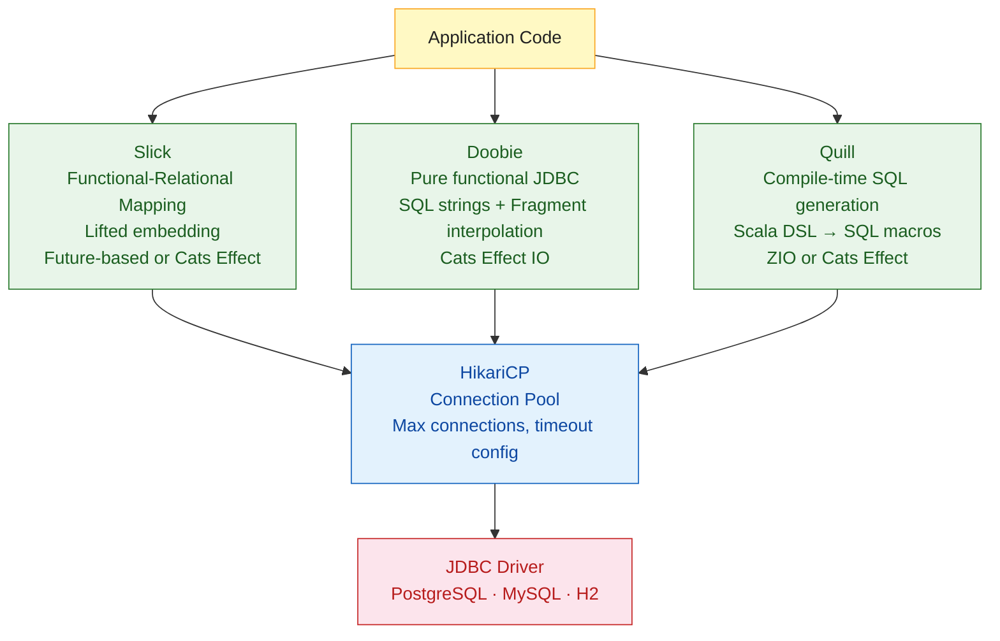

# Scala Database Access

> [!abstract] TL;DR
> Scala has three main database access libraries: **Slick** (functional-relational mapping — lifted embedding with type-safe queries that look like Scala collections); **Doobie** (pure functional JDBC — SQL strings with compile-time type checking, built on Cats Effect); **Quill** (macro-based compile-time query generation — write Scala, get SQL at compile time). All three use **HikariCP** for connection pooling. Doobie is the idiomatic choice in Cats Effect / ZIO codebases; Slick fits Play Framework; Quill favors teams that want to minimize raw SQL.

---

## Intuition

**Analogy:** Think of these three libraries as different takes on the same kitchen. Slick is a smart ordering system — you write what you want in Scala and it figures out the SQL. Doobie is a transparent kitchen — you write your SQL exactly, but it wraps every dish in a type-safe container that guarantees correct cleanup and no resource leaks. Quill is a prep-cook who translates your Scala recipe to SQL at cooking-prep time (compile time) — if the recipe is wrong, you find out before service, not during.

---

## How It Works



---

## Slick — Functional-Relational Mapping

Slick lets you query a database using Scala collection-like operations. Queries are values that can be composed.

```scala
// build.sbt
libraryDependencies ++= Seq(
  "com.typesafe.slick" %% "slick"                % "3.5.1",
  "com.typesafe.slick" %% "slick-hikaricp"        % "3.5.1",
  "org.postgresql"      %  "postgresql"            % "42.7.3"
)
```

```scala
import slick.jdbc.PostgresProfile.api.*
import scala.concurrent.{Future, ExecutionContext}

// Table definition — mirrors database schema
class UsersTable(tag: Tag) extends Table[User](tag, "users"):
  def id    = column[Long]("id", O.PrimaryKey, O.AutoInc)
  def name  = column[String]("name")
  def email = column[String]("email", O.Unique)
  def *     = (id, name, email).mapTo[User]

case class User(id: Long, name: String, email: String)

object UserRepository:
  val users = TableQuery[UsersTable]

  // DB connection with HikariCP
  val db = Database.forConfig("myapp.db")  // reads application.conf

  def findAll()(using ec: ExecutionContext): Future[Seq[User]] =
    db.run(users.result)

  def findByEmail(email: String)(using ec: ExecutionContext): Future[Option[User]] =
    db.run(users.filter(_.email === email).result.headOption)

  def insert(user: User)(using ec: ExecutionContext): Future[Long] =
    db.run((users returning users.map(_.id)) += user)

  // Composable queries
  def activeAdmins()(using ec: ExecutionContext): Future[Seq[User]] =
    val query = users
      .join(rolesTable).on(_.id === _.userId)
      .filter { case (u, r) => r.name === "admin" }
      .map    { case (u, _) => u }
    db.run(query.result)

  // Transactions
  def transferPoints(fromId: Long, toId: Long, amount: Int)
                    (using ec: ExecutionContext): Future[Unit] =
    val action = for
      _ <- users.filter(_.id === fromId)
                .map(_.points).update(...)   // illustrative
      _ <- users.filter(_.id === toId)
                .map(_.points).update(...)
    yield ()
    db.run(action.transactionally)
```

```hocon
# application.conf — HikariCP config for Slick
myapp.db = {
  dataSourceClass = "org.postgresql.ds.PGSimpleDataSource"
  properties.databaseName = "myapp"
  properties.user         = "postgres"
  properties.password     = ${?DB_PASSWORD}
  numThreads   = 10    # HikariCP pool size
  maxConnections = 10
}
```

---

## Doobie — Pure Functional JDBC

Doobie wraps JDBC in Cats Effect `IO` — every query is an effect that can be composed, tested, and cancelled:

```scala
// build.sbt
libraryDependencies ++= Seq(
  "org.tpolecat" %% "doobie-core"      % "1.0.0-RC4",
  "org.tpolecat" %% "doobie-hikari"    % "1.0.0-RC4",
  "org.tpolecat" %% "doobie-postgres"  % "1.0.0-RC4"
)
```

```scala
import cats.effect.*
import doobie.*
import doobie.implicits.*
import doobie.hikari.HikariTransactor

case class User(id: Long, name: String, email: String)

// Transactor — manages connection lifecycle
object Database:
  def transactor[F[_]: Async]: Resource[F, HikariTransactor[F]] =
    for
      ce <- ExecutionContexts.fixedThreadPool[F](8)
      xa <- HikariTransactor.newHikariTransactor[F](
              "org.postgresql.Driver",
              "jdbc:postgresql://localhost/myapp",
              "postgres",
              sys.env.getOrElse("DB_PASSWORD", ""),
              ce
            )
    yield xa

// Queries are ConnectionIO values — pure descriptions of work
object UserQueries:
  // sql interpolator generates Fragment; .query[T] adds decoder
  def findAll: Query0[User] =
    sql"SELECT id, name, email FROM users".query[User]

  def findById(id: Long): Query0[User] =
    sql"SELECT id, name, email FROM users WHERE id = $id".query[User]

  def findByEmail(email: String): Query0[User] =
    sql"SELECT id, name, email FROM users WHERE email = $email".query[User]

  def insert(name: String, email: String): Update0 =
    sql"INSERT INTO users (name, email) VALUES ($name, $email)".update

  // Fragment composition for dynamic queries
  def search(nameOpt: Option[String], emailOpt: Option[String]): Query0[User] =
    val base = fr"SELECT id, name, email FROM users WHERE TRUE"
    val nameFilter  = nameOpt.map(n => fr"AND name ILIKE ${"%" + n + "%"}").getOrElse(fr"")
    val emailFilter = emailOpt.map(e => fr"AND email = $e").getOrElse(fr"")
    (base ++ nameFilter ++ emailFilter).query[User]

// Usage inside an IO context
object UserService:
  def getAllUsers(xa: HikariTransactor[IO]): IO[List[User]] =
    UserQueries.findAll
      .to[List]
      .transact(xa)

  def createUser(name: String, email: String, xa: HikariTransactor[IO]): IO[Int] =
    UserQueries.insert(name, email)
      .run
      .transact(xa)

  // Transaction — both ops or neither
  def transfer(xa: HikariTransactor[IO]): IO[Unit] =
    val program: ConnectionIO[Unit] = for
      _ <- sql"UPDATE accounts SET balance = balance - 100 WHERE id = 1".update.run
      _ <- sql"UPDATE accounts SET balance = balance + 100 WHERE id = 2".update.run
    yield ()
    program.transact(xa)
```

---

## Quill — Compile-Time Query Generation

Quill generates SQL at compile time from Scala DSL — type mismatches become compilation errors:

```scala
// build.sbt
libraryDependencies ++= Seq(
  "io.getquill" %% "quill-jdbc-zio" % "4.8.1",
  "org.postgresql" % "postgresql"   % "42.7.3"
)
```

```scala
import io.getquill.*
import io.getquill.jdbczio.Quill
import zio.*

case class User(id: Long, name: String, email: String)
case class Post(id: Long, userId: Long, title: String)

object UserRepo:
  val layer: ZLayer[Quill.Postgres[SnakeCase], Nothing, UserRepo] =
    ZLayer.fromFunction(new UserRepo(_))

class UserRepo(quill: Quill.Postgres[SnakeCase]):
  import quill.*

  // Macro expands to: SELECT id, name, email FROM "user" at compile time
  def findAll: ZIO[Any, SQLException, List[User]] =
    run(query[User])

  // Compile-time error if column doesn't exist on User
  def findByName(n: String): ZIO[Any, SQLException, List[User]] =
    run(query[User].filter(_.name == lift(n)))

  // Join — generates LEFT JOIN SQL
  def usersWithPosts: ZIO[Any, SQLException, List[(User, Option[Post])]] =
    run {
      for
        u <- query[User]
        p <- query[Post].leftJoin(_.userId == u.id)
      yield (u, p)
    }

  def insert(user: User): ZIO[Any, SQLException, Long] =
    run(query[User].insertValue(lift(user)).returningGenerated(_.id))
```

---

## HikariCP Connection Pool

HikariCP is the fastest JDBC connection pool — all three libraries default to it:

```hocon
# application.conf (Doobie / Slick)
hikari {
  jdbcUrl          = "jdbc:postgresql://localhost/myapp"
  username         = "postgres"
  password         = ${?DB_PASSWORD}
  maximumPoolSize  = 10       # total connections in pool
  minimumIdle      = 2        # connections kept open when idle
  connectionTimeout = 30000   # ms to wait for connection
  idleTimeout      = 600000   # ms before idle connection removed
  maxLifetime      = 1800000  # ms max connection age (30 min)
}
```

**Pool sizing rule:** `max_pool_size = (core_count * 2) + effective_spindle_count`. For web apps with I/O-bound queries, a pool of 10–20 is typical.

---

## Comparison

| Aspect | Slick | Doobie | Quill |
|---|---|---|---|
| Query style | Lifted Scala DSL | Raw SQL with interpolation | Scala DSL (macro-expanded) |
| SQL visibility | Hidden (generated) | Explicit SQL | Generated at compile time |
| Effect system | Future / cats-effect | Cats Effect `IO` | ZIO or Cats Effect |
| Type safety | Compile-time | Compile-time | Compile-time |
| Dynamic queries | Moderate | Easy (Fragment) | Moderate (quote composition) |
| Learning curve | Steep | Moderate | Moderate |
| Best with | Play Framework | http4s / Cats Effect stack | ZIO applications |

---

## Common Pitfalls

- **Slick N+1** — `flatMap` on Slick queries inside a `for` comprehension may issue a query per row instead of a JOIN. Use `join` operations and inspect generated SQL with `query.statements`.
- **Doobie connection leaks** — not calling `.transact(xa)` leaves connections open indefinitely. Always transact; never hold a raw `ConnectionIO` across request boundaries.
- **Quill macro expansion failures** — Quill macros fail with cryptic errors if entity names don't match schema (it uses snake_case by default). Use `NamingStrategy` or explicit `querySchema` overrides.
- **Pool exhaustion** — setting `maximumPoolSize` too low causes requests to queue or timeout under load. Monitor `hikaricp.pending` metric in production.
- **Wrong effect type** — mixing `Future`-based Slick with a Cats Effect codebase requires `IO.fromFuture`. Commit to one effect system per project.

---

## Review Questions

1. What is the "lifted embedding" in Slick, and why does it require a special DSL instead of plain Scala?
2. What does `transact(xa)` do in Doobie, and what resource does the `HikariTransactor` manage?
3. When would you choose Doobie over Slick for a new Cats Effect project?
4. What is the HikariCP pool sizing recommendation for a CPU-bound vs I/O-bound workload?

---

Related: [[Scala_Overview]] | [[Cats_and_ZIO_Overview]] | [[Scala_Futures_and_Promises]] | [[Play_Framework]]

#Scala #Database #Slick #Doobie #Quill #HikariCP #SQL
