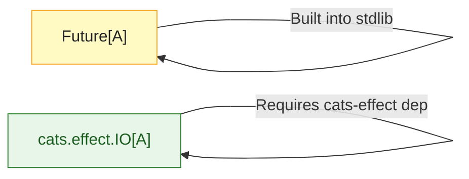

# Scala Futures and Promises

> [!abstract] TL;DR
> `Future[T]` is Scala's standard library construct for asynchronous computation — it wraps a value that will be available eventually. Futures are eagerly evaluated, require an implicit `ExecutionContext`, and compose with `map`/`flatMap`/for-comprehensions. `Promise[T]` is the write-side of a `Future` for bridging callback-based APIs. For production FP use Cats Effect `IO` or ZIO instead.

---

## Intuition

A `Future` is like a receipt for a computation happening on another thread. You hand off work to a thread pool and get back a `Future` immediately. You then describe what to do with the result using `map`/`flatMap` — building a pipeline of transformations. The callbacks run when the value becomes available, without blocking. The key limitation: Futures are eager (start immediately) and not referentially transparent, which is why FP purists prefer `IO`.

---

## How It Works

### Basic Future Creation

```scala
import scala.concurrent.{Future, ExecutionContext}
import scala.concurrent.ExecutionContext.Implicits.global  // thread pool

// Future starts immediately on the thread pool
val f1: Future[Int] = Future {
  Thread.sleep(100)   // simulate async work
  42
}

// Pre-completed futures
val success: Future[Int]    = Future.successful(100)
val failure: Future[Nothing] = Future.failed(RuntimeException("oops"))

// Check status (non-blocking)
println(f1.isCompleted)   // may be false
```

### Composing Futures

```scala
// map: transform the result (non-blocking, callback)
val doubled: Future[Int] = f1.map(_ * 2)

// flatMap: chain async operations
def fetchUser(id: Int): Future[User]          = Future(db.getUser(id))
def fetchOrders(user: User): Future[List[Order]] = Future(db.getOrders(user.id))

val userOrders: Future[List[Order]] =
  fetchUser(1).flatMap(fetchOrders)

// for-comprehension — sequential async pipeline
val summary: Future[String] =
  for
    user   <- fetchUser(1)
    orders <- fetchOrders(user)
    total   = orders.map(_.amount).sum
  yield s"${user.name}: ${orders.length} orders, total $$$total"
```

### Running Futures in Parallel

```scala
// Start both futures BEFORE for-comprehension (parallel execution)
val f1 = fetchUser(1)         // starts now
val f2 = fetchUser(2)         // starts now, in parallel

val combined: Future[(User, User)] =
  for
    u1 <- f1
    u2 <- f2
  yield (u1, u2)

// zip — explicit parallel combination
val zipped: Future[(User, List[Order])] =
  fetchUser(1).zip(fetchOrders(User(1, "Alice")))

// Future.sequence — run a list of futures, collect results
val ids = List(1, 2, 3, 4, 5)
val allUsers: Future[List[User]] =
  Future.sequence(ids.map(fetchUser))   // fires all in parallel

// Future.traverse — map + sequence in one step
val allUsers2: Future[List[User]] =
  Future.traverse(ids)(fetchUser)
```

### Error Handling in Futures

```scala
// recover: handle specific failures with a fallback value
val safe: Future[User] =
  fetchUser(-1).recover:
    case _: UserNotFoundException => User(-1, "Guest")

// recoverWith: handle failure with another Future
val withFallback: Future[User] =
  fetchUser(-1).recoverWith:
    case _: UserNotFoundException => fetchUser(0)   // retry with default

// transform: handle both success and failure
val result: Future[String] = fetchUser(1).transform(
  success = user => s"Found: ${user.name}",
  failure = err  => s"Error: ${err.getMessage}"
)

// fallbackTo: try second future if first fails
val primary: Future[Data]  = fetchFromPrimary()
val fallback: Future[Data] = fetchFromReplica()
val data: Future[Data] = primary.fallbackTo(fallback)
```

### Promise — Write-Side of a Future

```scala
import scala.concurrent.Promise

// Promise is the "box" you fill; future is the "read window"
val promise: Promise[Int] = Promise[Int]()
val future:  Future[Int]  = promise.future

// Complete from another thread / callback
Future {
  Thread.sleep(200)
  promise.success(42)           // completes the future
  // promise.failure(ex)        // fail the future
}

// Bridging a callback-based Java API
def wrapCallback(javaApi: JavaAsync): Future[String] =
  val p = Promise[String]()
  javaApi.doWork(new Callback:
    def onSuccess(result: String): Unit = p.success(result)
    def onFailure(ex: Exception): Unit  = p.failure(ex)
  )
  p.future
```

### Await — For Testing Only

```scala
import scala.concurrent.Await
import scala.concurrent.duration.*

// BLOCKING — never use in production async code
val result: String = Await.result(summary, 10.seconds)
println(result)

// Await.ready — block without extracting value (check isCompleted)
Await.ready(future, 5.seconds)
```

### Future vs Cats Effect IO



## Common Pitfalls

| # | Pitfall | Fix |
|---|---------|-----|
| 1 | Starting futures inside for-comprehension — sequential, not parallel | Start all futures BEFORE the for-comprehension |
| 2 | Using `Await.result` in production — blocks thread pool threads | Use callbacks (`onComplete`), or switch to `IO`/`ZIO` |
| 3 | Forgetting `ExecutionContext` — compilation error or wrong thread pool | Always import `ExecutionContext.Implicits.global` or inject your own EC |
| 4 | Unhandled future failures — silently swallowed | Add `.recover` or use `.onComplete` with `Failure` case |
| 5 | `Future.sequence` on large lists creates pressure on the thread pool | Use `Future.traverse` with a semaphore or switch to `IO.parTraverseN(n)` |

## Review Questions

1. Why does starting futures inside a for-comprehension cause them to run sequentially instead of in parallel?
2. What is a `Promise`, and when would you use it instead of `Future { ... }`?
3. What are the two main drawbacks of `Future` compared to `cats.effect.IO`?

---

Related: [[Akka_Actors_Intro]] | [[Cats_and_ZIO_Overview]] | [[Scala_Build_Tools]] | [[Scala_Error_Handling_FP]]

#Scala
