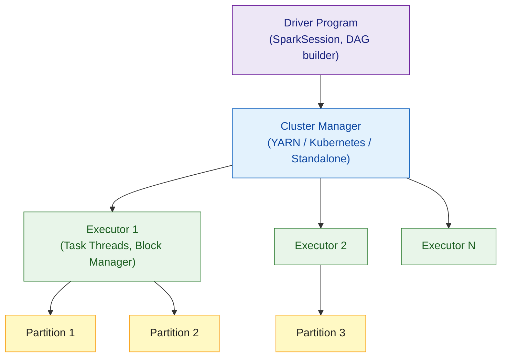

# Scala Spark Basics

> [!abstract] TL;DR
> Apache Spark is the dominant distributed data processing framework, written in Scala. The Scala API is the most expressive: `SparkSession` as the entry point, `DataFrame` for schema-aware distributed tables, `Dataset[T]` for type-safe operations, lazy transformations (nothing runs until an action is called), and Spark SQL for mixed query/code workflows. Spark powers most large-scale data engineering pipelines.

---

## Intuition

Think of a Spark `DataFrame` as a distributed `List[Row]` spread across hundreds of machines — but you write code that looks like working on a single machine. Spark figures out the execution plan, optimises it (Catalyst), and distributes it (Tungsten). The key insight: **transformations are lazy** — only when you call an action (`show`, `count`, `write`) does Spark compile your entire chain into an optimised execution graph and run it.

---

## How It Works

### Spark Architecture



### SparkSession — Entry Point

```scala
import org.apache.spark.sql.{SparkSession, DataFrame, Dataset}
import org.apache.spark.sql.functions.*

val spark: SparkSession = SparkSession.builder()
  .appName("MyApp")
  .master("local[*]")         // local for dev; "yarn" in production
  .config("spark.sql.shuffle.partitions", "8")
  .getOrCreate()

import spark.implicits.*       // enables .toDF(), encoders, $"col" syntax
```

### Reading Data Sources

```scala
// CSV
val salesDF: DataFrame = spark.read
  .option("header", "true")
  .option("inferSchema", "true")
  .csv("data/sales.csv")

// Parquet (columnar format — preferred for analytics)
val eventsDF = spark.read.parquet("s3a://bucket/events/date=2026-07-*/")

// JSON
val logsDF = spark.read.json("data/logs/*.json")

// JDBC
val ordersDF = spark.read
  .format("jdbc")
  .option("url", "jdbc:postgresql://host/db")
  .option("dbtable", "orders")
  .option("user", "admin")
  .load()
```

### DataFrame Transformations (Lazy)

```scala
// select — project columns
val slim = salesDF.select("customer_id", "product", "amount", "date")

// filter / where — row predicate
val recent = salesDF.filter(col("date") >= "2026-01-01")
val highVal = salesDF.where($"amount" > 1000)  // $"col" syntax

// withColumn — add/replace column
val withTax = salesDF.withColumn("amount_with_tax", $"amount" * 1.2)

// groupBy + agg — aggregations
val summary: DataFrame = salesDF
  .groupBy("customer_id", "product")
  .agg(
    sum("amount").alias("total"),
    count("*").alias("num_orders"),
    avg("amount").alias("avg_order")
  )

// join
val customersDF = spark.read.parquet("data/customers/")
val enriched = salesDF.join(customersDF, "customer_id", "left")

// orderBy
val ranked = summary.orderBy(col("total").desc)
```

### Actions — Trigger Execution

```scala
// Actions materialise the lazy DAG

salesDF.show(20)               // print first 20 rows
salesDF.count()                // number of rows (triggers full scan)
salesDF.printSchema()          // print column names and types (free — no scan)

val firstRow = salesDF.first()  // one Row object
val list: List[Row] = salesDF.take(100).toList   // collect to driver

// Write results
summary
  .repartition(4)               // control output file count
  .write
  .mode("overwrite")
  .parquet("output/sales_summary/")

// Write to Hive / Delta Lake
summary.write
  .format("delta")
  .saveAsTable("analytics.sales_summary")
```

### Type-Safe Dataset[T]

```scala
// Dataset[T] = DataFrame with compile-time type checking
case class Sale(customerId: Int, product: String, amount: Double, date: String)

val salesDS: Dataset[Sale] = salesDF.as[Sale]   // encode DataFrame as case class

// Type-safe transformations — IDE completion + compile errors
val filtered: Dataset[Sale] = salesDS.filter(_.amount > 100)
val totals = salesDS.groupByKey(_.customerId).mapGroups { (id, sales) =>
  (id, sales.map(_.amount).sum)
}
```

### Spark SQL

```scala
// Register as temp view, query with SQL
salesDF.createOrReplaceTempView("sales")
customersDF.createOrReplaceTempView("customers")

val result: DataFrame = spark.sql("""
  SELECT c.name, SUM(s.amount) as total_spend
  FROM sales s
  JOIN customers c ON s.customer_id = c.id
  WHERE s.date >= '2026-01-01'
  GROUP BY c.name
  ORDER BY total_spend DESC
  LIMIT 10
""")

result.show()
```

### Performance Tips

```scala
// Cache frequently reused DataFrames
val base = spark.read.parquet("large_table/").cache()
base.count()   // materialise cache now

// Broadcast join for small tables (avoid shuffle)
import org.apache.spark.sql.functions.broadcast
val enriched2 = salesDF.join(broadcast(customersDF), "customer_id")

// Partition pruning — filter on partition column before reading
val partitioned = spark.read.parquet("events/").filter($"date" === "2026-07-29")
// Spark skips all partitions except date=2026-07-29

// Repartition vs coalesce
df.repartition(100)   // shuffle — even distribution, expensive
df.coalesce(10)       // no shuffle — reduce partitions only, cheap
```

## Common Pitfalls

| # | Pitfall | Fix |
|---|---------|-----|
| 1 | Calling `collect()` on large DataFrames — OOM on driver | Use `write` to save results; only `collect` small aggregated results |
| 2 | `count()` inside a loop — triggers a full job per iteration | Accumulate transformations, trigger one final action |
| 3 | Non-broadcast join on a small table — unnecessary shuffle | Wrap small table with `broadcast(smallDF)` |
| 4 | `inferSchema` on CSV — slow and may infer wrong types | Provide explicit `StructType` schema |
| 5 | Using Scala collection operations on DataFrame instead of Spark functions | Use `col()`, `lit()`, `when()`, `functions.*` — not `.map` on DataFrame |

## Review Questions

1. What is the difference between a transformation and an action in Spark? Give two examples of each.
2. When would you use `Dataset[T]` over `DataFrame`? What is the cost?
3. Why should you `broadcast` a small DataFrame in a join?

---

Related: [[Scala_Build_Tools]] | [[Scala_Collections]] | [[Scala_Overview]] | [[Scala_Futures_and_Promises]]

#Scala
